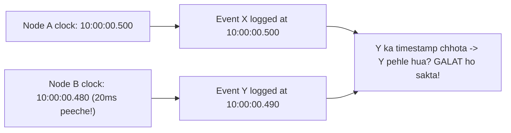
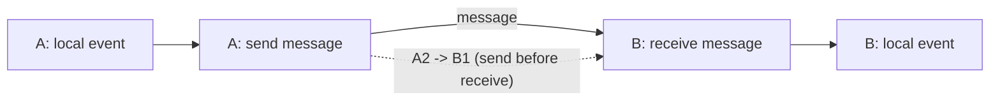
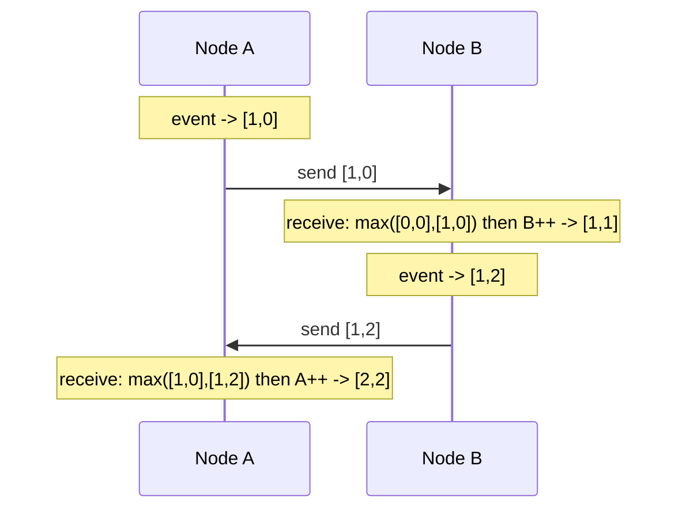
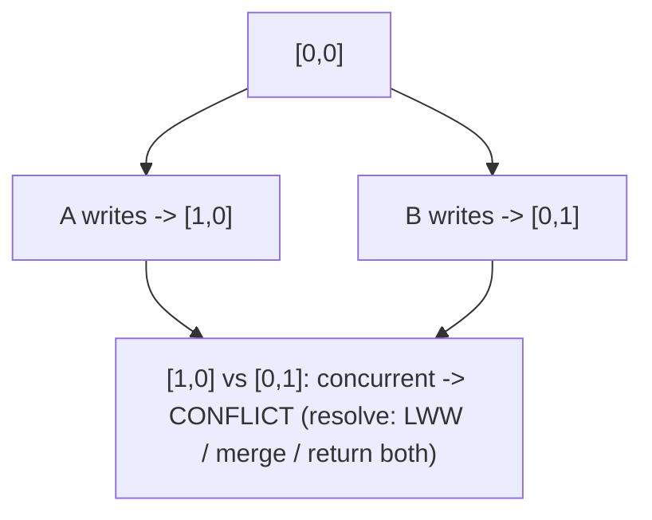
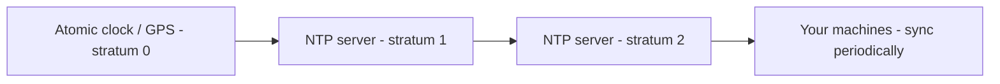
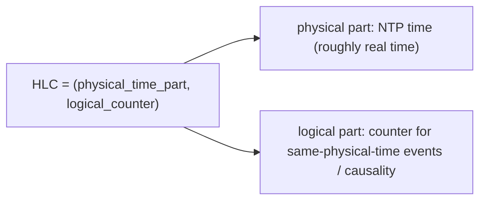
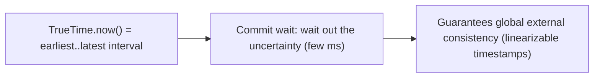

# ⏱️ Logical Clocks & Distributed Time (Lamport, Vector, HLC, NTP)

> **Problem:** Distributed system me **"pehle kya hua, baad me kya?"** ka jawaab dena surprisingly hard
> hai. Har machine ki apni **physical clock** hoti hai jo thodi-bahut galat/alag chalti (clock skew), to
> do alag machines ke events ko sahi order me lagana wall-clock timestamp se **reliable nahi**. Ye file
> batati hai ki distributed systems me **time aur ordering** kaise handle karte hain — **Lamport clocks,
> vector clocks, Hybrid Logical Clocks (HLC), NTP, aur TrueTime**. Ordering, causality, aur conflict
> resolution in sabki jaan hai.

---

## 1. Kyun mushkil hai? (The problem with physical time)

Ek single machine pe events order karna easy — ek hi clock. Distributed me har node ki **apni clock**:



- **Clock skew:** do machines ki clocks kabhi bilkul same nahi (quartz crystals slightly differ) → ~milliseconds ka diff.
- **Clock drift:** clocks time ke saath aur diverge hoti (per machine alag rate).
- **NTP corrections:** clock ko sync karne pe wo **aage ya peeche jump** kar sakti (even backwards!).
- **Consequence:** event Y ka wall-clock timestamp event X se chhota ho sakta hai **chahe Y baad me hua ho** → wrong ordering → wrong conflict resolution, wrong "latest wins", corrupted data.

> **Core insight:** distributed systems me **"kaunsa event pehle hua" ka jawaab wall-clock se reliable
> nahi.** Isi liye **logical clocks** invent hue — jo physical time nahi, **causality (kya kis-pe depend
> karta)** track karte.

---

## 2. Happens-Before Relationship (→) — the foundation

Leslie Lamport ne define kiya: kab hum **sure** ho sakte hain ki event A, event B se pehle hua? Sirf 3 cases:

1. **Same process:** A aur B ek hi node pe, A pehle execute hua → `A → B`.
2. **Message send/receive:** A ne message bheja, B ne wahi message receive kiya → `A → B` (send hamesha receive se pehle).
3. **Transitivity:** `A → B` aur `B → C` → `A → C`.



- **Agar A → B nahi aur B → A bhi nahi** → wo **concurrent** hain (`A || B`) — inka koi causal order nahi, kisi bhi order me hue maano.
- **Logical clocks** ka goal: is happens-before relationship ko **capture** karna (numbers se), physical time ke bina.

---

## 3. ⭐ Lamport Clocks (logical timestamps)

Sabse simple logical clock — har node ek **counter** rakhta. Rules:

1. Har node ka counter **event pe +1**.
2. **Message ke saath** apna counter bhejo.
3. Message **receive** pe: `counter = max(own_counter, received_counter) + 1`.

```mermaid
sequenceDiagram
    participant A as Node A
    participant B as Node B
    Note over A: event, C=1
    Note over A: event, C=2
    A->>B: send (timestamp C=3)
    Note over A: (A ka C=3 tha send pe)
    Note over B: B ka C=1 tha; receive: max(1,3)+1 = 4
    Note over B: event, C=5
```

### Lamport clock ki guarantee
- **Agar `A → B` (A causally B se pehle), to `L(A) < L(B)`** (Lamport timestamp order preserve hota).
- **Par ULTA sach NAHI:** `L(A) < L(B)` ka matlab ye **nahi** ki A, B se pehle hua — wo concurrent bhi ho sakte. ⚠️

> **Ek line me:** Lamport clock **causality ko preserve karta** (cause ka timestamp effect se chhota),
> par **causality vs concurrency distinguish nahi kar sakta** — sirf timestamp dekh ke ye nahi keh sakte
> ki do events related hain ya concurrent. Iske liye **vector clocks** chahiye.

### Total ordering (tie-break)
- Do events ka same Lamport timestamp ho sakta (different nodes) → tie-break by **node ID** → ek consistent **total order** ban jaata (useful for e.g. distributed mutual exclusion, ordered logs).

---

## 4. ⭐ Vector Clocks (causality + concurrency detection)

Lamport ki kami (concurrency detect nahi kar sakta) ko **vector clock** solve karta. Har node ek **vector**
rakhta — `[counter per node]`. Ye batata hai "is node ne har doosre node ke kitne events dekhe".

**Rules (N nodes):**
1. Har node ka apna vector `V` (size N, sab 0 se shuru).
2. Local event: apna index `+1` (`V[self]++`).
3. Message ke saath **poora vector** bhejo.
4. Receive pe: **element-wise max** with received vector, phir `V[self]++`.



### ⭐ Vector clocks se comparison (the power)
Do vector clocks `V1`, `V2` compare karke **exactly** pata chalta hai:
- **`V1 → V2` (V1 happened-before V2):** har element `V1[i] <= V2[i]` aur kam se kam ek strictly chhota. (V2 descendant hai V1 ka.)
- **`V2 → V1`:** ulta.
- **Concurrent (`V1 || V2`):** na V1 ≤ V2, na V2 ≤ V1 — dono me kuch elements ek doosre se bade. → **CONFLICT!**

| Compare | Matlab |
|---|---|
| `[1,0] vs [2,2]` | [1,0] ≤ [2,2] → **[1,0] → [2,2]** (causal, auto-resolve) |
| `[2,0] vs [1,1]` | neither ≤ other → **concurrent → conflict** |



> **Yahi wajah hai** DynamoDB/Dynamo, Riak, aur version-vector systems **vector clocks** use karte —
> concurrent writes (conflict) ko **detect** kar paate, phir resolve (LWW / app-merge / CRDT). Dekho
> [Database Replication](../Database_Replication.md), [Key-Value Store (DynamoDB)](../System_Design_Case_Studies/24_Key_Value_Store_DynamoDB.md).

### Vector clock ki keemat
- **Space:** vector size = number of nodes → bade dynamic clusters me bada (thousands of nodes → huge vectors). **Version vectors** / pruning se manage karte.

---

## 5. ⭐ Physical time sync — NTP

Logical clocks ordering deti par **wall-clock time** (jaise "kab hua" for logs/TTL/timestamps) ke liye
physical clocks chahiye — inhe sync karne ka standard **NTP (Network Time Protocol)**.



- **Hierarchy (strata):** atomic/GPS clocks (stratum 0) → NTP servers → your machines. Har machine periodically NTP se sync karti.
- **Accuracy:** LAN me ~1ms, internet pe ~10-100ms (network delay estimate karke adjust).
- **Problem 1 — never perfect:** network delay variable → sync me residual error (~ms).
- **Problem 2 — jumps:** correction pe clock **aage ya peeche jump** kar sakti. **Backward jump = disaster**
  (duplicate IDs in Snowflake, negative durations, TTL bugs). Dekho [Snowflake ID](../System_Design_Case_Studies/25_Distributed_Unique_ID_Snowflake.md).
- **Clock smearing:** jump ke bajaye clock ko dheere-dheere adjust karo (leap second smearing — Google/AWS) → no sudden jumps.

> **Rule:** physical timestamps use karo "roughly kab hua" ke liye (logs, display), par **ordering /
> correctness ke liye kabhi bharosa mat karo** — logical clocks use karo.

---

## 6. ⭐ Hybrid Logical Clocks (HLC) — best of both

Lamport/vector = causality but no physical time meaning. NTP physical time = but unreliable ordering.
**HLC** dono combine karta — ek timestamp jo **physical time ke close** ho AND **causality preserve** kare.



- **HLC = (pt, c):** `pt` = physical time (NTP-based), `c` = logical counter.
- Update rule (simplified): new HLC = max of (own pt, message pt, current physical clock); agar pt same rahe to `c++` (causality within same ms).
- **Guarantees:** (a) HLC roughly tracks real time (within NTP error — useful for "when"), AND (b) preserves happens-before (like Lamport — reliable ordering).
- **Used by:** CockroachDB, MongoDB (for causal consistency), YugabyteDB. Vector clock se **compact** (fixed size, not per-node) + physical-time-meaningful.

| | Lamport | Vector | HLC |
|---|---|---|---|
| Causality preserve | ✅ | ✅ | ✅ |
| Detect concurrency (conflict) | ❌ | ✅ | ❌ (partial) |
| Close to real time | ❌ | ❌ | ✅ |
| Size | O(1) | O(nodes) | O(1) |

---

## 7. TrueTime (Google Spanner) — bounded uncertainty

Google Spanner ne ek radical approach liya — **physical clocks ko itna accurate banao** (GPS + atomic
clocks in datacenters) ki uncertainty **bounded** ho. TrueTime API real time ek **interval** deta:
`[earliest, latest]` (typically ~7ms uncertainty).



- **Commit wait:** transaction commit karne se pehle uncertainty interval "wait out" karta → guarantees
  ki agar T1 committed before T2 started (real time), to T1's timestamp < T2's → **globally consistent ordering** without coordination.
- Cost: special hardware (GPS/atomic clocks) + few-ms commit latency. Enables Spanner's **externally
  consistent** distributed transactions across continents. Unique to Google-scale infra.

---

## 8. Where each is used (real systems)

| Technique | Kahan / kyun |
|---|---|
| **Lamport clocks** | Ordered logs, distributed mutual exclusion, total-order broadcast |
| **Vector clocks** | Conflict detection in Dynamo/Riak/DynamoDB, causal consistency, version vectors |
| **HLC** | CockroachDB, MongoDB causal consistency, YugabyteDB (compact + real-time-ish) |
| **NTP** | Everywhere — general clock sync (logs, TTL, "roughly when") |
| **TrueTime** | Google Spanner — globally-consistent transactions (bounded uncertainty) |

---

## 9. Causal Consistency (why this matters for design)

Logical clocks **causal consistency** enable karte — ek important consistency model:
- "Agar A, B ka cause hai (A → B), to har node A ko B se pehle dekhega." Concurrent events koi bhi order me.
- Example: WhatsApp — reply message original se pehle nahi dikhna chahiye (reply original par causally depend karta). Vector/HLC clocks ye ensure karte.
- Stronger than eventual, weaker than strong (linearizable) — good middle ground. Dekho [CAP](../11_CAP_Theorem.md), [Replication](../Database_Replication.md).

---

## ✅ / ❌ Trade-offs summary

**✅ Logical clocks (Lamport/Vector)**
- No dependency on synchronized physical clocks; capture true causality; detect conflicts (vector).

**❌ Limitations**
- Lamport can't detect concurrency; vector clocks grow with node count; neither means "real time".

**✅ Physical (NTP/HLC/TrueTime)**
- Real-time meaning (logs, TTL, "when"); HLC compact + causal; TrueTime bounded → global consistency.

**❌ Limitations**
- NTP never perfect (skew/jumps, backward danger); TrueTime needs special hardware.

---

## 🎤 Interview Q&A

**Q: Distributed system me wall-clock timestamp se ordering kyun reliable nahi?**
Clock skew/drift + NTP jumps → ek event ka timestamp doosre se chhota ho sakta chahe wo baad me hua → wrong order.

**Q: Happens-before (→) relationship?**
A → B agar: same process me A pehle, ya A ne msg bheja jo B ne receive kiya, ya transitivity. Warna concurrent.

**Q: Lamport clock kya guarantee deta, kya nahi?**
`A → B ⟹ L(A) < L(B)` (causality preserve). Par `L(A) < L(B)` se ye nahi keh sakte A pehle hua — concurrency detect nahi kar sakta.

**Q: Vector clock Lamport se better kyun?**
Vector clocks **concurrency detect** karte — compare karke pata chalta A→B, B→A, ya concurrent (conflict). Lamport nahi kar sakta.

**Q: Vector clock ki cost?**
Size = number of nodes → bade/dynamic clusters me huge; version vectors/pruning se manage.

**Q: Concurrent writes (conflict) kaise detect + resolve?**
Vector clocks: neither ≤ other → concurrent → conflict; resolve = LWW / app-merge / CRDT (Dynamo cart = union).

**Q: NTP ka problem?**
Never perfect (network delay → residual error); corrections cause jumps (backward jump = duplicate IDs / bugs). Clock smearing avoids sudden jumps.

**Q: HLC kya, kyun?**
Hybrid Logical Clock = (physical time, logical counter) → real-time-close AND causality-preserving, compact (O(1)); used by CockroachDB/MongoDB for causal consistency.

**Q: Google TrueTime?**
GPS+atomic clocks → bounded uncertainty interval `[earliest,latest]`; commit-wait → globally externally-consistent transactions (Spanner). Needs special hardware.

**Q: Causal consistency?**
Causally-related events seen in order everywhere (reply after original); concurrent = any order. Enabled by logical clocks; middle ground between eventual and strong.

---

## Summary
- Distributed me **wall-clock ordering reliable nahi** (skew/drift/NTP jumps) → use **logical clocks** (causality, not physical time).
- **Happens-before (→):** same-process / send-before-receive / transitive; warna **concurrent**.
- **Lamport clocks** = counter, preserve causality (`A→B ⟹ L(A)<L(B)`) but **can't detect concurrency**.
- **Vector clocks** = per-node counters → **detect causality vs concurrency (conflicts)** — Dynamo/Riak/DynamoDB; cost = size grows with nodes.
- **NTP** = physical sync (imperfect, jumps); **HLC** = physical + logical (real-time-ish + causal, compact — CockroachDB/Mongo); **TrueTime** = bounded uncertainty → global consistency (Spanner, special hardware).
- Enables **causal consistency** — key for correct conflict resolution + ordering.

> **Related:** [Database Replication (conflict resolution)](../Database_Replication.md) · [Key-Value Store (DynamoDB)](../System_Design_Case_Studies/24_Key_Value_Store_DynamoDB.md) · [Consensus Algorithms](./01_Consensus_Algorithms.md) · [Distributed Unique ID (Snowflake)](../System_Design_Case_Studies/25_Distributed_Unique_ID_Snowflake.md) · [CAP Theorem](../11_CAP_Theorem.md) · [Distributed Systems Intro](../09_Introduction_to_Distributed_Systems.md)
