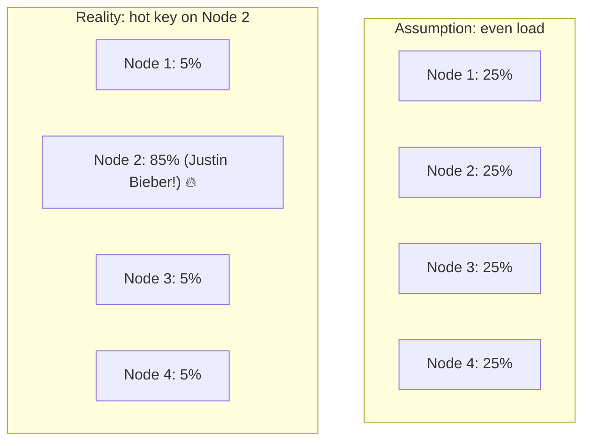
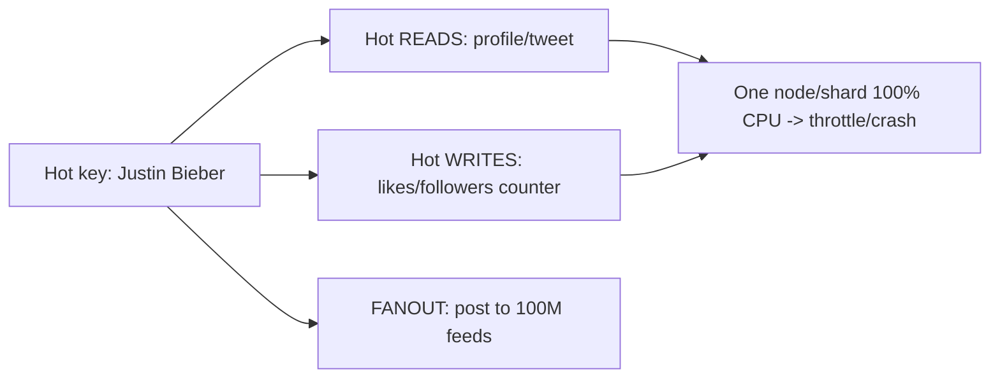
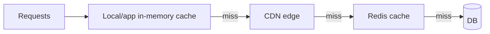
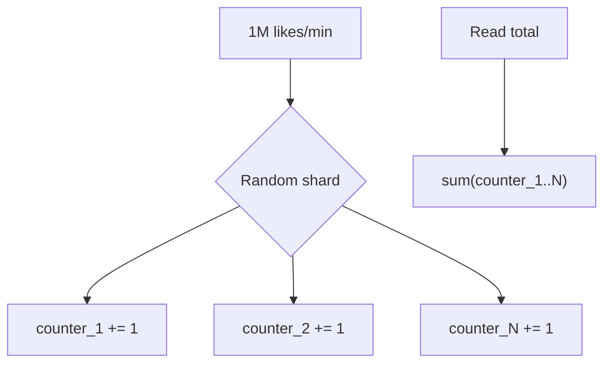
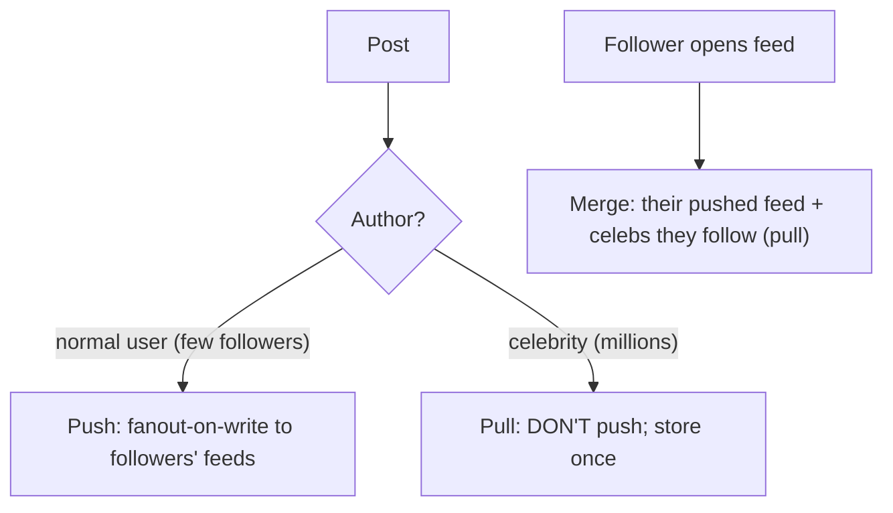
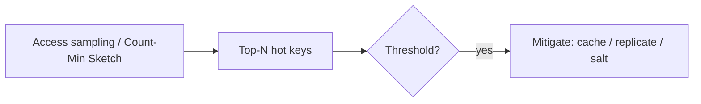

# 🌟 The Hot Key / Celebrity Problem ("Justin Bieber Problem")

> **Problem:** Distributed systems maante hain ki load **evenly** distribute hoga (sharding, consistent
> hashing sab isi pe based). Par real duniya me load **skewed** hota — kuch entities baaki se **hazaaron-lakhs
> guna zyada** traffic laate. Jaise **Justin Bieber** (100M+ followers) ka ek post/profile → ek hi
> key/shard pe itna load ki wo node **crash** ho jaaye, chahe baaki sab nodes idle ho. Isi ko
> **"Justin Bieber problem"** / **hot key** / **hot partition** / **celebrity problem** kehte hain — ye
> almost har bade system (Twitter, Instagram, Discord, DynamoDB, Redis) me aata hai.

---

## 1. Kya hai ye problem? (Skewed load)

Sharding/consistent hashing ka core assumption: **keys evenly distribute** → har node ~equal load.
Par real access pattern **power-law / Zipfian** hota — chhota sa % entities zyada tar traffic laate.

- **80/20 (Pareto):** ~20% content ~80% traffic laata (aur celebrities me to 0.001% content huge % laata).
- **Hot key** = ek single key (Justin Bieber's user_id / a viral tweet / a trending product) jo
  disproportionate load leti → us key ko host karne wala **ek node bottleneck** ban jaata (baaki idle).
- **Consistent hashing bhi nahi bachata:** wo keys ko nodes pe distribute karta, par **ek single key ka
  saara load ek hi node pe** jaata — us key ka traffic split nahi hota. Dekho [Consistent Hashing](../19_Consistent_Hashing.md).

> **Ek line:** "Load even nahi, skewed hota. Ek celebrity/hot-key ek node ko akele overload kar deti,
> chahe cluster me 1000 nodes ho." Yehi "Justin Bieber problem" hai.

---

## 2. Ye kahan-kahan chot pahunchati (manifestations)

Hot key alag jagah alag roop me aati:

| Type | Kya hota | Example |
|---|---|---|
| **Hot read key** | Ek key bahut baar padhi jaati | Celebrity profile, viral tweet, trending product page |
| **Hot write key** | Ek key pe bahut writes | Viral post ke likes counter, live-match score, celebrity's follower count |
| **Celebrity fanout** | Ek write → millions ko deliver | Bieber posts → 100M followers ke feed me push |
| **Hot partition/shard** | Ek shard pe skewed keys | DynamoDB partition with a hot key → throttled |
| **Thundering herd** | Ek popular key expire → sab ek saath DB pe | Popular cache entry TTL → 10K requests DB pe |

---

## 3. ⭐ Solving HOT READS (celebrity profile/tweet)

Read hotspot sabse aasaan — kyunki reads **replicate/cache** ho sakti hain (writes se easy).

### (a) Caching — multi-layer
Hot key hai to sabse pehle **cache** — DB tak jaayegi hi nahi.

- **Multi-layer:** browser → CDN → app-local cache → Redis → DB. Hot key har layer pe cache → 99%+ reads DB tak nahi aate. Dekho [Caching](../08_Caching_and_Distributed_Caching.md), [CDN](../10_Content_Delivery_Network_CDN.md).
- **Local cache on each app server** for super-hot keys → even Redis pe load kam (Redis bhi hot key se choke ho sakta).

### (b) Replicate the hot key
Ek key ek node pe hai → us node pe load. **Solution:** hot key ki **multiple copies** across nodes/replicas → reads distribute.
- **Read replicas:** hot key ka data kai replicas pe → reads baant do. Dekho [Replication](../Database_Replication.md).
- **Key replication with suffixes:** `bieber_profile` ko `bieber_profile_1`, `bieber_profile_2`... me copy karke alag nodes pe → client random suffix chunta → load N nodes me bat jaata.

### (c) Thundering herd fix
Popular key cache se expire → hazaaron requests ek saath DB pe (dogpile). Fix:
- **Single-flight / request coalescing:** pehla request DB se laata, baaki wait karte (ek hi DB call).
- **Stale-while-revalidate:** expire hone pe stale value serve karo + background me refresh.
- **Jittered TTL:** sab keys ek saath expire na hon (random offset). Dekho [Caching (thundering herd)](../08_Caching_and_Distributed_Caching.md).

---

## 4. ⭐ Solving HOT WRITES (viral counters, live scores)

Writes replicate nahi hote (consistency) → hot write harder. Bieber ke post pe 1M likes/min → ek counter row pe 1M writes/min → lock contention / throttle.

### (a) Sharded / split counter
Ek counter ko **N sub-counters** me todo (alag keys/nodes pe). Write = random sub-counter increment; read = sum of all.

- Write load N nodes me bat jaata (no single hot row). Read = sum (slightly costlier, cache it).
- Ye **"sharded counter"** pattern — Instagram/YouTube like counts isi tarah.

### (b) Batching / aggregation (in-memory then flush)
- Har write DB pe mat karo — **in-memory aggregate** (jaise per-second batch) → periodically flush to DB.
- 1M writes/min → per-second aggregate → ~60 DB writes/min instead of 1M. **Eventual** count (approx real-time, fine for likes).
- Stream aggregation (Kafka + Flink) for huge scale. Dekho [Big Data / Stream Processing](./05_Big_Data_and_Stream_Processing.md).

### (c) Key salting (spread hot partition)
- Hot partition key (DynamoDB) → **salt** the key: `bieber` → `bieber#1`, `bieber#2`... (random suffix) → spreads across partitions. Read = query all salts + merge. Dekho [Key-Value Store](../System_Design_Case_Studies/24_Key_Value_Store_DynamoDB.md).

---

## 5. ⭐ Solving CELEBRITY FANOUT (the classic Justin Bieber case)

Bieber posts → push to 100M followers' feeds = **fanout storm** (100M writes for one post). Normal
users push works, celebrities crash it. **Solution: hybrid fanout.** Dekho [Twitter/News Feed](../System_Design_Case_Studies/05_Twitter_News_Feed.md), [Instagram](../System_Design_Case_Studies/06_Instagram.md).

- **Normal users → push** (fanout-on-write): reads fast.
- **Celebrities → pull** (fanout-on-read): unke posts push NAHI hote; follower feed open kare tab celeb ke posts **merge on read** → 100M-write storm avoid.
- **Threshold:** followers > X (jaise 1M) → treat as celebrity. This hybrid is THE canonical Justin Bieber solution.

---

## 6. Consistent hashing hotspots — virtual nodes (partial help)

- Plain consistent hashing me ek node ka **range** bada ho sakta → uneven. **Virtual nodes** (har physical
  node = kai points on ring) → ranges even → distribution better. Dekho [Consistent Hashing](../19_Consistent_Hashing.md).
- **Par virtual nodes ek SINGLE hot key ko split NAHI karte** — wo sirf key-distribution even karta,
  ek key ka load ek hi node pe rehta. Single hot key ke liye replication/salting chahiye (upar wale).

---

## 7. Detecting hot keys (monitoring)

Fix karne se pehle **pata** to chale konsi key hot hai:
- **Per-key metrics / sampling:** track top-N most-accessed keys (Redis `--hotkeys`, sampling).
- **Heavy-hitter algorithms:** **Count-Min Sketch** — memory-efficient "kaunsi keys most frequent". Dekho [Bloom Filters & Probabilistic DS](../Bloom_Filters_and_Probabilistic_Data_Structures.md).
- **Alerts:** ek node/partition ka CPU/throughput baaki se bahut zyada → hot key suspected. Dekho [Observability](./02_Observability_Monitoring_Logging_Tracing.md).
- **Auto-mitigation:** detect → auto-cache / auto-replicate hot key (advanced systems).

---

## 8. Real-world examples

| System | Hot key problem | Solution |
|---|---|---|
| **Twitter/Instagram** | Celebrity post → fanout storm | Hybrid fanout (celebs pull) |
| **Instagram likes** | Viral post → millions of like writes | Sharded counters + async aggregation |
| **DynamoDB** | Hot partition → throttled | Key salting, adaptive capacity, on-demand |
| **Redis** | Hot key → one shard maxed | Local cache + key replication (suffixes) |
| **Discord** | Huge server (guild) messages | Dedicated per-guild process + pull for inactive |
| **YouTube views** | Viral video counter | Batched/aggregated counts (eventual) |
| **Live sports score** | Millions reading one match | CDN + cache + pub-sub push |

---

## ✅ Solutions cheat-summary

| Hotspot type | Fixes |
|---|---|
| **Hot read** | Multi-layer cache, CDN, local cache, read replicas, replicate key (suffixes) |
| **Hot write** | Sharded/split counter, batching + async aggregation, key salting |
| **Fanout** | Hybrid push/pull (celebrity → pull + merge on read) |
| **Hot partition** | Salting, virtual nodes (distribution), adaptive capacity |
| **Thundering herd** | Single-flight, stale-while-revalidate, jittered TTL |
| **Detection** | Sampling, Count-Min Sketch, per-node metrics + alerts |

---

## 🎤 Interview Q&A

**Q: "Justin Bieber problem" kya hai?**
Hot key/celebrity problem — ek entity (celebrity) itna disproportionate load laati ki uska host node/shard akela overload ho jaata, chahe cluster me hazaaron nodes ho (skewed, not even, load).

**Q: Consistent hashing se solve kyun nahi hota?**
Wo keys ko nodes pe distribute karta, par ek **single key** ka saara load ek hi node pe jaata — key split nahi hoti. Single hot key ke liye replication/salting chahiye.

**Q: Hot READ key kaise handle?**
Multi-layer caching (CDN + local + Redis), read replicas, aur hot key ko multiple nodes pe replicate (suffix keys) → reads distribute.

**Q: Hot WRITE key (viral like counter) kaise?**
Sharded/split counter (N sub-counters, random increment, read=sum) + in-memory batching/async aggregation (eventual count). Key salting for hot partitions.

**Q: Celebrity fanout (100M followers) kaise?**
Hybrid fanout — normal users push, celebrities pull (unke posts push nahi, follower feed open pe merge-on-read) → 100M-write storm avoid.

**Q: Thundering herd (popular key expire) kaise?**
Single-flight (ek request DB se laaye, baaki wait), stale-while-revalidate, jittered TTL.

**Q: Hot key detect kaise karoge?**
Access sampling / Count-Min Sketch (heavy hitters) + per-node metrics; ek node ka load spike = hot key suspect.

**Q: DynamoDB hot partition?**
Key salting (suffix spreads across partitions), adaptive capacity, good partition-key design (high cardinality).

**Q: Sharded counter read slow nahi?**
Read = sum of N sub-counters (thoda costlier) → cache the aggregate; likes = eventual OK.

---

## Summary
- **Justin Bieber / hot key problem** = load **skewed** (not even) — ek celebrity/viral entity ek node/shard ko akele overload karti; consistent hashing bhi single-key ko split nahi karta.
- **Hot reads** → multi-layer cache + CDN + read replicas + replicate key (suffixes).
- **Hot writes** → **sharded counters** + async **batching/aggregation** + key **salting**.
- **Celebrity fanout** → **hybrid push/pull** (celebs pull, merge on read) — the canonical fix.
- **Thundering herd** → single-flight + stale-while-revalidate + jittered TTL; **detect** hot keys via sampling/Count-Min Sketch + metrics.

> **Related:** [Consistent Hashing](../19_Consistent_Hashing.md) · [Caching](../08_Caching_and_Distributed_Caching.md) · [Twitter/News Feed (fanout)](../System_Design_Case_Studies/05_Twitter_News_Feed.md) · [Key-Value Store (salting)](../System_Design_Case_Studies/24_Key_Value_Store_DynamoDB.md) · [Bloom Filters (Count-Min Sketch)](../Bloom_Filters_and_Probabilistic_Data_Structures.md) · [Database Sharding](../21_Database_Sharding.md)
