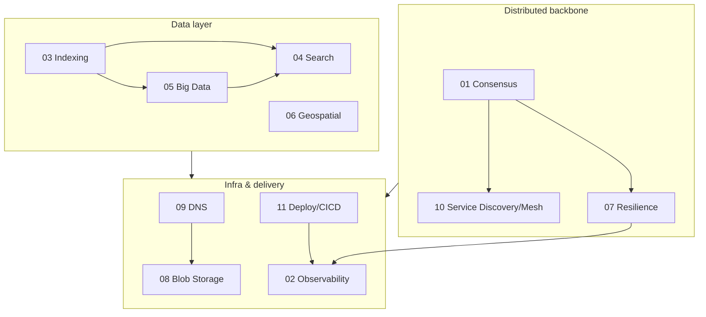

# 🔬 Advanced HLD Topics

  
  
  

> Ye folder **advanced system-design deep-dives** ke liye hai — jo core [21 topics](../README.md) se
> ek level aage hain. Senior/SDE-2+ interviews aur real-world architecture me ye topics bar-bar aate
> hain. Har file: Hinglish + Mermaid diagrams + comparison tables + ✅/❌ trade-offs + interview Q&A.

---

## 📚 Topics (11)

### 🔥 Core distributed & data (top priority)
| # | Topic | Ek line me |
|---|---|---|
| 01 | [Consensus Algorithms](./01_Consensus_Algorithms.md) | Raft, Paxos, leader election, quorum, Zookeeper/etcd — nodes ka ek decision par agree hona |
| 02 | [Observability](./02_Observability_Monitoring_Logging_Tracing.md) | Metrics + Logs + Traces, p95/p99, distributed tracing, SLI/SLO/SLA, error budget |
| 03 | [Database Indexing Deep-Dive](./03_Database_Indexing_Deep_Dive.md) | B+Tree vs LSM-Tree, clustered/covering/composite index, kab index na banao |
| 04 | [Search Systems & Elasticsearch](./04_Search_Systems_and_Elasticsearch.md) | Inverted index, analysis pipeline, BM25 ranking, autocomplete, ES shards/replicas |
| 05 | [Big Data & Stream Processing](./05_Big_Data_and_Stream_Processing.md) | Batch vs Stream, MapReduce, Spark, windowing, Lambda vs Kappa, lake vs warehouse |
| 06 | [Geospatial & Location Services](./06_Geospatial_and_Location_Services.md) | Geohash, Quadtree, S2, "nearby drivers" (Uber) design, Haversine |

### ⚡ Reliability, infra & delivery (second priority)
| # | Topic | Ek line me |
|---|---|---|
| 07 | [Resilience & Fault Tolerance](./07_Resilience_and_Fault_Tolerance.md) | Timeout, retry+backoff+jitter, circuit breaker, bulkhead, DR (RTO/RPO), chaos |
| 08 | [Blob/Object Storage & Large Files](./08_Blob_Object_Storage_and_Large_Files.md) | S3, chunking/multipart, dedup, pre-signed URLs, Dropbox/Drive design |
| 09 | [DNS Deep-Dive](./09_DNS_Deep_Dive.md) | Resolution flow, TTL/caching, records, GeoDNS, DNS load balancing, anycast |
| 10 | [Service Discovery & Service Mesh](./10_Service_Discovery_and_Service_Mesh.md) | Registry, client/server-side discovery, K8s, sidecar/Envoy, Istio, mTLS |
| 11 | [Deployment Strategies & CI/CD](./11_Deployment_Strategies_and_CICD.md) | Rolling, blue-green, canary, feature flags, expand-contract DB migrations |

---

## 🗺️ Ye topics kaise judte hain

---

## 🎯 Kaunsa topic kis interview/system me

| Agar poocha jaaye… | Padho |
|---|---|
| "Design Uber / nearby drivers / food delivery" | [06 Geospatial](./06_Geospatial_and_Location_Services.md) |
| "Design search / autocomplete / e-commerce search" | [04 Search Systems](./04_Search_Systems_and_Elasticsearch.md) |
| "Design Dropbox / Google Drive / YouTube storage" | [08 Blob Storage](./08_Blob_Object_Storage_and_Large_Files.md) |
| "Design analytics / metrics / recommendation pipeline" | [05 Big Data](./05_Big_Data_and_Stream_Processing.md) |
| "System down kyun? kaise pata chalega?" | [02 Observability](./02_Observability_Monitoring_Logging_Tracing.md) |
| "Ek service slow ho to poora system na gire" | [07 Resilience](./07_Resilience_and_Fault_Tolerance.md) |
| "Leader kaise chunte / distributed lock / config store" | [01 Consensus](./01_Consensus_Algorithms.md) |
| "Query slow hai / index kaise kaam karta" | [03 DB Indexing](./03_Database_Indexing_Deep_Dive.md) |
| "Naya version safely deploy / zero-downtime" | [11 Deployment](./11_Deployment_Strategies_and_CICD.md) |
| "Microservices ek doosre ko dhoondhein kaise" | [10 Service Discovery](./10_Service_Discovery_and_Service_Mesh.md) |
| "Traffic routing / GeoDNS / failover at DNS" | [09 DNS](./09_DNS_Deep_Dive.md) |

---

## 📖 Prerequisites (pehle ye core topics)
Ye advanced topics se pehle core samajh lo:
- [09 Distributed Systems Intro](../09_Introduction_to_Distributed_Systems.md) · [11 CAP Theorem](../11_CAP_Theorem.md)
- [Database Replication](../Database_Replication.md) · [21 Sharding](../21_Database_Sharding.md) · [Distributed Transactions](../Distributed_Transactions.md)
- [01 Monolith vs Microservices](../01_Monolithic_and_Microservices.md) · [18 Message Queues](../18_Message_Queues_Kafka_RabbitMQ.md)

---

> ⬅️ Wapas: [HLD main index](../README.md) · [LLD folder](../../LLD/README.md) · [Root](../../README.md)
