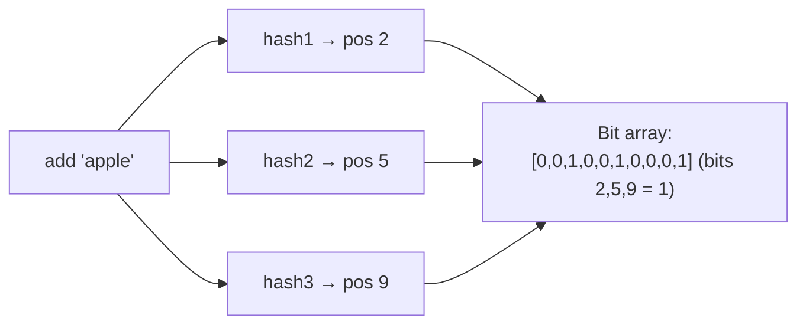
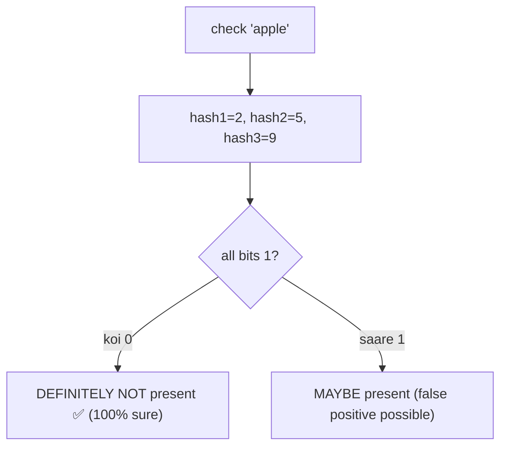
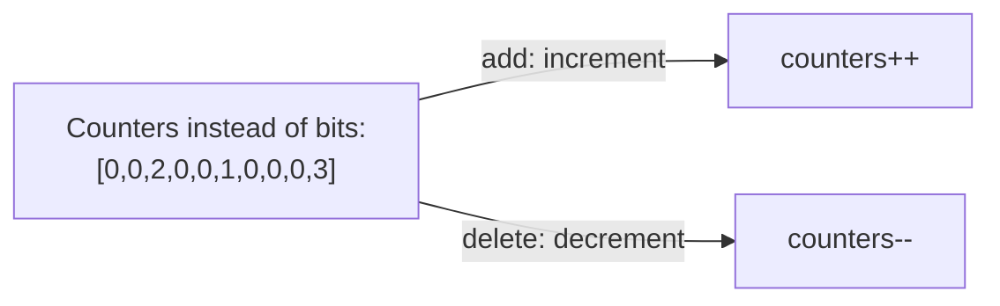
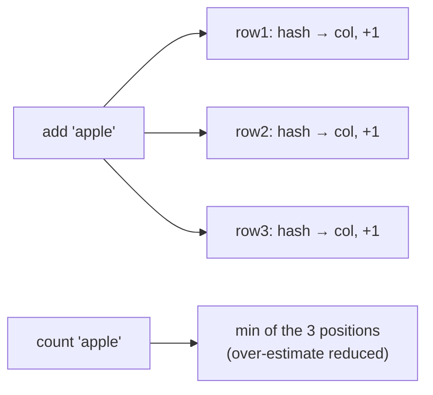
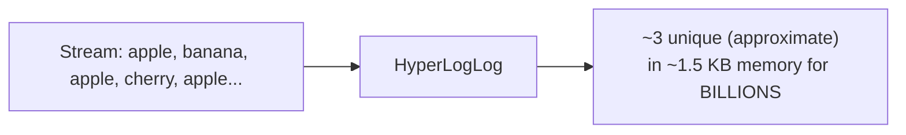
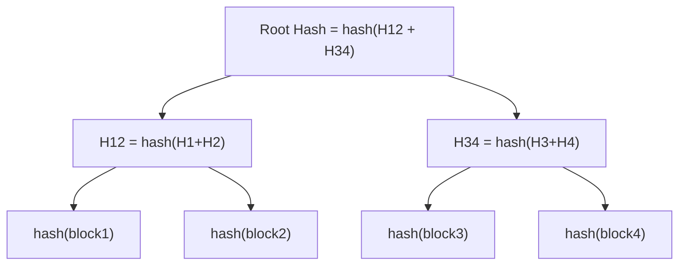
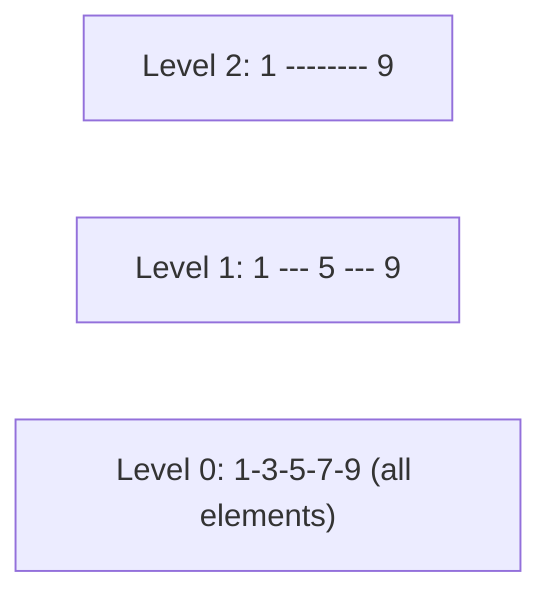
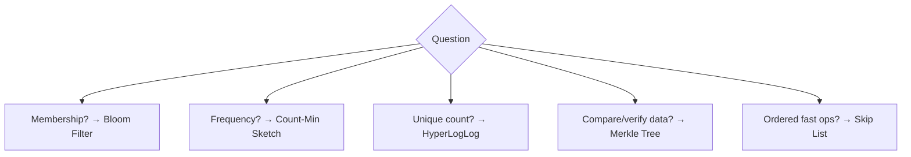

# Bloom Filters & Probabilistic Data Structures — Complete Deep Dive

> Bade scale pe **exact** data structures (set, counter) memory me nahi aate — billions of items ka
> exact tracking = huge RAM. **Probabilistic data structures** approximate answers dete hain **tiny
> memory** me (thodi error acceptable). Ye file: Bloom Filter (deep), Count-Min Sketch, HyperLogLog,
> Merkle Tree, Skip List — kaise kaam karte, use cases, aur trade-offs.

---

## 📑 Table of Contents
1. [Kyun probabilistic data structures](#1-kyun-probabilistic-structures)
2. [Bloom Filter — deep](#2-bloom-filter--deep)
3. [Counting Bloom Filter](#3-counting-bloom-filter)
4. [Count-Min Sketch](#4-count-min-sketch)
5. [HyperLogLog](#5-hyperloglog)
6. [Merkle Tree](#6-merkle-tree)
7. [Skip List](#7-skip-list)
8. [Comparison + use cases](#8-comparison--use-cases)
9. [Interview Q&A](#9-interview-qa)
10. [Summary](#10-summary)

---

## 1. Kyun Probabilistic Structures

Problem: billions of items ka **exact** tracking = huge memory.
```
Exact set of 1 billion URLs (crawled) = ~ tens of GB in a hash set
Exact unique visitors count = store every visitor ID
```

**Solution:** probabilistic structures — **approximate** answer, **tiny** memory, **fast**. Thodi
error (false positives ya slight count error) acceptable jab exactness zaroori nahi.


| Question | Exact | Probabilistic |
|---|---|---|
| "Is X in set?" | HashSet (large) | **Bloom Filter** (tiny) |
| "How many unique?" | Set + count (large) | **HyperLogLog** (tiny, ~2% error) |
| "How often X?" (frequency) | HashMap counters | **Count-Min Sketch** (tiny) |

---

## 2. Bloom Filter — Deep

**Bloom Filter** = space-efficient structure jo answer deta: "**is X in the set?**" — with two possible
answers: **"definitely NOT in set"** ya **"maybe in set"**.

> ⭐ **Key property:** **No false negatives** (agar X add kiya to "maybe" milega, kabhi "no" nahi).
> **False positives possible** (X add nahi kiya, phir bhi "maybe" mil sakta). "Definitely not" is
> 100% reliable; "maybe" needs verification.

### Structure
- **Bit array** (m bits, all 0 initially).
- **k hash functions** (each maps item → position in bit array).

### Add(x)
k hashes compute → k positions → un bits ko **1** set karo.


### Check(x)
k hashes compute → k positions → check all bits:
- **Koi bit 0** → **DEFINITELY NOT** present (agar add hota to sab 1 hote).
- **Saare bits 1** → **MAYBE** present (could be x, ya doosre items ne ye bits set kar diye — false
  positive).



### Why false positives (no false negatives)
- Different items ke hashes **overlap** kar sakte (same bit multiple items set kar dein). To check(y)
  me y ke bits already 1 ho sakte (doosre items ne set kiye) → "maybe" (false positive).
- Par agar x add hua, to x ke saare bits **guaranteed 1** → check(x) hamesha "maybe" (never "no") →
  **no false negatives**.

### Trade-offs
- **More bits (m) + optimal hashes (k)** → **lower false positive rate**, more memory.
- **Can't delete** (bit reset karo to doosre items affect — Counting Bloom Filter delete allow karta).
- **Can't retrieve items** (sirf membership, items store nahi).

### Use cases ⭐
- **Cache penetration defense** — "ye key exist karti hai kya?" (DB hit se pehle). "Definitely not" →
  DB touch hi mat karo (save query). [Detail: `08_Caching...`]
- **Web crawler dedup** — "ye URL crawl ho chuki?" (Bloom filter — memory-efficient for billions).
- **Database (LSM-tree)** — SSTable me key hai kya (skip SSTables that "definitely don't have" — read
  optimize). Cassandra, LevelDB.
- **Spell checkers, malicious URL detection, spam filters.**

> ⭐ **Interview line:** "Bloom filter = 'definitely not' or 'maybe' — no false negatives, false
> positives possible. Use to avoid expensive lookups (DB/disk) for definitely-absent items."

---

## 3. Counting Bloom Filter

Standard Bloom Filter **delete nahi kar sakta** (bit reset → other items affect). **Counting Bloom
Filter** — bits ki jagah **small counters** (increment on add, decrement on delete).

- ✅ Supports deletion.
- ❌ More memory (counters vs bits).

---

## 4. Count-Min Sketch

Answer: "**X kitni baar aaya?**" (approximate **frequency**) — tiny memory, **over-estimates** (never
under).

### Structure
- 2D array (d rows × w columns), d hash functions.
- Add(x): each row me `hash_i(x)` position increment.
- Count(x): each row me `hash_i(x)` position ka value → **minimum** (min reduces over-estimate error).



- ✅ **Frequency estimation** in tiny memory, over-estimate (never under).
- **Use:** heavy hitters (top-K frequent items — trending topics, top queries), rate limiting, network
  traffic analysis, streaming analytics.

---

## 5. HyperLogLog

Answer: "**kitne UNIQUE items?**" (approximate **cardinality** — distinct count) — **billions** of
unique items counted in **kilobytes** (~2% error).



- **Idea:** hash items, observe pattern (leading zeros in hash) — rare patterns (many leading zeros)
  → many unique items (probabilistic estimation). Clever math.
- ✅ Billions of unique in KBs (~2% error). Mergeable (combine HLLs).
- **Use:** unique visitors count, unique search queries, distinct users — jaha exact count expensive/
  unnecessary.
- **Redis:** `PFADD`, `PFCOUNT` (HyperLogLog built-in).

> ⭐ Exact unique count of 1 billion items = store 1 billion IDs (GBs). HyperLogLog = ~1.5 KB, ~2%
> error. Massive memory saving when exactness not critical.

---

## 6. Merkle Tree

**Hash tree** — large datasets ko efficiently **compare/verify**. Leaf nodes = data hashes, parent
nodes = hash of children.



- **Verify:** root hashes match → datasets identical. Differ → traverse down to find **which block**
  differs (log n comparisons, not all data).
- ✅ Efficient comparison/verification (only differing branches), tamper detection.
- **Use:** **anti-entropy** (Cassandra/DynamoDB replica sync — find differing data), **Git** (commits),
  **blockchain** (Bitcoin block verification), **P2P** (BitTorrent — verify chunks), data integrity.

---

## 7. Skip List

**Probabilistic balanced** structure — sorted linked list + "express lanes" (multiple levels) for
O(log n) search/insert (vs O(n) linked list).



- **Idea:** higher levels skip elements (express lanes) — search starts top, drops down. Levels
  assigned randomly (probabilistic balancing — no complex rotations like balanced trees).
- ✅ O(log n) search/insert/delete, simpler than balanced BST (no rotations), concurrent-friendly.
- **Use:** **Redis sorted sets (ZSET)** internally, LevelDB memtable, in-memory ordered data.

---

## 8. Comparison + Use Cases

| Structure | Answers | Memory | Error | Use case |
|---|---|---|---|---|
| **Bloom Filter** | "in set?" (yes-maybe/no-definite) | tiny | false positives | cache penetration, dedup, LSM |
| **Counting Bloom** | "in set?" + delete | small | false positives | deletable membership |
| **Count-Min Sketch** | "frequency of X?" | tiny | over-estimate | heavy hitters, trending, rate limit |
| **HyperLogLog** | "unique count?" | tiny (KBs) | ~2% | unique visitors/queries |
| **Merkle Tree** | "datasets same? which differs?" | tree | none (exact) | replica sync, blockchain, Git |
| **Skip List** | ordered ops O(log n) | normal | none (exact) | Redis ZSET, ordered data |



### In system design problems
- **Cache** — Bloom filter (penetration defense).
- **Web crawler** — Bloom filter (URL dedup), billions of URLs.
- **Distributed DB** — Bloom filter (LSM SSTable skip), Merkle tree (replica sync).
- **Analytics** — HyperLogLog (unique counts), Count-Min (top-K).
- **Redis** — Skip list (ZSET), HyperLogLog (PFADD).

---

## 9. Interview Q&A

**Q: Bloom filter kya, kaise kaam karta?**
Space-efficient membership — "definitely not in set" ya "maybe in set" (no false negatives, false
positives possible). Bit array + k hash functions. Add: k positions set 1. Check: all 1 → maybe,
any 0 → definitely no.

**Q: Bloom filter me false positive/negative?**
False positives possible (hash overlap — other items set same bits → "maybe" for absent item). **No
false negatives** (added item's bits guaranteed 1 → never "no"). "Definitely not" 100% reliable.

**Q: Bloom filter kaha use?**
Cache penetration (definitely-absent → skip DB), web crawler dedup (billions URLs), LSM-tree (skip
SSTables without key), spam/malicious URL filters.

**Q: Bloom filter delete kar sakte?**
Standard no (bit reset affects others). Counting Bloom Filter (counters instead of bits) — delete
via decrement.

**Q: HyperLogLog kya?**
Approximate unique count (cardinality) — billions unique in KBs (~2% error). Redis PFADD/PFCOUNT.
Unique visitors/queries. Exact would need storing all IDs (GBs).

**Q: Count-Min Sketch?**
Approximate frequency ("how often X") — tiny memory, over-estimates. Heavy hitters (top-K trending),
rate limiting, traffic analysis.

**Q: Merkle tree kaha use?**
Efficient data comparison/verification — hash tree, root match → same, differ → find which block (log
n). Replica anti-entropy (Cassandra), blockchain, Git, P2P.

**Q: Probabilistic structures kyun?**
Exact structures huge memory at scale (billions). Probabilistic = tiny memory, approximate (acceptable
error), fast. Trade precision for memory when exactness not critical.

---

## 10. Summary

- **Probabilistic structures** — approximate answers, tiny memory, fast (trade precision for space at
  huge scale).
- **Bloom Filter** — membership ("definitely not" / "maybe"). No false negatives, false positives
  possible. Bit array + k hashes. Cache penetration, dedup, LSM.
- **Counting Bloom Filter** — Bloom + delete (counters).
- **Count-Min Sketch** — frequency estimation (over-estimate). Heavy hitters, trending.
- **HyperLogLog** — unique count (cardinality) — billions in KBs (~2%). Unique visitors. Redis PFADD.
- **Merkle Tree** — hash tree for comparison/verification (replica sync, blockchain, Git).
- **Skip List** — probabilistic balanced (O(log n)), Redis ZSET.
- **Use:** cache (Bloom), crawler (Bloom), DB (Bloom/Merkle), analytics (HLL/Count-Min), Redis
  (Skip list/HLL).

> Related: [`08_Caching_and_Distributed_Caching.md`](./08_Caching_and_Distributed_Caching.md) (cache
> penetration) · [`Database_Replication.md`](./Database_Replication.md) (Merkle anti-entropy) ·
> [`19_Consistent_Hashing.md`](./19_Consistent_Hashing.md)
