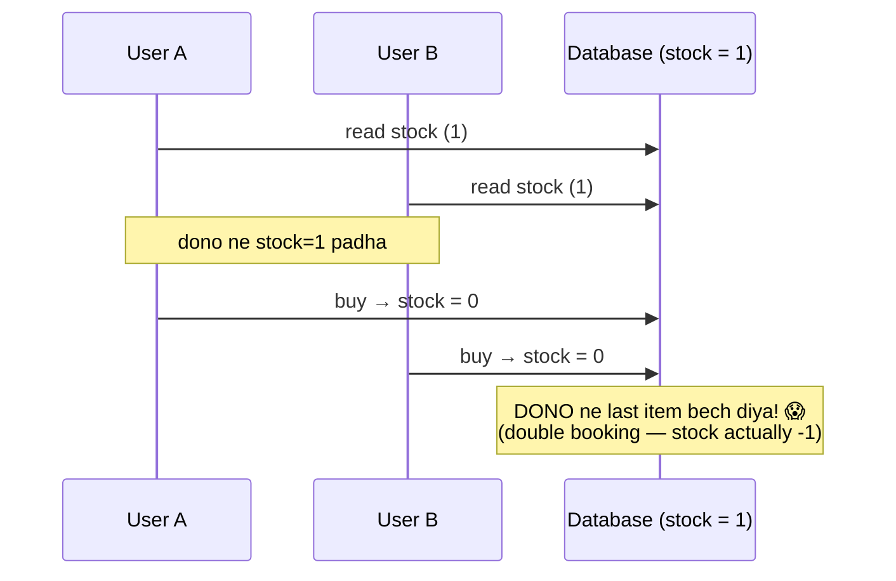
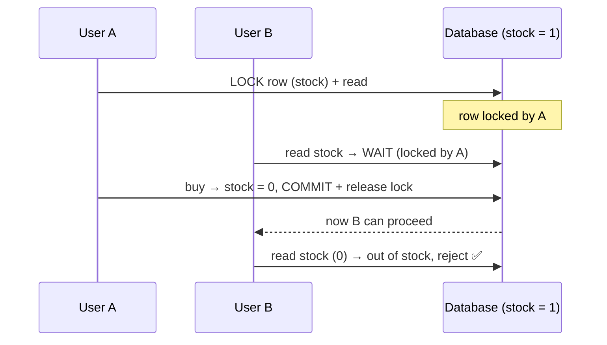
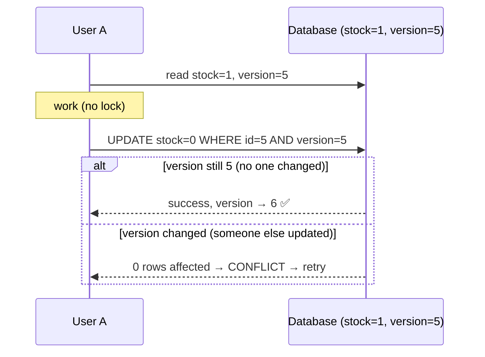
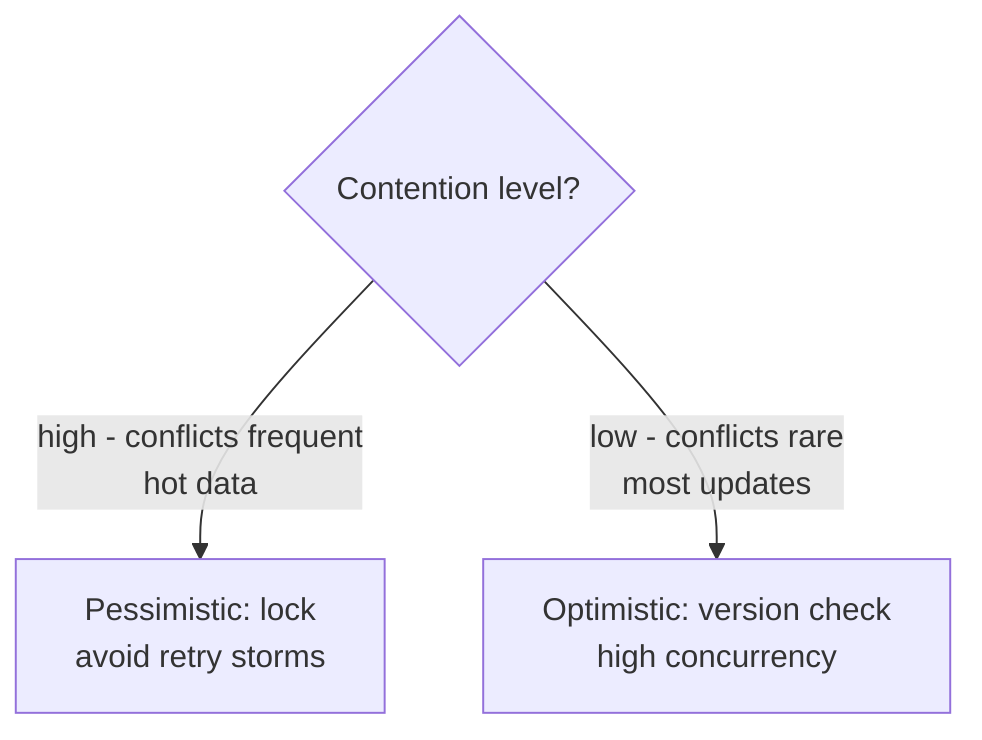
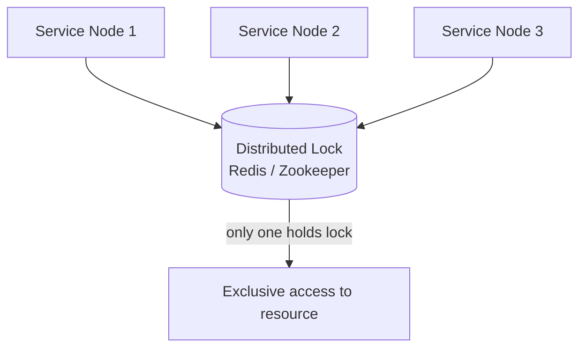
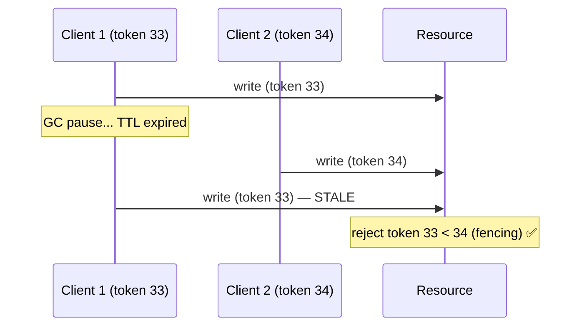
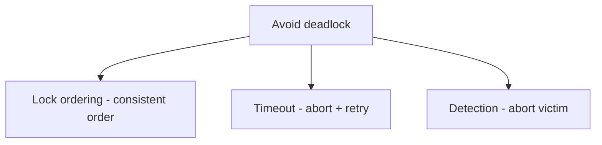
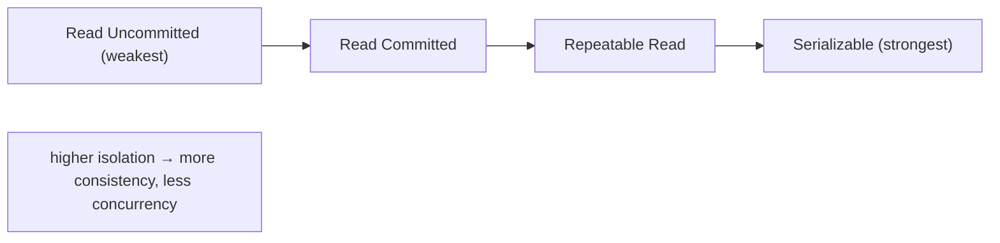
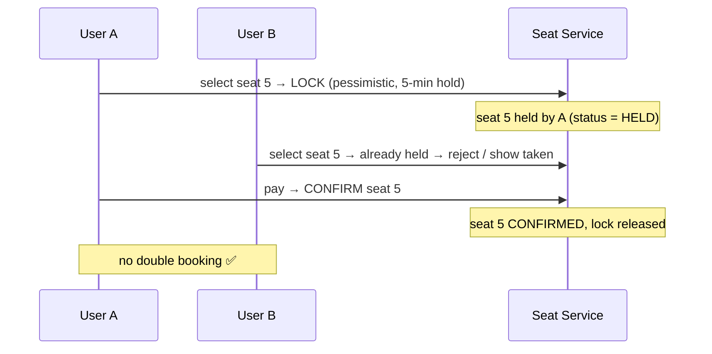

# Concurrency Control — Complete Deep Dive

> Jab **multiple users/threads** ek saath **same data** access/modify karte hain, race conditions +
> data corruption ho sakti (double booking, lost updates). **Concurrency control** ye ensure karta ki
> concurrent operations correct results dein. Ye file: race conditions, pessimistic vs optimistic
> locking, distributed locks (Redis/Zookeeper), deadlocks, aur isolation.

---

## 📑 Table of Contents
1. [Concurrency problem (race conditions)](#1-concurrency-problem--race-conditions)
2. [Pessimistic Locking](#2-pessimistic-locking)
3. [Optimistic Locking](#3-optimistic-locking)
4. [Pessimistic vs Optimistic](#4-pessimistic-vs-optimistic)
5. [Distributed Locks (Redis, Zookeeper)](#5-distributed-locks)
6. [Deadlocks](#6-deadlocks)
7. [Database isolation levels](#7-database-isolation-levels)
8. [Atomic operations](#8-atomic-operations)
9. [Real-world: booking systems](#9-real-world--booking-systems)
10. [Interview Q&A](#10-interview-qa)
11. [Summary](#11-summary)

---

## 1. Concurrency Problem — Race Conditions

**Race condition** = do (ya zyada) operations ek saath same data pe → result **timing pe depend**
karta (galat ho sakta).

### Lost update problem


Do users ne **last item** ek saath dekha (stock 1), dono ne buy kiya → **double booking** (stock ek
tha, do bik gaye). "Lost update" — ek update doosre ne overwrite kar diya.

**Real examples:**
- **Booking** — do log ek seat book kar dein.
- **Inventory** — last item double sold.
- **Bank balance** — concurrent withdrawals → overdraft.
- **Counter** — `count = count + 1` concurrently → lost increments.

> ⭐ Concurrency control in problems ko solve karta — ensure ek time me ek hi update "wins" cleanly.

---

## 2. Pessimistic Locking

**"Pehle lock lo, phir kaam karo."** Assume conflict **hoga** (pessimistic) — data ko **lock** karo
jab tak operation complete na ho. Doosre wait karte.



### Kaise
- **`SELECT ... FOR UPDATE`** (SQL) — row lock during transaction. Doosre transactions wait.
- Lock held from read to commit. Serialized access.

```sql
BEGIN;
  SELECT stock FROM products WHERE id = 5 FOR UPDATE;  -- lock
  -- (doosre transactions is row pe wait karte)
  UPDATE products SET stock = stock - 1 WHERE id = 5;
COMMIT;  -- lock release
```

### Pros / Cons
- ✅ **Prevents conflicts** (guaranteed no lost update), simple reasoning, good for **high contention**
  (jaha conflicts frequent).
- ❌ **Reduced concurrency** (waiting → lower throughput), **deadlock risk** (multiple locks), locks
  held long → performance. Blocking.
- **Use:** high-contention data (popular seat booking, hot inventory), correctness critical.

---

## 3. Optimistic Locking

**"Bina lock kaam karo, commit pe check karo."** Assume conflict **rare** (optimistic) — no lock
during work, but at commit **check if data changed** (version number). Changed → conflict → retry.



### Kaise
- **Version column** — har row me `version` (ya `updated_at`).
- Read: data + version.
- Write: `UPDATE ... WHERE id=X AND version=readVersion` (+ increment version).
- Agar version match (koi nahi badla) → success. Nahi match (kisi ne badla) → 0 rows → **conflict** →
  retry (re-read + reapply).

```sql
-- read
SELECT stock, version FROM products WHERE id = 5;   -- stock=1, version=5
-- write (conditional)
UPDATE products SET stock = 0, version = 6
WHERE id = 5 AND version = 5;                        -- version check
-- if 0 rows affected → someone changed it → CONFLICT → retry
```

### Pros / Cons
- ✅ **High concurrency** (no locks, no waiting), no deadlocks, good for **low contention** (conflicts
  rare).
- ❌ **Conflicts → retry** (wasted work if frequent conflicts), retry logic needed, poor for
  **high contention** (many retries).
- **Use:** low-contention data (most updates), read-heavy, high concurrency needed.

---

## 4. Pessimistic vs Optimistic

| | **Pessimistic** | **Optimistic** |
|---|---|---|
| Assumption | conflict will happen | conflict rare |
| Approach | lock first, then work | work, check at commit (version) |
| Locking | yes (rows locked) | no locks |
| Concurrency | lower (waiting) | higher (no waiting) |
| Deadlock risk | yes | no |
| On conflict | others wait | retry |
| Best for | **high contention** | **low contention** |
| Example | popular seat booking | profile update |



> ⭐ **Rule:** high contention (many concurrent writes on same data — popular seat) → **pessimistic**
> (lock, avoid retry storms). Low contention (rare conflicts) → **optimistic** (no lock overhead, high
> throughput). Choose based on conflict frequency.

---

## 5. Distributed Locks

Single DB me locks easy. **Distributed** systems me (multiple services/nodes) ek shared resource pe
exclusive access chahiye → **distributed lock**.



### Redis-based lock (SETNX + TTL)
```
lock:
    SET lock_key unique_value NX PX 30000
    # NX = set only if not exists (atomic)
    # PX 30000 = TTL 30 sec (auto-release if holder crashes)
unlock:
    if get(lock_key) == unique_value:   # only holder unlocks
        delete(lock_key)
```
- **NX** — only one client acquires (atomic).
- **TTL** — auto-release if holder crashes (deadlock avoid).
- ⚠ **Problem:** TTL expire before work done → another acquires → **two holders** (unsafe).
- **Redlock** — multiple Redis instances, majority lock (safer, but debated).

### Zookeeper-based lock
- **Ephemeral nodes** — client creates ephemeral znode. Session mari (client crash) → node
  auto-deleted → lock released (reliable).
- Sequential nodes → ordered lock acquisition (queue).
- More reliable than Redis (session-based), but heavier.

### Fencing tokens (safety)
Distributed lock ka classic problem: holder pause (GC) → TTL expire → another acquires → old holder
resumes → **both act** (corruption).

**Fencing token** — lock ke saath monotonic increasing token. Resource highest token accept karta,
purane (stale holder) reject. Prevents old holder corruption.

### ⚠ Distributed lock advice
> Distributed locks **hard + risky** (TTL, split-brain, fencing). **Avoid if possible** — prefer
> optimistic concurrency (version), idempotency, ya single-writer (partition data). Use only when
> genuinely needed.

---

## 6. Deadlocks

Pessimistic locking me **deadlock** — do transactions ek doosre ke lock ka wait (circular).

```mermaid
flowchart LR
    T1[Transaction 1<br/>holds lock A, wants B] -->|waits for B| T2
    T2[Transaction 2<br/>holds lock B, wants A] -->|waits for A| T1
    Note[Circular wait → DEADLOCK (both stuck forever)]
```

### 4 conditions (Coffman) — all needed for deadlock
1. **Mutual exclusion** — resource exclusive.
2. **Hold and wait** — hold one, wait for another.
3. **No preemption** — can't force-take.
4. **Circular wait** — cycle of waiting.

### Prevention / handling
- **Lock ordering** — hamesha ek hi order me locks lo (A phir B, kabhi B phir A) → no cycle.
- **Timeout** — lock wait timeout → abort + retry (break deadlock).
- **Deadlock detection** — DB cycle detect karta → ek transaction abort (victim).
- **Lock granularity** — kam locks, chhote critical sections.



> ⭐ **Lock ordering** sabse effective — sab transactions same order me locks lein → circular wait
> impossible → no deadlock. (Repo LLD: IRCTC me non-nested lock ordering.)

---

## 7. Database Isolation Levels

Databases concurrency ko **isolation levels** se control karte (transactions ek doosre ko kitna
dekhein):

| Level | Prevents | Allows |
|---|---|---|
| **Read Uncommitted** | — | dirty reads (uncommitted data dikhta) |
| **Read Committed** | dirty reads | non-repeatable reads |
| **Repeatable Read** | non-repeatable reads | phantom reads |
| **Serializable** | all anomalies | (slowest, full isolation) |

- **Dirty read** — uncommitted data padhna (rolled back ho sakta).
- **Non-repeatable read** — same query, transaction me alag result (koi ne beech me update kiya).
- **Phantom read** — new rows appear (koi ne insert kiya).



- Higher isolation = more consistency, **less concurrency** (more locking). Trade-off.
- **MVCC** (PostgreSQL, MySQL InnoDB) — readers don't block writers (snapshot isolation — each
  transaction sees consistent snapshot).

---

## 8. Atomic Operations

Simple concurrency (counters) ke liye **atomic operations** (locks se sasta):

```
Redis: INCR counter        # atomic increment (no race)
       DECR stock           # atomic decrement
DB:    UPDATE x SET n = n + 1 WHERE id = 5   # atomic at DB level
Compare-and-swap (CAS):     # atomic conditional update
```

- **Atomic** — operation indivisible (no partial state, no race). "Read-modify-write" ek step me.
- **Use:** counters, flags, simple increments (rate limiter, view count). Locks overkill for these.
- **Compare-and-Swap (CAS)** — atomic "update if current value == expected" (lock-free algorithms,
  optimistic concurrency ka base).

---

## 9. Real-world — Booking Systems

Concurrency control ka classic — **seat/ticket booking** (high contention on popular events):



**Approaches:**
- **Pessimistic** — seat lock during booking (BookMyShow — high contention). Timeout hold (payment
  window).
- **Optimistic** — version/status check at confirm (`UPDATE seat SET status='booked' WHERE id=5
  AND status='available'` — atomic compare-and-set).
- **Status field + atomic update** — common practical approach.

> ⭐ **Repo LLD:** `IRCTC_LLD` — segment-based seat + per-run mutex (pessimistic, fine-grained
> locking). `Movie_Ticket_Booking_System`. Wo code padho — concurrency LLD-level pe.

---

## 10. Interview Q&A

**Q: Race condition kya, example?**
Multiple operations same data ek saath → result timing pe depend (galat). Example: do users last item
ek saath buy (double booking), `count = count + 1` concurrently (lost increment).

**Q: Pessimistic vs optimistic locking?**
Pessimistic — lock first (assume conflict, others wait — high contention, deadlock risk). Optimistic
— no lock, version check at commit (assume rare, retry on conflict — high concurrency, low contention).

**Q: Kaunsa kab (pessimistic/optimistic)?**
High contention (popular seat, hot data — conflicts frequent) → pessimistic (avoid retry storms). Low
contention (rare conflicts) → optimistic (no lock overhead, high throughput).

**Q: Distributed lock kaise?**
Redis (SETNX + TTL — atomic, auto-release), Zookeeper (ephemeral nodes — session-based, reliable).
Fencing tokens (monotonic) for safety (stale holder reject). Avoid if possible (optimistic/idempotent
better).

**Q: Deadlock kya, avoid?**
Two transactions circular wait (T1 holds A wants B, T2 holds B wants A). 4 conditions (mutual
exclusion, hold-and-wait, no preemption, circular wait). Avoid: lock ordering (consistent order),
timeout, detection.

**Q: Optimistic locking implement kaise?**
Version column — read data+version, write `UPDATE ... WHERE id=X AND version=readVersion` (+increment).
Version match → success. Mismatch (someone changed) → 0 rows → conflict → retry.

**Q: Isolation levels?**
Read Uncommitted (dirty reads) → Read Committed → Repeatable Read → Serializable (full isolation,
slowest). Higher = more consistency, less concurrency. MVCC (readers don't block writers).

**Q: Booking system me double booking kaise roke?**
Pessimistic (lock seat during booking — high contention) ya atomic compare-and-set (`UPDATE seat SET
status='booked' WHERE status='available'`). Hold timeout for payment window.

---

## 11. Summary

- **Race condition** — concurrent ops on same data → wrong result (double booking, lost update).
- **Pessimistic locking** — lock first (assume conflict). High contention. `SELECT FOR UPDATE`.
  Deadlock risk, lower concurrency.
- **Optimistic locking** — no lock, version check at commit (assume rare). Low contention. High
  concurrency, retry on conflict.
- **Choose:** high contention → pessimistic, low contention → optimistic.
- **Distributed locks** — Redis (SETNX+TTL), Zookeeper (ephemeral). Fencing tokens for safety.
  Avoid if possible.
- **Deadlocks** — circular wait. Avoid: lock ordering, timeout, detection.
- **Isolation levels** — Read Uncommitted → Serializable (consistency vs concurrency). MVCC.
- **Atomic operations** (Redis INCR, CAS) — simple concurrency (counters) without locks.

> Related: [`Idempotency.md`](./Idempotency.md) · [`Distributed_Transactions.md`](./Distributed_Transactions.md)
> · [`16_Database_Design_Tips.md`](./16_Database_Design_Tips.md) · [`Database_Replication.md`](./Database_Replication.md)
