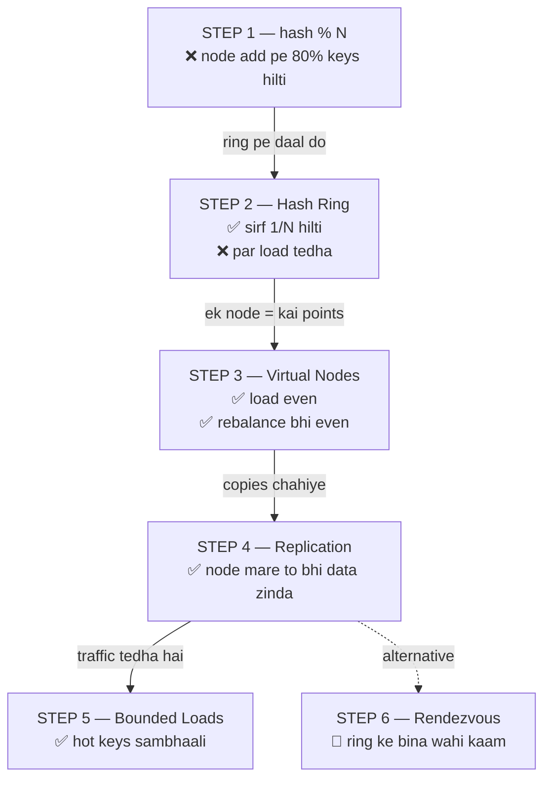
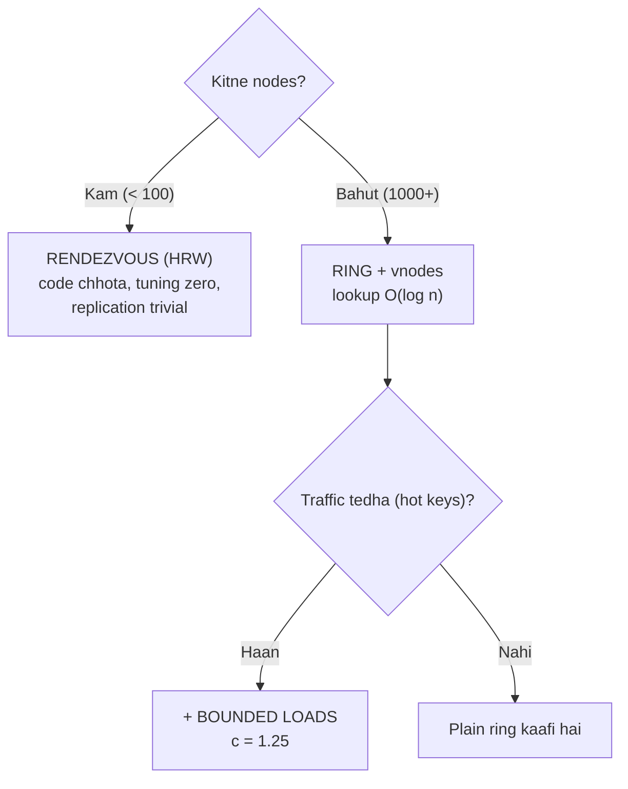

# Consistent Hashing — Code Karke Samjho 🔁

> [19_Consistent_Hashing.md](../19_Consistent_Hashing.md) me theory hai. Ye folder wahi theory
> **chala kar** dikhata hai — har concept ek alag `.cpp` file, jise aap compile karke apni aankhon
> se numbers dekh sako. Theory padhne se "pata chalta hai", code chalane se **yaad ho jaata hai**.

---

## 📑 Is folder me

| # | File | Kya sikhata hai |
|---|------|-----------------|
| — | [hash_util.h](hash_util.h) | Common hash function (FNV-1a + murmur finalizer) |
| 1 | [01_modulo_hashing_problem.cpp](01_modulo_hashing_problem.cpp) | `hash % N` kyun fail hota — **naap ke** |
| 2 | [02_hash_ring_basic.cpp](02_hash_ring_basic.cpp) | Hash ring, clockwise lookup, wrap-around |
| 3 | [03_virtual_nodes.cpp](03_virtual_nodes.cpp) | Virtual nodes — even distribution + even rebalance |
| 4 | [04_replication.cpp](04_replication.cpp) | Replication factor, preference list |
| 5 | [05_bounded_loads.cpp](05_bounded_loads.cpp) | Hot keys aur bounded loads (Google) |
| 6 | [06_rendezvous_hashing.cpp](06_rendezvous_hashing.cpp) | Rendezvous (HRW) — ring ke bina |
| ⭐ | [ConsistentHashRing.h](ConsistentHashRing.h) | **Capstone** — reusable class (vnodes + RF + weights + thread-safe) |
| ⭐ | [main.cpp](main.cpp) | Capstone demo — nakli distributed cache |

---

## 🚀 Kaise chalayein

```bash
./compile.sh          # sab build karo
./compile.sh 3        # sirf step 3 build karke chala do
./compile.sh main     # capstone demo
./compile.sh clean    # binaries hatao
```

Ya seedha:
```bash
g++ -std=c++17 -Wall -Wextra 01_modulo_hashing_problem.cpp -o demo && ./demo
```

> 📌 **Order me padho.** Har file pichhli file ki *kami* se shuru hoti hai. Step 3 ka matlab
> tabhi khulega jab step 2 ka tedha distribution apni aankh se dekha ho.

---

## 🎯 Poori kahani ek nazar me



---

## 📊 Code ne kya NAAPA (asli output ke numbers)

### Step 1 — modulo ki maut
100,000 keys, node count badla:

| Change | Keys jo move hui |
|--------|------------------|
| 4 → 5 nodes | **79.8%** |
| 10 → 11 nodes | **91.0%** |
| 100 → 101 nodes | **99.0%** |

> Formula: `1 - 1/N_new`. Cluster jitna bada, utna bura. Yahi wajah hai ki dynamic
> clusters me `% N` **use hi nahi hota**.

### Step 2 — ring ne kya bachaya
| Metric | Value |
|--------|-------|
| Node add pe keys moved | **33%** (modulo me 80%) |
| Baaki nodes ki keys jo bewajah hili | **0** ✅ |
| Load distribution | ❌ 68% / 18% / 12% / 1% — bahut tedha |

### Step 3 — virtual nodes ka jaadu
5 nodes, ideal share 20% har ek ka:

| vnodes/node | max share | min share | std-dev |
|-------------|-----------|-----------|---------|
| 1 | 40.16% | 0.44% | 13.48 |
| 20 | 23.97% | 16.74% | 2.71 |
| 100 | 22.86% | 15.98% | 2.47 |
| **200** | **21.08%** | **19.10%** | **0.75** |

> ⭐ Curve ~100-200 pe flat ho jaata hai — isiliye Cassandra/Dynamo **100-256 vnodes**
> pe rukte hain. Aage badhane se sirf memory badhti hai, faayda nahi.

**Doosra faayda** (jo log bhool jaate hain) — node marne pe:
- vnodes=1 → uska poora bojh **1 padosi** pe gira ❌
- vnodes=150 → bojh **saare 4 bache nodes** me barabar bata ✅

### Step 4 — replication
RF=3, 5 nodes, ek node maara:

| | |
|---|---|
| Keys jinki 2 copies ek hi node pe | **0** ✅ |
| Node marne pe kho gayi keys | **0** ✅ |
| Replica ne serve ki | 20,427 |
| Storage cost | **3x** 💰 |

### Step 5 — hot keys aur bounded loads
100 distinct keys (Zipf), ek key akele **19% traffic** kha rahi thi:

| `c` | capacity/node | max load | deflected |
|-----|---------------|----------|-----------|
| — (no cap) | ∞ | 1.52x avg | 0% |
| 1.50 | 30,000 | 1.50x | 0.5% |
| 1.25 | 25,000 | **1.25x** | 8.7% |
| 1.05 | 21,000 | **1.05x** | 17.5% |

> ⚖ **Trade-off saaf hai:** `c` ghatao → load utna hi barabar, par utni hi zyada keys
> apne asli node se hatengi (= zyada cache miss).

### Step 6 — rendezvous (HRW)
| Metric | Ring (150 vnodes) | Rendezvous (0 tuning) |
|--------|-------------------|------------------------|
| std-dev | 0.75 | **0.08** ✅ |
| Bewajah hili keys | 0 | 0 |
| Lookup cost | **O(log n)** ✅ | O(n) ❌ |
| Code lines | ~40 | **~12** ✅ |

---

## 🧠 Do sabse badi galtiyan (interview me yahi pakde jaate hain)

### ❌ Galti 1 — replication me "agle N points" le lena
```cpp
// GALAT — vnodes ke baad agle 3 points ek hi physical node ke ho sakte hain!
for (int i = 0; i < 3; i++) { replicas.push_back((++it)->second); }
```
`NodeA#7`, `NodeA#88`, `NodeA#3` — teeno **NodeA**. Aapki "3 copies" asal me ek hi server pe.
Wo server gaya, teeno gayi.

```cpp
// SAHI — jab tak N alag PHYSICAL nodes na mil jaayein, chalte raho
if (seen.insert(it->second).second) { replicas.push_back(it->second); }
```
Detail: [04_replication.cpp](04_replication.cpp)

### ❌ Galti 2 — `std::hash` use kar lena
`std::hash<string>` ki value **process/library ke beech same rehne ki guarantee nahi** hai.
Distributed system me har node ko **bilkul same** number chahiye — warna ek server key ko "A" pe
dhundhega, doosra "B" pe. Isliye apna fixed hash (FNV-1a / Murmur3 / xxHash) use karo.
Detail: [hash_util.h](hash_util.h)

---

## ⚖️ Kab kya use karein



| Chahiye | Use karo |
|---------|----------|
| Data placement (sharded DB, cache) | Ring + vnodes + RF |
| Request routing / load balancing | Ring + **bounded loads** |
| Chhota cluster, simple code | **Rendezvous (HRW)** |
| Alag-alag capacity ke servers | **Weighted** vnodes ([ConsistentHashRing.h](ConsistentHashRing.h)) |

---

## 🌍 Real duniya me

| System | Kya use karta |
|--------|---------------|
| **Cassandra** | Ring + vnodes (default 256) + RF=3, Murmur3Partitioner |
| **DynamoDB / Riak** | Dynamo paper — ring + vnodes + preference list |
| **Memcached clients** | Client-side consistent hashing (ketama — MD5 based) |
| **Redis Cluster** | 16384 hash slots (thoda alag — fixed slots, manual assign) |
| **Ceph** | CRUSH (rendezvous family) |
| **Google / Vimeo LB** | Bounded loads — peak load 8x se 1.25x pe aaya |

---

## 💬 Interview me kaise bolna

**"Consistent hashing kya hai?"**
> Data ko nodes me baantne ki technique jahan node add/remove pe sirf **~1/N keys** move hoti hain,
> na ki saari. Nodes aur keys dono ek hi hash ring (0 to 2^32) pe map hote hain, aur key uske
> **clockwise agle node** ki ho jaati hai. Kyunki node ki position `hash(node_id)` se aati hai —
> `N` se nahi — isliye N badalne pe baaki nodes hilte hi nahi.

**"Virtual nodes kyun?"**
> Do wajah. Ek — sirf 4-5 random points se ring ke arcs barabar nahi bante (maine test kiya tha,
> ek node ko 68% keys mil gayi thi). Do — bina vnodes ke node marne pe uska **poora bojh ek hi
> padosi** pe girta hai, jo cascading failure de sakta hai. 150-200 vnodes pe dono theek ho jaate.

**"Aur agar ek key hi bahut garam ho?"**
> Consistent hashing keys barabar baantta hai, **traffic nahi**. Uske liye consistent hashing
> **with bounded loads** — har node pe `c × average` ka cap, bhara node skip. Par wo assignment
> stateful bana deta hai, isliye wo **routing** ke liye theek hai, permanent data placement ke liye nahi.

---

## 📝 Summary

- **Problem:** `hash % N` — node add/remove pe ~80-99% keys remap (cache stampede / data movement).
- **Ring:** nodes + keys dono 0..2^32 pe, key → clockwise agla node. Sirf ~1/N move.
- **Vnodes:** ek node = 100-256 ring points → even load **aur** even rebalance.
- **Replication:** clockwise agle RF **distinct physical** nodes (preference list).
- **Bounded loads:** hot keys ke liye capacity cap — balance vs churn ka trade-off.
- **Rendezvous:** `max(hash(key+node))` — chhote clusters ke liye simpler aur behtar.

---

## 🔗 Aage padho
- [19_Consistent_Hashing.md](../19_Consistent_Hashing.md) — theory + interview Q&A
- [21_Database_Sharding.md](../21_Database_Sharding.md) — sharding jahan ye lagta hai
- [08_Caching_and_Distributed_Caching.md](../08_Caching_and_Distributed_Caching.md) — distributed cache
- [Database_Replication.md](../Database_Replication.md) — replication deep dive
- [Hot Key / Celebrity Problem](../Advanced_Topics/13_Hot_Key_Celebrity_Problem.md) — Step 5 ka hi bada version
- [Distributed Cache case study](../System_Design_Case_Studies/03_Distributed_Cache.md) — capstone jaisa, par design level pe
