# Database Replication — Complete Deep Dive

> Replication = data ki **multiple copies** alag machines pe rakhna. Ye **read scaling**, **high
> availability**, aur **fault tolerance** deta. Sharding ka jodidaar hai — sharding data **split**
> karta (write scaling), replication data **copy** karta (read scaling + HA). Ye file: replication
> kyun, topologies (master-slave/multi-master/leaderless), sync/async, replication lag, conflict
> resolution, quorum — sab detail me.

---

## 📑 Table of Contents
1. [Replication kya + kyun](#1-replication-kya-hai)
2. [Replication vs Sharding](#2-replication-vs-sharding)
3. [Topologies (3 types)](#3-replication-topologies)
4. [Sync vs Async vs Semi-sync](#4-synchronous-vs-asynchronous-replication)
5. [Replication lag + solutions](#5-replication-lag--stale-reads)
6. [Conflict resolution (multi-master)](#6-conflict-resolution-multi-leader)
7. [Leaderless replication + Quorum](#7-leaderless-replication--quorum)
8. [Failover](#8-failover-leader-mara-to)
9. [Read replicas — read scaling](#9-read-replicas--read-scaling)
10. [Interview Q&A](#10-interview-qa)
11. [Summary](#11-summary)

---

## 1. Replication kya hai

**Replication** = database ki data ko **multiple servers (replicas)** pe copy karna. Ek copy fail ho
to doosri available. Reads multiple copies me distribute → read scaling.

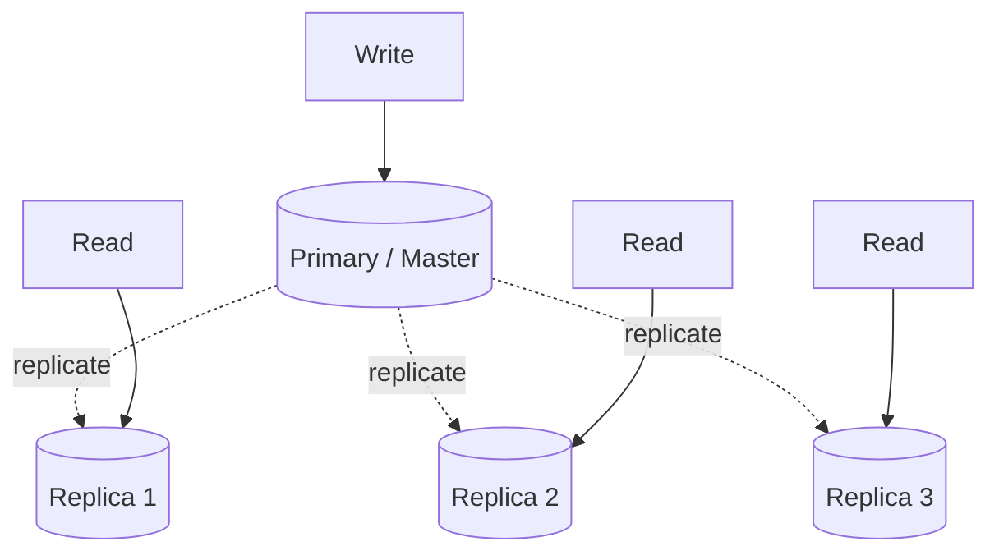

### Kyun replication
1. **Read scaling** — reads multiple replicas me distribute (most apps read-heavy — 100:1 read:write).
2. **High availability** — ek node down → doosra serve karta (no downtime).
3. **Fault tolerance** — data ki copies (ek disk fail → data safe).
4. **Geo-distribution** — replicas different regions me (users ko nearest, low latency).
5. **Backup / analytics** — replica pe heavy analytics queries (primary unaffected).

---

## 2. Replication vs Sharding

Dono distributed data ke techniques par bilkul alag maqsad:

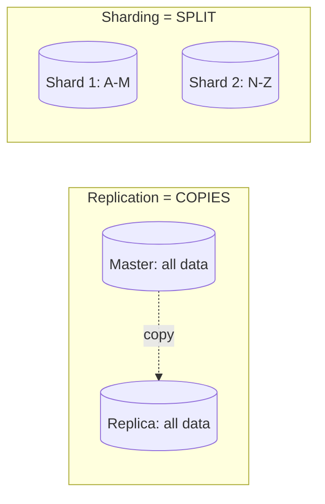

| | Replication | Sharding |
|---|---|---|
| Kya karta | data ki **copies** | data ko **split** |
| Scales | **reads** + availability | **writes** + storage |
| Har node | poora dataset (copy) | subset (partition) |
| Failure | replica serve karta (redundant) | shard down → us data ka loss (unless replicated) |
| Use | read-heavy, HA | write-heavy, huge data |

> ⭐ **Real systems dono use karte** — har **shard** ki apni **replicas** (write scaling + read
> scaling + HA). [Sharding: `21_Database_Sharding.md`]

---

## 3. Replication Topologies

Data replicas me kaise flow karta — 3 fundamental topologies:

### 3.1 — Single-Leader (Master-Slave / Primary-Replica)
Ek **leader (master)** saare **writes** handle karta. Writes ko **replicas (slaves)** pe propagate
karta. Replicas sirf **reads** serve karti.

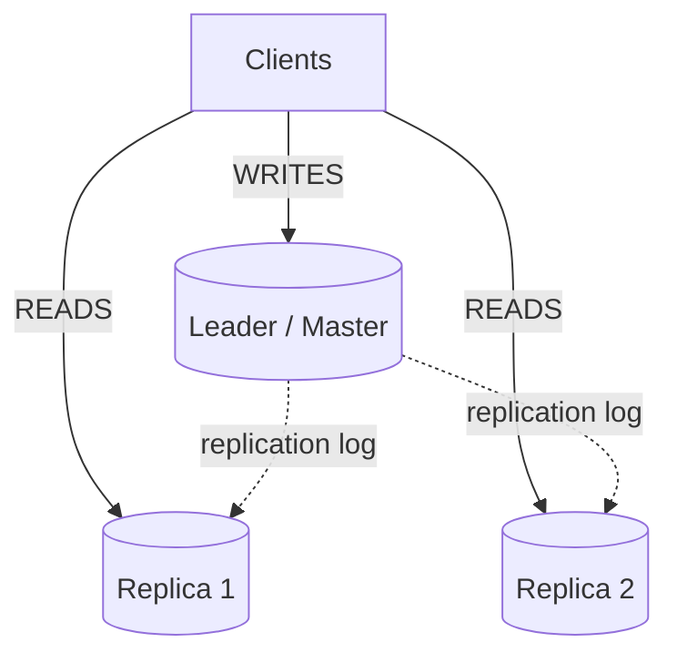

- **Writes** → leader only. **Reads** → replicas (scaled).
- **Kaise:** leader changes ko **replication log** (WAL/binlog) me likhta, replicas isse apply karti.
- ✅ Simple, no write conflicts (ek leader), consistent writes.
- ❌ **Leader = write bottleneck + SPOF** (leader down → writes rukte, until failover).
- **Use:** most common (MySQL, PostgreSQL, MongoDB replica sets). Read-heavy apps.

### 3.2 — Multi-Leader (Master-Master)
**Multiple leaders** — har ek writes accept karta. Leaders ek doosre ko replicate karte.

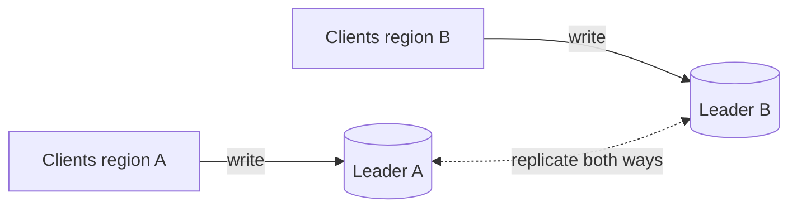

- ✅ **Write availability** (multiple write points), geo (har region ka apna leader — low write
  latency), leader down → doosra writes le sakta.
- ❌ **Write conflicts** — do leaders same row alag update karein → conflict (resolution chahiye).
  Complex.
- **Use:** multi-region active-active, collaborative apps (offline sync).

### 3.3 — Leaderless (Dynamo-style)
**Koi leader nahi** — client (ya coordinator) **kisi bhi node** ko write/read bhej sakta. Multiple
nodes se read/write (quorum).

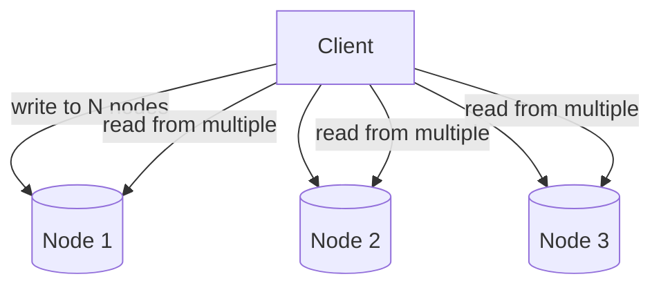

- ✅ **High availability** (no leader SPOF), no failover needed, tunable consistency (quorum).
- ❌ Complex (read-repair, conflict resolution, eventual consistency).
- **Use:** Cassandra, DynamoDB, Riak. AP systems (availability priority).

### Topology comparison
| | Single-Leader | Multi-Leader | Leaderless |
|---|---|---|---|
| Write nodes | 1 | multiple | any (quorum) |
| Conflicts | none | possible | possible (quorum resolves) |
| Availability | leader SPOF | higher | highest |
| Complexity | low | medium | high |
| Examples | MySQL, PostgreSQL | multi-region setups | Cassandra, DynamoDB |

---

## 4. Synchronous vs Asynchronous Replication

Leader writes ko replicas pe kaise propagate karta — timing ka trade-off:

### Synchronous
Leader **wait karta** replica(s) ke acknowledgement ka, phir client ko success deta.
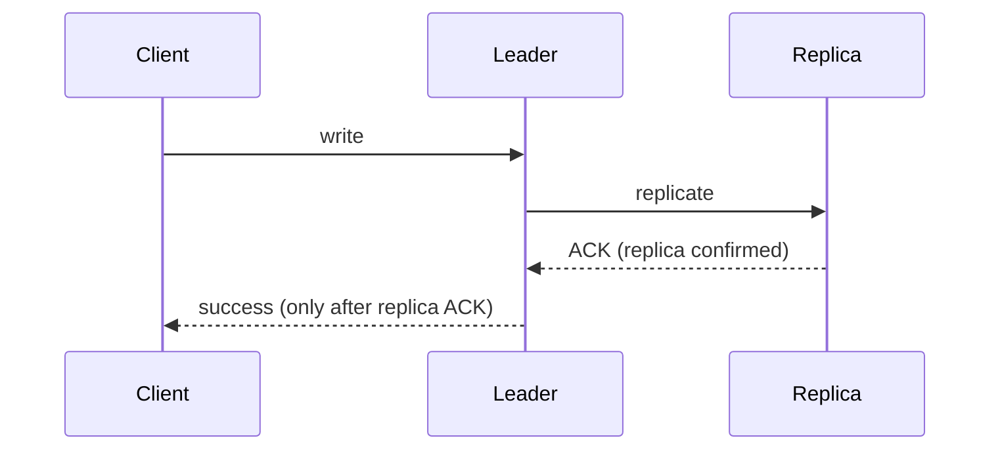
- ✅ **Consistent** — replica always up-to-date (no data loss on leader failure — replica has it).
- ❌ **Slow** (wait for replica), **availability hit** (replica down/slow → writes block).

### Asynchronous
Leader client ko **turant** success deta, replicas ko **background** me propagate karta.
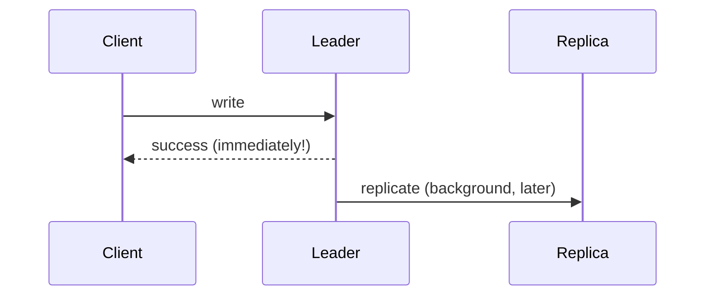
- ✅ **Fast** (no wait), high availability (replica down → writes continue).
- ❌ **Replication lag** (replica behind → stale reads), **data loss risk** (leader crash before
  replicating → unreplicated writes gone).

### Semi-Synchronous
**At least ONE** replica sync, baaki async. Balance.
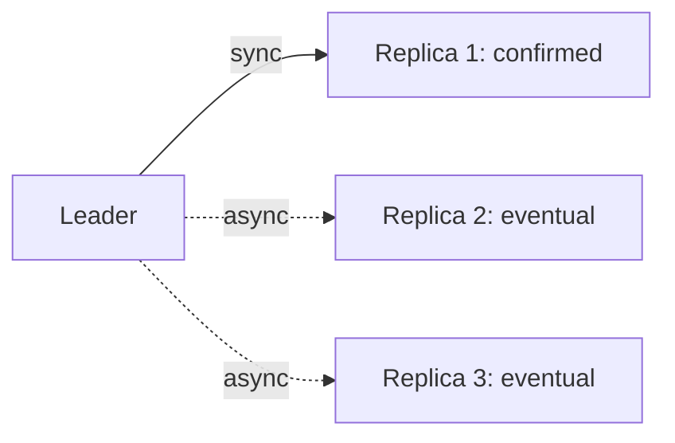
- ✅ No total data loss (one sync replica has it), decent speed.
- **Use:** balance of consistency + performance (common production choice).

| | Sync | Async | Semi-sync |
|---|---|---|---|
| Speed | slow | fast | medium |
| Data loss on failover | none | possible | minimal (1 sync copy) |
| Availability | lower (replica must be up) | high | medium |
| Consistency | strong | eventual (lag) | good |

> ⭐ Most systems **async** (speed + availability) with monitoring, ya **semi-sync** for critical
> data. Full sync rare (slow).

---

## 5. Replication Lag & Stale Reads

Async replication me replica leader se **peeche** hoti (lag) → user ko **stale (purana) data** dikh
sakta.

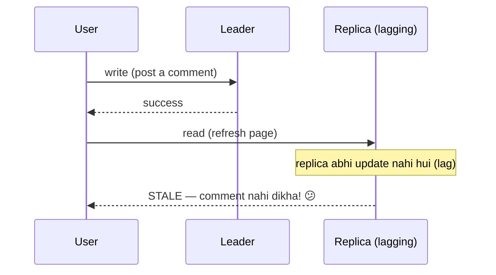

### Consistency guarantees (lag ke solutions)
1. **Read-your-own-writes** — user ko apni likhi cheez turant dikhe. Fix: uske reads **leader** se
   (ya recently-written data leader se, X seconds tak).
2. **Monotonic reads** — user ek baar naya data dekha, to purana nahi dikhe (time backward na jaaye).
   Fix: ek user hamesha **same replica** se (ya newer).
3. **Consistent prefix reads** — causally-related writes sahi order me dikhein (question before
   answer). Fix: causal ordering.
4. **Bounded staleness** — replica X seconds se zyada peeche na ho (warna traffic hatao).

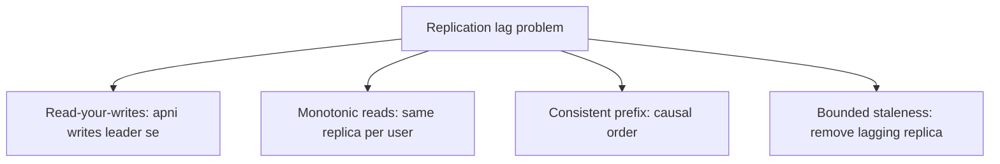

> ⭐ **Trade-off:** async replication (fast, available) ka cost = lag (stale reads). Critical reads
> ke liye leader use karo (read-your-writes), warna replica (eventual ok).

---

## 6. Conflict Resolution (Multi-Leader)

Multi-leader me do leaders **same row** alag update karein → conflict. Resolve kaise:

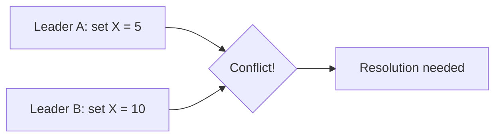

### Resolution strategies
1. **Last-Write-Wins (LWW)** — timestamp se latest jeetta. Simple par **data loss** (ek update
   silently discard). Clock skew issues.
2. **Version vectors / Vector clocks** — concurrent vs causal detect. Concurrent → app resolve ya
   keep both (siblings).
3. **CRDTs (Conflict-free Replicated Data Types)** — data structures jo **automatically merge**
   without conflict (counters, sets, sequences). Collaborative editing (Google Docs-like),
   distributed counters. No manual resolution.
4. **Application-level** — business logic decide (merge shopping carts — union of items).

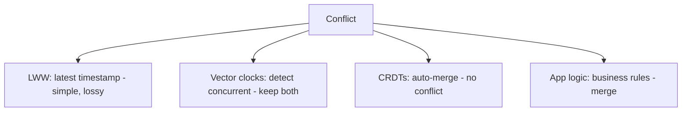

> ⭐ **Best avoidance:** design so conflicts don't happen (single-leader for a data item, ya route
> a user's writes to one region). Conflicts unavoidable → CRDT (auto) ya app-level (semantic merge).

---

## 7. Leaderless Replication + Quorum

Leaderless (Dynamo/Cassandra) me **quorum** se consistency tune hoti.

### Quorum formula
```
N = number of replicas
W = write acknowledgements needed (write succeeds after W replicas confirm)
R = read responses needed (read from R replicas)

W + R > N  →  STRONG consistency (read + write sets overlap → latest guaranteed)
```

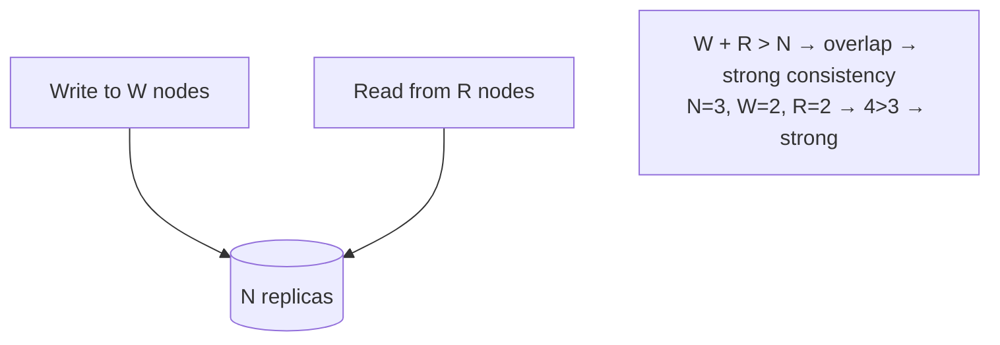

**Examples:**
```
N=3, W=2, R=2 → W+R=4 > 3 → STRONG (overlap guaranteed, latest read)
N=3, W=1, R=1 → 2 > 3? no → EVENTUAL (fast, may read stale)
N=3, W=3, R=1 → fast reads, slow writes (read-optimized)
N=3, W=1, R=3 → fast writes, slow reads (write-optimized)
```

### Leaderless mechanisms
- **Read-repair** — read pe stale replica detect → update (during read, opportunistic).
- **Anti-entropy** — background process replicas sync (Merkle trees se diff).
- **Hinted handoff** — node down → doosra node uska write temporarily rakhta ("hint"), node wapas →
  handoff. Availability badhata.

> ⭐ Cassandra/DynamoDB me W, R, N **tunable per-query** — same DB me kuch queries strong (W+R>N),
> kuch fast eventual. Flexibility.

---

## 8. Failover (leader mara to?)

Single-leader me leader **SPOF** — down ho to writes rukte. **Failover** = automatically naya leader.

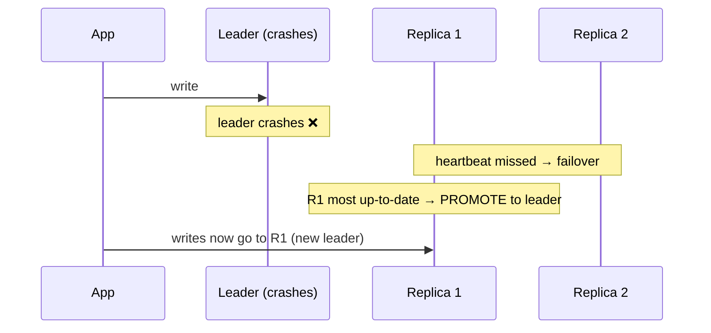

**Failover steps:**
1. **Detect failure** — heartbeat timeout.
2. **Choose new leader** — most up-to-date replica (consensus/election — Raft).
3. **Reconfigure** — clients + replicas naye leader ko point (VIP/DNS switch).

**Problems:**
- **Split-brain** — 2 leaders (old + new both think they're leader) → conflicting writes. Fix:
  fencing (old leader reject), quorum (majority side).
- **Lost writes** — async me unreplicated writes (leader crash before replicating) — gone.
- **Timeout tuning** — too short → false failover (leader alive, network blip), too long → longer
  downtime.

---

## 9. Read Replicas — Read Scaling

Most common practical use — **read replicas** se reads scale karo.

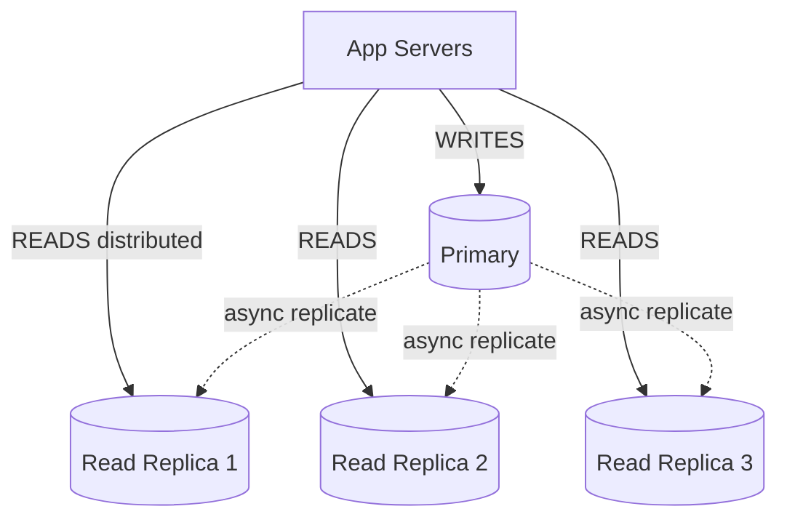

- **Writes** → primary, **reads** → replicas (10x read capacity with 10 replicas).
- Most apps **read-heavy** (100:1 read:write) → read replicas huge impact.
- ⚠ **Replication lag** — replica reads may be stale (async). Critical reads → primary.
- **When:** DB read load bottleneck (before sharding). [Scaling: `07_Scale_Application_0_to_Million.md`]

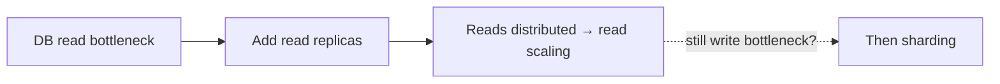

---

## 10. Interview Q&A

**Q: Replication vs sharding?**
Replication = data ki copies (read scaling + HA). Sharding = data split (write scaling + storage).
Dono saath — replicated shards (each shard master + replicas).

**Q: Replication topologies?**
Single-leader (one writer + read replicas — common, no conflicts, leader SPOF), multi-leader
(multiple writers — write availability + geo, but conflicts), leaderless (any node, quorum — high
availability, Cassandra/DynamoDB).

**Q: Sync vs async replication?**
Sync — leader waits for replica ACK (consistent, no data loss, but slow + availability hit). Async —
leader responds immediately, replicates later (fast, available, but replication lag + data loss risk).
Semi-sync — one sync replica (balance).

**Q: Replication lag ka problem, solutions?**
Async me replica behind → stale reads. Solutions: read-your-writes (own writes from leader),
monotonic reads (same replica per user), consistent prefix, bounded staleness.

**Q: Multi-leader conflict resolution?**
LWW (timestamp — simple, lossy), version/vector clocks (detect concurrent, keep both), CRDTs
(auto-merge — counters/sets), app-level (semantic merge — carts).

**Q: Quorum kya (leaderless)?**
W + R > N → strong consistency (write + read sets overlap). N=3, W=2, R=2 → strong. Tunable per-query
(fast eventual vs slow strong).

**Q: Failover kaise, split-brain?**
Leader down → detect (heartbeat) → promote most up-to-date replica → reconfigure. Split-brain (2
leaders) → fencing + quorum (majority active).

**Q: Read replicas kab?**
DB read bottleneck (read-heavy apps). Writes → primary, reads → replicas (read scaling). Before
sharding. Watch replication lag (critical reads → primary).

---

## 11. Summary

- **Replication** = data copies (read scaling + HA + fault tolerance + geo). Sharding ka jodidaar
  (sharding = split/write scaling).
- **Topologies:** single-leader (common, no conflicts, leader SPOF), multi-leader (write availability,
  conflicts), leaderless (quorum, high availability — Cassandra/DynamoDB).
- **Sync** (consistent, slow) vs **async** (fast, lag + loss risk) vs **semi-sync** (balance).
- **Replication lag** → stale reads. Fix: read-your-writes, monotonic reads, bounded staleness.
- **Conflict resolution** (multi-leader): LWW, vector clocks, CRDTs, app-level.
- **Quorum** (leaderless): W + R > N → strong. Tunable.
- **Failover** — promote replica; split-brain → fencing + quorum.
- **Read replicas** — read scaling (most common, before sharding).

> Related: [`21_Database_Sharding.md`](./21_Database_Sharding.md) · [`11_CAP_Theorem.md`](./11_CAP_Theorem.md)
> · [`09_Introduction_to_Distributed_Systems.md`](./09_Introduction_to_Distributed_Systems.md) ·
> [`Distributed_Transactions.md`](./Distributed_Transactions.md)
