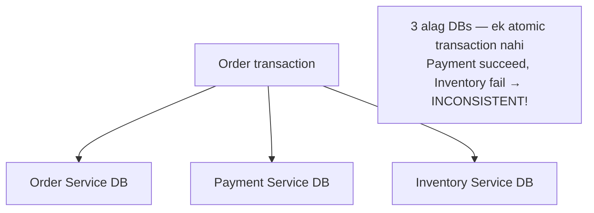
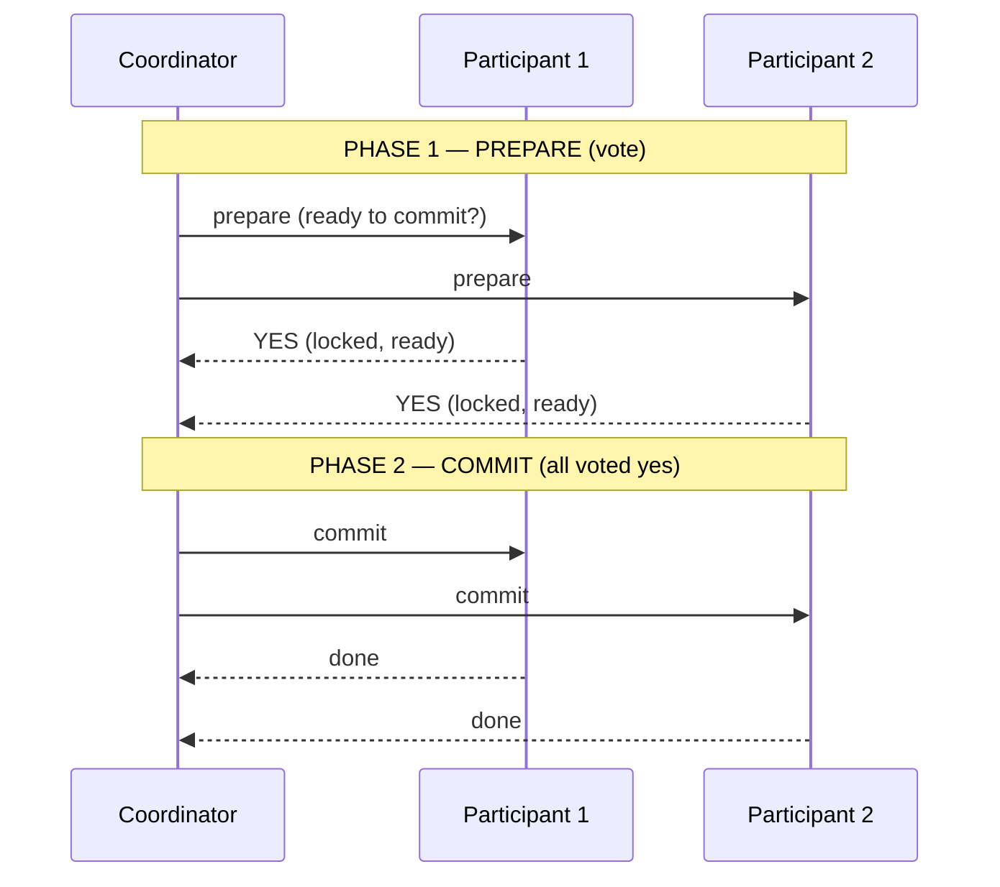
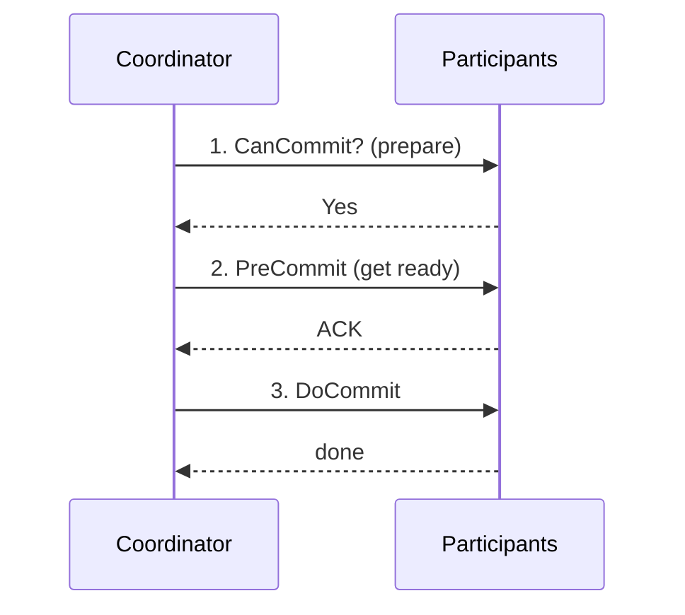
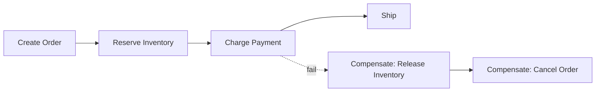
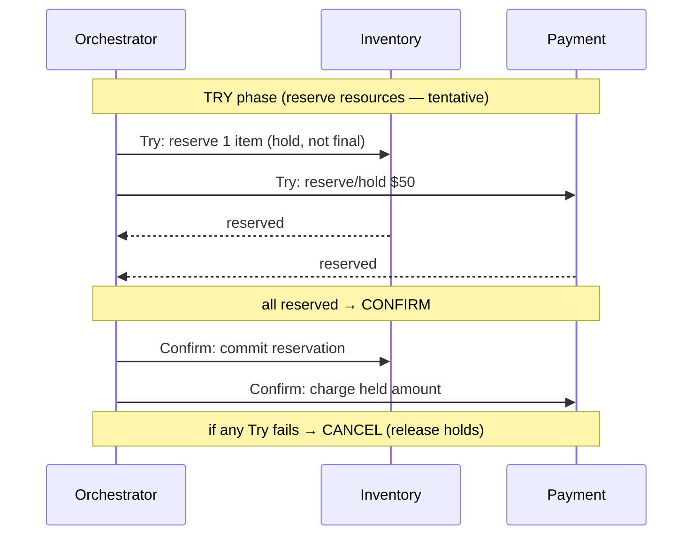
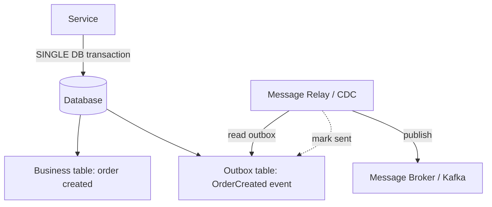
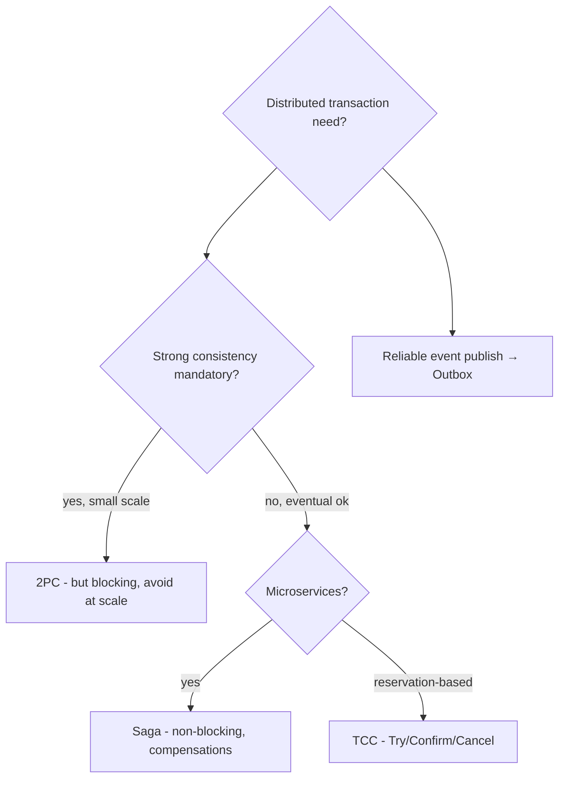

# Distributed Transactions — Complete Deep Dive

> Single DB me transaction easy (`BEGIN...COMMIT` — ACID). Par microservices/distributed systems me
> ek transaction **multiple services/databases** touch kare (order + payment + inventory) — atomic
> kaise? Ye file: distributed transactions kyun mushkil, 2PC, 3PC, Saga, TCC, Outbox — sabke
> mechanisms, pros/cons, aur when to use.

---

## 📑 Table of Contents
1. [Problem: distributed transaction kyun mushkil](#1-problem--distributed-transactions-kyun-mushkil)
2. [Two-Phase Commit (2PC)](#2-two-phase-commit-2pc)
3. [Three-Phase Commit (3PC)](#3-three-phase-commit-3pc)
4. [Saga Pattern](#4-saga-pattern)
5. [TCC (Try-Confirm-Cancel)](#5-tcc-try-confirm-cancel)
6. [Outbox Pattern](#6-outbox-pattern)
7. [Comparison + when to use](#7-comparison--when-to-use)
8. [Interview Q&A](#8-interview-qa)
9. [Summary](#9-summary)

---

## 1. Problem — Distributed Transactions kyun mushkil

Single DB me: `BEGIN → update A → update B → COMMIT` (atomic, ACID — all or nothing). Distributed me:
alag services, alag DBs — ek `BEGIN...COMMIT` possible **nahi**.

**Challenge:** "order create + payment charge + inventory reduce" — sab succeed ya sab fail (atomic).
Par ek DB transaction inhe cover nahi karta. Agar payment succeed but inventory fail → **inconsistent**
(paisa kata, item nahi mila).

**Approaches:**
- **2PC / 3PC** — strong consistency (atomic), but blocking + availability cost.
- **Saga** — eventual consistency (compensations), non-blocking (microservices standard).
- **TCC** — structured reservation-based.
- **Outbox** — reliable event publishing (dual-write solve).

---

## 2. Two-Phase Commit (2PC)

**2PC** = atomic distributed transaction via a **coordinator** + **participants**. Do phases:
**prepare** (vote) + **commit/abort**.

### How it works
**Phase 1 (Prepare/Voting):**
- Coordinator har participant ko "prepare" bhejta (ready to commit?).
- Participants resources **lock** karte, "yes" (ready) ya "no" vote karte.

**Phase 2 (Commit/Abort):**
- **Sab "yes"** → coordinator "commit" bhejta → sab commit.
- **Koi "no"** → coordinator "abort" bhejta → sab rollback.

### ✅ Advantages
- **Strong consistency** — atomic (all commit ya all abort). ACID across services.

### ❌ Disadvantages
- **Blocking** — coordinator down (Phase 2 ke beech) → participants **locked** (resources held, wait
  indefinitely). Big problem.
- **Coordinator = SPOF** — coordinator failure → stuck transaction.
- **Slow** — 2 round trips + locks held across services (poor throughput, low concurrency).
- **Availability hit** — ek participant down → whole transaction blocked.

> ⚠ **2PC modern microservices/scale me avoid** — blocking + availability + performance issues.
> Databases (single) me XA transactions use hoti, par distributed services me Saga prefer.

---

## 3. Three-Phase Commit (3PC)

**3PC** = 2PC + extra "pre-commit" phase → **non-blocking** (timeout se decide). Prepare → Pre-Commit
→ Commit.

- Extra phase → participants timeout pe **decide kar sakte** (coordinator down → commit if pre-committed)
  → **non-blocking**.
- ❌ Still issues with network partitions, more complex, more latency (3 phases). **Practically rare**
  (complexity vs benefit).

---

## 4. Saga Pattern

**Saga** = distributed transaction ko **local transactions ki sequence** me todo, har step ka
**compensating action** (undo). Non-blocking, eventual consistency. **Microservices standard.**

- **Forward:** each step local transaction (ACID in its own DB).
- **Failure:** completed steps ko **compensating transactions** se undo (reverse order).
- **Two types:** Choreography (event-driven, decentralized) vs Orchestration (central coordinator).

> ⭐ **Saga poora detail** (choreography vs orchestration, sequence diagrams, sync/async,
> compensations, pros/cons, considerations) `01_Monolithic_and_Microservices.md` § 2.2 me hai — wo
> padho (bahut detailed).

### 2PC vs Saga
| | 2PC | Saga |
|---|---|---|
| Consistency | strong (atomic) | eventual |
| Blocking | yes (locks) | no |
| Availability | lower | higher |
| Coordinator | SPOF | orchestrator (Saga) / none (choreography) |
| Rollback | automatic | compensating transactions (manual undo) |
| Use | rare (avoid at scale) | **microservices standard** |

> ⭐ **Modern:** Saga (non-blocking, resilient, eventual consistency) >> 2PC (blocking) for
> microservices. 2PC avoid at scale.

---

## 5. TCC (Try-Confirm-Cancel)

**TCC** = Saga ka structured variant. Har operation **3 phases** me: Try (reserve), Confirm (commit),
Cancel (rollback). Reservation-based.

### Phases
- **Try** — resources **reserve** karo (tentative — hold, not final). E.g. inventory "hold" (not
  deducted), payment "authorize" (not captured).
- **Confirm** — reservation **commit** (permanent). Inventory deduct, payment capture.
- **Cancel** — reservation **release** (rollback). Inventory unhold, payment void.

- ✅ More control than Saga (explicit reserve), better isolation (reserved resources not visible).
- ❌ Each service must implement 3 operations (Try/Confirm/Cancel — more code), complexity.
- **Use:** booking systems (seat hold → confirm/release), payments (authorize → capture/void),
  resource reservation.

> ⭐ **Repo LLD:** `Ecommerce_Cart_Checkout_LLD` reservation saga (reserve → commit/release) = TCC-like
> (Try=reserve, Confirm=commit, Cancel=release).

---

## 6. Outbox Pattern

**Problem — dual write:** service DB update **aur** event publish dono karni hai — **atomic nahi** (2
systems: DB + message broker). Ek succeed, doosra fail → inconsistency (order created but event not
sent, ya event sent but order not saved).

### How it works
1. Service business data + event ko **ek DB transaction** me likhta (order + outbox row) — **atomic**
   (DB ACID guarantees both or neither).
2. **Message relay** (poller ya CDC — Change Data Capture via Debezium) outbox table read karta.
3. Events message broker (Kafka) pe publish karta.
4. Published events mark/delete.

- ✅ **Guaranteed consistency** — DB commit hui to event **definitely** jaayega (at-least-once). No
  lost events, no phantom events.
- ⚠ Eventual (small delay DB write → publish), duplicates possible (consumer idempotent).
- **Use:** reliable event publishing in microservices (order → inventory sync). Standard dual-write
  solution.

> ⭐ **Outbox + CDC (Debezium) = reliable event pipeline.** Detail bhi `01_Monolithic_and_Microservices.md`
> § 2.5 me.

---

## 7. Comparison + When to Use

| Approach | Consistency | Blocking | Complexity | Use |
|---|---|---|---|---|
| **2PC** | strong (atomic) | yes | medium | rare (avoid at scale) |
| **3PC** | strong | no | high | rare (complexity) |
| **Saga** | eventual | no | medium | **microservices standard** |
| **TCC** | eventual (isolated) | no (reserved) | high (3 ops) | booking, payments (reserve) |
| **Outbox** | eventual (reliable events) | no | low-medium | reliable event publishing |

### Decision
- **Strong consistency + small scale** → 2PC (par blocking — carefully).
- **Microservices, eventual ok** → **Saga** (most common).
- **Reservation/hold semantics** → TCC (booking, payment authorize).
- **Reliable event publishing** → Outbox.
- **Best avoidance:** design so transactions **stay within one service/DB** (co-locate related data)
  — no distributed transaction needed.

---

## 8. Interview Q&A

**Q: Distributed transaction kyun mushkil?**
Multiple services/DBs — ek `BEGIN...COMMIT` (ACID) possible nahi. "Order + payment + inventory atomic"
— ek DB transaction cover nahi karta. Payment succeed + inventory fail → inconsistent.

**Q: 2PC kaise kaam karta, problems?**
Coordinator + participants, 2 phases: prepare (vote + lock) + commit/abort (all yes → commit). Problems:
blocking (coordinator down → participants locked), coordinator SPOF, slow (locks + 2 round trips),
availability hit. Avoid at scale.

**Q: Saga vs 2PC?**
2PC — strong consistency, atomic, but blocking + availability cost. Saga — eventual consistency, local
transactions + compensations, non-blocking, resilient. Microservices → Saga.

**Q: Saga ke do types?**
Choreography (event-driven, decentralized — each service reacts to events) vs Orchestration (central
orchestrator commands services). [Detail: 01 file § 2.2]

**Q: TCC kya?**
Try-Confirm-Cancel — 3-phase reservation. Try (reserve/hold), Confirm (commit), Cancel (release). More
control + isolation than Saga. Booking (seat hold), payments (authorize → capture).

**Q: Outbox pattern kyun?**
Dual-write problem — DB update + event publish atomic nahi (2 systems). Outbox: event ko same DB
transaction me outbox table me likho → relay/CDC publish karta. Guaranteed (DB committed → event sent).

**Q: Distributed transaction avoid kaise?**
Design so transactions stay within one service/DB (co-locate related data — same shard/service). No
distributed transaction = no complexity. Best solution.

**Q: Exactly-once with distributed transactions?**
Idempotent operations + Saga/Outbox (at-least-once + idempotent = effectively exactly-once). Each step
idempotent (retry-safe). [Detail: `Idempotency.md`]

---

## 9. Summary

- **Distributed transaction** — multiple services/DBs atomic operation. Single `BEGIN...COMMIT`
  impossible.
- **2PC** — coordinator + prepare/commit phases. Strong consistency (atomic), but **blocking**,
  coordinator SPOF, slow. **Avoid at scale.**
- **3PC** — 2PC + pre-commit (non-blocking), but complex, rare.
- **Saga** — local transactions + compensations (undo). Eventual consistency, non-blocking.
  **Microservices standard.** Choreography vs orchestration.
- **TCC** — Try (reserve) / Confirm (commit) / Cancel (release). Reservation-based, isolation. Booking,
  payments.
- **Outbox** — reliable event publishing (DB + event atomic via outbox table + relay/CDC). Solves
  dual-write.
- **Choose:** microservices → Saga, reservation → TCC, reliable events → Outbox, strong+small → 2PC
  (careful). **Best: avoid distributed transactions** (co-locate data).

> Related: [`01_Monolithic_and_Microservices.md`](./01_Monolithic_and_Microservices.md) (Saga/Outbox
> deep) · [`Idempotency.md`](./Idempotency.md) · [`Concurrency_Control.md`](./Concurrency_Control.md)
> · [`Event_Driven_Architecture.md`](./Event_Driven_Architecture.md) · [`11_CAP_Theorem.md`](./11_CAP_Theorem.md)
