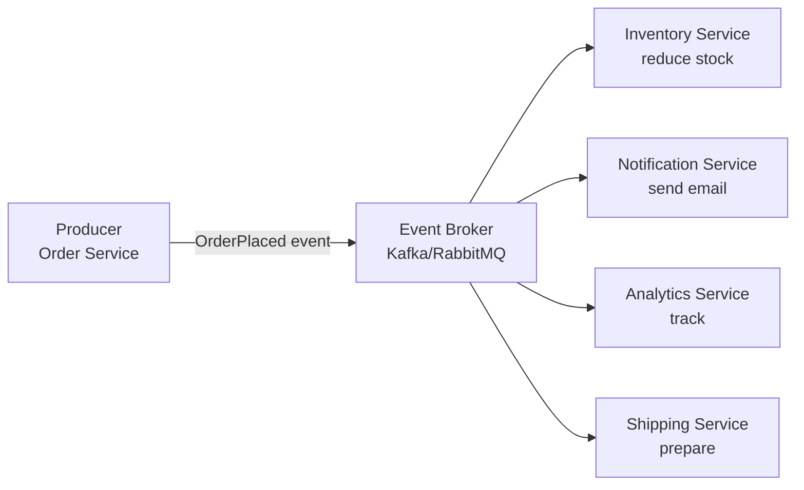
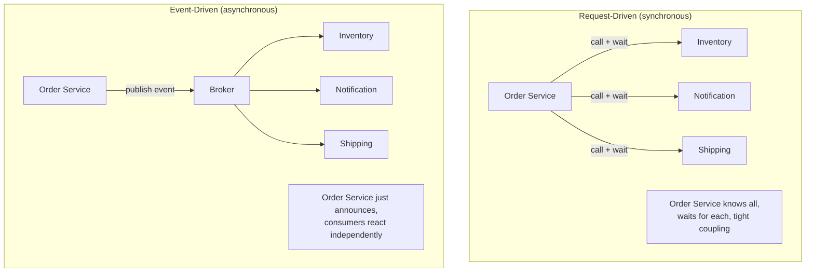
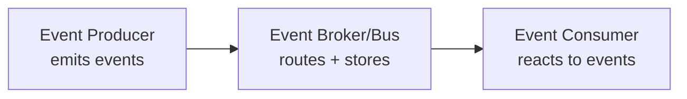
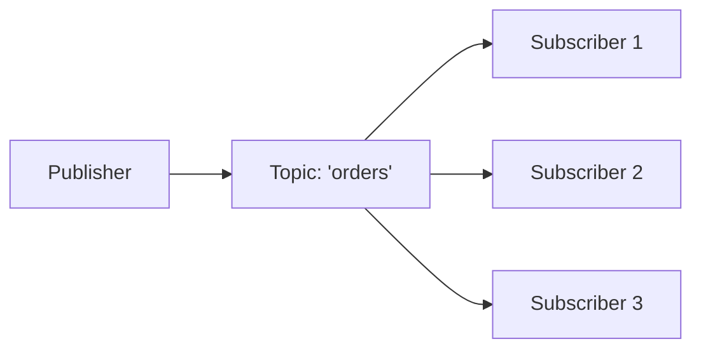
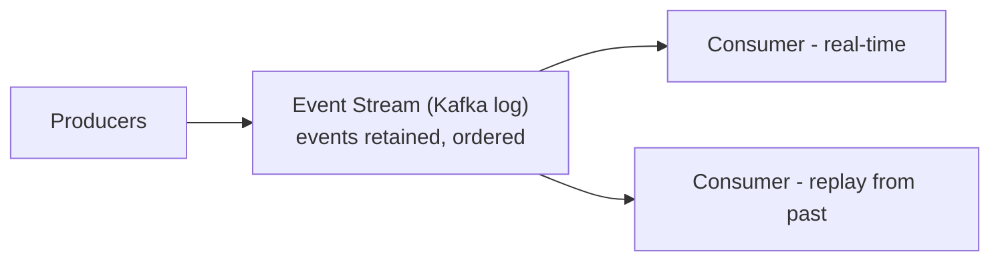
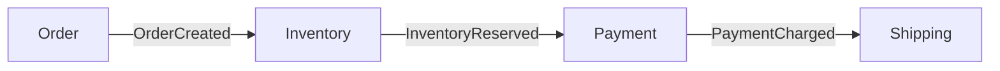
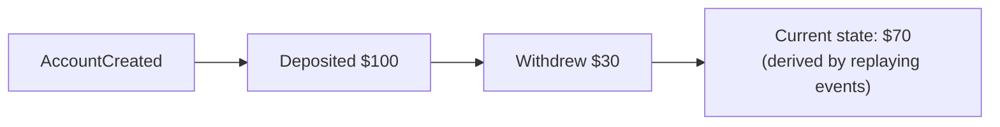
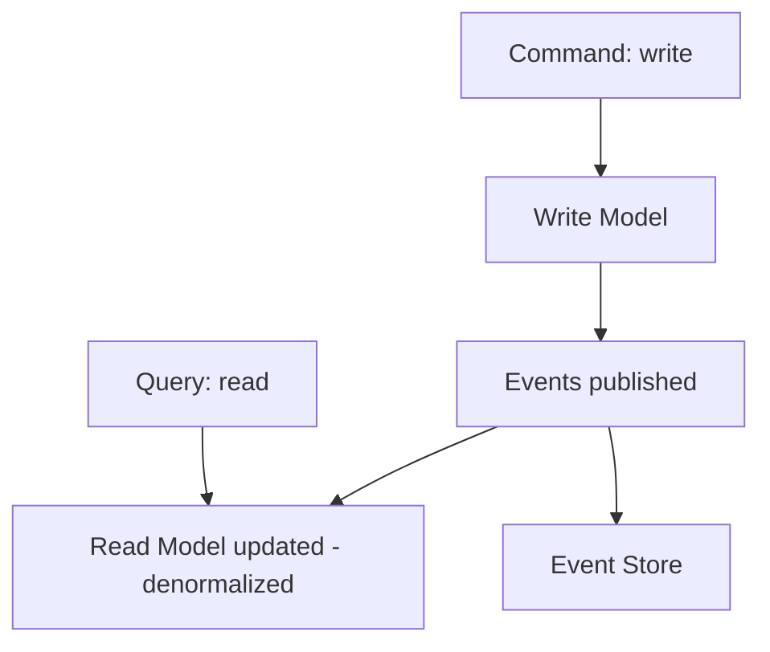
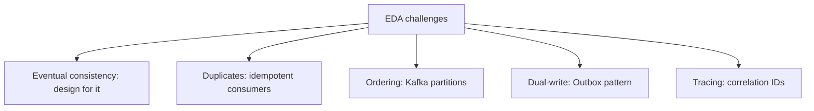
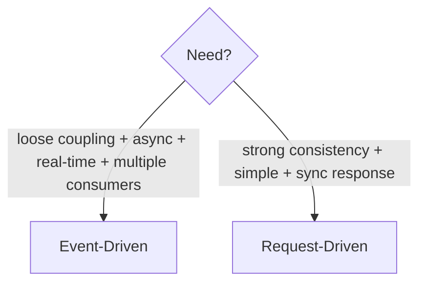

# Event-Driven Architecture (EDA) — Complete Deep Dive

> Event-Driven Architecture me components **events** (kuch hua) produce aur consume karke communicate
> karte — direct synchronous calls ke bajaye. Ye **loose coupling, scalability, aur real-time
> processing** deta. Modern distributed systems (microservices) ka backbone. Ye file: EDA kya, event
> types, patterns (pub-sub, event streaming, event sourcing, CQRS), pros/cons, aur when to use.

---

## 📑 Table of Contents
1. [EDA kya hai](#1-eda-kya-hai)
2. [Request-driven vs Event-driven](#2-request-driven-vs-event-driven)
3. [Core components + events](#3-core-components--events)
4. [Event patterns (pub-sub, streaming, notification)](#4-event-patterns)
5. [Event Sourcing](#5-event-sourcing)
6. [CQRS + EDA](#6-cqrs--eda)
7. [Advantages & Disadvantages](#7-advantages--disadvantages)
8. [Challenges + solutions](#8-challenges--solutions)
9. [When to use EDA](#9-when-to-use-eda)
10. [Interview Q&A](#10-interview-qa)
11. [Summary](#11-summary)

---

## 1. EDA kya hai

**Event-Driven Architecture** = ek design paradigm jaha components **events** ke through communicate
karte. Ek component **event produce** karta (kuch hua — "OrderPlaced"), doosre components us event ko
**consume** karke react karte — **without knowing each other** (loose coupling).



**Event** = "kuch hua" ka record (immutable fact). "OrderPlaced", "PaymentCharged", "UserSignedUp".
Producer event emit karta, **kaun consume karega isse matlab nahi** (fire + forget). Consumers
independently react karte.

> ⭐ **Core idea:** producer aur consumer **decoupled** — producer sirf "ye hua" announce karta,
> consumers apni marzi se react karte. Naya consumer add karo → bas event subscribe kar le
> (producer untouched).

---

## 2. Request-Driven vs Event-Driven



| | Request-Driven | Event-Driven |
|---|---|---|
| Communication | direct call (sync usually) | events (async) |
| Coupling | tight (caller knows callees) | loose (producer unaware of consumers) |
| Producer waits? | yes (blocking) | no (fire + move on) |
| Add consumer | modify producer (add call) | subscribe event (producer untouched) |
| Failure | callee down → caller blocked | consumer down → events queued |
| Consistency | immediate | eventual |

> ⭐ Request-driven = "do this and tell me the result" (command, coupled). Event-driven = "this
> happened, whoever cares can react" (fact, decoupled).

---

## 3. Core Components + Events



- **Event Producer** — event emit karta (state change → event).
- **Event** — immutable record of "what happened" (data + metadata: type, timestamp, id).
- **Event Broker/Bus** — events route + (optionally) store (Kafka, RabbitMQ, SNS/SQS, EventBridge).
- **Event Consumer** — events subscribe + react.

### Event structure
```json
{
  "eventId": "evt-123",
  "eventType": "OrderPlaced",
  "timestamp": "2024-01-01T10:00:00Z",
  "data": { "orderId": "o1", "userId": "u1", "amount": 500 }
}
```

### Command vs Event (important distinction)
- **Command** — "do this" (imperative, expects action, directed to specific handler). `ReserveInventory`.
- **Event** — "this happened" (fact, past tense, broadcast, no specific target). `InventoryReserved`.
- EDA primarily **events** (facts), though command messages bhi use hote (orchestration).

---

## 4. Event Patterns

### 4.1 — Publish-Subscribe (Pub-Sub)
Producer event **topic** pe publish, **multiple subscribers** consume (fan-out — broadcast).

- Ek event → sab subscribers. Loose coupling (publisher subscribers ko nahi jaanta).
- Kafka topics, SNS, RabbitMQ fanout exchange.

### 4.2 — Event Streaming
Events ek **continuous stream** (log) me — retained, replayable. Consumers apni pace pe process,
replay possible.

- **Kafka** — distributed log (partitions, offsets, retention). [Detail: `18_Message_Queues...`]
- Analytics, real-time processing, event sourcing.

### 4.3 — Event Notification
Producer light event bhejta ("something changed"), consumer details ke liye callback/query karta.
- Thin events (just "OrderUpdated: id 5"), consumer fetches details.
- vs **Event-Carried State Transfer** — event me full data (consumer ko query nahi karna).

### 4.4 — Choreography (EDA + Saga)
Services events ke through workflow coordinate (no central orchestrator). [Detail: Saga in
`01_Monolithic_and_Microservices.md`]


---

## 5. Event Sourcing

State ko **events ki sequence** se store karo (current snapshot ke bajaye). Har change ek **immutable
event**. Current state = events replay karke derive.



**Traditional vs Event Sourcing:**
```
Traditional: store CURRENT state (balance = 70). History lost (kaise pahuncha?).
Event Sourcing: store ALL events (created, +100, -30). Current = replay. Full history.
```

- ✅ **Full audit trail** (every change recorded — compliance, debugging), **time-travel** (past state
  = replay till point), **event replay** (rebuild read models, fix bugs), natural fit with Kafka +
  CQRS.
- ❌ **Complexity**, event schema evolution (old events, new code), **replay cost** (many events →
  snapshots optimize), eventual consistency.
- **Use:** audit-critical (banking, ledger, accounting), CQRS ke saath, systems needing history.

> ⭐ **Repo LLD:** `GPay_LLD` transaction ledger — event-sourcing-lite idea (transactions as immutable
> records).

---

## 6. CQRS + EDA

**CQRS (Command Query Responsibility Segregation)** — read aur write models alag. EDA ke saath natural:
writes (commands) events emit karte, read models events se update.



- **Write side** — commands → state change → **events** emitted.
- **Read side** — events consume → **read models** (denormalized, query-optimized) update.
- **Fit:** events sync mechanism between write + read models. Event Sourcing + CQRS common combo.
- [Detail: CQRS in `01_Monolithic_and_Microservices.md`]

---

## 7. Advantages & Disadvantages

### ✅ Advantages
1. **Loose coupling** — producers + consumers independent (don't know each other). Naya consumer add
   → subscribe event (producer untouched). Highly extensible.
2. **Scalability** — components independently scale (consumers apni pace). Async → spike buffering.
3. **Resilience** — consumer down → events queued (not lost), process on recovery. No cascading
   failure.
4. **Real-time processing** — events processed as they occur (streaming analytics, notifications).
5. **Flexibility** — easy to add new features (new event consumers) without touching existing.
6. **Async performance** — producer fire + move on (fast response, work in background).

### ❌ Disadvantages
1. **Eventual consistency** — events async → system temporarily inconsistent (order placed but
   inventory not yet updated). Business must accept.
2. **Complexity** — distributed, async → harder to reason about, debug (event flow tracing needed).
3. **Debugging mushkil** — event flow across services (which event → which action) — distributed
   tracing zaroori.
4. **Ordering + duplicates** — events order (Kafka per-partition), duplicates (at-least-once →
   idempotent consumers). [Detail: `Idempotency.md`]
5. **Event schema evolution** — events change → old/new versions compatibility (Avro/Protobuf schemas).
6. **Broker dependency** — event broker (Kafka) critical infra (must be HA).

---

## 8. Challenges + Solutions

| Challenge | Solution |
|---|---|
| **Eventual consistency** | design for it (accept temporary inconsistency), Saga for transactions |
| **Duplicate events** | idempotent consumers (dedup by event ID) |
| **Event ordering** | Kafka per-partition ordering (same key → same partition) |
| **Debugging/tracing** | correlation IDs, distributed tracing (Jaeger) |
| **Schema evolution** | schema registry (Avro/Protobuf — backward/forward compatible) |
| **Lost events (dual-write)** | **Outbox pattern** (DB + event atomic) [Detail: `01`] |
| **Consumer failures** | retries + Dead Letter Queue (DLQ) |
| **Broker HA** | Kafka cluster (partitions replicated) |



---

## 9. When to Use EDA

### ✅ Use EDA agar:
- **Loose coupling** chahiye (independent services, easy extensibility).
- **Real-time processing** (analytics, notifications, live updates).
- **Async workflows** (order processing, background tasks).
- **Multiple consumers** ek event ke (fan-out — order → inventory + notification + analytics).
- **Scalability** critical (independent scaling, spike buffering).
- **Event history** needed (event sourcing — audit).

### ❌ Avoid / careful agar:
- **Strong consistency** required (immediate — banking single operation). EDA eventual.
- **Simple CRUD** (EDA overkill for basic apps).
- **Synchronous response** needed (user waits for result — request-driven better).
- **Small team / simple system** (EDA operational complexity).



### Real-world EDA
- **E-commerce** — OrderPlaced → inventory, notification, analytics, shipping (fan-out).
- **Netflix** — event streaming (viewing events → recommendations, analytics).
- **Uber** — location events, trip events (real-time).
- **Banking** — transaction events (event sourcing, audit).
- **IoT** — sensor events (streaming processing).

---

## 10. Interview Q&A

**Q: Event-Driven Architecture kya hai?**
Components events (facts — "what happened") produce/consume karke communicate karte, direct calls ke
bajaye. Loose coupling (producer unaware of consumers), async, scalable. Broker (Kafka) events route.

**Q: Request-driven vs event-driven?**
Request-driven — direct call, sync, tight coupling, caller waits. Event-driven — events, async, loose
coupling, producer fire + move on, consumers react independently. EDA more scalable + extensible, but
eventual consistency.

**Q: EDA ke advantages?**
Loose coupling (extensible — new consumer just subscribes), scalability (independent + async buffering),
resilience (consumer down → events queued), real-time processing, flexibility.

**Q: EDA ke disadvantages?**
Eventual consistency (temporary inconsistency), complexity (distributed, async), debugging hard
(event flow tracing), ordering + duplicates (idempotency needed), schema evolution, broker dependency.

**Q: Event Sourcing kya?**
State ko events ki sequence se store (current snapshot ke bajaye). Current state = replay events.
Full audit trail, time-travel, replay. Complexity + replay cost (snapshots). Audit-critical (banking).

**Q: Command vs event?**
Command — "do this" (imperative, specific handler, expects action). Event — "this happened" (fact,
past tense, broadcast, no target). EDA primarily events.

**Q: EDA me duplicate/ordering kaise handle?**
Duplicates — idempotent consumers (dedup by event ID). Ordering — Kafka per-partition (same key →
same partition → ordered). Outbox for reliable publishing.

**Q: EDA kab use, kab nahi?**
Use: loose coupling, real-time, async, multiple consumers, scalability. Avoid: strong consistency
needed, simple CRUD, sync response required, small/simple system.

---

## 11. Summary

- **EDA** — components communicate via **events** (facts — "what happened"), not direct calls. Producer
  emits, consumers react (decoupled, unaware of each other).
- **Request-driven** (direct, sync, coupled, waits) vs **event-driven** (events, async, decoupled,
  fire+forget).
- **Components** — producer, event, broker (Kafka/RabbitMQ), consumer.
- **Patterns** — pub-sub (fan-out), event streaming (Kafka log, replay), notification, choreography.
- **Event Sourcing** — state as event sequence (audit, time-travel, replay).
- **CQRS + EDA** — events sync write/read models.
- **Advantages** — loose coupling, scalability, resilience, real-time, extensibility.
- **Disadvantages** — eventual consistency, complexity, debugging, ordering/duplicates, schema evolution.
- **Challenges** — idempotency (duplicates), ordering (partitions), Outbox (dual-write), tracing.
- **Use** for loose coupling + async + real-time + multiple consumers; avoid for strong consistency +
  simple + sync.

> Related: [`18_Message_Queues_Kafka_RabbitMQ.md`](./18_Message_Queues_Kafka_RabbitMQ.md) ·
> [`01_Monolithic_and_Microservices.md`](./01_Monolithic_and_Microservices.md) (Saga/CQRS/Outbox) ·
> [`Idempotency.md`](./Idempotency.md) · [`Distributed_Transactions.md`](./Distributed_Transactions.md)
