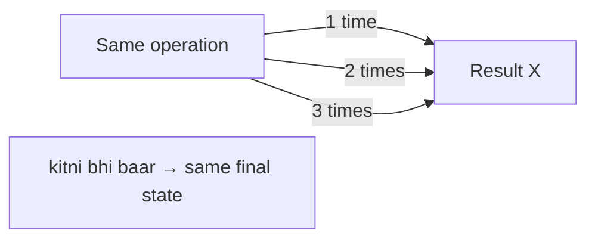
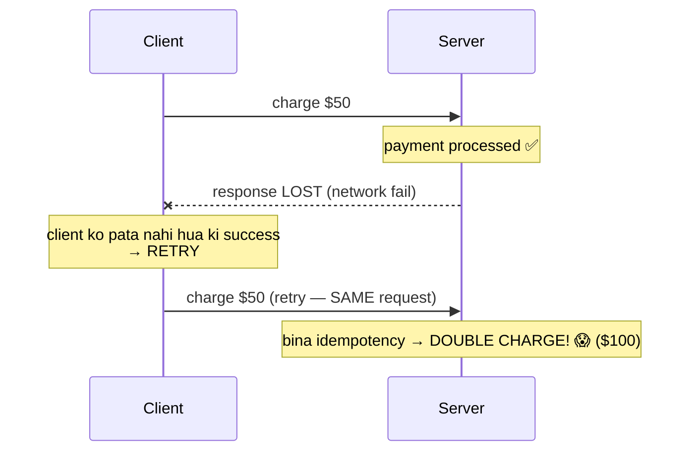
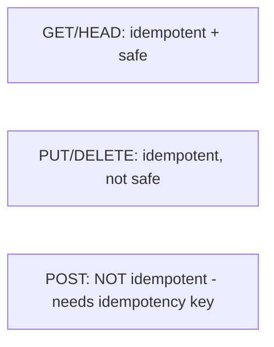
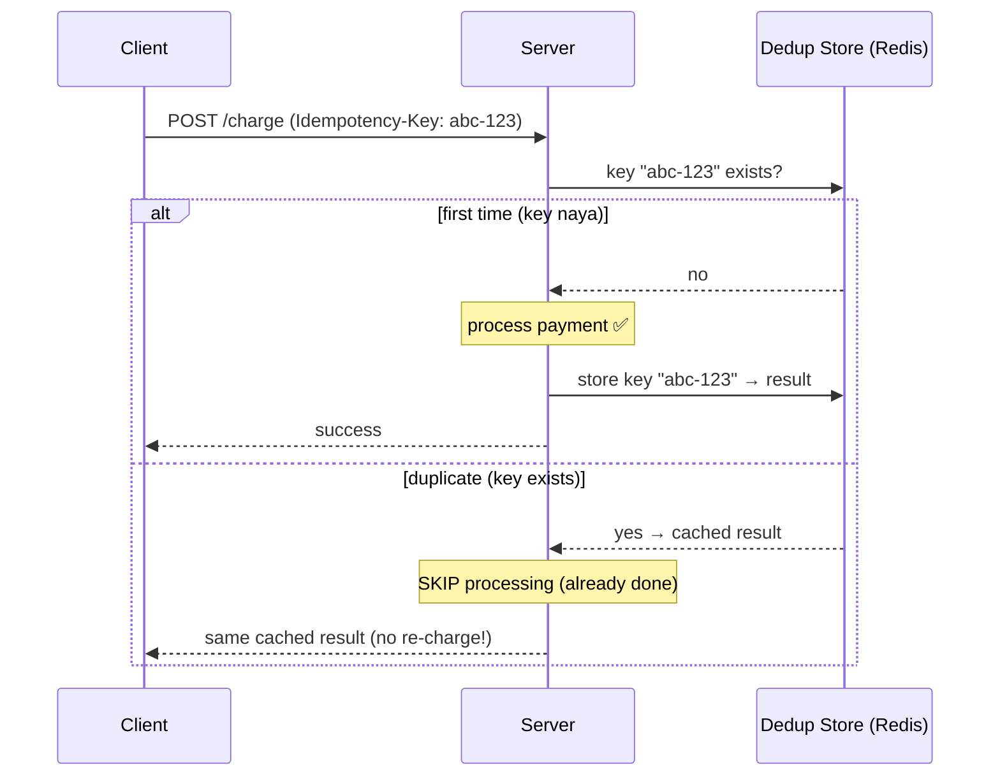
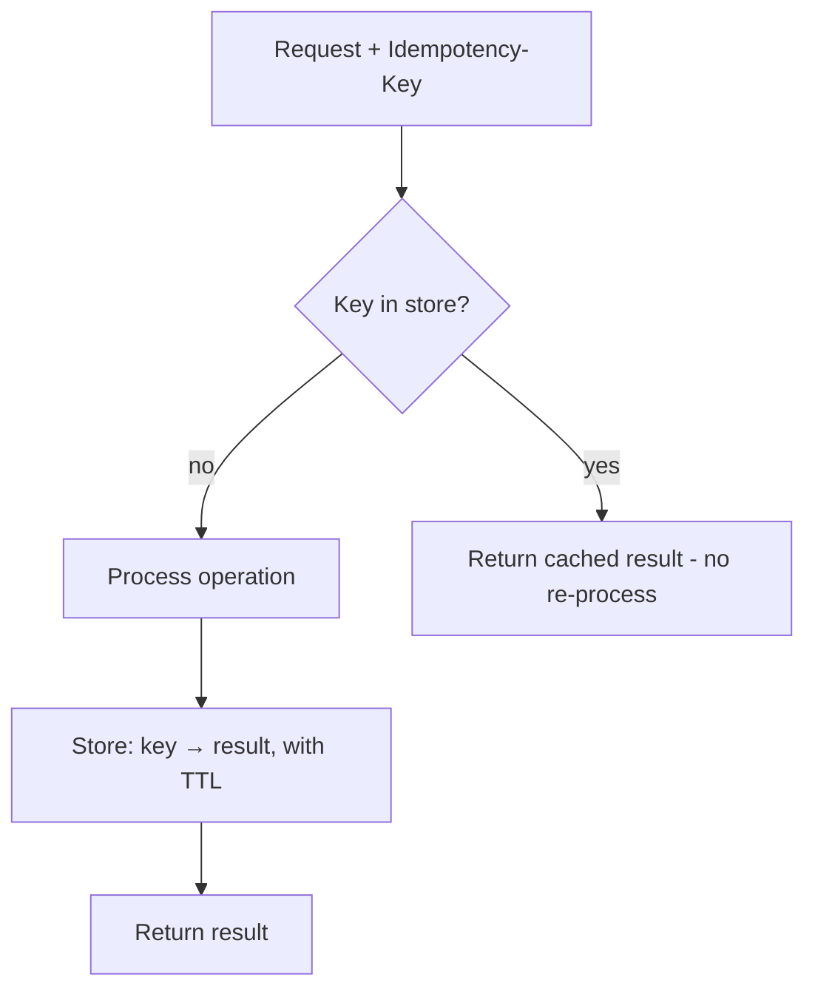
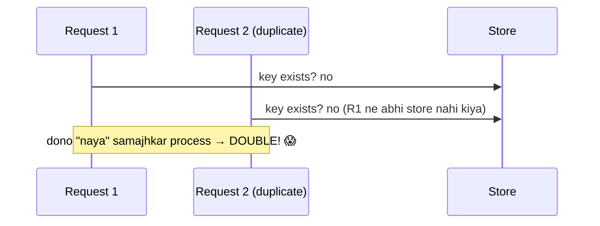
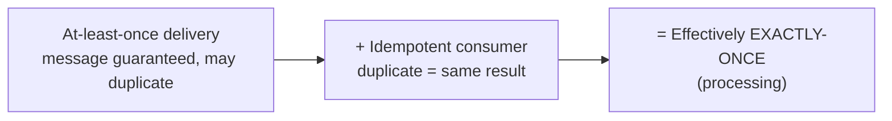
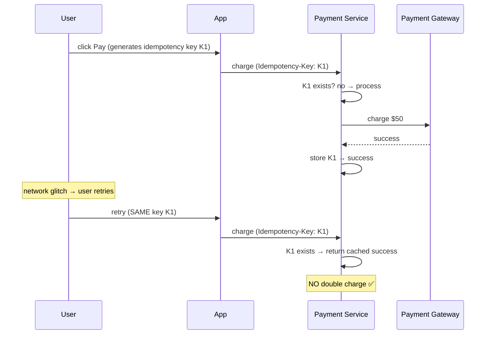

# Idempotency — Complete Deep Dive

> Idempotency = ek operation ko **kai baar** perform karo, par **result (side-effect) ek hi baar** ho.
> Distributed systems + payments ka **core concept** — kyunki networks unreliable hain (retries,
> timeouts, duplicates), same request kai baar aa sakti. Bina idempotency ke: double charge, duplicate
> orders. Ye file: idempotency kya, kyun zaroori, idempotency key, HTTP methods, implementation,
> exactly-once, aur real examples.

---

## 📑 Table of Contents
1. [Idempotency kya hai](#1-idempotency-kya-hai)
2. [Kyun zaroori (the problem)](#2-kyun-zaroori--the-problem)
3. [Idempotent HTTP methods](#3-idempotent-http-methods)
4. [Idempotency Key](#4-idempotency-key)
5. [Implementation (dedup store)](#5-implementation--dedup-store)
6. [Race conditions in idempotency](#6-race-conditions)
7. [At-least-once + idempotent = exactly-once](#7-exactly-once-processing)
8. [Real-world: payments](#8-real-world--payment-systems)
9. [Interview Q&A](#9-interview-qa)
10. [Summary](#10-summary)

---

## 1. Idempotency kya hai

Ek operation **idempotent** hai agar use **ek baar ya multiple baar** perform karne se **same result**
aaye (system state same rahe, side-effect ek hi baar).



**Math analogy:** `f(f(x)) = f(x)`. `abs(abs(-5)) = abs(-5) = 5`. Multiply by 1: `x × 1 × 1 = x`.

### Idempotent vs Non-idempotent examples
```
Idempotent:
  SET balance = 100        (kitni baar bhi → balance 100)
  DELETE user 5            (delete once ya 5 times → user gone, same)
  UPDATE status = "shipped" (same state)

NON-idempotent:
  balance = balance + 100  (2 baar → +200! different result)
  INSERT new order          (2 baar → 2 orders! duplicate)
  charge $50               (2 baar → $100 charged! double charge 😱)
```

> ⭐ **Key:** idempotent operation ka result **input pe depend karta, execution count pe nahi.**
> "set to X" idempotent, "add X" nahi. "delete" idempotent, "create" nahi (usually).

---

## 2. Kyun zaroori — the problem

Distributed systems me **networks unreliable** hain. Same request **kai baar** pahunch sakti:



**Duplicate requests kab hote:**
1. **Network retries** — response lost → client retry (par server ne pehle process kar liya).
2. **Timeouts** — client timeout → retry (server slow tha, actually processing).
3. **User double-click** — "Pay" button 2 baar dabaya.
4. **Message queue at-least-once** — same message 2x delivered (retry on failure).
5. **Load balancer retries** — LB failed-looking request retry karta.

**Bina idempotency ka disaster:**
- Payment → **double charge** (user ka $100 kata, chahiye tha $50).
- Order → **duplicate orders** (2 orders, 1 chahiye tha).
- Inventory → **double decrement**.

> ⭐ **Isliye:** critical operations (specially payments/orders) **idempotent** banao — retry safe.
> "At-least-once delivery + idempotent processing = safe."

---

## 3. Idempotent HTTP Methods

HTTP spec me methods idempotent hain ya nahi:

| Method | Idempotent? | Safe? (no side-effect) | Kyun |
|---|---|---|---|
| **GET** | ✅ yes | ✅ yes | read only (kitni baar bhi same) |
| **HEAD** | ✅ yes | ✅ yes | read headers |
| **PUT** | ✅ yes | ❌ no | replace (set to X — same result) |
| **DELETE** | ✅ yes | ❌ no | delete (once ya N times → gone) |
| **POST** | ❌ **no** | ❌ no | create (each → new resource — duplicate!) |
| **PATCH** | ⚠ usually no | ❌ no | partial update (depends — `+1` no, `set` yes) |



> ⭐ **POST is the problem** — creates resources (retry → duplicate). Isliye POST ke liye
> **idempotency key** chahiye (neeche). PUT/DELETE naturally idempotent (design them so).

**Design tip:** operations ko idempotent design karo where possible:
```
BAD:  POST /account/balance/add    body: {amount: 100}   → not idempotent
GOOD: PUT /account/balance          body: {balance: 500}  → idempotent (set)
```

---

## 4. Idempotency Key

Jab operation naturally idempotent nahi (POST — payment, order), to **idempotency key** use karo.

**Idea:** client har operation ke liye ek **unique key** (UUID) generate karta aur request me bhejta.
Server key track karta — same key **dobara** aaye → **pehle wala result** return (re-process nahi).



**Flow:**
1. Client UUID generate (`Idempotency-Key: abc-123`), request me header.
2. Server key check (dedup store — Redis/DB):
   - **Key naya** → process operation + store key→result.
   - **Key exists** → pehle wala result return (no re-process).
3. Same key wali retry → same result (safe).

> ⭐ **Client generates key** (server nahi) — kyunki client ko pata hai "ye ek hi logical operation
> hai" (retry same key use karta). Stripe, PayPal, etc. `Idempotency-Key` header use karte.

---

## 5. Implementation — Dedup Store

Idempotency key ko track karne ke liye **dedup store** (usually Redis):



### Basic implementation (concept)
```
handleRequest(idempotencyKey, operation):
    existing = store.get(idempotencyKey)
    if existing:
        return existing.result          # duplicate → cached result
    
    result = process(operation)         # first time → do it
    store.set(idempotencyKey, result, TTL=24h)
    return result
```

**Considerations:**
- **TTL** — keys expire after time (24h typical) — store cleanup (unbounded na ho).
- **Store choice** — Redis (fast, TTL) common. DB (durable) for critical.
- **What to store** — key + result (return same response) + status.
- **Scope** — per-user + key (do users same key clash na karein — ideally UUID unique).

### Handling in-progress requests (race condition preview)
```
Key exists but status = "processing" (concurrent duplicate):
  → wait / return "processing" / reject (avoid double-process)
```

---

## 6. Race Conditions

Do duplicate requests **ek saath** aayein (concurrent) — dono key check karein (naya), dono process
karein → **double** (idempotency fail).



### Fix: atomic check-and-set
- **Atomic operation** — `SETNX` (SET if Not eXists) in Redis: key set karo **only if not exists**,
  atomically. Ek request jeetti (key set), doosri fail (key exists → skip/wait).
```
if store.setnx(key, "processing"):   # atomic — only one succeeds
    result = process()
    store.set(key, result)
else:
    # someone else processing/done → wait or return existing
```
- **Database unique constraint** — key column unique. Second insert fails (duplicate) → skip.
- **Distributed lock** — lock on key during processing (Redis lock).

> ⭐ **Atomic check-and-set (SETNX / DB unique) is critical** — warna concurrent duplicates race
> karke double process kar denge. Idempotency implementation me atomicity zaroori.

---

## 7. Exactly-Once Processing

"Exactly-once **delivery**" networks me **impossible** (theoretically — FLP). Par practically:



**At-least-once + idempotent = effectively exactly-once:**
- Message broker (Kafka/SQS) guarantees **at-least-once** (delivered, maybe duplicate).
- Consumer **idempotent** — duplicate message → same result (dedup by message ID).
- **Net effect:** exactly-once processing (even though delivery is at-least-once).

```
Consumer:
    if processed(messageId):    # dedup
        skip
    else:
        process(message)
        markProcessed(messageId)
```

- **Kafka exactly-once** — transactions (idempotent producer + transactional consumer) — real
  exactly-once for Kafka pipelines.

> ⭐ **Interview line:** "Exactly-once delivery impossible; achieve exactly-once **processing** via
> at-least-once delivery + idempotent consumer (dedup by message ID)."

---

## 8. Real-world — Payment Systems

Idempotency payments ka **must-have**:



- **Stripe/Razorpay** — `Idempotency-Key` header. Retry-safe API.
- **Repo LLD:** `Ecommerce_Cart_Checkout_LLD` + `GPay_LLD` me `clientRequestId` — idempotency key
  ka LLD-level roop (double-click → same order, no double charge). Wo code padho — concept concrete.

### Other real uses
- **Order creation** — duplicate submit → same order (not two).
- **Message processing** — Kafka duplicate → process once.
- **Distributed transactions (Saga)** — each step idempotent (retry-safe).
- **Webhooks** — provider retries webhook → consumer idempotent.

---

## 9. Interview Q&A

**Q: Idempotency kya hai?**
Operation ko kai baar perform karo, result (side-effect) ek hi baar ho. `f(f(x)) = f(x)`. "set X"
idempotent, "add X" nahi. Critical for retry-safety in distributed systems.

**Q: Idempotency kyun zaroori?**
Networks unreliable — retries, timeouts, double-clicks, at-least-once queues → same request kai baar.
Bina idempotency: double charge, duplicate orders. Idempotency → retry-safe.

**Q: Kaunse HTTP methods idempotent?**
GET, HEAD, PUT, DELETE idempotent. POST **not** (creates — retry → duplicate). PATCH usually not.
POST ke liye idempotency key chahiye.

**Q: Idempotency key kaise kaam karta?**
Client unique key (UUID) generate karta, request me bhejta. Server dedup store me key track — naya
→ process + store, exists → cached result return (no re-process). Retry-safe.

**Q: Idempotency me race condition?**
Concurrent duplicates dono "naya" samajh ke process → double. Fix: atomic check-and-set (Redis SETNX,
DB unique constraint) — only one processes.

**Q: Exactly-once kaise achieve?**
Exactly-once delivery impossible. At-least-once delivery + idempotent consumer (dedup by message ID)
= effectively exactly-once processing. Kafka transactions for pipelines.

**Q: Payment system me idempotency?**
Idempotency-Key header — retry (network fail/double-click) → same charge (no double). Stripe/Razorpay
standard. Store key → result in Redis/DB.

**Q: Idempotency key kahan store?**
Dedup store — Redis (fast, TTL) common, DB (durable) for critical. Key → result, with TTL (24h),
atomic set (SETNX) for race safety.

---

## 10. Summary

- **Idempotency** = operation kai baar = result ek baar (retry-safe). `f(f(x)) = f(x)`.
- **Kyun:** networks unreliable (retries, timeouts, double-click, at-least-once) → duplicate requests
  → double charge/orders without idempotency.
- **HTTP:** GET/PUT/DELETE idempotent, **POST not** (needs idempotency key).
- **Idempotency Key** — client generates UUID, server dedup store se track (naya → process, exists →
  cached result).
- **Race condition** — atomic check-and-set (SETNX / DB unique) mandatory.
- **Exactly-once** — at-least-once delivery + idempotent consumer = effectively exactly-once.
- **Payments** — must-have (Idempotency-Key header — Stripe/Razorpay). Repo: `clientRequestId`.

> Related: [`18_Message_Queues_Kafka_RabbitMQ.md`](./18_Message_Queues_Kafka_RabbitMQ.md) (delivery
> guarantees) · [`Distributed_Transactions.md`](./Distributed_Transactions.md) ·
> [`Concurrency_Control.md`](./Concurrency_Control.md) · [`API_Design.md`](./API_Design.md)
