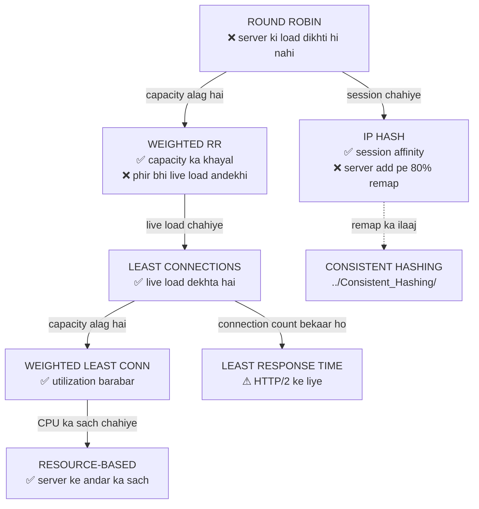

# Load Balancer Algorithms — Code Karke Samjho ⚖️

> [03_Load_Balancer_Types_and_Algorithms.md](../03_Load_Balancer_Types_and_Algorithms.md) me theory hai.
> Ye folder wahi theory **chala kar** dikhata hai — har algorithm ek alag `.cpp` file, aur har ek
> apni kamzori khud **naap kar** dikhata hai.

---

## 📑 Is folder me

| Folder | File | Kya sikhata hai |
|---|---|---|
| — | [lb_common.h](lb_common.h) | Common simulator (processor-sharing model) |
| **Static** | [01_round_robin.cpp](Static_Algorithms/01_round_robin.cpp) | Baari-baari; barabar ginti ≠ barabar load |
| **Static** | [02_weighted_round_robin.cpp](Static_Algorithms/02_weighted_round_robin.cpp) | Capacity ke hisaab se; nginx ka smooth WRR |
| **Static** | [03_ip_hashing.cpp](Static_Algorithms/03_ip_hashing.cpp) | Session affinity; aur `% N` ka remap disaster |
| **Dynamic** | [01_least_connections.cpp](Dynamic_Algorithms/01_least_connections.cpp) | Live load dekhta hai; self-correcting |
| **Dynamic** | [02_weighted_least_connections.cpp](Dynamic_Algorithms/02_weighted_least_connections.cpp) | Ginti nahi, **utilization** barabar karta hai |
| **Dynamic** | [03_least_response_time.cpp](Dynamic_Algorithms/03_least_response_time.cpp) | Latency-based; aur wo kab **ulta** padta hai |
| **Dynamic** | [04_resource_based.cpp](Dynamic_Algorithms/04_resource_based.cpp) | CPU/RAM dekh ke; hybrid approach |

---

## 🚀 Kaise chalayein

```bash
./compile.sh            # sab build karo
./compile.sh static     # sirf static
./compile.sh dynamic    # sirf dynamic
./compile.sh clean      # binaries hatao

./Static_Algorithms/01_round_robin_demo
```

> 📌 **Order me padho.** Har file pichhli file ki *kami* se shuru hoti hai.

---

## 🎯 Poori kahani



---

## 📊 Naapa hua result (wahi 4 servers, wahi traffic)

Simulator ~64% utilization pe chalta hai (na khaali, na collapse) — **farak sirf isi range me dikhta hai**.

### Equal-capacity servers

| Algorithm | Avg latency | p95 | Max | Worst peak conns |
|---|---|---|---|---|
| Round Robin (static) | 3.10 | 15 | 68 | 18 |
| Least Connections | 2.07 | 9 | 23 | 5 |
| Resource (CPU only) | 2.38 | 9 | 26 | — |
| **Hybrid (CPU + conns)** | **1.98** | **7** | **22** | — |

### Unequal-capacity servers (2 bade weight 16, 2 chhote weight 4)

| Algorithm | Avg latency | p95 | Max |
|---|---|---|---|
| Plain Round Robin | 40.96 | 122 | 1220 |
| **Weighted Round Robin** | **3.13** | **14** | **100** |
| Plain Least Connections | 2.35 | 9 | 43 |
| **Weighted Least Connections** | **2.16** | 10 | **22** |

> ⭐ Plain RR ne chhote servers ko maar diya (latency 40.96!). Sirf weight batane se
> **92% sudhaar**. Ye is folder ka sabse bada single result hai.

### IP Hash — remap disaster

| Change | Clients jinka server badla |
|---|---|
| 4 → 5 servers | **80.1%** |
| 4 → 3 servers | **75.4%** |

> Ek server add karna = **80% users ki session ud gayi**. Isi problem ne
> [Consistent Hashing](../Consistent_Hashing/README.md) ko janm diya.

---

## 🧠 Teen baatein jo textbook me nahi milti (yahan naapi gayi hain)

### 1️⃣ "Barabar requests" aur "barabar load" bilkul alag cheezein hain
Round Robin har server ko **theek 900 requests** deta hai — perfect fairness. Phir bhi latency
1.5x tak bhatakti hai aur peak connections 2.2x. Kyunki har request ka **kaam alag** hai.

> Static algorithms fairness ko **ginti** se naapte hain (galat paimana).
> Dynamic algorithms use **load** se naapte hain (sahi paimana).

### 2️⃣ Least Connections ko harana bahut mushkil hai
Humne ek server ko jaan-bujh ke **5x dheera** (bimaar) banaya aur LB ko bataya tak nahi.
Least Connections ne phir bhi use sirf **241 requests** di jabki healthy servers ko ~1100.

**Kaise?** Slow server pe requests dheere khatam hoti hain → unki ginti uspe **jama** ho jaati hai →
LC apne aap usse bachne lagta hai. Yaani *"server slow hai"* ki khabar connection count me
**pehle se hi chhupi hui** hoti hai.

### 3️⃣ Zyada signal daalne se algorithm behtar nahi hota
Least Response Time me humne latency **bhi** joda — aur result **kharab** ho gaya
(3.38 vs 2.07). Kyunki jab saare servers healthy hain, latency ka farak sirf **shor** hai,
information nahi. Aur `avgLatency` ek **purana** signal hai jabki `activeConnections` **taaza sach**.

> Isi liye Least Response Time ki asli jagah **HTTP/2 aur gRPC** hai — wahan ek connection pe
> sainkdon streams chalti hain, to connection count hamesha 1 dikhta hai aur
> Least Connections **andha** ho jaata hai. (Envoy isi liye request-level metrics use karta hai.)

---

## ⚖️ Kab kya use karein

| Situation | Algorithm |
|---|---|
| Servers identical, requests bhi ek jaisi | Round Robin |
| Servers ki capacity alag | Weighted Round Robin |
| Stateful backend (session server pe hai) | IP Hash → *par behtar hai server stateless karo* |
| Cache locality chahiye | IP Hash / Consistent Hashing |
| Long-lived ya variable-duration requests | **Least Connections** |
| Capacity alag **aur** duration variable | **Weighted Least Connections** ⭐ (sabse common) |
| HTTP/2, gRPC, multiplexed protocols | Least Response Time |
| Server pe LB ke alawa bhi kaam chalta ho | Resource-based (hybrid) |
| Server add/remove aksar hota ho | [Consistent Hashing](../Consistent_Hashing/README.md) |

---

## 💬 Interview me kaise bolna

**"Round Robin ka problem kya hai?"**
> Wo har server ko barabar requests ki **ginti** deta hai, par requests barabar hoti nahi. Maine
> test kiya tha — ginti bilkul barabar (900 each) hone ke baad bhi latency 1.5x aur peak
> connections 2.2x tak bhatakte hain. Aur agar servers ki capacity bhi alag ho to chhote server
> ki latency 40 tick tak chali jaati hai jabki weighted version me 3.

**"Least Connections kab use karoge?"**
> Jab requests ka duration variable ho — long-lived connections, WebSocket, DB pools. Uski
> khoobsurti ye hai ki wo **self-correcting** hai: LB ko request ka cost jaanne ki zaroorat hi
> nahi, kyunki bhaari request lambi chalti hai to uski ginti apne aap us server pe jama ho jaati
> hai aur agli requests kahin aur chali jaati hain.

**"To Least Response Time to aur behtar hoga?"**
> Zaroori nahi — aur ye counter-intuitive hai. Normal HTTP/1 cluster me wo aksar **kharab** karta
> hai, kyunki latency ek lagging aur noisy signal hai jabki connection count taaza sach hai.
> Uski asli jagah HTTP/2 aur gRPC hai, jahan multiplexing ki wajah se connection count hamesha 1
> dikhta hai aur Least Connections kaam hi nahi karta.

---

## 📝 Summary

- **Static** (Round Robin, Weighted RR, IP Hash) — server ki live state **nahi** dekhte. Sasta, simple, predictable.
- **Dynamic** (Least Connections aur uske variants) — live state dekhte hain. Behtar, par state tracking chahiye.
- **Weighted** versions tab zaroori jab servers ki capacity alag ho — aur wo lagbhag hamesha alag hoti hai.
- **Least Connections** default dynamic choice hai; usko harana mushkil hai.
- **Ginti barabar karna ≠ load barabar karna** — poore folder ka ek-line nichod.

---

## 🔗 Aage padho
- [03_Load_Balancer_Types_and_Algorithms.md](../03_Load_Balancer_Types_and_Algorithms.md) — theory + interview Q&A
- [Consistent_Hashing/](../Consistent_Hashing/README.md) — IP Hash ke remap problem ka ilaaj
- [02_API_Gateway_and_Load_Balancer.md](../02_API_Gateway_and_Load_Balancer.md) — LB kahan baithta hai
- [LoadBalancer_LLD](../../LLD/LoadBalancer_LLD/) — inhi algorithms ka OOP design (Strategy pattern)
- [17_Avoid_Single_Point_of_Failure.md](../17_Avoid_Single_Point_of_Failure.md) — LB khud SPOF na ban jaaye
