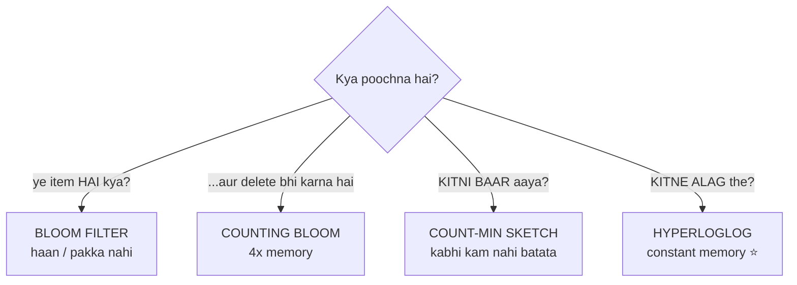

# Probabilistic Data Structures — Code Karke Samjho 🎲

> [Bloom_Filters_and_Probabilistic_Data_Structures.md](../Bloom_Filters_and_Probabilistic_Data_Structures.md)
> me theory hai. Ye folder wahi theory **chala kar** dikhata hai.

Baaki folders se ek baat alag hai: in structures ke paas **asli mathematical formula** hain.
Isliye yahan hum sirf "achha lag raha hai" nahi dekhte — **formula ka jawab nikalte hain,
phir lakhon operations chala kar naapte hain, aur dono compare karte hain.**

---

## 📑 Is folder me

| File | Kya sikhata hai |
|---|---|
| [pds_common.h](pds_common.h) | 64-bit hash + Kirsch-Mitzenmacher double hashing |
| [structures/](structures/) | Chaaron structures ka implementation |
| [01_bloom_filter.cpp](01_bloom_filter.cpp) | FP rate **formula se match karta hai** ya nahi |
| [02_counting_bloom_filter.cpp](02_counting_bloom_filter.cpp) | Delete — aur uski 4x keemat |
| [03_count_min_sketch.cpp](03_count_min_sketch.cpp) | Error bound `ε*N` nibhaya ya toota |
| [04_hyperloglog.cpp](04_hyperloglog.cpp) | `1.04/√m` verify + merge |
| [05_compare_all.cpp](05_compare_all.cpp) | Chaaron ek saath, ek hi data pe |

---

## 🚀 Kaise chalayein

```bash
./compile.sh            # sab build karo
./compile.sh 1          # sirf demo 1 build karke chala do
./compile.sh compare    # sabka muqabla
./compile.sh clean
```

> ⚠ `-O2` zaroori hai — ye demos lakhon items process karte hain.

---

## 🎯 Kaun kis sawaal ka jawab deta hai

Ye chaaron dikhne me ek jaise lagte hain (hash + kam memory + approximate), par sawaal alag hai:



> ⭐ Ek line me: **Bloom = membership, CMS = frequency, HLL = cardinality.**
> Ye ek doosre ki jagah nahi lete — asli systems teeno saath chalate hain.

---

## 📊 Naapa hua result

### Bloom filter — formula sach bolta hai?

100,000 items add kiye, 1,000,000 naye items se test kiya:

| target p | m (bits) | k | fill% | theory FP | measured FP | farak |
|---|---|---|---|---|---|---|
| 0.10 | 479,253 | 3 | 46.5 | 10.0713% | 10.0437% | **0.3%** |
| 0.05 | 623,523 | 4 | 47.4 | 5.0269% | 5.0531% | **0.5%** |
| 0.01 | 958,506 | 7 | 51.8 | 1.0039% | 1.0034% | **0.1%** |
| 0.001 | 1,437,759 | 10 | 50.1 | 0.1000% | 0.1006% | **0.6%** |

> ⭐ Formula `p = (1 - e^(-kn/m))^k` measurement se **0.6% ke andar** match karta hai.
> Isse do baatein sabit hoti hain — theory sahi hai, **aur** hash function theek se bikhra hua hai.
>
> 📌 `fill%` hamesha ~50% hai. Ye ittefaq nahi — optimal `k` wahi hota hai jo aadhi bits 1 kare.

**False negatives: 0** (10 lakh items pe test kiya). Ye 'shayad' nahi, guarantee hai.

### Counting bloom — delete kyun zaroori hai

Normal Bloom me bits 0 karke delete kiya to:

```
2000 items add → pehle 1000 "delete" → bache hue 1000 check kiye
FALSE NEGATIVES: 991 out of 1000  💥
```

> 99.1% items "gayab" ho gaye jabki wo andar the. Bloom ki **eklauti guarantee** toot gayi.
> Counting Bloom pe wahi test: **0 false negatives** ✅ (keemat: 4x memory)

### Count-Min Sketch — bound nibhaya?

2,000,000 events, 50,000 distinct keys:

| ε | w | memory | bound (ε·N) | asli max error | vaada? |
|---|---|---|---|---|---|
| 0.01 | 272 | 10.62 KB | 19,987 | 13,781 | ✅ |
| 0.001 | 2,719 | 106 KB | 1,999 | 875 | ✅ |
| 0.0001 | 27,183 | 1.04 MB | 200 | 75 | ✅ |
| 0.00001 | 271,829 | 10.37 MB | 20 | 4 | ✅ |

**Underestimates: 0** — CMS kabhi kam nahi batata.

⚠ Par error **absolute** hai (`ε·N`), isliye chhoti counts pe % me bada lagta hai:

| rank | asli count | estimate | error % |
|---|---|---|---|
| 1 | 175,461 | 175,461 | 0.00% |
| 100 | 1,760 | 1,760 | 0.00% |
| 1,000 | 179 | 186 | 3.91% |
| 10,000 | 18 | 23 | **27.78%** |

> ⭐ Isi liye CMS **heavy hitters** ke liye hai, har item ki exact ginti ke liye nahi.

### HyperLogLog — `1.04/√m` sach hai?

50 alag dataset pe average error:

| b | m | theory error | measured average |
|---|---|---|---|
| 10 | 1,024 | 3.250% | 2.474% |
| 12 | 4,096 | 1.625% | 1.497% |
| 14 | 16,384 | 0.812% | 0.567% |

> ⭐ `b` 2 se badhao → `m` 4x → error **aadha**. Ulta matlab: error aadha karne ke liye
> memory **4x** chahiye. Isi liye sab 16 KB (b=14) pe rukte hain.
>
> 📌 Measured average theory se thoda kam aata hai — ye normal distribution ki property hai
> (average |error| ≈ 0.8 × standard deviation), bug nahi.

**Merge:** 4 servers ke overlapping users jode → estimate 987,209 (asli 1,000,000, **1.28% error**).
Simple jod 1,400,000 deta — merge ne overlap apne aap handle kiya, kyunki wo registers ka
**max** leta hai, jod nahi.

### Memory — 1 crore items pe

| Structure | Memory | vs exact |
|---|---|---|
| `unordered_set` (exact) | 762.94 MB | 1x |
| Bloom Filter (1% FP) | 11.43 MB | 67x |
| Counting Bloom (1% FP) | 45.71 MB | 17x |
| Count-Min Sketch | 1.04 MB | 736x |
| **HyperLogLog (b=14)** | **16.00 KB** | **48,828x** |

> ⭐ HLL ki memory item count pe **depend hi nahi karti** — 1000 items ho ya 1 arab, 16 KB.

---

## 🧠 Teen baatein jo yaad rakhni hain

### 1️⃣ Sabki galti **ek hi taraf** jaati hai — aur yahi unhe useful banata hai

| Structure | Galti | Ulta kabhi? |
|---|---|---|
| Bloom Filter | "hai" bol sakta jab nahi hai | "nahi hai" galat — **kabhi nahi** ✅ |
| Count-Min | zyada bata sakta hai | kam — **kabhi nahi** ✅ |
| HyperLogLog | dono taraf (±2%) | — |

Cassandra har read se pehle Bloom filter poochta hai. Jawab "NAHI" aaya to wo file **bina
padhe** skip kar deta hai — kyunki wo "nahi" 100% pakka hai. Agar galti dono taraf hoti,
to ye skip khatarnak hota aur poora faayda khatam.

### 2️⃣ Ye ek doosre ki jagah nahi lete
Membership, frequency, cardinality — teen alag sawaal. Asli analytics pipeline teeno saath
chalati hai, aur teeno ki kul memory phir bhi exact se bahut kam padti hai.

### 3️⃣ Exact jawab chahiye to ye BILKUL mat lagao
Payment, billing, auth, inventory — wahan 1% galti bhi bhaari padti hai. Ye tab hain jab
"lagbhag sahi, par 1000x sasta" acceptable ho.

---

## 🌍 Real duniya me

| System | Kya use karta |
|---|---|
| **Cassandra / HBase / RocksDB** | Bloom filter — disk read se pehle "ye key ho sakti hai?" |
| **Redis** | HyperLogLog (`PFADD`/`PFCOUNT`/`PFMERGE`) — 12 KB per key |
| **Chrome (purana)** | Bloom filter — malicious URL list |
| **BigQuery / Presto** | `APPROX_COUNT_DISTINCT` = HyperLogLog |
| **CDN / network gear** | Count-Min Sketch — heavy hitters, DDoS detection |
| **Bitcoin (SPV wallets)** | Bloom filter — relevant transactions filter karna |

---

## 💬 Interview me kaise bolna

**"Bloom filter kaise kaam karta hai?"**
> `m` bits ki array aur `k` hash. Add pe k bits 1 kar do, check pe dekho saari 1 hain kya.
> False negative **impossible** hai kyunki bit kabhi 0 nahi hoti. False positive hota hai —
> par uska rate `(1-e^(-kn/m))^k` se **pehle se calculate** kar sakte ho. Maine test kiya tha,
> measured formula se 0.6% ke andar match karta hai.

**"Bloom filter me delete kyun nahi kar sakte?"**
> Ek bit kai items ki ho sakti hai. Use 0 karoge to doosre items ke liye false negative aa
> jaayega — aur wahi ek guarantee thi jo bachani thi. Maine naap ke dekha: 1000 items delete
> karne pe bache hue 1000 me se **991 gayab** ho gaye. Iska hal counting Bloom filter hai,
> par wo 4x memory leta hai.

**"1 arab unique users kaise ginoge?"**
> HyperLogLog — 16 KB me, ~1% error ke saath. Idea ye hai ki hash me "leading zeros" ka
> sabse lamba streak dekh kar cardinality ka andaaza lagta hai. Aur uska sabse bada faayda
> **merge** hai: har server apna 16 KB sketch bheje, registers ka max le lo, poore cluster
> ka unique count mil jaata hai — overlap apne aap handle ho jaata hai.

---

## 🔗 Aage padho
- [Bloom_Filters_and_Probabilistic_Data_Structures.md](../Bloom_Filters_and_Probabilistic_Data_Structures.md) — theory + Merkle tree + Skip list
- [Consistent_Hashing/](../Consistent_Hashing/README.md) — wahi hash-quality wali baat, ring pe
- [08_Caching_and_Distributed_Caching.md](../08_Caching_and_Distributed_Caching.md) — cache ke aage Bloom filter
- [Advanced_Topics/13_Hot_Key_Celebrity_Problem.md](../Advanced_Topics/13_Hot_Key_Celebrity_Problem.md) — heavy hitters ka bada roop
