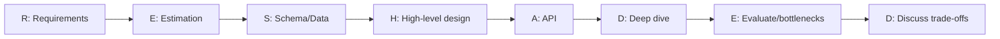
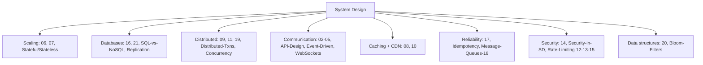

# 📕 High-Level Design (HLD) — System Design Master Folder

<p align="center">
  
  
  
  
  
</p>

> **High-Level Design (HLD)** = poore system ka architecture — scalability, databases, caching,
> distributed systems, security. Yahan **44 detailed topic deep-dives** (21 core + 11 deep-dives +
> 12 advanced) + **30 full system-design case studies** (TinyURL, Twitter, Uber, Payment, Maps, DynamoDB…) —
> diagrams + tables + advantages/disadvantages + interview Q&A — plus ek complete **HLD interview
> guide**. Har file Hinglish me, interview-focused. LLD (code-level) ke liye [`../LLD/`](../LLD/) dekho.

---

## 🧭 Quick Navigation

| Chahiye | Jao |
|---|---|
| ⚡ **Quick revision cheatsheet** (15-min last-minute) | [`CHEATSHEET.md`](./CHEATSHEET.md) |
| **Complete interview guide** (framework + 20+ system designs) | [`HLD_Interview.md`](./HLD_Interview.md) |
| **30 full system-design case studies** (classic + real apps) | [`System_Design_Case_Studies/`](./System_Design_Case_Studies/README.md) |
| **21 core topics** (structured course) | [Section neeche](#-part-1--21-core-topics) |
| **11 deep-dive + 12 advanced topics** | [Deep-dives](#-part-2--advanced-deep-dives) · [Advanced](#-part-3--advanced-topics-advanced_topicsreadmemd) |
| **Theory notes** | [`System_Design_theory.md`](./System_Design_theory.md) |
| LLD (code, patterns, C++) | [`../LLD/`](../LLD/README.md) |

---

## 📘 Complete HLD Interview Guide

[`HLD_Interview.md`](./HLD_Interview.md) — **3800+ lines** ka comprehensive guide:
- **RESHADED framework** (Requirements → Estimation → Schema → High-level → API → Deep-dive → Evaluate → Discuss)
- Scalability, load balancing, caching, databases, CAP, message queues, networking, microservices
- **20+ full system designs** — TinyURL, Twitter, WhatsApp, Uber, YouTube, Dropbox, Payment, Rate Limiter...
- **PART II Advanced** — sharding, replication, consensus (Raft), distributed transactions, probabilistic
  structures, geo-indexing, streaming, CDC, multi-region, security, SRE, NoSQL modeling

> Topic files (neeche) = focused deep-dives per concept. Interview guide = end-to-end framework +
> full system designs. **Dono padho.**

---

## 📚 PART 1 — 21 Core Topics

Structured system-design course (sequential padho). Har file: concept + diagrams + tables + Q&A.

### 🏗️ Foundations & Networking (1–5)
| # | Topic | Kya cover |
|---|---|---|
| 01 | [Monolithic vs Microservices](./01_Monolithic_and_Microservices.md) ⭐ | architectures + **microservices design patterns by phase** (Strangler Fig, **Saga deep**, CQRS, Event Sourcing, Outbox, Canary, Circuit Breaker) |
| 02 | [API Gateway & Load Balancer](./02_API_Gateway_and_Load_Balancer.md) | gateway vs LB, cross-cutting, aggregation, resiliency |
| 03 | [Load Balancer — Types & Algorithms](./03_Load_Balancer_Types_and_Algorithms.md) | L4 vs L7, RR/least-conn/hash, health checks, NAT/DSR |
| 04 | [Proxy & Reverse Proxy](./04_Proxy_and_Reverse_Proxy.md) | forward vs reverse, use cases, SSL/cache/security mechanics |
| 05 | [Network Protocols](./05_Network_Protocols.md) | client-server vs P2P, TCP/UDP, HTTP/1-2-3, WebSocket, REST/gRPC/GraphQL |

### 📈 Scaling & Caching (6–8)
| # | Topic | Kya cover |
|---|---|---|
| 06 | [Scaling — Vertical & Horizontal](./06_Scaling_Vertical_and_Horizontal.md) | scale up vs out, stateless, DB scaling, autoscaling |
| 07 | [Scale App 0 → Million](./07_Scale_Application_0_to_Million.md) | full evolution: 1 server → sharding → microservices |
| 08 | [Caching & Distributed Caching](./08_Caching_and_Distributed_Caching.md) | strategies, eviction, invalidation, thundering herd, Redis |

### 🌐 Distributed Systems (9–11)
| # | Topic | Kya cover |
|---|---|---|
| 09 | [Introduction to Distributed Systems](./09_Introduction_to_Distributed_Systems.md) | challenges, fallacies, consensus, replication, failure handling |
| 10 | [Content Delivery Network (CDN)](./10_Content_Delivery_Network_CDN.md) | **kaise kaam karta**, push vs pull, invalidation, anycast |
| 11 | [CAP Theorem](./11_CAP_Theorem.md) | C/A/P, CP vs AP, PACELC, consistency models |

### 🛡️ Rate Limiting & Security (12–15)
| # | Topic | Kya cover |
|---|---|---|
| 12 | [Rate Limiting & Algorithms](./12_Rate_Limiting_and_Algorithms.md) | token/leaky bucket, fixed/sliding window |
| 13 | [Rate Limiting Part-2 (Distributed)](./13_Rate_Limiting_Part_2.md) | Redis, race conditions, atomicity (Lua), fail open/closed |
| 14 | [SSL Certificate](./14_SSL_Certificate.md) | TLS handshake, certificates, CA chain, mTLS |
| 15 | [Rate Limiting Strategies](./15_Rate_Limiting_Strategies.md) | placement, dimensions, tiers, 429 headers, graceful |

### 🗄️ Data & Reliability (16–21)
| # | Topic | Kya cover |
|---|---|---|
| 16 | [Database Design Tips](./16_Database_Design_Tips.md) | SQL vs NoSQL, indexing, normalization, transactions, pooling |
| 17 | [Avoid Single Point of Failure](./17_Avoid_Single_Point_of_Failure.md) | redundancy, failover, multi-region, availability math |
| 18 | [Message Queues (Kafka/RabbitMQ)](./18_Message_Queues_Kafka_RabbitMQ.md) | queue vs pub-sub, Kafka/RabbitMQ, delivery guarantees |
| 19 | [Consistent Hashing](./19_Consistent_Hashing.md) | hash ring, virtual nodes, resharding, replication |
| 20 | [Back-of-the-Envelope Calculations](./20_Back_of_the_Envelope_Calculations.md) | numbers, formulas, worked examples (TinyURL/Twitter/Chat) |
| 21 | [Database Sharding](./21_Database_Sharding.md) | strategies, shard key, resharding, cross-shard, hotspots |

---

## 🔬 PART 2 — Advanced Deep-Dives

Extra detailed standalone topics (advantages/disadvantages + diagrams + interview Q&A). Ye 21 core
topics ko complement karte hain.

### 🗃️ Databases & Data
| Topic | Kya cover |
|---|---|
| [**SQL vs NoSQL**](./SQL_vs_NoSQL.md) ⭐ (1000+ lines) | ACID/BASE, all NoSQL types, data modeling, scaling, transactions, CAP, popular DBs, polyglot, real-world case studies |
| [**Database Replication**](./Database_Replication.md) | master-slave/multi-master/leaderless, sync/async, replication lag, conflict resolution, quorum, failover, read replicas |
| [**Database Sharding**](./21_Database_Sharding.md) | (core topic 21 — sharding ka jodidaar replication ke saath) |

### 🔒 Consistency & Transactions
| Topic | Kya cover |
|---|---|
| [**Idempotency**](./Idempotency.md) | idempotency key, HTTP methods, dedup store, race conditions, exactly-once, payments |
| [**Concurrency Control**](./Concurrency_Control.md) | optimistic vs pessimistic locking, distributed locks (Redis/Zookeeper), deadlocks, isolation levels |
| [**Distributed Transactions**](./Distributed_Transactions.md) | 2PC, 3PC, Saga, TCC, Outbox — mechanisms + pros/cons |

### 🌐 Architecture & Communication
| Topic | Kya cover |
|---|---|
| [**API Design**](./API_Design.md) | REST best practices, HTTP methods/status, versioning, pagination, errors, REST vs gRPC vs GraphQL |
| [**Event-Driven Architecture**](./Event_Driven_Architecture.md) | events, pub-sub, event streaming, event sourcing, CQRS, pros/cons |
| [**Stateful vs Stateless Architecture**](./Stateful_and_Stateless_Architecture.md) | state, scaling implications, sticky sessions, externalize state, JWT vs session |
| [**WebSockets & Real-Time**](./WebSockets_and_Realtime.md) | polling/long-polling/WebSocket/SSE, WebSocket deep, scaling millions of connections |

### 🛡️ Security & Data Structures
| Topic | Kya cover |
|---|---|
| [**Security in System Design**](./Security_in_System_Design.md) | AuthN vs AuthZ, OAuth/JWT, encryption, attacks (SQLi/XSS/CSRF/DDoS) + defenses, secrets, zero-trust |
| [**Bloom Filters & Probabilistic DS**](./Bloom_Filters_and_Probabilistic_Data_Structures.md) | Bloom filter, Count-Min Sketch, HyperLogLog, Merkle tree, Skip list |

---

## 🔬 PART 3 — Advanced Topics ([`Advanced_Topics/`](./Advanced_Topics/README.md))

Senior/SDE-2+ level deep-dives — ek alag folder me, apne [index](./Advanced_Topics/README.md) ke saath.

| # | Topic | Kya cover |
|---|---|---|
| 01 | [Consensus Algorithms](./Advanced_Topics/01_Consensus_Algorithms.md) | Raft, Paxos, leader election, quorum, Zookeeper/etcd |
| 02 | [Observability](./Advanced_Topics/02_Observability_Monitoring_Logging_Tracing.md) | Metrics/Logs/Traces, p95/p99, tracing, SLI/SLO/SLA, error budget |
| 03 | [Database Indexing Deep-Dive](./Advanced_Topics/03_Database_Indexing_Deep_Dive.md) | B+Tree vs LSM-Tree, clustered/covering/composite index |
| 04 | [Search Systems & Elasticsearch](./Advanced_Topics/04_Search_Systems_and_Elasticsearch.md) | Inverted index, BM25 ranking, autocomplete, shards/replicas |
| 05 | [Big Data & Stream Processing](./Advanced_Topics/05_Big_Data_and_Stream_Processing.md) | Batch vs Stream, MapReduce, Spark, Lambda vs Kappa |
| 06 | [Geospatial & Location Services](./Advanced_Topics/06_Geospatial_and_Location_Services.md) | Geohash, Quadtree, S2, "nearby" (Uber) design |
| 07 | [Resilience & Fault Tolerance](./Advanced_Topics/07_Resilience_and_Fault_Tolerance.md) | Timeout, retry+backoff, circuit breaker, bulkhead, DR (RTO/RPO) |
| 08 | [Blob/Object Storage & Large Files](./Advanced_Topics/08_Blob_Object_Storage_and_Large_Files.md) | S3, chunking, dedup, pre-signed URLs, Dropbox design |
| 09 | [DNS Deep-Dive](./Advanced_Topics/09_DNS_Deep_Dive.md) | Resolution, TTL, GeoDNS, DNS load balancing, anycast |
| 10 | [Service Discovery & Service Mesh](./Advanced_Topics/10_Service_Discovery_and_Service_Mesh.md) | Registry, K8s discovery, sidecar/Envoy, Istio, mTLS |
| 11 | [Deployment Strategies & CI/CD](./Advanced_Topics/11_Deployment_Strategies_and_CICD.md) | Rolling, blue-green, canary, feature flags, DB migrations |
| 12 | [Logical Clocks & Distributed Time](./Advanced_Topics/12_Logical_Clocks_and_Distributed_Time.md) | Lamport/vector clocks, HLC, NTP, clock skew, causal consistency |

---

## 🏗️ PART 4 — System Design Case Studies ([`System_Design_Case_Studies/`](./System_Design_Case_Studies/README.md))

**30 full end-to-end designs** (classic + famous real apps) — ek hi folder me, har ek me **main bada
HLD architecture diagram** + chhote flow diagrams. RESHADED format (requirements → estimation → API →
schema → architecture → deep-dive → bottlenecks).

| # | Design | Core concept |
|---|---|---|
| 01 | [TinyURL / URL Shortener](./System_Design_Case_Studies/01_TinyURL_URL_Shortener.md) | Base62 + distributed ID, cache, read-heavy |
| 02 | [Rate Limiter](./System_Design_Case_Studies/02_Rate_Limiter.md) | Token bucket, distributed Redis + atomicity |
| 03 | [Distributed Cache](./System_Design_Case_Studies/03_Distributed_Cache.md) | Consistent hashing, eviction, replication |
| 04 | [SQL Database Internals](./System_Design_Case_Studies/04_SQL_Database_Internals.md) | Optimizer, B+Tree, buffer pool, WAL, MVCC, ACID |
| 05 | [Twitter / News Feed](./System_Design_Case_Studies/05_Twitter_News_Feed.md) | Fanout (push/pull/hybrid), celebrity problem |
| 06 | [Instagram](./System_Design_Case_Studies/06_Instagram.md) | Media (object store+CDN) + feed fanout |
| 07 | [WhatsApp / Chat](./System_Design_Case_Studies/07_WhatsApp_Chat.md) | WebSockets, registry, presence, offline |
| 08 | [Notification System](./System_Design_Case_Studies/08_Notification_System.md) | Queues, multi-channel fanout, retries/DLQ |
| 09 | [YouTube / Netflix](./System_Design_Case_Studies/09_YouTube_Netflix.md) | CDN + adaptive bitrate, transcoding |
| 10 | [Spotify](./System_Design_Case_Studies/10_Spotify_Music_Streaming.md) | Audio streaming + recommendation engine |
| 11 | [Uber / Ride-Hailing](./System_Design_Case_Studies/11_Uber_Ride_Hailing.md) | Geospatial, matching, real-time location |
| 12 | [Swiggy / Zomato](./System_Design_Case_Studies/12_Swiggy_Zomato_Food_Delivery.md) | Three-sided marketplace, geo, matching, tracking |
| 13 | [Zepto / Blinkit](./System_Design_Case_Studies/13_Zepto_Blinkit_Quick_Commerce.md) | Dark stores, hyperlocal inventory, rider assign |
| 14 | [Tinder](./System_Design_Case_Studies/14_Tinder_Dating_App.md) | Geospatial swipe deck, swipe writes, match detection |
| 15 | [Ticketmaster / Booking](./System_Design_Case_Studies/15_Ticketmaster_Booking_System.md) | No double-book, seat hold, CP |
| 16 | [IRCTC](./System_Design_Case_Studies/16_IRCTC_Train_Booking.md) | Tatkal thundering herd, no double-book, waitlist/RAC |
| 17 | [Airbnb](./System_Design_Case_Studies/17_Airbnb_Marketplace.md) | Geo + date-availability search, date-range no-double-book |
| 18 | [Search Autocomplete](./System_Design_Case_Studies/18_Search_Autocomplete_Typeahead.md) | Trie + precomputed top-k, multi-layer cache |
| 19 | [Google Docs](./System_Design_Case_Studies/19_Google_Docs.md) | OT vs CRDT, real-time collab, op log |
| 20 | [Payment System / UPI / Wallet](./System_Design_Case_Studies/20_Payment_System_UPI_Wallet.md) | Ledger, idempotency, double-spend, Saga, reconciliation |
| 21 | [Google Maps / Navigation](./System_Design_Case_Studies/21_Google_Maps_Navigation.md) | Map tiles, shortest path (CH), ETA, live traffic |
| 22 | [Web Crawler](./System_Design_Case_Studies/22_Web_Crawler.md) | BFS at scale, politeness, Bloom dedup, frontier |
| 23 | [Distributed Job Scheduler](./System_Design_Case_Studies/23_Distributed_Job_Scheduler.md) | Scheduling, at-least-once, leader election, locks |
| 24 | [Key-Value Store (DynamoDB)](./System_Design_Case_Studies/24_Key_Value_Store_DynamoDB.md) | Consistent hashing, quorum, vector clocks, gossip |
| 25 | [Distributed Unique ID (Snowflake)](./System_Design_Case_Studies/25_Distributed_Unique_ID_Snowflake.md) | 64-bit ID, timestamp+machine+seq, clock skew |
| 26 | [Leaderboard / Gaming Rank](./System_Design_Case_Studies/26_Leaderboard_Gaming_Rank.md) | Redis sorted sets, real-time ranking, top-K |
| 27 | [Ad Click Aggregation / Analytics](./System_Design_Case_Studies/27_Ad_Click_Aggregation_Analytics.md) | Stream processing, exactly-once, Lambda/Kappa |
| 28 | [Slack / Discord](./System_Design_Case_Studies/28_Slack_Discord.md) | Channels, huge-room fanout, presence, search |
| 29 | [Google Drive / Dropbox](./System_Design_Case_Studies/29_Google_Drive_Dropbox.md) | Chunking, delta sync, dedup, conflict resolution |
| 30 | [LinkedIn](./System_Design_Case_Studies/30_LinkedIn.md) | Social graph, 2nd-degree, PYMK, feed, who-viewed |

---

## 🎯 System Design Interview — RESHADED Framework



1. **Requirements** — functional + non-functional + scope (read:write ratio poocho)
2. **Estimation** — QPS, storage, bandwidth ([topic 20](./20_Back_of_the_Envelope_Calculations.md))
3. **Schema/Data** — SQL vs NoSQL, data model ([SQL vs NoSQL](./SQL_vs_NoSQL.md), [topic 16](./16_Database_Design_Tips.md))
4. **High-level design** — components + data flow (draw karo)
5. **API** — key endpoints ([API Design](./API_Design.md))
6. **Deep dive** — 1-2 components in detail
7. **Evaluate** — bottlenecks, SPOF ([topic 17](./17_Avoid_Single_Point_of_Failure.md)), scaling
8. **Discuss** — trade-offs (CAP, cost, consistency)

---

## 🗺️ Topic map by theme (kaunsa concept kahan)



---

## 📖 Recommended study path
1. **Topics 01–11** — core (foundations → distributed systems).
2. **Topics 12–21** — rate limiting, security, data, reliability.
3. **Deep-dives** — SQL vs NoSQL, Replication, Idempotency, Concurrency, API Design, Security,
   Event-Driven, WebSockets, Distributed Transactions, Bloom Filters, Stateful/Stateless.
4. **[`HLD_Interview.md`](./HLD_Interview.md)** — RESHADED + full system designs.
5. **Practice** — pick a system (Twitter/Uber/WhatsApp), apply RESHADED, use topic files as reference.

---

## 📂 All files in this folder (32 topic deep-dives + guide)

```
HLD/
├── README.md                    ← you are here (index)
├── HLD_Interview.md             ← complete guide (3800+ lines)
├── System_Design_theory.md      ← theory notes
├── 01..21_*.md                  ← 21 core topics
├── SQL_vs_NoSQL.md              ← deep (1000+)
├── Database_Replication.md
├── Idempotency.md
├── Concurrency_Control.md
├── API_Design.md
├── Security_in_System_Design.md
├── Event_Driven_Architecture.md
├── Bloom_Filters_and_Probabilistic_Data_Structures.md
├── WebSockets_and_Realtime.md
├── Distributed_Transactions.md
├── Stateful_and_Stateless_Architecture.md
├── Advanced_Topics/            ← 12 advanced deep-dives (own README)
│   ├── 01_Consensus_Algorithms.md
│   ├── 02_Observability_Monitoring_Logging_Tracing.md
│   ├── 03_Database_Indexing_Deep_Dive.md
│   ├── 04_Search_Systems_and_Elasticsearch.md
│   ├── 05_Big_Data_and_Stream_Processing.md
│   ├── 06_Geospatial_and_Location_Services.md
│   ├── 07_Resilience_and_Fault_Tolerance.md
│   ├── 08_Blob_Object_Storage_and_Large_Files.md
│   ├── 09_DNS_Deep_Dive.md
│   ├── 10_Service_Discovery_and_Service_Mesh.md
│   ├── 11_Deployment_Strategies_and_CICD.md
│   └── 12_Logical_Clocks_and_Distributed_Time.md
└── System_Design_Case_Studies/ ← 30 end-to-end designs, 01-30 (own README)
    ├── 01-19: TinyURL, Rate Limiter, Distributed Cache, SQL Internals,
    │          Twitter, Instagram, WhatsApp, Notification, YouTube, Spotify,
    │          Uber, Swiggy, Zepto, Tinder, Ticketmaster, IRCTC, Airbnb,
    │          Autocomplete, Google Docs
    └── 20-30: Payment/UPI, Google Maps, Web Crawler, Job Scheduler,
               Key-Value Store, Snowflake ID, Leaderboard, Ad Aggregation,
               Slack/Discord, Google Drive, LinkedIn
```

---

> 💡 **Combine with LLD** — HLD (ye folder) = poore system ka architecture; LLD ([`../LLD/`](../LLD/))
> = ek component ke andar ka code (OOP, patterns, C++). Dono FAANG/product interviews me aate hain.
>
> **Ja ke crack kar de bhai! 🚀**
