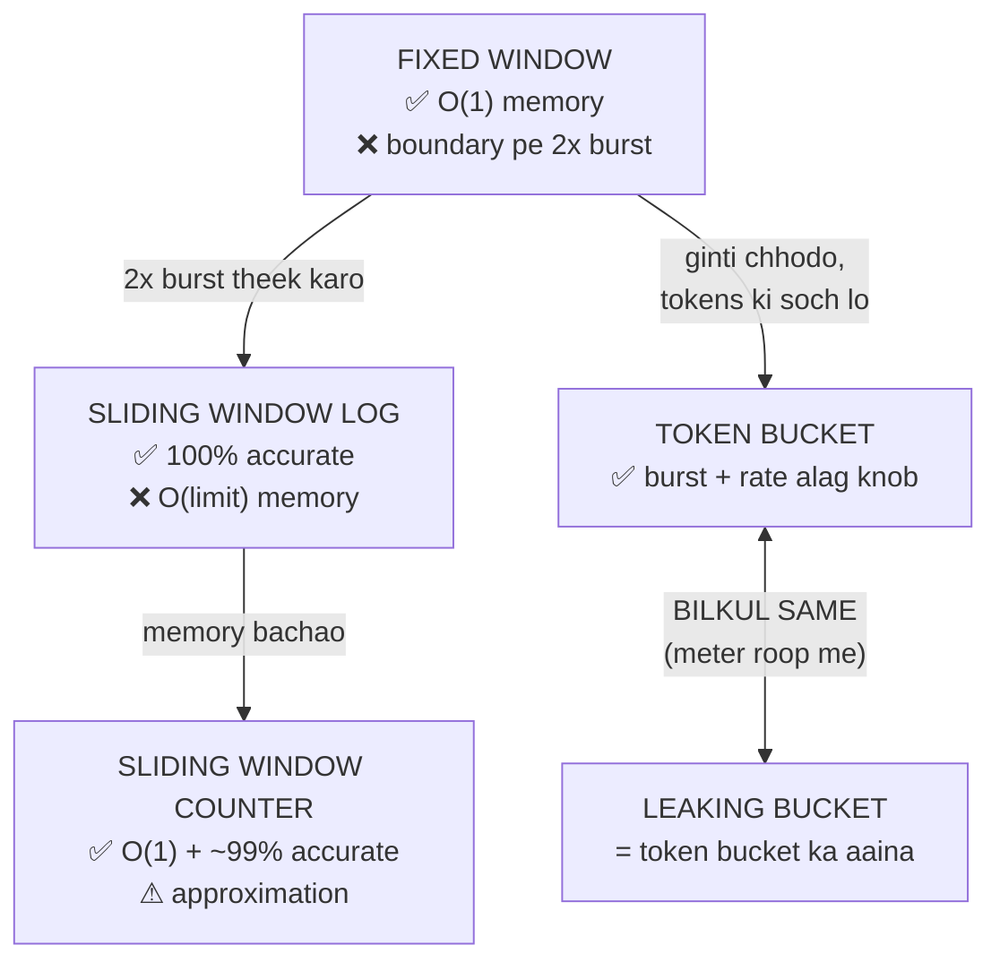

# Rate Limiting Algorithms — Code Karke Samjho 🚦

> [12_Rate_Limiting_and_Algorithms.md](../12_Rate_Limiting_and_Algorithms.md) me theory hai.
> Ye folder wahi theory **chala kar** dikhata hai — har algorithm apni kamzori khud **naap kar**
> batata hai.

---

## 📌 Code kahan se aaya

`rate_limiter/` ke saare headers **aapke apne repo se JYON KE TYON** copy kiye gaye hain —
[github.com/subhm2004/Rate_Limiter](https://github.com/subhm2004/Rate_Limiter)
(`backend/include/rate_limiter/`). Unme **ek line bhi nahi badli**, taaki wo repo ke saath
match karte rahein.

Jo naya likha gaya hai wo sirf ye hai:
- [rl_harness.h](rl_harness.h) — virtual-time test harness
- `01`–`06` demo files — jo un algorithms ko chala kar unka behaviour naapti hain

---

## 📑 Is folder me

| File | Kya sikhata hai |
|---|---|
| [rate_limiter/base.h](rate_limiter/base.h) | `Decision` struct + common interface (aapka code) |
| [rate_limiter/fixed_window.h](rate_limiter/fixed_window.h) | Fixed window counter (aapka code) |
| [rate_limiter/sliding_window_log.h](rate_limiter/sliding_window_log.h) | Sliding window log (aapka code) |
| [rate_limiter/sliding_window_counter.h](rate_limiter/sliding_window_counter.h) | Sliding window counter (aapka code) |
| [rate_limiter/token_bucket.h](rate_limiter/token_bucket.h) | Token bucket (aapka code) |
| [rate_limiter/leaking_bucket.h](rate_limiter/leaking_bucket.h) | Leaking bucket (aapka code) |
| [rl_harness.h](rl_harness.h) | Virtual time — demos deterministic banane ke liye |
| [01_fixed_window.cpp](01_fixed_window.cpp) | Boundary burst — **hamesha 2x limit** |
| [02_sliding_window_log.cpp](02_sliding_window_log.cpp) | 100% sahi, par O(limit) memory |
| [03_sliding_window_counter.cpp](03_sliding_window_counter.cpp) | Approximation — aur uski **dono** galtiyan |
| [04_token_bucket.cpp](04_token_bucket.cpp) | Burst aur rate **alag-alag** control |
| [05_leaking_bucket.cpp](05_leaking_bucket.cpp) | Token bucket ka **aaina** (0 mismatches me sabit) |
| [06_compare_all.cpp](06_compare_all.cpp) | Saare 5, ek hi traffic pe |

---

## 🚀 Kaise chalayein

```bash
./compile.sh            # sab build karo
./compile.sh 1          # sirf demo 1 build karke chala do
./compile.sh compare    # sabka muqabla
./compile.sh clean
```

> 📌 **Order me padho** — har file pichhli file ki *kami* se shuru hoti hai.

---

## ⏱️ Ek design note: demos ASLI ghadi use nahi karte

Aapke `base.h` me ek baat bahut achhi hai — asli logic `check(key, now, cost)` me hai aur `now`
**bahar se** aata hai. `allow()` sirf ek patla wrapper hai jo ghadi padh ke `check` ko deta hai.

Isi wajah se demos me hum `check` ko **apna nakli time** de kar bula sakte hain:

```cpp
rlx::Probe<rl::TokenBucket> tb(5, 1.0);
tb.at("user1", 0.0);     // t=0 second
tb.at("user1", 3600.0);  // t=1 ghanta — bina 1 ghanta ruke!
```

Warna "window boundary pe kya hota hai" dikhane ke liye har demo me 10 second `sleep` karna padta,
aur result har machine pe alag aata. Ye **dependency injection** ka faayda hai — aapka code
testable isi wajah se hai.

---

## 🎯 Poori kahani



---

## 📊 Naapa hua result

### Boundary attack — t=9.99s pe 5, phir t=10.01s pe 5 (limit 5 per 10s)

| Algorithm | t=9.99 | t=10.01 | Kul | Nateeja |
|---|---|---|---|---|
| Fixed Window | 5 | 5 | **10** | ❌ 2x limit |
| Sliding Window Log | 5 | 0 | 5 | ✅ |
| Sliding Window Counter | 5 | 0 | 5 | ✅ |
| Token Bucket | 5 | 0 | 5 | ✅ |
| Leaking Bucket | 5 | 0 | 5 | ✅ |

> Fixed Window ka ye burst **hamesha theek 2x** hota hai — limit 5 ho ya 1000.

### Recovery pattern — quota khatam karke har second try karo

```
Fixed Window           : ❌❌❌❌❌❌❌❌❌✅✅✅✅✅❌❌❌❌❌✅
Sliding Window Log     : ❌❌❌❌❌❌❌❌❌✅✅✅✅✅❌❌❌❌❌✅
Sliding Window Counter : ❌❌❌❌❌❌❌❌❌❌❌✅❌✅❌✅❌✅❌✅
Token Bucket           : ❌✅❌✅❌✅❌✅❌✅❌✅❌✅❌✅❌✅❌✅
Leaking Bucket         : ❌✅❌✅❌✅❌✅❌✅❌✅❌✅❌✅❌✅❌✅
```

> ⭐ **Yahi tasveer poora farak samjha deti hai.** Window algorithms quota **jhatke me**
> dete hain (t=10 pe achanak 5 slot khul gaye — backend pe saw-tooth spike).
> Buckets **drip** karte hain — har 2 second me ek. Backend ke liye drip behtar hai.

### Memory (limit=1000, 1 crore users)

| Algorithm | Per key | Total |
|---|---|---|
| Fixed Window | 1 counter | ~160 MB |
| Sliding Window Counter | 2 counters | ~240 MB |
| Sliding Window Log | 1000 timestamps | **~74 GB** 💀 |

---

## 🧠 Teen baatein jo blogs galat batate hain

### 1️⃣ "Leaking Bucket burst nahi allow karta" — ADHOORI baat
Leaking bucket ke **do roop** hain:
- **Meter** (aapka code, aur zyadatar rate limiters) → balti full to **reject**
- **Queue/shaper** (nginx `limit_req` bina `nodelay`) → request **queue** me wait karti hai

"Burst smooth karta hai" wali baat sirf **queue roop** pe lagu hai. Meter roop me wo Token Bucket
ka bilkul **aaina** hai:

```
tokens  ==  capacity - level        (hamesha)
```

[05_leaking_bucket.cpp](05_leaking_bucket.cpp) isse **489 requests pe 0 mismatches** ke saath
sabit karta hai.

### 2️⃣ Sliding Window Counter ki galti DONO taraf jaati hai
Log ise "sach" maan kar compare karo to:

| Requests kahan hui | Counter ka faisla | Sach | Galti |
|---|---|---|---|
| Window ke **shuru** me (t=0) | ❌ DENY (est. 4.95) | ✅ ALLOW | zyada **sakht** |
| Window ke **ant** me (t=9.9) | 2 allow | 0 allow | zyada **dheela** |

Wajah: wo maan ke chalta hai ki pichhli window ki requests **barabar bikhri** thi.
Asli traffic me wo aksar bikhri hoti hain, isliye practice me galti ~1% se kam rehti hai.

### 3️⃣ Fixed Window ka 2x burst "bug" nahi hai
Algorithm apne hisaab se bilkul sahi chalta hai — dono windows me 5-5 requests thi.
Galti uski **soch** me hai: wo pichhli window ko poori tarah **bhool** jaata hai.
Isliye capacity planning me maan ke chalo ki peak **2x** aayega.

---

## ⚖️ Kab kya use karein

| Situation | Algorithm |
|---|---|
| Public API (burst allow karna hai) | **Token Bucket** — Stripe, GitHub, AWS |
| General purpose, crore users | **Sliding Window Counter** — Cloudflare, Kong |
| OTP / login / payment (ek bhi extra nahi) | **Sliding Window Log** — mehnga par exact |
| Downstream ko steady rate chahiye | **Leaking Bucket** (queue roop) |
| Bas mota-mota quota, sabse sasta | **Fixed Window** (2x maan ke chalo) |

---

## 💬 Interview me kaise bolna

**"Fixed window ka problem?"**
> Boundary burst. Counter har window pe achanak 0 ho jaata hai, to client window ke ant me aur
> agli ke shuru me apni limit nikaal sakta hai — **hamesha theek 2x**, chahe limit kuch bhi ho.
> Maine test kiya tha: limit 5 per 10s pe 0.02 second me 10 requests nikal gayi.

**"Token bucket vs leaky bucket?"**
> Meter form me wo **ek hi cheez** hain — `tokens == capacity - level`. Maine dono pe same traffic
> chala kar dekha, 489 requests pe zero mismatch. Asli farak tab aata hai jab leaky bucket ko
> **queue** ki tarah use karo — tab wo reject nahi karta, requests ko constant rate pe release
> karta hai. Yaani wo rate *limiter* nahi, traffic *shaper* ban jaata hai — aur uski keemat latency hai.

**"Kaunsa use karoge?"**
> Default sliding window counter — O(1) memory aur practice me ~99% accurate. Public API me token
> bucket, kyunki wahan burst allow karna user experience ke liye zaroori hai aur capacity/refill
> alag-alag tune ho jaate hain.

---

## 🔗 Aage padho
- [12_Rate_Limiting_and_Algorithms.md](../12_Rate_Limiting_and_Algorithms.md) — theory
- [13_Rate_Limiting_Part_2.md](../13_Rate_Limiting_Part_2.md) — distributed rate limiting
- [15_Rate_Limiting_Strategies.md](../15_Rate_Limiting_Strategies.md) — placement, 429 headers
- [Rate Limiter case study](../System_Design_Case_Studies/02_Rate_Limiter.md) — full design
- [Rate_Limiter_LLD](../../LLD/Rate_Limiter_LLD/) — OOP design
- 🌐 [github.com/subhm2004/Rate_Limiter](https://github.com/subhm2004/Rate_Limiter) — inka live simulator
