# SQL vs NoSQL — The Complete Deep Dive

> Ye system design ka **sabse zyada poochha jaane wala** database decision hai. "SQL ya NoSQL?" ka
> jawab "it depends" hai — par **kis cheez pe depend karta hai**, poora yahan hai. Ye file dono ko
> zero se, deep detail me cover karti hai: internals, ACID vs BASE, saare NoSQL types, data
> modeling, scaling, consistency, transactions, use cases, popular databases, aur decision framework.

---

## 📑 Table of Contents
1. [Introduction — ye decision itna important kyun](#1-introduction)
2. [SQL (Relational Databases) — deep](#2-sql-relational-databases--deep)
3. [NoSQL — deep](#3-nosql--deep)
4. [ACID vs BASE](#4-acid-vs-base)
5. [NoSQL Types — saare 6 detail me](#5-nosql-types--deep)
6. [Schema — fixed vs flexible](#6-schema--fixed-vs-flexible)
7. [Data Modeling — relational vs NoSQL](#7-data-modeling)
8. [Query Capabilities](#8-query-capabilities)
9. [Transactions](#9-transactions)
10. [Scaling — vertical vs horizontal](#10-scaling)
11. [Consistency Models](#11-consistency-models)
12. [Indexing in both](#12-indexing)
13. [Normalization vs Denormalization](#13-normalization-vs-denormalization)
14. [CAP Theorem positioning](#14-cap-theorem-positioning)
15. [Performance characteristics](#15-performance-characteristics)
16. [Popular databases — deep](#16-popular-databases--deep)
17. [Polyglot persistence](#17-polyglot-persistence)
18. [When to use SQL vs NoSQL](#18-when-to-use-what)
19. [Decision framework](#19-decision-framework)
20. [Common myths](#20-common-myths--misconceptions)
21. [Migration considerations](#21-migration-considerations)
22. [Interview Q&A](#22-interview-qa)
23. [Summary](#23-summary)

---

## 1. Introduction

Database har system ka **dil** hai. Data kaise store, query, scale, aur consistent kiya jaata —
ye poore system ki performance, scalability, aur reliability decide karta. Galat database choice
scale pe system ko **kill** kar sakta (ya millions of dollars ka re-architecture).

Do fundamental categories:
- **SQL (Relational)** — 1970s se (Edgar Codd), structured, tables, relationships, ACID. Battle-tested.
- **NoSQL (Non-relational)** — 2000s me scale ki demand se (Google BigTable, Amazon Dynamo papers),
  flexible, distributed, huge scale.

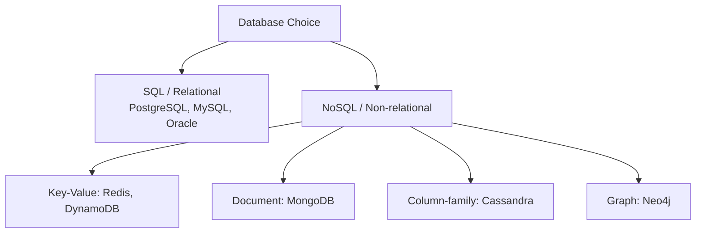

> ⭐ **Interview insight:** "NoSQL" ka matlab "no SQL" nahi — "**Not Only SQL**" hai. Ye SQL ka
> replacement nahi, **complement** hai. Modern systems aksar dono use karte (polyglot persistence).

---

## 2. SQL (Relational Databases) — deep

### Kya hai
**SQL (Structured Query Language) databases** data ko **tables** (rows + columns) me store karte
hain, jinke beech **relationships** (foreign keys) hote hain. Predefined **schema** (structure fixed).
Query ke liye SQL language.

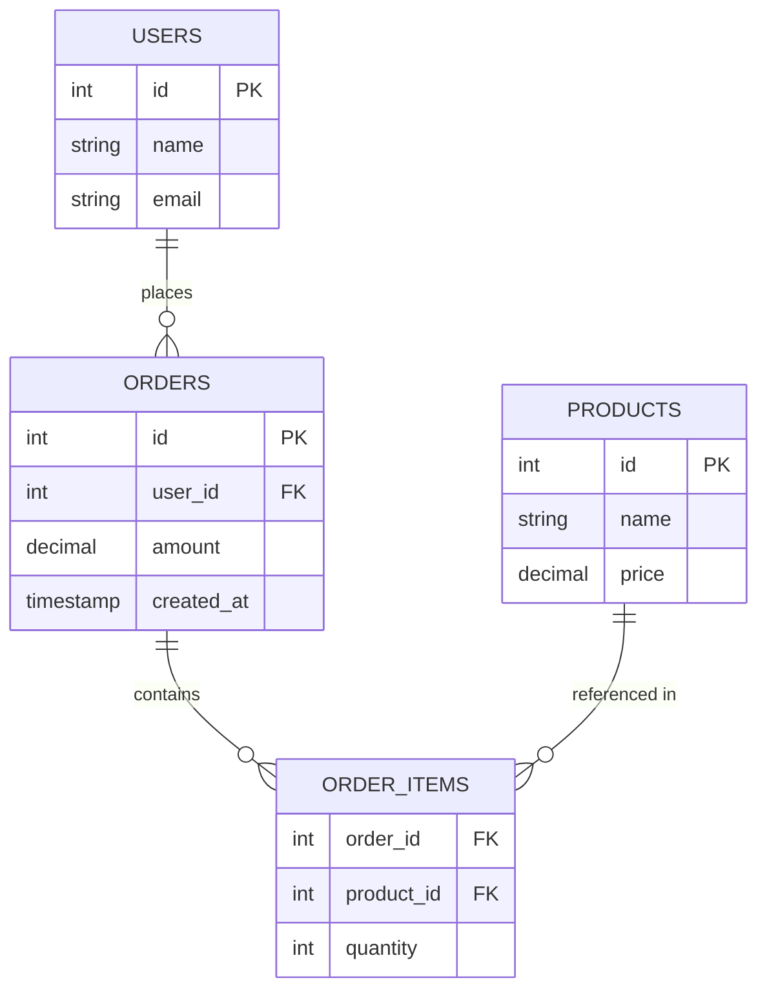

### Structure — tables, rows, columns
```sql
-- Schema (structure) pehle define karni padti
CREATE TABLE users (
    id       INT PRIMARY KEY AUTO_INCREMENT,
    name     VARCHAR(100) NOT NULL,
    email    VARCHAR(255) UNIQUE NOT NULL,
    created_at TIMESTAMP DEFAULT NOW()
);

CREATE TABLE orders (
    id       INT PRIMARY KEY AUTO_INCREMENT,
    user_id  INT NOT NULL,
    amount   DECIMAL(10,2),
    FOREIGN KEY (user_id) REFERENCES users(id)   -- relationship
);
```

### Key characteristics
1. **Structured data** — fixed schema (columns + types defined pehle).
2. **Relationships** — tables foreign keys se linked. Joins se combine.
3. **ACID transactions** — strong consistency (atomicity, consistency, isolation, durability).
4. **SQL query language** — powerful, standardized (SELECT, JOIN, GROUP BY, aggregations).
5. **Normalization** — data duplication avoid (multiple tables).
6. **Vertical scaling** — traditionally bigger machine (sharding possible but complex).

### Fayde
- **Data integrity** — constraints (NOT NULL, UNIQUE, FK, CHECK), ACID → consistent, reliable data.
- **Complex queries** — joins, subqueries, aggregations, window functions — powerful analytics.
- **Standardized** — SQL universal, mature tooling, huge ecosystem, expertise widely available.
- **Strong consistency** — transactions (banking-grade).
- **Mature + battle-tested** — decades of production (PostgreSQL, MySQL, Oracle).

### Nuksan
- **Fixed schema** — schema change (ALTER TABLE) large tables pe slow/locking, evolution mushkil.
- **Horizontal scaling hard** — sharding complex (joins across shards, distributed transactions).
- **Object-relational impedance mismatch** — OOP objects ↔ relational tables mapping (ORM overhead).
- **Not ideal for unstructured/rapidly-changing data** — flexible schema chahiye to painful.

### Examples
**PostgreSQL** (most powerful open-source, extensions, JSON support), **MySQL** (popular, web),
**Oracle / SQL Server** (enterprise), **SQLite** (embedded), **Amazon Aurora** (cloud-native MySQL/
PostgreSQL compatible).

---

## 3. NoSQL — deep

### Kya hai
**NoSQL databases** relational model se hatt ke — flexible schema, distributed by design, horizontal
scaling built-in, huge scale ke liye optimized. "Not Only SQL." 2000s me web-scale (Google, Amazon,
Facebook) ki demand se aaye.

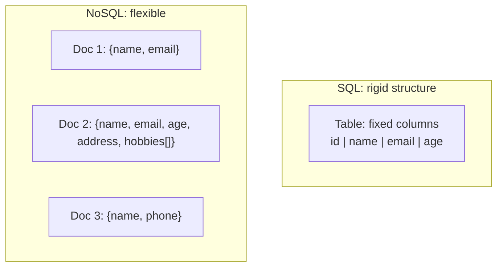

### Kyun aaye (history)
- **Scale** — web giants ko billions of users, petabytes data — single SQL machine handle nahi kar
  paati, sharding painful.
- **Flexibility** — rapidly evolving products (schema roz badalta) — fixed schema bottleneck.
- **Speed** — simple access patterns (key lookup) me relational overhead unnecessary.
- **Availability** — global systems ko always-available (eventual consistency acceptable) chahiye.
- Landmark papers: **Google BigTable (2006)**, **Amazon Dynamo (2007)** — NoSQL movement ki neev.

### Key characteristics
1. **Flexible / no schema** — documents/records ka structure vary kar sakta (schema-on-read).
2. **Horizontal scaling** — built-in (sharding, replication native).
3. **Distributed by design** — multiple nodes, fault-tolerant.
4. **Eventual consistency** (usually) — BASE model (availability over strict consistency).
5. **Denormalized** — related data embed (no joins).
6. **Simple access patterns** — key-based lookups fast.

### Fayde
- **Massive horizontal scale** — commodity machines add karo, linear scaling.
- **Flexible schema** — evolving data, no migration pain.
- **High availability** — distributed, no SPOF, always-on.
- **Performance at scale** — optimized for specific access patterns.
- **Handles unstructured/semi-structured** — JSON, logs, sensor data, time-series.

### Nuksan
- **Eventual consistency** (usually) — stale reads possible (strong consistency mushkil/costly).
- **Limited query capabilities** — joins nahi (usually), complex queries mushkil.
- **Limited transactions** — usually single-document/partition (multi-record ACID limited).
- **Less mature (some)** — tooling/expertise SQL se kam (though rapidly improving).
- **Denormalization overhead** — data duplication (updates multiple jagah, consistency risk).

---

## 4. ACID vs BASE

Ye do consistency philosophies — SQL usually ACID, NoSQL usually BASE.

### ACID (SQL) — strong consistency
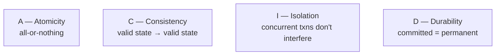

- **Atomicity** — transaction poora ya kuch nahi. `BEGIN → debit A → credit B → COMMIT`. Beech me
  fail → ROLLBACK (kuch nahi hua). Money transfer: A se kata par B ko nahi mila — impossible.
- **Consistency** — transaction valid state se valid state (constraints hold — FK, unique, check).
  Invalid → reject.
- **Isolation** — concurrent transactions ek doosre ko disturb nahi karti (jaise serially chali).
  Isolation levels se tune.
- **Durability** — commit ke baad data permanent (crash pe bhi — WAL/disk).

**Example — bank transfer (ACID zaroori):**
```sql
BEGIN;
  UPDATE accounts SET balance = balance - 100 WHERE id = 'A';  -- debit
  UPDATE accounts SET balance = balance + 100 WHERE id = 'B';  -- credit
COMMIT;   -- dono ya kuch nahi (atomic)
```

### BASE (NoSQL) — eventual consistency
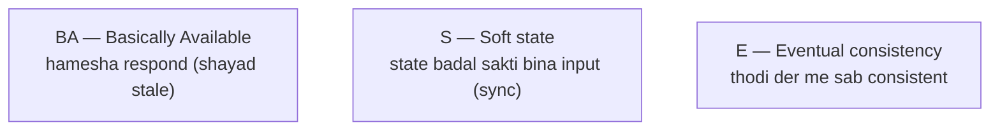

- **Basically Available** — system hamesha respond karta (availability priority, chahe latest data
  na ho).
- **Soft state** — state time ke saath badal sakti (background sync — external input ke bina).
- **Eventual consistency** — writes ke baad thodi der me sab replicas consistent (temporarily stale).

**Example — social media likes (BASE ok):**
```
User likes post → local node updated → other nodes eventually synced
Like count 999 vs 1001 for a moment — chalega (availability > exactness)
```

### ACID vs BASE
| | ACID | BASE |
|---|---|---|
| Priority | consistency | availability |
| Data | always consistent | eventually consistent |
| Transactions | strong (multi-record) | limited (single record) |
| Availability | can sacrifice for consistency | always available |
| Use | banking, inventory, orders | social, analytics, feeds |
| CAP | CP-leaning | AP-leaning |

> ⭐ ACID = "correctness over availability." BASE = "availability over strict correctness." Choose
> per use case (money = ACID, likes = BASE). [CAP: `11_CAP_Theorem.md`]

---

## 5. NoSQL Types — deep

NoSQL umbrella term hai — 4 main types (+ 2 modern). Har ek alag data model, use case.

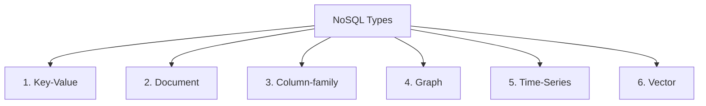

### 5.1 — Key-Value Store
Simplest NoSQL — **key → value** (like a giant hash map). Value opaque (DB doesn't interpret).
```
"user:123"        → {name: "Alice", age: 30}
"session:abc"     → {userId: 123, expiry: ...}
"cart:456"        → [item1, item2]
```
- **Structure:** key (unique) → value (string, JSON, blob).
- **Operations:** GET, PUT, DELETE (by key). No queries on value.
- ✅ **Ultra-fast** (O(1) key lookup), simple, highly scalable.
- ❌ No querying by value, no relationships.
- **Use:** caching (Redis), session storage, user preferences, real-time bidding, feature flags,
  leaderboards (Redis sorted sets).
- **Examples:** **Redis**, **Amazon DynamoDB** (KV mode), **Memcached**, **Riak**.

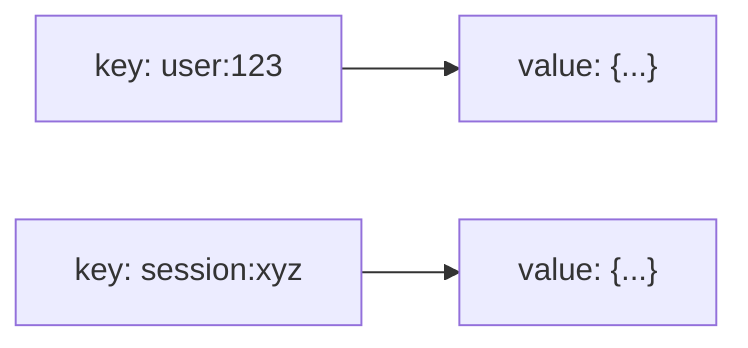

### 5.2 — Document Store
Data as **documents** (JSON/BSON/XML). Har document self-contained (nested structure). Flexible
schema per document.
```json
// users collection
{
  "_id": "123",
  "name": "Alice",
  "email": "alice@example.com",
  "address": { "city": "Mumbai", "pin": "400001" },
  "orders": [
    { "id": "o1", "amount": 500 },
    { "id": "o2", "amount": 300 }
  ]
}
```
- **Structure:** collections of documents (JSON). Nested objects, arrays. Query on any field.
- **Operations:** rich queries (by any field), indexes, aggregations.
- ✅ **Flexible schema** (each doc different), natural for objects (OOP-friendly), rich queries,
  embedded data (no joins for related).
- ❌ Complex cross-document joins limited, data duplication (embedding).
- **Use:** content management, catalogs, user profiles, e-commerce, real-time apps, mobile backends.
- **Examples:** **MongoDB** (most popular), **CouchDB**, **Amazon DocumentDB**, **Firestore**.

### 5.3 — Column-Family (Wide-Column) Store
Data **columns** me organized (rows me nahi jaise SQL). Har row ka alag columns ho sakte. Optimized
for **write-heavy** + huge scale + time-series.
```
Row key: user123
  Column family "profile": {name: Alice, age: 30}
  Column family "activity": {2024-01-01: login, 2024-01-02: purchase}
```
- **Structure:** row key → column families → columns (dynamic per row). Sparse (nulls no storage).
- ✅ **Massive write throughput** (LSM-tree — sequential writes), huge scale (petabytes), time-series
  friendly, tunable consistency, no SPOF (leaderless).
- ❌ Not for complex queries/joins, eventual consistency, query flexibility limited (design for
  access patterns).
- **Use:** time-series (IoT, metrics, logs), write-heavy (event logging, messaging), analytics,
  recommendation data.
- **Examples:** **Cassandra** (most popular), **HBase**, **Google Bigtable**, **ScyllaDB**.

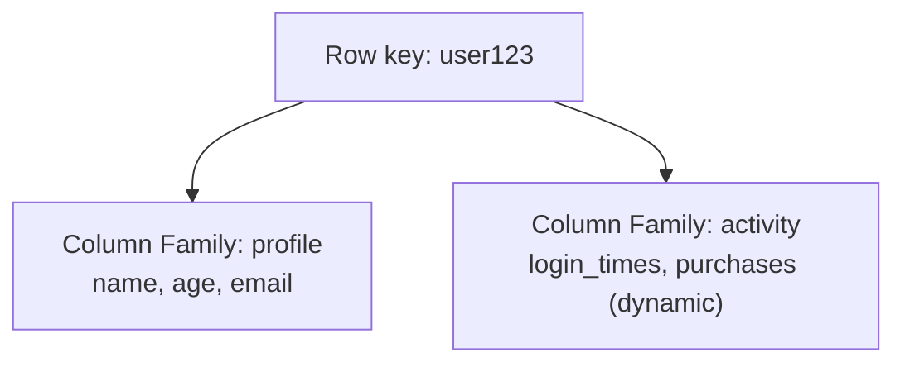

### 5.4 — Graph Database
Data as **nodes** (entities) + **edges** (relationships). Relationships **first-class** (SQL joins
se kahin fast for connected data).
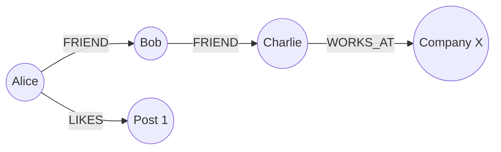
- **Structure:** nodes (with properties) + edges (typed, directed, with properties). Query =
  graph traversal.
- ✅ **Relationships-heavy queries fast** ("friends of friends", shortest path, recommendations).
  SQL me ye multi-join (expensive), graph me native traversal.
- ❌ Not for simple tabular data, scaling harder (graphs hard to partition), niche.
- **Use:** social networks, recommendation engines, fraud detection (connection patterns),
  knowledge graphs, network/IT topology.
- **Examples:** **Neo4j** (most popular), **Amazon Neptune**, **ArangoDB**, **JanusGraph**.

### 5.5 — Time-Series Database
Time-stamped data ke liye optimized (metrics, IoT, monitoring). Append-heavy, time-range queries.
- ✅ Efficient time-based storage (compression, downsampling), retention policies, fast time-range
  queries.
- **Use:** monitoring (metrics), IoT sensors, financial ticks, application telemetry.
- **Examples:** **InfluxDB**, **TimescaleDB** (PostgreSQL extension), **Prometheus**, **OpenTSDB**.

### 5.6 — Vector Database (AI era)
**Embeddings** (high-dimensional vectors) similarity search ke liye. AI/ML — RAG, semantic search,
recommendations. Approximate Nearest Neighbor (ANN — HNSW algorithm).
- **Use:** semantic search, RAG (LLM retrieval), image/audio similarity, recommendations.
- **Examples:** **Pinecone**, **Milvus**, **Weaviate**, **pgvector** (PostgreSQL), **Qdrant**.

### NoSQL types comparison
| Type | Data model | Best for | Examples |
|---|---|---|---|
| Key-Value | key → value | cache, session, simple lookup | Redis, DynamoDB |
| Document | JSON docs | flexible objects, catalogs, profiles | MongoDB |
| Column-family | wide columns | write-heavy, time-series, huge scale | Cassandra, HBase |
| Graph | nodes + edges | relationships, social, fraud | Neo4j |
| Time-series | time-stamped | metrics, IoT, monitoring | InfluxDB, TimescaleDB |
| Vector | embeddings | AI, semantic search, RAG | Pinecone, pgvector |

---

## 6. Schema — Fixed vs Flexible

### SQL — schema-on-write (rigid)
Structure **pehle** define karni padti (CREATE TABLE). Data insert karne se pehle schema exist
karna chahiye. Data schema conform kare (else reject).
```sql
CREATE TABLE users (id INT, name VARCHAR(100), age INT);
-- age missing? → default/null. Extra field? → error.
```
- **Schema change** — `ALTER TABLE` (large tables pe slow, locking, careful migration).
- ✅ Data integrity (structure guaranteed), predictable.
- ❌ Rigid (evolving data painful), migrations for changes.

### NoSQL — schema-on-read (flexible)
No predefined schema (mostly). Har record apna structure. Application read time pe interpret karta.
```json
{ "name": "Alice", "age": 30 }
{ "name": "Bob", "email": "bob@x.com", "hobbies": ["a", "b"] }   // different structure — OK
```
- ✅ Flexible (evolving data, no migration), rapid iteration, heterogeneous data.
- ❌ No enforced structure (application responsibility), data quality risk (garbage possible),
  implicit schema (documentation matters).

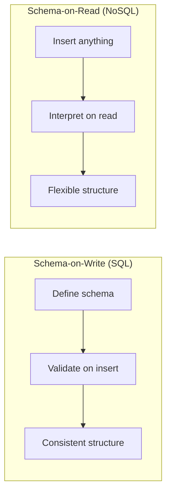

> ⭐ Fixed schema = safety + rigidity. Flexible schema = agility + responsibility. Evolving product/
> unknown structure → NoSQL. Stable, integrity-critical → SQL.

---

## 7. Data Modeling

### SQL — normalized, relationship-driven
Data ko **entities** me todo, relationships (FK) se link. Model **data structure** (normalize —
no duplication).
```
users(id, name, email)
orders(id, user_id, amount)          -- user_id → users
order_items(order_id, product_id, qty)
products(id, name, price)
```
"User ke saare orders" → JOIN users + orders.

### NoSQL — denormalized, access-pattern-driven
**Queries pehle** define karo, phir model. Related data **embed** (no joins). "Model for how you
read."
```json
// Document (MongoDB) — user + orders embedded (one read)
{
  "userId": "123", "name": "Alice",
  "orders": [ {id, amount, items: [...]}, ... ]   // embedded (no join)
}
```
```
// Cassandra — table per query
orders_by_user (user_id PK, order_id, amount)      -- "user ke orders"
orders_by_date (date PK, order_id, user_id)        -- "date ke orders" (duplicate data)
```

| | SQL modeling | NoSQL modeling |
|---|---|---|
| Approach | model data (normalize) | model queries (denormalize) |
| Relationships | joins (FK) | embed / duplicate |
| Order | schema first | access patterns first |
| Duplication | minimal | intentional (read speed) |

> ⭐ **NoSQL golden rule:** "Design your data model based on your **queries**, not your data." Access
> patterns pehle define karo — kaunsi queries chahiye — phir accordingly model (denormalize).

---

## 8. Query Capabilities

### SQL — powerful, declarative
```sql
-- Joins, aggregations, subqueries, window functions
SELECT u.name, COUNT(o.id) as order_count, SUM(o.amount) as total
FROM users u
JOIN orders o ON u.id = o.user_id
WHERE o.created_at > '2024-01-01'
GROUP BY u.name
HAVING SUM(o.amount) > 1000
ORDER BY total DESC;
```
- ✅ Joins (multi-table), aggregations (COUNT/SUM/AVG), GROUP BY, subqueries, window functions,
  full SQL — powerful ad-hoc queries + analytics.

### NoSQL — limited, access-pattern-optimized
- **Key-value** — GET/PUT by key only (no queries).
- **Document** — query by fields, some aggregation (MongoDB aggregation pipeline), but joins
  limited (`$lookup` exists but not efficient at scale).
- **Column-family** — query by partition key + clustering key (design for access patterns), no
  arbitrary queries.
- **Graph** — traversal queries (Cypher) — relationships-optimized.

```
MongoDB: db.users.find({age: {$gt: 25}})   -- by field OK
         db.users.aggregate([...])          -- pipeline
Cassandra: SELECT * FROM orders WHERE user_id = 123  -- partition key
           SELECT * FROM orders WHERE amount > 100    -- ❌ (not partition key — inefficient/error)
```

> ⭐ SQL = flexible ad-hoc queries (analytics-friendly). NoSQL = fast for **designed** access
> patterns, poor for arbitrary queries. NoSQL me "query first, model accordingly."

---

## 9. Transactions

### SQL — full ACID transactions
Multi-row, multi-table atomic transactions.
```sql
BEGIN;
  UPDATE inventory SET stock = stock - 1 WHERE product_id = 5;
  INSERT INTO orders (user_id, product_id) VALUES (1, 5);
  UPDATE users SET order_count = order_count + 1 WHERE id = 1;
COMMIT;   -- sab ya kuch nahi (atomic across tables)
```

### NoSQL — limited transactions
- **Single-document/partition atomicity** — ek document/row atomic (MongoDB single doc, DynamoDB
  single item, Cassandra single partition).
- **Multi-document transactions** — modern NoSQL me added (MongoDB 4.0+, DynamoDB transactions) but
  limited scope, performance cost, not for huge distributed scale.
- **Distributed transactions** — across shards/nodes → **Saga pattern** (compensations, eventual)
  ya 2PC (avoid). [Detail: `01_Monolithic...` Saga section]

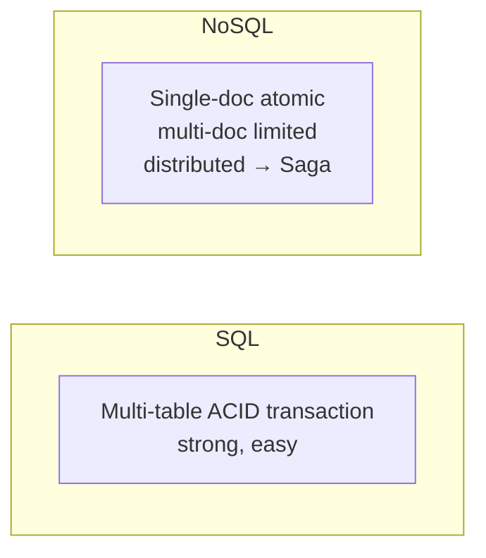

> ⭐ Financial/inventory (multi-record atomicity critical) → **SQL**. Simple single-entity updates
> or eventual-consistency-ok → NoSQL. Distributed transactions → Saga (application-level).

---

## 10. Scaling

### SQL — vertical primary, horizontal hard
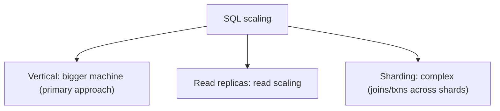
- **Vertical** — bigger machine (traditional). Ceiling.
- **Read replicas** — read scaling (master writes, replicas reads).
- **Sharding** — possible but **complex** (cross-shard joins, distributed transactions, resharding).
  Vitess (MySQL), Citus (PostgreSQL) help.
- ✅ Simple until scale limit. ❌ Horizontal scaling painful (relational model resists partitioning).

### NoSQL — horizontal native
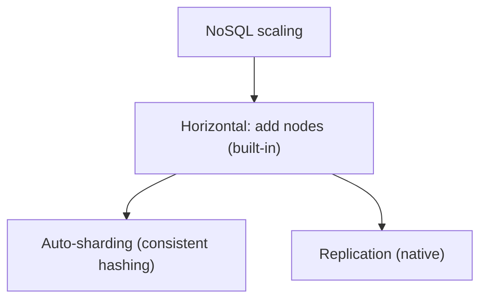
- **Horizontal** — nodes add karo, data auto-distributed (sharding + replication native).
  Consistent hashing (Cassandra/DynamoDB).
- ✅ Linear scaling (commodity machines), petabyte scale, elastic. Designed for it.
- ❌ Consistency trade-offs (distributed).

| | SQL | NoSQL |
|---|---|---|
| Primary | vertical | horizontal |
| Horizontal | hard (sharding complex) | native (built-in) |
| Scale ceiling | machine limit | practically unlimited |
| Sharding | manual, complex | automatic |

> ⭐ Modern SQL (PostgreSQL + read replicas + caching) **far** scale karta (StackOverflow, Shopify
> proof). NoSQL jab genuinely huge horizontal scale + auto-sharding chahiye.

---

## 11. Consistency Models

### SQL — strong consistency
Har read latest committed write dekhta (ACID). Single source of truth, immediate consistency.

### NoSQL — tunable (usually eventual)
- **Eventual** (default many) — thodi der me consistent (fast, available).
- **Tunable** — Cassandra/DynamoDB me per-query consistency (quorum: `W + R > N` → strong).
```
Cassandra: consistency ONE (fast, eventual), QUORUM (strong-ish), ALL (strong, slow)
DynamoDB: eventually consistent read (cheap) vs strongly consistent read (2x cost)
```

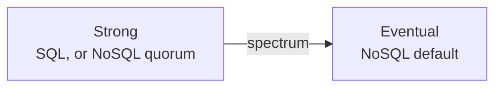

> Consistency vs availability/latency trade-off (CAP/PACELC). SQL leans strong (CP), NoSQL leans
> eventual/available (AP), but tunable.

---

## 12. Indexing

### SQL indexing
- **B-tree** (default) — range queries, sorting, equality. O(log n).
- **Hash** — exact match.
- **Composite** — multiple columns (leftmost prefix rule).
- **Covering** — query columns in index (no table access).
- Full-text, GIN/GiST (PostgreSQL), spatial.
```sql
CREATE INDEX idx_email ON users(email);      -- fast email lookup
CREATE INDEX idx_user_date ON orders(user_id, created_at);  -- composite
```

### NoSQL indexing
- **Document (MongoDB)** — indexes on any field, compound, multikey (arrays), text, geospatial.
- **Column-family (Cassandra)** — primary index (partition key), secondary indexes (limited,
  discouraged at scale), materialized views.
- **Key-value** — key is the index (value not indexed).
- **Trade-off same** — indexes fast reads, slow writes + storage. Don't over-index.

> Both: index frequently-queried fields, avoid over-indexing (write cost). NoSQL me access patterns
> se index design (not ad-hoc).

---

## 13. Normalization vs Denormalization

### Normalization (SQL default)
Data tables me todo, **no duplication** (1NF, 2NF, 3NF). Single source of truth.
```
users(id, name)          -- name ek jagah
orders(id, user_id)      -- reference
```
- ✅ No duplication, consistency (update ek jagah), integrity, storage efficient.
- ❌ Reads mehnge (joins), complex queries.
- **Use:** OLTP (transactions), write-heavy, consistency-critical.

### Denormalization (NoSQL common)
Data **duplicate/embed** — reads fast (no join).
```json
{ "orderId": "o1", "userId": "u1", "userName": "Alice", "amount": 500 }
// userName duplicated in each order (no join needed)
```
- ✅ Reads fast (all in one place, no join), simple read queries.
- ❌ Duplication (storage), updates multiple jagah (consistency risk — update anomaly).
- **Use:** OLAP/read-heavy, NoSQL (joins expensive/absent).

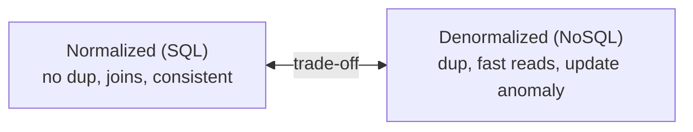

> Normalize for correctness (SQL default), denormalize for read speed (NoSQL, read-heavy). Even
> SQL denormalizes hot read paths.

---

## 14. CAP Theorem Positioning

CAP: distributed system Consistency, Availability, Partition-tolerance — 2/3. [Detail: `11_CAP_Theorem.md`]

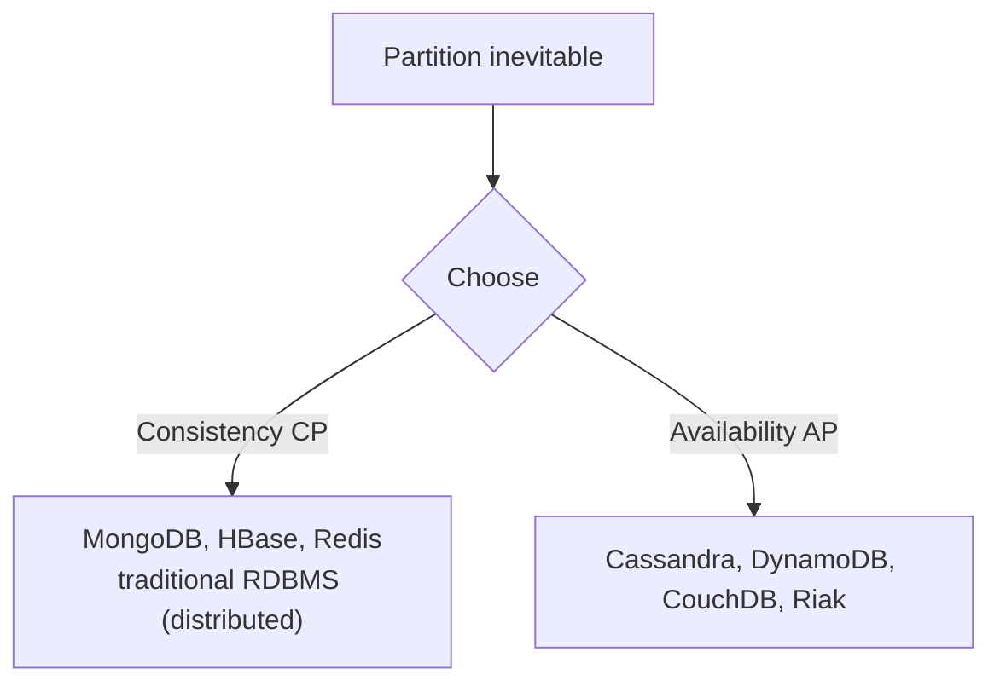

- **SQL (distributed)** — usually **CP** (consistency priority). Traditional RDBMS single-node = CA
  (no partition).
- **NoSQL** — varies: **CP** (MongoDB, HBase) or **AP** (Cassandra, DynamoDB — availability + tunable).
- **PACELC** — normal operation me latency vs consistency (DynamoDB PA/EL, Spanner PC/EC).

---

## 15. Performance Characteristics

| Operation | SQL | NoSQL |
|---|---|---|
| Simple key lookup | fast (indexed) | **very fast** (KV O(1)) |
| Complex joins | **fast** (optimized) | slow/unsupported |
| Aggregations | **powerful** | limited |
| Write throughput (single) | good | good |
| Write throughput (huge scale) | limited (single master) | **excellent** (distributed) |
| Read scaling | replicas | native |
| Range queries | **good** (B-tree) | depends (Cassandra clustering, MongoDB) |
| Full-text search | ok (or Elasticsearch) | ok (or Elasticsearch) |

> ⭐ SQL wins on complex queries/joins/analytics. NoSQL wins on simple-access huge-scale +
> write-heavy + horizontal scaling. **Match to access patterns.**

---

## 16. Popular Databases — deep

### PostgreSQL (SQL)
Most advanced open-source RDBMS. Full ACID, complex queries, extensions (PostGIS geo, pgvector AI),
JSON/JSONB (NoSQL-like flexibility!), strong consistency, MVCC. **Default choice for most apps.**
Scales far with read replicas + Citus (sharding).

### MySQL (SQL)
Popular, web-focused, fast reads, mature, huge ecosystem. LAMP stack. InnoDB (ACID, MVCC). Vitess
(YouTube's sharding layer) for scale.

### MongoDB (Document NoSQL)
Most popular NoSQL. JSON documents (BSON), flexible schema, rich queries + aggregation pipeline,
horizontal sharding, replica sets. Multi-document transactions (4.0+). E-commerce, CMS, catalogs,
mobile backends.

### Cassandra (Column-family NoSQL)
Write-optimized (LSM-tree), massive scale (petabytes), leaderless (no SPOF, AP), tunable
consistency (quorum), linear scaling. Time-series, write-heavy, IoT, messaging. Netflix, Instagram.

### Amazon DynamoDB (Key-Value/Document NoSQL)
Fully managed, serverless, single-digit-ms latency, auto-scaling, high availability. Partition +
sort key. Eventually/strongly consistent (tunable). Gaming, e-commerce, IoT, serverless apps.

### Redis (Key-Value NoSQL)
In-memory, ultra-fast (sub-ms). Rich types (strings, lists, sets, sorted sets, hashes, streams).
Cache, session, leaderboard, pub-sub, rate limiter, distributed locks. Persistence optional.

### Neo4j (Graph NoSQL)
Native graph, Cypher query language, relationship traversal fast. Social networks, recommendations,
fraud detection, knowledge graphs.

### Cloud databases
- **Amazon Aurora** — MySQL/PostgreSQL-compatible, cloud-native, auto-scaling storage, 15 read
  replicas, high availability.
- **Google Spanner** — globally distributed + strong consistency (TrueTime) — CP at global scale
  (rare feat). SQL interface + horizontal scale.
- **CockroachDB** — distributed SQL (NewSQL) — horizontal scale + ACID + SQL.

### NewSQL (best of both?)
**NewSQL** — SQL interface + ACID + horizontal scalability (NoSQL-like). Examples: **Google Spanner,
CockroachDB, YugabyteDB, TiDB, VoltDB**. "SQL ka power, NoSQL ka scale." Trade-off: complexity, cost.

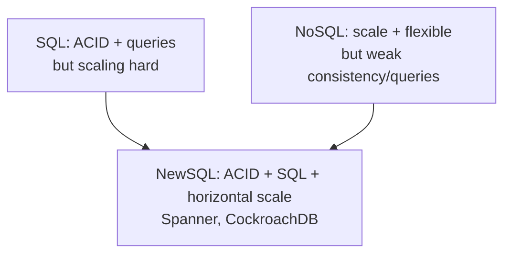

---

## 17. Polyglot Persistence

Modern reality: **ek application me multiple databases** — har use case ke liye best tool.

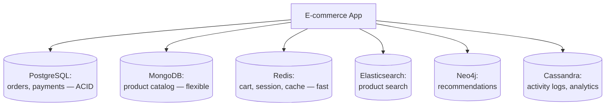

**Example — e-commerce:**
- **Orders/payments** → PostgreSQL (ACID, transactions).
- **Product catalog** → MongoDB (flexible attributes per category).
- **Cart/session** → Redis (fast, ephemeral).
- **Search** → Elasticsearch (full-text).
- **Recommendations** → Neo4j (graph — "users who bought X").
- **Activity logs** → Cassandra (write-heavy, time-series).

> ⭐ **"Right tool for the job."** SQL vs NoSQL binary nahi — real systems dono use karte. Interview
> me polyglot persistence mention = maturity.

---

## 18. When to Use What

### Use SQL agar:
- ✅ **Structured data** with clear relationships (entities linked).
- ✅ **ACID transactions** critical (banking, inventory, orders, payments).
- ✅ **Complex queries** — joins, aggregations, analytics, reporting.
- ✅ **Strong consistency** required (financial, booking).
- ✅ **Data integrity** important (constraints, FK).
- ✅ Moderate scale (single machine + replicas kaafi).
- ✅ **Unsure?** — start with SQL (PostgreSQL) — powerful, flexible (even JSON), scales far.

### Use NoSQL agar:
- ✅ **Massive horizontal scale** (billions of records, petabytes, high throughput).
- ✅ **Flexible/evolving schema** (rapidly changing, heterogeneous data).
- ✅ **Eventual consistency ok** (social feeds, likes, analytics, logs).
- ✅ **Simple access patterns** (key lookups) at huge scale.
- ✅ **High availability** critical (always-on, global).
- ✅ **Specific data type** — documents (MongoDB), time-series (InfluxDB), graph (Neo4j), cache (Redis).

### Concrete examples
| System | Choice | Why |
|---|---|---|
| Banking / payments | SQL | ACID, transactions, consistency |
| E-commerce orders | SQL | transactions, integrity |
| Product catalog | Document (MongoDB) | flexible attributes per category |
| Social media feed | Column/Document (Cassandra) | scale, write-heavy, eventual ok |
| Caching / sessions | Key-Value (Redis) | ultra-fast, ephemeral |
| Analytics / logs | Column-family (Cassandra) | write-heavy, time-series |
| Recommendations | Graph (Neo4j) | relationships |
| Search | Elasticsearch | full-text |
| IoT / metrics | Time-series (InfluxDB) | time-stamped, retention |
| Chat messages | Column-family (Cassandra) | write-heavy, scale |
| Leaderboard | Key-Value (Redis sorted sets) | ranking, fast |

---

## 19. Decision Framework

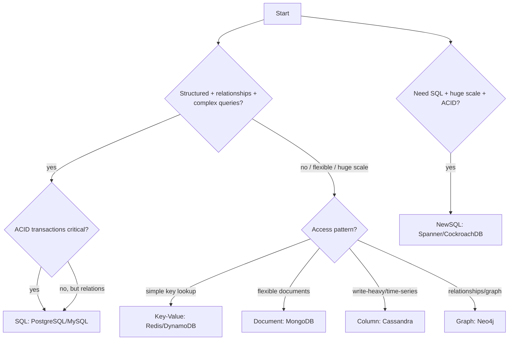

**Questions to ask:**
1. **Data structure** — structured (SQL) vs flexible/varied (NoSQL)?
2. **Relationships** — many joins (SQL) vs simple/embedded (NoSQL)?
3. **Consistency** — strong ACID (SQL) vs eventual ok (NoSQL)?
4. **Scale** — moderate (SQL) vs massive horizontal (NoSQL)?
5. **Queries** — complex ad-hoc/analytics (SQL) vs known access patterns (NoSQL)?
6. **Transactions** — multi-record atomic (SQL) vs single-entity (NoSQL)?

> ⭐ **Default:** unsure → **PostgreSQL** (powerful, ACID, JSON flexibility, scales far). NoSQL for
> specific needs (proven scale/flexibility requirement). Don't choose NoSQL for "cool factor."

---

## 20. Common Myths & Misconceptions

| Myth | Reality |
|---|---|
| "NoSQL = no SQL" | "**Not Only** SQL" — complement, not replacement. Many NoSQL have SQL-like queries. |
| "NoSQL always faster" | Only for **specific access patterns**. SQL faster for complex queries/joins. |
| "SQL can't scale" | SQL scales far (replicas, caching, sharding). StackOverflow/Shopify proof. |
| "NoSQL has no schema" | Has **implicit** schema (application-enforced) — "schema-on-read." |
| "NoSQL = no transactions" | Modern NoSQL (MongoDB, DynamoDB) have transactions (limited scope). |
| "Use NoSQL for scale" | Scale ≠ NoSQL. Access patterns + consistency needs decide. |
| "SQL is old/outdated" | Battle-tested, most reliable, PostgreSQL cutting-edge (JSON, vector). |
| "Pick one" | Polyglot persistence — use both (right tool per use case). |

---

## 21. Migration Considerations

### SQL → NoSQL (why + challenges)
- **Why:** hit scaling wall (writes), need flexible schema, huge growth.
- **Challenges:** denormalize (rethink model — access patterns), lose ACID (handle in app — Saga),
  lose joins (embed/duplicate), data migration (large), query rewrite, team learning curve.

### NoSQL → SQL (why)
- **Why:** need complex queries/joins/transactions, over-engineered NoSQL (didn't need scale),
  consistency issues.

### Best practices
- **Don't migrate prematurely** — SQL scales far. Migrate on **proven** need.
- **Incremental** — one component/table at a time (not big-bang). Dual-write during transition.
- **Polyglot** — often better to **add** a NoSQL for specific use case than full migration.

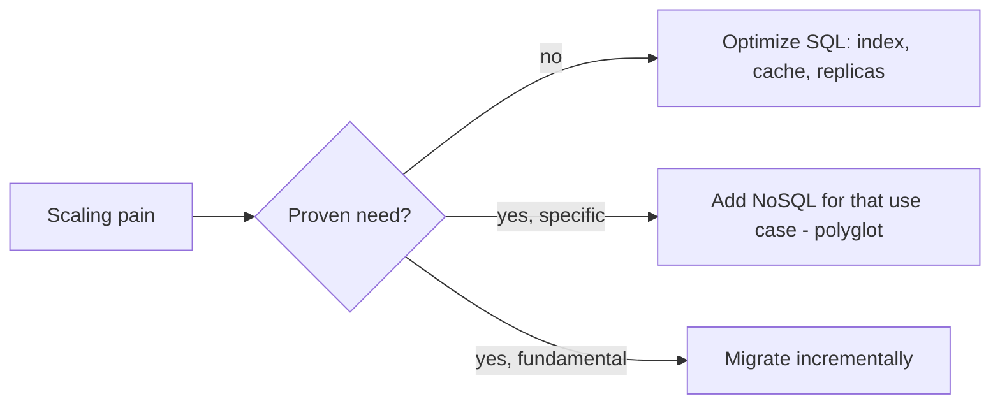

---

## 22. Interview Q&A

**Q: SQL vs NoSQL, kaise choose?**
SQL — structured data, relationships, ACID transactions, complex queries, strong consistency
(banking, orders). NoSQL — massive horizontal scale, flexible schema, eventual consistency ok,
simple access patterns (feeds, logs, cache). Match to data + access patterns + consistency needs.
Default PostgreSQL if unsure. Polyglot for real systems.

**Q: ACID vs BASE?**
ACID (SQL) — Atomicity, Consistency, Isolation, Durability — strong consistency, multi-record
transactions. BASE (NoSQL) — Basically Available, Soft state, Eventual consistency — availability
priority. Money = ACID, likes = BASE.

**Q: NoSQL types?**
Key-Value (Redis/DynamoDB — cache, fast lookup), Document (MongoDB — flexible objects), Column-family
(Cassandra — write-heavy, scale, time-series), Graph (Neo4j — relationships). Plus time-series
(InfluxDB), vector (Pinecone — AI).

**Q: NoSQL me data modeling kaise?**
Access-pattern-driven — queries pehle define karo, phir model. Denormalize (embed/duplicate related
data — no joins). "Model for reads, not data." SQL me opposite (normalize, model data).

**Q: SQL scale nahi karta — sahi?**
Galat. SQL far scale karta — read replicas (read scaling), caching, sharding (Vitess/Citus).
StackOverflow, Shopify huge scale on SQL. NoSQL jab genuinely huge horizontal + write scaling +
auto-sharding chahiye.

**Q: NoSQL me transactions?**
Single-document/partition atomic (native). Multi-document limited (MongoDB 4.0+, DynamoDB — scope +
cost). Distributed transactions → Saga pattern (compensations, eventual). Multi-record ACID → SQL.

**Q: Polyglot persistence kya?**
Ek app me multiple DBs — best tool per use case. E-commerce: orders (PostgreSQL/ACID), catalog
(MongoDB/flexible), cart (Redis/fast), search (Elasticsearch), recommendations (Neo4j/graph). "Right
tool for the job."

**Q: NewSQL kya?**
SQL interface + ACID + horizontal scalability (NoSQL-like). Spanner, CockroachDB, TiDB, YugabyteDB.
"SQL power + NoSQL scale." Trade-off: complexity, cost.

**Q: Document vs Column-family DB?**
Document (MongoDB) — JSON docs, flexible, rich queries per field, catalogs/profiles. Column-family
(Cassandra) — wide columns, write-optimized (LSM), huge scale, time-series, tunable consistency,
design for access patterns.

**Q: Consistency SQL vs NoSQL?**
SQL — strong (ACID, immediate). NoSQL — usually eventual (fast, available), tunable (quorum W+R>N →
strong). Trade-off: consistency vs availability/latency (CAP/PACELC).

**Q: Schema-on-write vs schema-on-read?**
SQL schema-on-write — structure defined first, validated on insert (rigid, safe). NoSQL
schema-on-read — insert anything, interpret on read (flexible, app-responsibility).

---

## 22b. Real-world architecture case studies

Companies ne kaise choose kiya — real patterns:

### Netflix
- **Cassandra** — massive scale (viewing history, user data, time-series) — write-heavy, global,
  AP (availability critical — "always play"). 
- **DynamoDB, Redis** — specific use cases.
- **MySQL (via Aurora)** — billing (needs ACID).
- **Elasticsearch** — search.
> Lesson: polyglot — Cassandra for scale/availability, SQL for billing (ACID).

### Uber
- **MySQL (via Schemaless — their sharding layer)** — trips, core data (needed transactions +
  scale, built custom sharding on MySQL).
- **Cassandra** — time-series, high-write.
- **Redis** — caching, geospatial (driver locations).
- **PostgreSQL** — earlier, migrated as scale grew.
> Lesson: started SQL, added sharding layer + NoSQL as scale demanded.

### Amazon
- **DynamoDB** — born from the Dynamo paper. Cart, sessions, high-scale services (availability +
  predictable latency).
- **Aurora (MySQL/PostgreSQL)** — relational needs.
> Lesson: DynamoDB for scale/availability, relational where ACID/queries needed.

### Instagram
- **PostgreSQL** — main data (sharded by user_id — logical shards on physical nodes). Proof SQL
  scales to hundreds of millions.
- **Cassandra** — feeds, activity (write-heavy).
- **Redis** — caching, feeds.
> Lesson: PostgreSQL (sharded) core + Cassandra/Redis for scale-specific.

### Discord
- Started **MongoDB** → hit scaling issues → migrated to **Cassandra** → later **ScyllaDB**
  (Cassandra-compatible, faster) for trillions of messages.
> Lesson: message storage = write-heavy → column-family (Cassandra/ScyllaDB). MongoDB wasn't right
> fit for that access pattern.

### Common thread
```mermaid
flowchart TB
    A[Core transactional data] --> SQL[SQL - ACID]
    B[Massive write-heavy/time-series] --> COL[Cassandra/ScyllaDB]
    C[Cache/session/geo/leaderboard] --> R[Redis]
    D[Search] --> ES[Elasticsearch]
    E[Everything] --> POLY[= POLYGLOT PERSISTENCE]
```
> ⭐ **Har bade company polyglot use karti** — SQL for transactions/integrity, NoSQL (Cassandra/
> DynamoDB) for scale, Redis for cache, Elasticsearch for search. Koi single DB sab kuch nahi.

---

## 23. Summary

```mermaid
flowchart TB
    SQL["SQL / Relational<br/>─────────────<br/>✅ ACID, transactions<br/>✅ complex queries, joins<br/>✅ strong consistency<br/>✅ data integrity<br/>❌ horizontal scaling hard<br/>❌ rigid schema"]
    NoSQL["NoSQL<br/>─────────────<br/>✅ horizontal scale (native)<br/>✅ flexible schema<br/>✅ high availability<br/>✅ specific data types<br/>❌ eventual consistency (usually)<br/>❌ limited joins/transactions"]
```

**Key takeaways:**
- **SQL** = structured, relationships, ACID, complex queries, strong consistency. Banking, orders,
  integrity-critical. Default PostgreSQL (scales far). Vertical + replicas + sharding.
- **NoSQL** = flexible, huge horizontal scale, high availability, specific access patterns. Feeds,
  logs, cache, time-series, graph.
  - **Key-Value** (Redis/DynamoDB) — cache, session, fast lookup.
  - **Document** (MongoDB) — flexible objects, catalogs.
  - **Column-family** (Cassandra) — write-heavy, time-series, huge scale.
  - **Graph** (Neo4j) — relationships.
- **ACID vs BASE** — strong consistency vs availability/eventual.
- **Data modeling** — SQL normalize (model data), NoSQL denormalize (model queries/access patterns).
- **Scaling** — SQL vertical (horizontal hard), NoSQL horizontal (native).
- **NewSQL** (Spanner/CockroachDB) — SQL + ACID + horizontal scale.
- **Polyglot persistence** — real systems use both (right tool per use case).
- **Decision:** data structure + relationships + consistency + scale + queries + transactions.
  Unsure → PostgreSQL. NoSQL for proven specific need. **Scale ≠ NoSQL; access patterns decide.**

> Related: [`11_CAP_Theorem.md`](./11_CAP_Theorem.md) · [`16_Database_Design_Tips.md`](./16_Database_Design_Tips.md)
> · [`21_Database_Sharding.md`](./21_Database_Sharding.md) · [`08_Caching_and_Distributed_Caching.md`](./08_Caching_and_Distributed_Caching.md)
