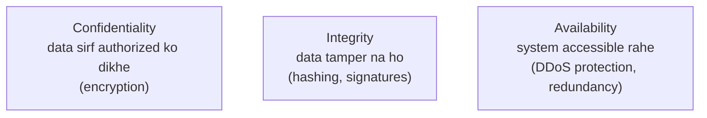
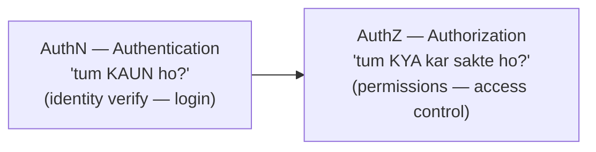
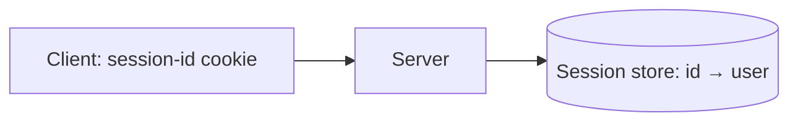
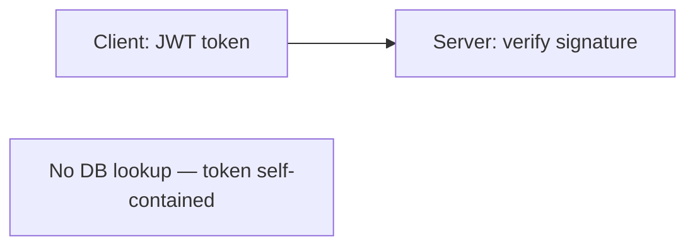
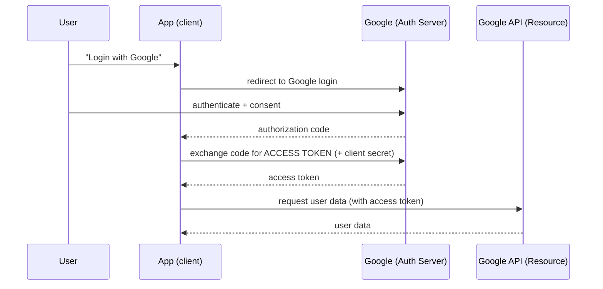
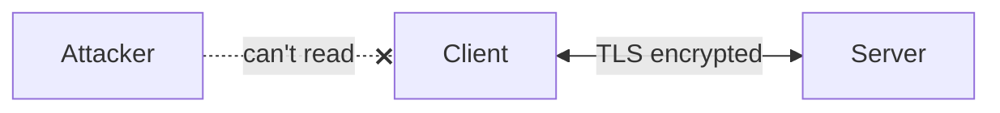
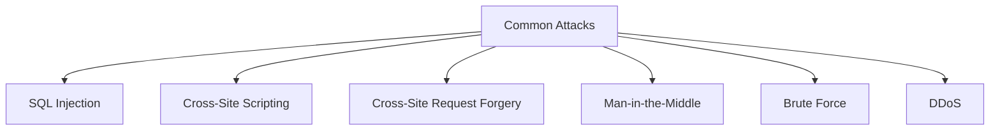
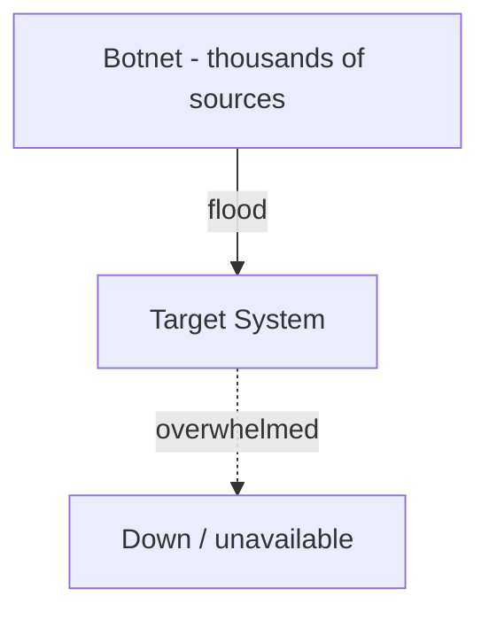
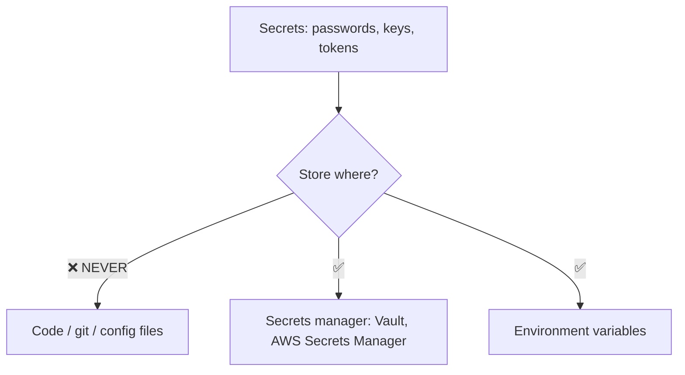
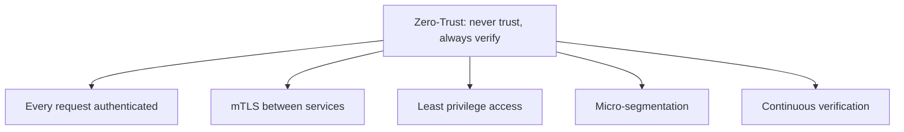

# Security in System Design — Complete Deep Dive

> Security har system ka **non-negotiable** part hai — ek breach millions of dollars + trust cost
> karta. Interview me security concerns raise karna maturity dikhata. Ye file: authentication vs
> authorization, OAuth/JWT, encryption (TLS, at-rest), common attacks (SQLi, XSS, CSRF, DDoS) + their
> defenses, WAF, secrets management, aur zero-trust.

---

## 📑 Table of Contents
1. [Security ka overview (CIA triad)](#1-security-overview--cia-triad)
2. [Authentication vs Authorization](#2-authentication-vs-authorization)
3. [Authentication methods (JWT, OAuth, etc.)](#3-authentication-methods)
4. [OAuth 2.0 deep](#4-oauth-20--deep)
5. [Encryption (in transit + at rest)](#5-encryption)
6. [Common attacks + defenses](#6-common-attacks--defenses)
7. [DDoS protection](#7-ddos-protection)
8. [Secrets management](#8-secrets-management)
9. [Zero-trust architecture](#9-zero-trust-architecture)
10. [Security best practices checklist](#10-security-best-practices-checklist)
11. [Interview Q&A](#11-interview-qa)
12. [Summary](#12-summary)

---

## 1. Security Overview — CIA Triad

Security ke teen fundamental goals (**CIA triad**):



- **Confidentiality** — sensitive data sirf authorized parties ko (encryption, access control).
- **Integrity** — data unauthorized modify na ho (hashing, digital signatures, checksums).
- **Availability** — system attack ke bawajood available rahe (DDoS defense, redundancy).

**Defense in depth** — multiple security layers (network, application, data) — ek fail ho to baaki
protect karein.

---

## 2. Authentication vs Authorization

Do fundamental concepts (aksar confuse hote):



- **Authentication (AuthN)** — "**tum kaun ho?**" — identity verify karta (login, password, biometric,
  token). Pehle hota.
- **Authorization (AuthZ)** — "**tum kya kar sakte ho?**" — permissions check (roles, access control).
  Authentication ke baad.

**Example:** login (authentication — "ye Alice hai") → Alice admin panel access kar sakti? (authorization
— "Alice ka role admin hai kya?").

### Authorization models
- **RBAC (Role-Based)** — permissions roles se (admin, user, guest). User → role → permissions.
- **ABAC (Attribute-Based)** — attributes se (user dept, resource type, time) — fine-grained.
- **ACL (Access Control List)** — per-resource explicit permissions.

---

## 3. Authentication Methods

### Session-based (server-side / stateful)
Server session store rakhta, client ke paas session ID (cookie).

- ✅ Easy revocation (delete session), server control.
- ❌ Stateful (server/Redis store), lookup per request, scaling needs shared store.

### Token-based (JWT — stateless)
Session state token me (client-side). Server signature verify — no store lookup.
```
JWT: header.payload.signature
     header:  {alg: HS256, typ: JWT}
     payload: {userId: 123, role: admin, exp: ...}   (claims)
     signature: sign(header + payload, secret)
```

- ✅ **Stateless** (scale-friendly), no store lookup, works across services (microservices).
- ❌ **Revocation hard** (valid till expiry — use short expiry + refresh tokens, ya blacklist),
  bigger, secret compromise = all tokens compromised.

### Others
- **API Keys** — service-to-service, simple (but static, careful management).
- **OAuth 2.0** — delegated auth (login with Google). [Section 4.]
- **MFA (Multi-Factor)** — password + OTP/biometric (extra layer).
- **mTLS** — mutual TLS (both sides certificate — service-to-service, zero-trust).

| | Session | JWT |
|---|---|---|
| State | server/Redis | client (token) |
| Lookup | per request | none (verify) |
| Revocation | easy | hard (blacklist/expiry) |
| Scaling | shared store | fully stateless |
| Use | traditional web | APIs, microservices, mobile |

---

## 4. OAuth 2.0 — Deep

**OAuth 2.0** = **delegated authorization** — user apna password **third-party app ko nahi deta**,
balki ek **access token** deta (limited access). "Login with Google/Facebook."



**Flow:**
1. User "Login with Google" → app redirects to Google.
2. User Google pe authenticate + consent ("app ko email access do").
3. Google authorization code deta app ko.
4. App code ko access token se exchange (client secret ke saath).
5. App access token se user data access (Google API).

- **OAuth = authorization** (access delegation). **OpenID Connect (OIDC)** = OAuth + **authentication**
  (identity — "who is the user"). Login systems OIDC use karte.
- **Access token** (short-lived) + **refresh token** (long-lived, new access token le sakta).
- ✅ User password app ko nahi share, granular scopes (limited access), revocable.

---

## 5. Encryption

### In Transit (TLS/HTTPS)
Data network pe travel karte waqt encrypt. **TLS** (HTTPS). Man-in-the-middle se bachaav. [Detail:
`14_SSL_Certificate.md`]


### At Rest (stored data)
Data disk/DB pe encrypt (stolen disk/breach me data unreadable).
- **Database encryption** — TDE (Transparent Data Encryption), column-level.
- **Disk encryption** — full disk.
- **Key management** — encryption keys securely (AWS KMS, HashiCorp Vault). Keys ≠ data (separate).

### Symmetric vs Asymmetric
- **Symmetric (AES)** — one key encrypt+decrypt. Fast (bulk data). Key distribution problem.
- **Asymmetric (RSA/ECC)** — public/private keys. Slow. Key exchange, signatures. (TLS handshake uses.)

### Hashing (passwords)
Passwords **kabhi plain text nahi** — **hash + salt**:
```
store: hash(password + salt) — NOT password
verify: hash(entered + salt) == stored_hash?
```
- **One-way** — hash se password reverse nahi (breach me passwords safe).
- **Salt** — per-user random (rainbow table attack se bachaav, same password → different hash).
- **Slow hashing** — **bcrypt, scrypt, Argon2** (deliberately slow → brute-force expensive).
- ❌ **Never** MD5/SHA-1 for passwords (fast → brute-forceable), no salt.

> ⭐ **Repo LLD:** `GPay_LLD`/`Truecaller_LLD` me `pinHash_` (PIN hashed, not plain) — note me
> mention ki demo hash hai, production me bcrypt/Argon2 + salt.

---

## 6. Common Attacks + Defenses



### SQL Injection
Attacker malicious SQL input me daalta → DB manipulate.
```
BAD:  query = "SELECT * FROM users WHERE name = '" + input + "'"
      input = "' OR '1'='1"  → returns all users! 😱
DEFENSE: parameterized queries / prepared statements (input as data, not code)
         + ORM + input validation
```

### XSS (Cross-Site Scripting)
Attacker malicious JavaScript inject karta (comment/input) → doosre users ke browser me run.
```
BAD:  <div>{userComment}</div>   → comment = "<script>steal cookies</script>"
DEFENSE: output encoding/escaping (HTML entities), Content Security Policy (CSP),
         sanitize input
```

### CSRF (Cross-Site Request Forgery)
User logged in, attacker unko malicious request trigger karwata (unke behalf pe).
```
DEFENSE: CSRF tokens (unpredictable token per form/request — attacker ko pata nahi),
         SameSite cookies, verify Origin/Referer
```

### Man-in-the-Middle (MITM)
Attacker communication intercept/modify.
```
DEFENSE: TLS/HTTPS (encryption + certificate verification), HSTS, certificate pinning
```

### Brute Force
Password/OTP guessing (millions of attempts).
```
DEFENSE: rate limiting, account lockout (N fails), CAPTCHA, MFA, slow password hashing (bcrypt)
```

### Attacks summary
| Attack | Kya | Defense |
|---|---|---|
| SQL Injection | malicious SQL in input | parameterized queries, ORM, validation |
| XSS | malicious JS injection | output encoding, CSP, sanitize |
| CSRF | forged requests | CSRF tokens, SameSite cookies |
| MITM | intercept traffic | TLS/HTTPS, HSTS, cert pinning |
| Brute force | credential guessing | rate limit, lockout, CAPTCHA, MFA |
| DDoS | overwhelm system | rate limit, WAF, CDN, autoscale |
| Data breach | steal stored data | encryption at rest, least privilege, audit |

---

## 7. DDoS Protection

**DDoS (Distributed Denial of Service)** — massive traffic from many sources → system overwhelm →
unavailable.



**Defenses:**
- **Rate limiting** — per-IP/user limits (excess reject). [Detail: `12`, `13`]
- **WAF (Web Application Firewall)** — malicious/bot traffic filter (rules-based).
- **CDN** — traffic edges pe absorb (distributed capacity), origin hidden. [Detail: `10_CDN.md`]
- **Auto-scaling** — capacity add (absorb spike) — but cost.
- **IP blacklisting / reputation** — known bad IPs block.
- **Anycast** — traffic distributed across locations.
- **Traffic scrubbing** — dedicated DDoS services (Cloudflare, AWS Shield) — clean traffic.

---

## 8. Secrets Management

Passwords, API keys, tokens, certificates — **secrets**. Inhe secure karna:



**Best practices:**
- **Never in code/git** — secrets code me nahi (git leak — public repos me secrets bahut leak hote).
- **Secrets manager** — HashiCorp Vault, AWS Secrets Manager, Azure Key Vault (centralized, encrypted,
  access-controlled).
- **Environment variables** — inject at runtime (not hardcoded).
- **Rotation** — secrets periodically change (compromise window kam).
- **Least privilege** — sirf zaroori access (principle of least privilege).
- **Encryption** — secrets at rest encrypted.

---

## 9. Zero-Trust Architecture

Traditional: "inside network = trusted" (castle-and-moat). **Zero-trust: "never trust, always
verify"** — every request authenticated + authorized, chahe internal ho.



- **No implicit trust** based on network location (internal ≠ safe).
- **mTLS** — service-to-service mutual authentication (both certificates).
- **Least privilege** — minimal access per identity.
- **Micro-segmentation** — network segments isolated.
- Modern microservices security (service mesh — Istio auto-mTLS).

---

## 10. Security Best Practices Checklist

```
✅ HTTPS everywhere (TLS) — encryption in transit
✅ Encryption at rest (DB, disk) + key management (Vault/KMS)
✅ Passwords: hash + salt (bcrypt/Argon2), never plain
✅ Authentication (OAuth/JWT/MFA) + Authorization (RBAC)
✅ Input validation (SQLi, XSS prevention)
✅ Parameterized queries (SQL injection)
✅ Output encoding + CSP (XSS)
✅ CSRF tokens + SameSite cookies
✅ Rate limiting (brute force, DDoS)
✅ WAF + CDN (DDoS, malicious traffic)
✅ Secrets: never in code, use secrets manager, rotate
✅ Least privilege (minimal access)
✅ Audit logging (security events)
✅ Regular updates (patch vulnerabilities)
✅ Zero-trust (mTLS, verify everything)
✅ Defense in depth (multiple layers)
```

---

## 11. Interview Q&A

**Q: Authentication vs authorization?**
Authentication — "who are you" (identity verify — login/token). Authorization — "what can you do"
(permissions — RBAC/ABAC). AuthN first, then AuthZ.

**Q: JWT vs session-based auth?**
JWT — stateless (token has claims, no store lookup, scale-friendly, hard to revoke). Session — server/
Redis store (session-id lookup, easy revoke, needs shared store). JWT for APIs/microservices.

**Q: OAuth 2.0 kaise kaam karta?**
Delegated authorization — user password app ko nahi deta, access token deta. Login with Google →
redirect → consent → auth code → exchange for token → access API. OIDC adds authentication.

**Q: Passwords kaise store?**
Hash + salt (bcrypt/Argon2/scrypt — slow, brute-force-resistant). Never plain text, never MD5/SHA-1
(fast). Salt per-user (rainbow table defense). One-way (can't reverse).

**Q: SQL injection kaise prevent?**
Parameterized queries / prepared statements (input as data not code), ORM, input validation. Never
concatenate user input into SQL.

**Q: XSS aur CSRF?**
XSS — malicious JS injection (defense: output encoding, CSP, sanitize). CSRF — forged requests on
user's behalf (defense: CSRF tokens, SameSite cookies, verify Origin).

**Q: DDoS se kaise bachein?**
Rate limiting, WAF, CDN (absorb at edge, hide origin), auto-scaling, IP blacklist, traffic scrubbing
(Cloudflare/AWS Shield), anycast.

**Q: Secrets kaise manage?**
Never in code/git. Secrets manager (Vault, AWS Secrets Manager), env vars, rotation, least privilege,
encryption at rest.

**Q: Zero-trust kya?**
"Never trust, always verify" — every request authenticated + authorized (even internal). mTLS between
services, least privilege, micro-segmentation. No implicit network trust.

---

## 12. Summary

- **CIA triad** — Confidentiality (encryption), Integrity (hashing/signatures), Availability (DDoS
  defense).
- **Authentication** (who — login/JWT/OAuth) vs **Authorization** (what — RBAC/ABAC).
- **JWT** (stateless, scale-friendly, hard revoke) vs **session** (server store, easy revoke).
- **OAuth 2.0** — delegated authorization (login with Google — token, no password share).
- **Encryption** — in transit (TLS/HTTPS), at rest (DB/disk + KMS). Passwords: hash+salt (bcrypt).
- **Attacks + defenses** — SQLi (parameterized), XSS (encoding/CSP), CSRF (tokens), MITM (TLS),
  brute force (rate limit/MFA), DDoS (WAF/CDN).
- **Secrets** — never in code, secrets manager, rotate, least privilege.
- **Zero-trust** — never trust, always verify (mTLS, least privilege).
- **Defense in depth** — multiple layers.

> Related: [`14_SSL_Certificate.md`](./14_SSL_Certificate.md) · [`API_Design.md`](./API_Design.md) ·
> [`12_Rate_Limiting_and_Algorithms.md`](./12_Rate_Limiting_and_Algorithms.md) ·
> [`Stateful_and_Stateless_Architecture.md`](./Stateful_and_Stateless_Architecture.md)
