# Stateful and Stateless Architecture — Complete Deep Dive

> "State" system design ka ek fundamental concept hai. Ek service **stateless** ho ya **stateful** —
> ye decision poori scalability, availability, aur deployment strategy affect karta hai. **Stateless
> = horizontal scaling ki neev.** Ye file dono architectures ko zero se detail me cover karti hai:
> kya hai, kaise kaam karta, advantages/disadvantages, stateful ko stateless kaise banayein, aur
> real-world examples.

---

## 📑 Table of Contents
1. [State kya hai](#1-state-kya-hai)
2. [Stateless Architecture — deep](#2-stateless-architecture--deep)
3. [Stateful Architecture — deep](#3-stateful-architecture--deep)
4. [Stateless vs Stateful — comparison](#4-stateless-vs-stateful--comparison)
5. [Scaling implications (sabse important)](#5-scaling-implications--why-stateless-wins)
6. [Sticky Sessions](#6-sticky-sessions-stateful-ka-band-aid)
7. [Stateful ko Stateless kaise banayein](#7-stateful-ko-stateless-kaise-banayein)
8. [State kahan rakhein (client vs server vs external)](#8-state-kahan-rakhein)
9. [Session management strategies](#9-session-management-strategies)
10. [Kuch cheezein STATEFUL honi hi padti hain](#10-kuch-cheezein-stateful-honi-hi-padti-hain)
11. [Real-world examples](#11-real-world-examples)
12. [Decision framework](#12-decision-framework)
13. [Interview Q&A](#13-interview-qa)
14. [Summary](#14-summary)

---

## 1. State kya hai

**State** = koi bhi data jo ek request ke **beyond** yaad rakha jaata hai — user session, cart
contents, login status, connection info, uploaded files, in-memory variables jo requests ke beech
persist karte.

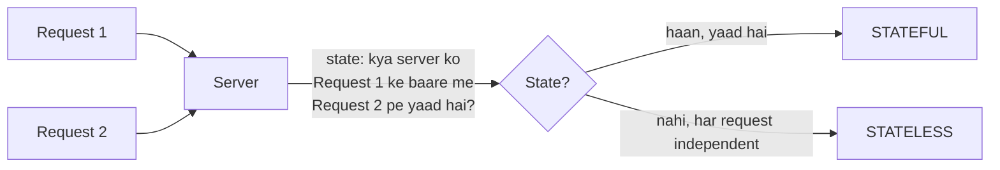

**Do fundamental sawaal:**
- Kya server ko **previous requests** yaad hain? (session, context)
- Agar wahi user next request kisi **doosre server** ko bheje, to kaam karega?

Iska jawab hi decide karta stateless vs stateful.

---

## 2. Stateless Architecture — deep

### Kya hai
Ek **stateless** service **requests ke beech koi state memory me nahi rakhta**. Har request
**self-contained** (poori information request me — ya external store se). Server request handle
karta, respond karta, aur **bhool jaata** (kuch remember nahi). Do requests ek doosre se independent.

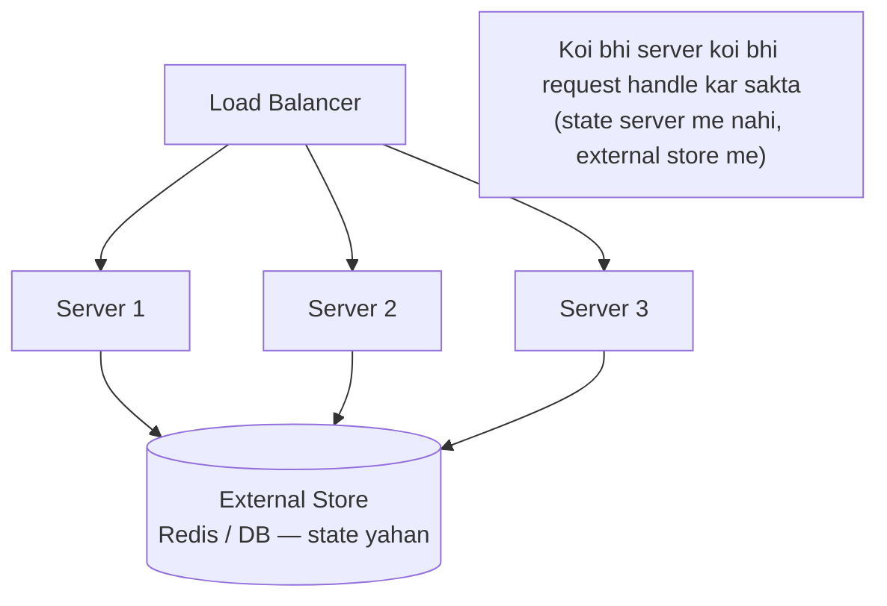

### Kaise kaam karta
Har request me **saara zaroori context** hota (ya external store se milta):
- Client **JWT token** bhejta (usme user identity + claims) — server verify karke process karta,
  session lookup nahi.
- Ya server **Redis/DB** se session/state fetch karta (server memory me nahi).
- Server request process karke response deta, **kuch retain nahi** karta.

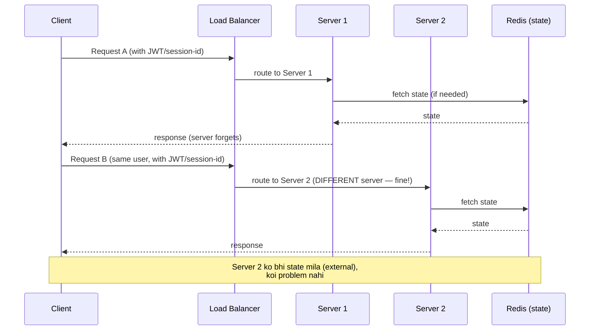

### Characteristics
- No session data in server memory.
- Har request independent + self-contained.
- Any server can handle any request (identical, interchangeable).
- State external (client token, Redis, DB).

### ✅ Stateless — Advantages
1. **Horizontal scaling easy** ⭐ — koi bhi server koi bhi request handle kar sakta → servers freely
   add/remove. Load balancer koi bhi algorithm (no sticky sessions). **Ye sabse bada fayda.**
2. **High availability / fault tolerance** — ek server crash → koi state loss nahi (external hai) →
   baaki servers seamlessly handle. User ko pata bhi nahi chalta.
3. **Simple load balancing** — no session affinity needed (any request to any server).
4. **Easy deployment** — rolling updates, blue-green, autoscaling — sab simple (servers
   interchangeable, no state migration).
5. **Resilient** — server restart/replace = no impact (nothing to lose).
6. **Predictable** — each request isolated (no hidden state → fewer bugs).

### ❌ Stateless — Disadvantages
1. **External store dependency** — state Redis/DB me → har request pe network hop (latency) +
   external store scale/HA karna padta.
2. **Repeated data transfer** — har request me context (token/session-id) bhejna padta (slight
   overhead).
3. **Token size** — JWT me zyada claims → bigger tokens (bandwidth).
4. **Not natural for some workloads** — real-time (WebSocket connections inherently stateful),
   large in-memory computations.

---

## 3. Stateful Architecture — deep

### Kya hai
Ek **stateful** service **client ka state server memory me rakhta** hai (session, context) requests
ke beech. Server ko previous requests **yaad** rehte. Isliye wahi user ke requests **usi server**
pe jaane chahiye (jaha uska state hai).

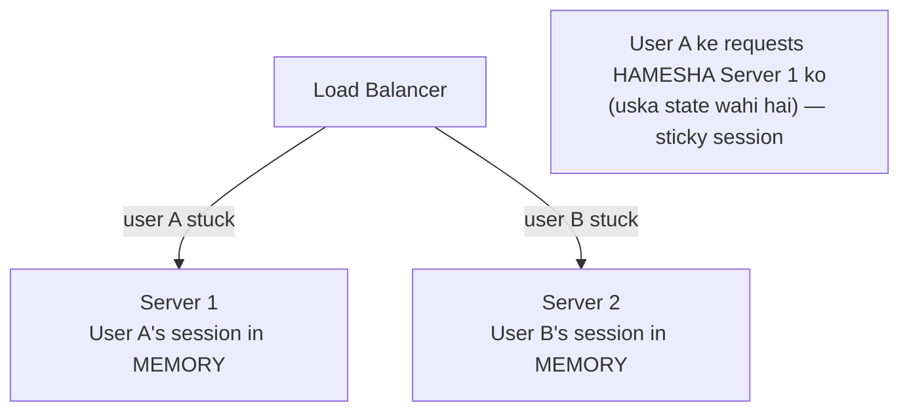

### Kaise kaam karta
- User pehli baar aata → Server 1 uska session **memory me** banata (cart, login, context).
- User ke **saare next requests Server 1 ko** jaane chahiye (sticky session) — kyunki state wahi hai.
- Server 1 memory se state read karke process karta (fast — no external lookup).

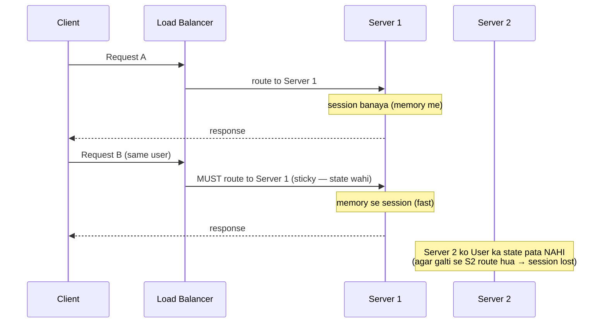

### Characteristics
- Session/state in server memory.
- Requests context pe depend (previous requests yaad).
- Specific server needed (sticky sessions).
- Fast local access (no external lookup).

### ✅ Stateful — Advantages
1. **Fast local access** — state memory me (no external network hop) → low latency.
2. **Natural for certain workloads** — real-time connections (WebSocket, gaming sessions, video
   calls), long-running computations, transactional sessions.
3. **Rich session context** — complex in-memory state easily maintained.
4. **Less external infra** — no separate state store (initially simpler).

### ❌ Stateful — Disadvantages
1. **Horizontal scaling HARD** ⭐ — user ko specific server chahiye (sticky) → servers freely
   add/remove nahi kar sakte, load uneven. **Ye biggest problem.**
2. **Server failure = state loss** — server crash → us server pe saare users ka in-memory state
   **gone** (cart lost, logout, disconnection). No fault tolerance.
3. **Sticky sessions complexity** — load balancer ko session affinity maintain karni padti
   (cookie/IP hash) → uneven load, scaling issues.
4. **Deployment mushkil** — server update/restart → active sessions lost (ya complex state migration).
   Rolling deploys tricky.
5. **Uneven load** — kuch servers pe zyada active sessions (hotspot), naye servers underutilized
   (existing users unhe nahi jaate).
6. **Autoscaling ineffective** — naye servers add karo, existing users unhe route nahi hote (state
   purane servers pe).

---

## 4. Stateless vs Stateful — comparison

| Factor | **Stateless** | **Stateful** |
|---|---|---|
| State location | external (client/Redis/DB) | server memory |
| Request handling | any server (interchangeable) | specific server (sticky) |
| Horizontal scaling | **easy** (add/remove freely) | **hard** (sticky, uneven) |
| Load balancing | simple (any algorithm) | sticky sessions needed |
| Server failure | no state loss (seamless) | **state loss** (session gone) |
| Fault tolerance | high | low |
| Deployment | easy (rolling/blue-green/autoscale) | hard (session migration) |
| Latency | +external store hop | fast (local memory) |
| Autoscaling | effective | ineffective (existing users stuck) |
| Complexity | external store to manage | sticky + failure handling |
| Best for | web APIs, microservices, REST | WebSocket, gaming, real-time sessions |

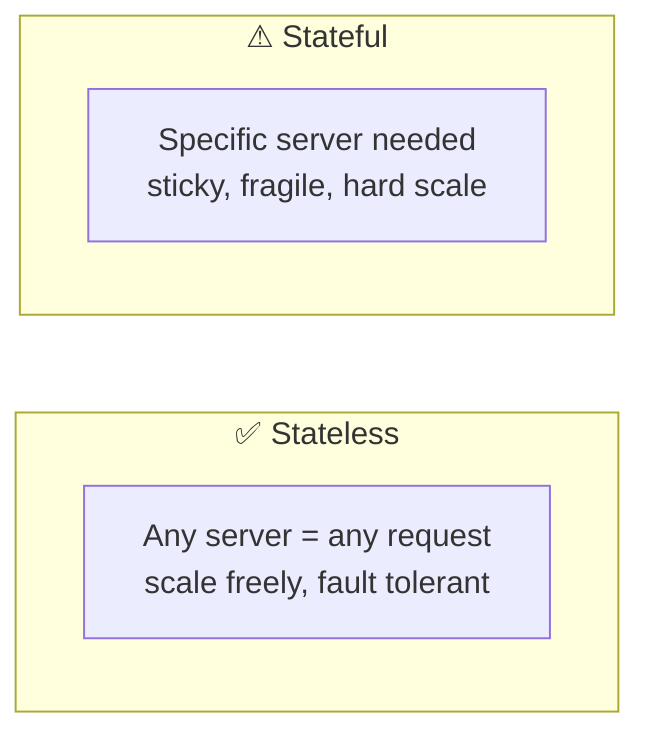

> ⭐ **Golden rule:** "**Make services stateless, push state to external stores.**" Ye horizontal
> scaling, HA, aur simple deployment — sab enable karta. Modern cloud-native architecture stateless
> hai.

---

## 5. Scaling Implications — why stateless wins

Ye sabse important connection hai — **stateless = horizontal scaling ki precondition**.

### Stateless — horizontal scaling seamless
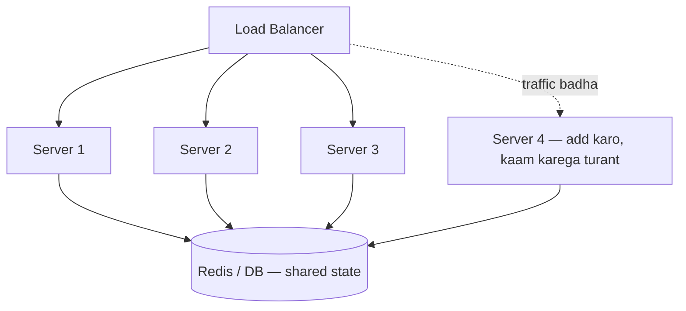
Naya server add → LB use karna shuru → **turant productive** (state external, no migration). Traffic
kam → server remove → no impact. **Elastic.**

### Stateful — horizontal scaling struggles
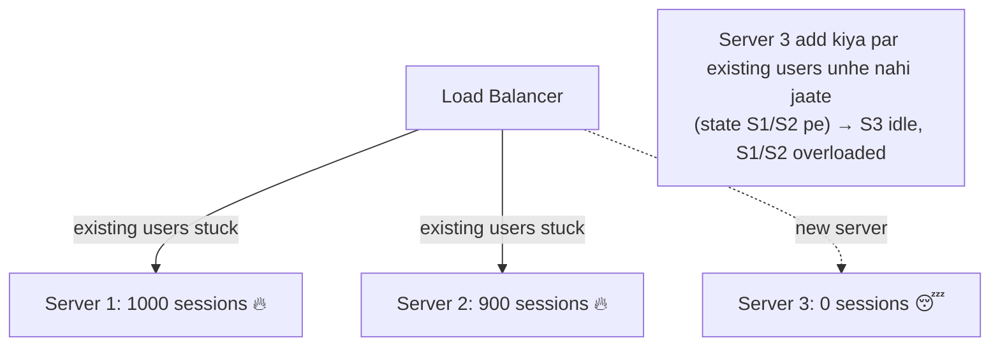
Naya server add → existing users unhe route nahi hote (unka state purane servers pe) → naya server
**idle**, purane overloaded. Autoscaling **ineffective**.

> ⭐ **Isliye:** cloud-native systems (Kubernetes, autoscaling, microservices) **stateless** design
> pe based hain. State ko external stores (Redis, DB, S3) me push karke services stateless banate,
> phir freely scale karte.

---

## 6. Sticky Sessions (stateful ka band-aid)

Agar service stateful ho, to load balancer ko ensure karna padta ki **same user → same server**
(jaha state hai). Isko **sticky sessions / session affinity** kehte.

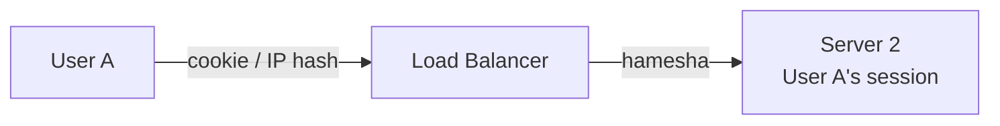

**Kaise:**
- **Cookie-based** — LB ek cookie set karta (server ID), same cookie → same server.
- **IP hash** — `hash(client IP)` → server (same IP → same server).

**Problems (isliye avoid):**
- **Uneven load** — kuch servers zyada sessions (hotspot).
- **Server failure = session loss** — sticky server mare → us user ke saare requests fail (session gone).
- **Scaling ineffective** — naye servers ko existing users nahi jaate.
- **Autoscaling breaks** — scale-in me active sessions wale server nahi hata sakte.

> ⭐ **Sticky sessions = stateful ka workaround, not a real solution.** Better: **stateless + external
> session store** (Redis) → koi bhi server, no stickiness needed, robust.

---

## 7. Stateful ko Stateless kaise banayein

State ko server memory se **external** move karo. Ye "externalize state" pattern hai:

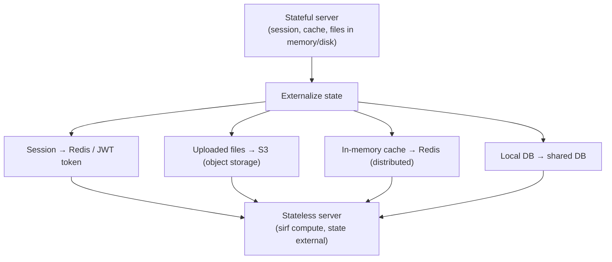

**Techniques:**
1. **Sessions → external store** — user session Redis/DB me (server memory nahi). Server session-id
   se lookup karta. Koi bhi server access kar sakta.
2. **JWT tokens** — session state **client** ke paas (token me claims: user id, role, expiry). Server
   token verify karke process karta (server-side session hi nahi). Fully stateless auth.
3. **Uploaded files → S3/object storage** — local disk (server-specific) nahi. Koi bhi server access.
4. **In-memory cache → distributed cache** — Redis (shared across servers).
5. **WebSocket state → connection registry** — Redis me "userId → server" mapping (routing).

**Example — login/session:**
```
BEFORE (stateful): user login → session server memory me → sticky server needed
AFTER (stateless): user login → JWT token (client) ya session in Redis
                   → koi bhi server token verify / Redis lookup → any server works
```

---

## 8. State kahan rakhein

Stateless banate waqt, state **teen jagah** ja sakta:

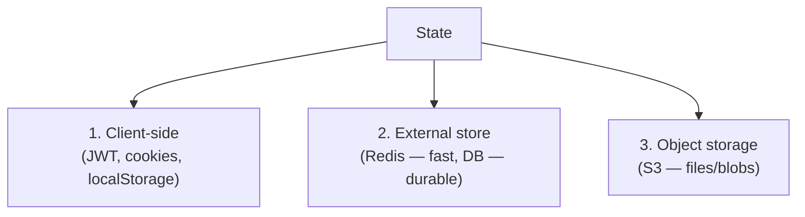

| Location | Kya | Pros | Cons |
|---|---|---|---|
| **Client (JWT/cookie)** | session claims, tokens | no server lookup, fully stateless | size limits, can't revoke easily, security (token theft) |
| **Redis (external)** | session, cache | fast (sub-ms), shared | network hop, Redis HA needed |
| **Database** | durable state | persistent, queryable | slower than Redis |
| **S3 / object storage** | files, blobs | cheap, scalable | latency (not for hot small data) |

- **JWT (client)** — auth/session (server-side session eliminate). Trade-off: revocation mushkil
  (token valid till expiry).
- **Redis (external)** — session store, cache (fast, shared). Most common for server-side sessions.
- **DB** — durable state (orders, user data).
- **S3** — uploaded files (never local disk in stateless design).

---

## 9. Session Management Strategies

Auth/session ke liye do main approaches (state kaha rehta):

### Session-based (server-side / external)
Server (ya Redis) session store rakhta. Client ke paas sirf **session ID** (cookie). Server ID se
session lookup.
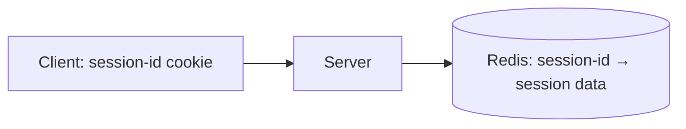
- ✅ Easy revocation (delete session), server controls.
- ❌ Server-side store needed (Redis), lookup per request.
- **Stateless kaise:** session store **external** (Redis) → any server lookup. (Server memory me
  session = stateful; Redis me = stateless-compatible.)

### Token-based (JWT — client-side)
Session state **token** me (client ke paas). `header.payload.signature`. Payload me claims (user id,
role, expiry). Server signature verify karke process — **no store lookup**.
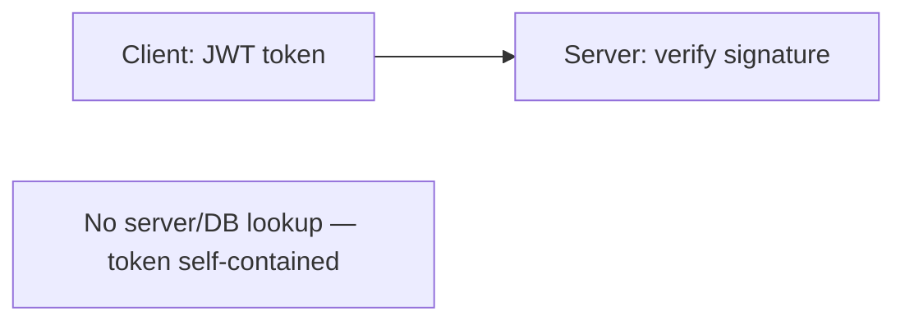
- ✅ **Fully stateless** (no store), scale-friendly, works across services.
- ❌ Revocation mushkil (valid till expiry — blacklist ya short expiry + refresh tokens), bigger.

| | Session-based | Token (JWT) |
|---|---|---|
| State | server/Redis store | client (token) |
| Lookup | per request (store) | none (verify) |
| Revocation | easy (delete) | hard (blacklist/expiry) |
| Scaling | needs shared store | fully stateless |
| Use | traditional web | APIs, microservices, mobile |

[Detail: `14_SSL_Certificate.md` (tokens), `HLD_Interview.md` auth section]

---

## 10. Kuch cheezein STATEFUL honi hi padti hain

Sab kuch stateless nahi ho sakta — kuch systems **inherently stateful** hain (aur hone chahiye):

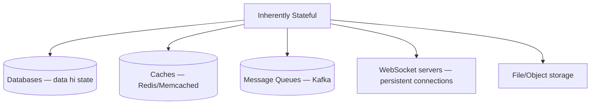

- **Databases** — data hi state hai (PostgreSQL, MongoDB). Inhe carefully scale (replication,
  sharding).
- **Caches** — Redis/Memcached (state = cached data).
- **Message queues** — Kafka (messages, offsets = state).
- **WebSocket / real-time servers** — persistent connections (chat, gaming) — connection state
  inherently on server. Handle: connection registry (Redis) for routing, sticky by connection.
- **Stateful stream processing** — Flink (windowed aggregations state).

> ⭐ **Pattern:** **application/compute services stateless** rakho, **state ko dedicated stateful
> systems** (DB, cache, queue) me push karo. Stateful systems specially designed hote (replication,
> persistence, failover) — apne app servers me state mat rakho.

**Stateful services scaling:** databases (replication + sharding), caches (Redis Cluster), Kafka
(partitions replicated), WebSocket servers (connection registry + sticky by connection). Ye
carefully engineered hote.

---

## 11. Real-world examples

### Stateless
- **REST APIs** — har request self-contained (auth token), stateless. Most microservices.
- **Serverless (AWS Lambda)** — functions stateless (no memory between invocations), state external.
- **CDN edge servers** — stateless content serving.
- **Static web servers** — no session (Nginx serving files).

### Stateful
- **Databases** — PostgreSQL, MongoDB (data = state).
- **Redis / caches** — cached data.
- **Kafka** — messages + consumer offsets.
- **WebSocket servers** — chat (WhatsApp), gaming, collaborative editing (Google Docs) — connection
  state.
- **Video call servers** (Zoom SFU) — media session state.

### Hybrid (common real architecture)
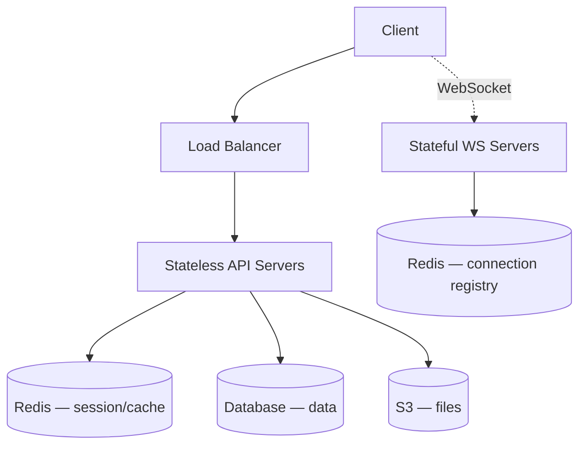
Compute (API servers) **stateless**, state dedicated **stateful stores** (Redis/DB/S3) me. WebSocket
servers stateful (connections) but connection registry (Redis) se routing.

---

## 12. Decision Framework

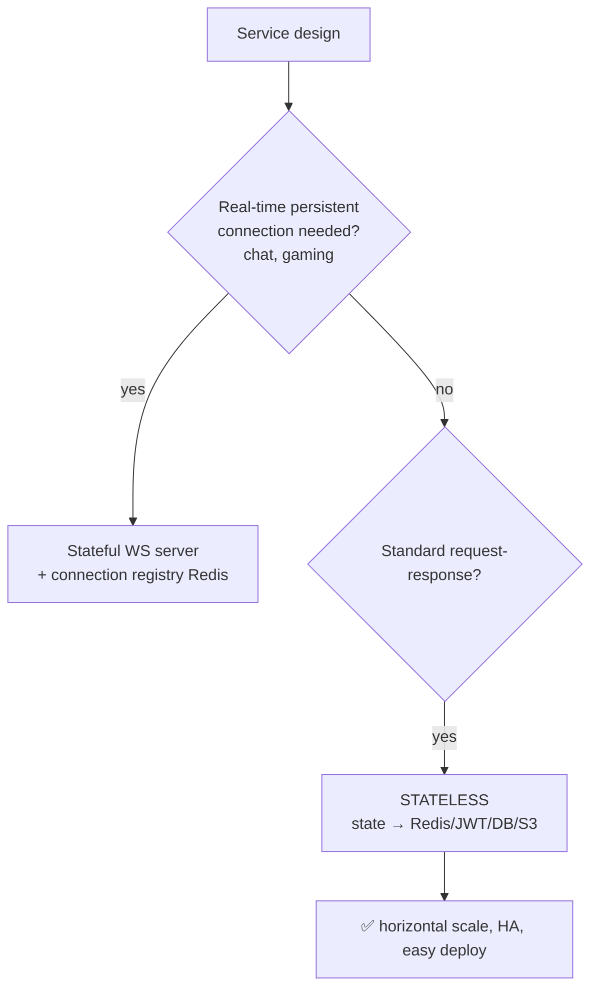

**Guidelines:**
1. **Default: stateless** — services stateless banao, state external (Redis/DB/JWT/S3).
2. **Stateful only when necessary** — persistent connections (WebSocket), large in-memory
   computations. Aur tab bhi state ko manage-able rakho (connection registry).
3. **Never store critical state in app server memory** — server crash = loss. External stores use.
4. **Databases/caches/queues = purpose-built stateful** — inhe use karo, apne app me state mat rakho.

---

## 13. Interview Q&A

**Q: Stateless vs stateful architecture?**
Stateless — server requests ke beech koi state nahi rakhta (state external — Redis/JWT/DB), any
server any request. Stateful — server client state memory me rakhta, specific server needed (sticky).
Stateless enables horizontal scaling + HA.

**Q: Stateless kyun prefer karte?**
Horizontal scaling easy (any server any request — add/remove freely), fault tolerance (server crash =
no state loss), simple load balancing (no sticky), easy deployment (rolling/autoscale). Modern
cloud-native = stateless.

**Q: Stateful app ko stateless kaise banayein?**
State externalize karo — sessions → Redis/JWT, files → S3, in-memory cache → distributed Redis, local
data → shared DB. Server sirf compute kare, state external store me.

**Q: Sticky sessions kya, kyun avoid?**
Same user → same server (jaha state hai) — cookie/IP hash. Avoid: uneven load, server death = session
loss, scaling ineffective (new servers idle), autoscaling breaks. Better: stateless + Redis session.

**Q: JWT vs session-based auth (stateless context)?**
JWT — state client ke paas (token, self-contained), no server lookup, fully stateless, hard to
revoke. Session-based — server/Redis store, session-id lookup, easy revoke, needs shared store for
statelessness.

**Q: Kya sab kuch stateless ho sakta?**
Nahi — databases, caches, message queues, WebSocket servers inherently stateful. Pattern: compute
services stateless, state dedicated stateful systems (DB/cache/queue) me. Purpose-built stateful
systems.

**Q: WebSocket servers stateless kaise scale?**
Inherently stateful (persistent connections). Connection registry (Redis: userId → server) se routing,
sticky by connection. Message sends registry lookup karke sahi server ko route.

**Q: Stateless me latency concern?**
State external (Redis) → network hop per request. Mitigate: Redis near app (fast, sub-ms), local L1
cache for hot data, JWT (no lookup for auth). Trade-off worth it for scalability.

---

## 14. Summary

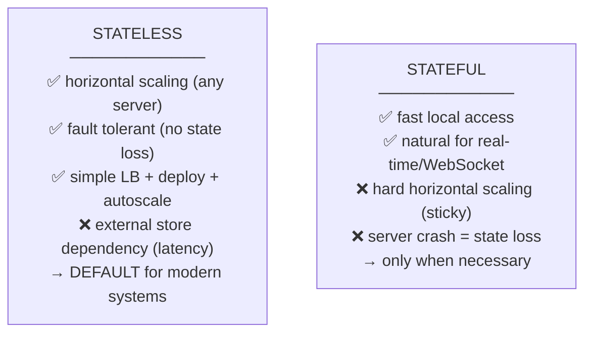

**Key takeaways:**
- **State** = data remembered between requests (session, cart, connections).
- **Stateless** — no server-memory state (external: Redis/JWT/DB/S3). Any server handles any request.
  **Enables horizontal scaling, HA, easy deployment. DEFAULT choice.**
- **Stateful** — state in server memory. Specific server (sticky). Fast local, but hard to scale,
  fragile (crash = loss). Only when necessary (WebSocket/real-time).
- **Golden rule:** "Make services stateless, push state to external stores."
- **Sticky sessions** = stateful band-aid (avoid — uneven load, fragile). Better: stateless + Redis.
- **Externalize state** — sessions → Redis/JWT, files → S3, cache → Redis.
- **Session mgmt** — JWT (client, fully stateless) vs session-store (Redis, easy revoke).
- **Inherently stateful** — DBs, caches, queues, WebSocket servers (purpose-built, don't put app
  state in app servers).
- **Hybrid reality** — stateless compute + stateful stores (DB/Redis/S3) + stateful WS (connection
  registry).

> Related: [`06_Scaling_Vertical_and_Horizontal.md`](./06_Scaling_Vertical_and_Horizontal.md) ·
> [`07_Scale_Application_0_to_Million.md`](./07_Scale_Application_0_to_Million.md) ·
> [`08_Caching_and_Distributed_Caching.md`](./08_Caching_and_Distributed_Caching.md) ·
> [`03_Load_Balancer_Types_and_Algorithms.md`](./03_Load_Balancer_Types_and_Algorithms.md) (sticky sessions)
