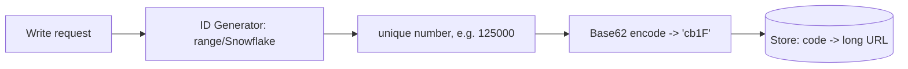
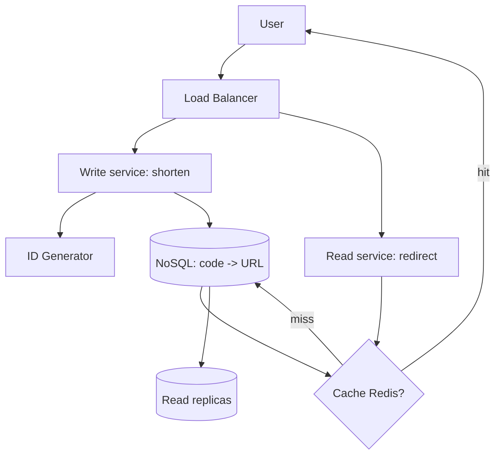
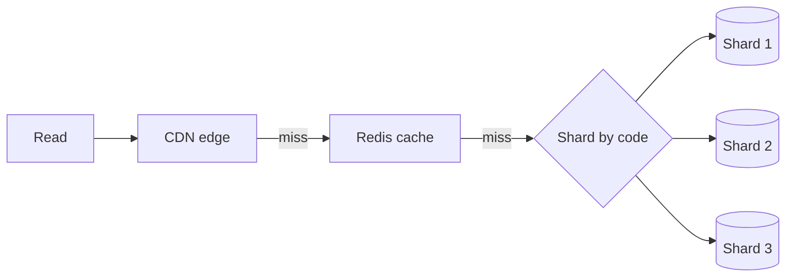

# 🔗 Design TinyURL / URL Shortener

> **Problem:** Ek lambi URL (`https://example.com/very/long/path?q=123`) ko ek chhoti URL
> (`https://tiny.co/aB3xY`) me badlo. Chhoti URL pe click → original pe redirect. Ye classic
> "warm-up" system design question hai — hashing, cache, DB, read-heavy scaling sab isme aata hai.

---

## 1. Requirements

### Functional
- **Shorten:** long URL → short URL.
- **Redirect:** short URL → original long URL (HTTP redirect).
- **Custom alias** (optional): user apna code de (`tiny.co/mybrand`).
- **Expiry** (optional): URL ki TTL.

### Non-Functional
- **High availability** — redirect service kabhi down na ho (down = saare links toot gaye).
- **Low latency** — redirect real-time (<100ms).
- **Scalable** — billions of URLs.
- **Not easily guessable** (thoda) — sequential predictable na ho (privacy).

---

## 2. Capacity Estimation (back-of-envelope)

Maano **100M new URLs/day**, read:write = **100:1** (log padho: [Back-of-Envelope](../20_Back_of_the_Envelope_Calculations.md)).

| Metric | Calculation | Value |
|---|---|---|
| Write QPS | 100M / 86400 | ~1,160/s |
| Read QPS | 100:1 | ~116,000/s ← **read-heavy!** |
| Storage/URL | ~500 bytes | |
| Storage 5 saal | 100M × 365 × 5 × 500B | ~**91 TB** |
| Short codes needed | 100M/day × 5yr | ~182B → 7 chars kaafi |

> **Key insight:** system **read-heavy** hai → cache + read replicas pe focus.

---

## 3. Short code kaise generate karein? (⭐ core design)

Short code = `[a-z A-Z 0-9]` = **62 characters** (Base62).

| Length | Combinations (62^n) |
|---|---|
| 6 chars | ~56 billion |
| 7 chars | ~3.5 trillion |

**7 chars** kaafi hai billions ke liye. Ab code generate karne ke 3 approaches:

### Approach A: Hash (MD5/SHA) + truncate ❌
Long URL ka hash lo, pehle 7 chars. **Problem:** collisions (do URL same code), same URL different code. Collision pe retry — mehnga at scale.

### Approach B: Counter + Base62 encode ✅ (best)
Ek global auto-increment counter (1, 2, 3...) → Base62 me encode karo.
```
counter 125 -> Base62 -> "cb"
counter 1000000 -> Base62 -> "4c92"
```
- ✅ **No collisions** (har counter unique), short, sequential-ish.
- ❌ **Predictable** (agla code guess ho sakta) + **counter ek SPOF/bottleneck**.

**Fix counter bottleneck:** ek single counter sab writes handle nahi kar sakta. Use **distributed
counter / ID generator**:
- **Zookeeper/DB ranges:** har app server ek **range** (1–1000, 1001–2000...) le le, apne range me
  locally allot kare → koi coordination nahi per-request.
- **Twitter Snowflake:** 64-bit unique ID (timestamp + machine-id + sequence) → distributed, roughly-sorted, no central counter.



### Approach C: Pre-generated keys (KGS)
Ek **Key Generation Service** pehle se billions unique codes bana ke rakhta; write pe ek utha lo (mark used). Fast, no collision, no per-request compute.

> **Interview answer:** "Counter + Base62 via distributed ID generator (Snowflake / DB ranges) — collision-free aur scalable. Predictability chahiye kam to thoda randomize."

---

## 4. API Design

```
POST /api/shorten
  body: { "long_url": "...", "custom_alias": "?", "expiry": "?" }
  -> 201 { "short_url": "https://tiny.co/aB3xY" }

GET /{short_code}
  -> 301/302 redirect to long_url
```

> **301 vs 302:** **301 (permanent)** browser cache karta → repeat clicks server tak nahi aate (kam
> load, par analytics miss + change nahi kar sakte). **302 (temporary)** har click server pe aata
> (analytics + control, par zyada load). Analytics chahiye → **302**.

---

## 5. Data Model

Simple key-value — **NoSQL** perfect (no joins, high read, simple lookup). Dekho [SQL vs NoSQL](../SQL_vs_NoSQL.md).

```
short_code (PK)  | long_url         | user_id | created_at | expiry
"aB3xY"          | "https://..."    | u42     | ...        | ...
```

---

## 6. High-Level Architecture



**Flow:**
- **Shorten (write):** ID generator se unique number → Base62 → DB me store → short URL return.
- **Redirect (read):** cache dekho (Redis) → hit to turant redirect; miss to DB → cache me daalo → redirect.

---

## 7. Deep Dive — Scaling the reads (116K QPS!)

- **Cache (Redis)** — 80/20 rule: kuch URLs bahut popular (viral links). Cache-aside, LRU eviction.
  Isse zyada tar reads DB tak jaate hi nahi. Dekho [Caching](../08_Caching_and_Distributed_Caching.md).
- **Read replicas** — DB reads ko replicas pe baanto ([Replication](../Database_Replication.md)).
- **CDN** — redirect ko edge pe bhi cache kar sakte (popular links).
- **Sharding** — 91 TB ek DB me nahi → shard **by short_code** (hash/range). Dekho [Sharding](../21_Database_Sharding.md).



---

## 8. Bottlenecks & Solutions

| Bottleneck | Solution |
|---|---|
| Counter/ID SPOF | Distributed ID (Snowflake / DB ranges / KGS) |
| Read-heavy (116K QPS) | Redis cache + read replicas + CDN |
| Storage (91 TB) | Sharding by short_code |
| Hot links (viral) | Cache + CDN absorb karta |
| DB down | Replicas + failover ([Avoid SPOF](../17_Avoid_Single_Point_of_Failure.md)) |

---

## 9. Interview Talking Points
- **Read-heavy** system → cache + replicas ki baat zaroor karo.
- **Base62 + distributed counter** = collision-free, scalable (hash+retry se better).
- **301 vs 302** trade-off (analytics vs load).
- **NoSQL** kyun (simple KV, no joins, horizontal scale).
- **Analytics** extension: har click event → Kafka → analytics pipeline ([Big Data](../Advanced_Topics/05_Big_Data_and_Stream_Processing.md)).

---

## Summary
- Read-heavy KV system; **Base62(counter)** via distributed ID generator (Snowflake/ranges/KGS) = collision-free codes.
- **NoSQL** store (code→URL), **sharded by code**; **Redis cache + read replicas + CDN** reads sambhalte.
- **302 redirect** for analytics; availability critical (redirect down = sab links dead).

> **Related:** [Caching](../08_Caching_and_Distributed_Caching.md) · [Sharding](../21_Database_Sharding.md) · [SQL vs NoSQL](../SQL_vs_NoSQL.md) · [Consistent Hashing](../19_Consistent_Hashing.md) · [Back-of-Envelope](../20_Back_of_the_Envelope_Calculations.md)
