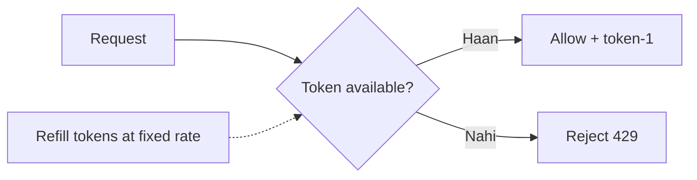
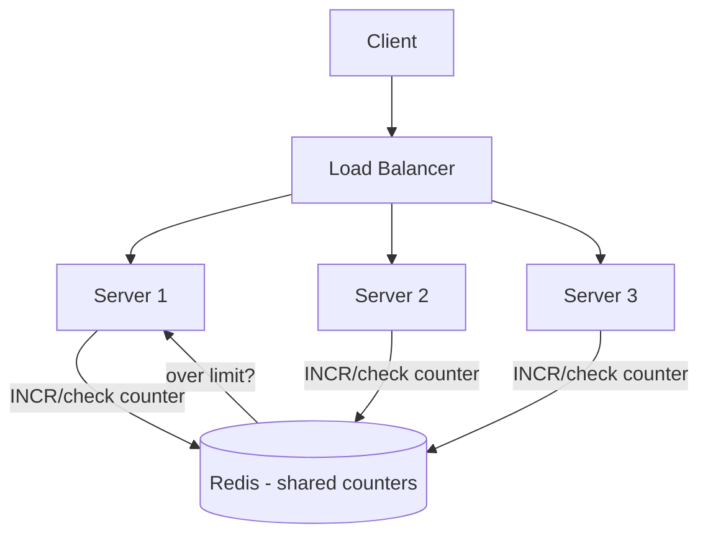
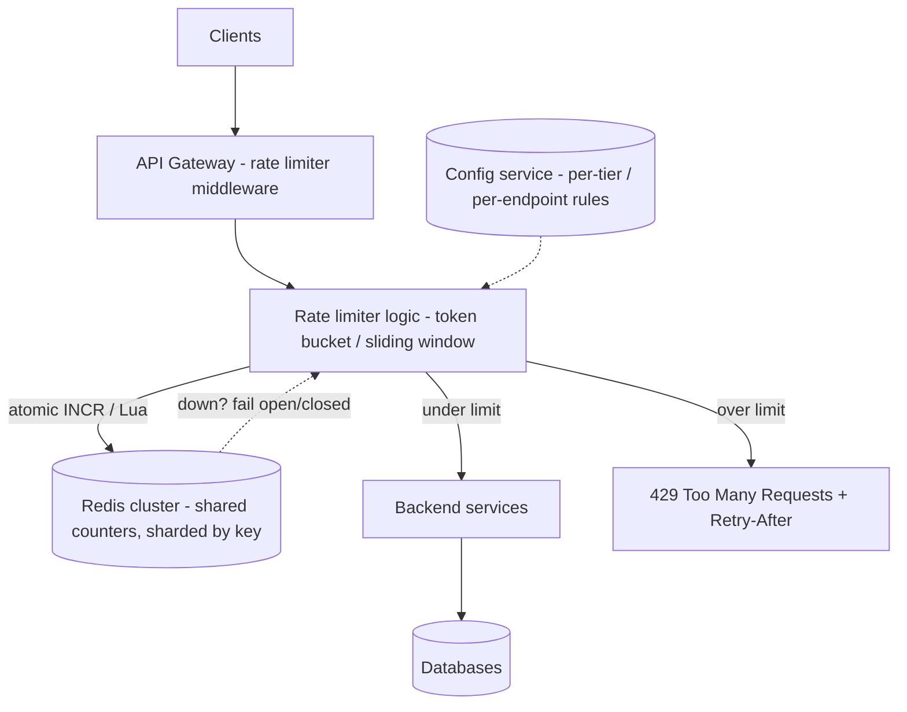

# 🚦 Design a Distributed Rate Limiter

> **Problem:** Ek service ko abuse/overload se bachao — har client (user/IP/API-key) ko ek limit ke
> andar rakho (jaise "100 requests/min"). Limit paar → **429 Too Many Requests**. Challenge:
> **distributed** environment me (kai servers) ye limit **accurately** aur **fast** enforce karna.

---

## 1. Requirements

### Functional
- Per-client limit (jaise 100 req/min per user/IP/API-key).
- Limit paar → reject (429) + headers (`Retry-After`, remaining).
- Different limits per tier (free vs premium) / per endpoint.

### Non-Functional
- **Low latency** — rate check har request pe (fast, <few ms).
- **Distributed accuracy** — kai servers ho to bhi global limit sahi.
- **Highly available** — rate limiter down → service crash na ho (fail open/closed decision).
- **Scalable** — millions of clients.

> Concepts ke liye: [Rate Limiting & Algorithms](../12_Rate_Limiting_and_Algorithms.md), [Part 2 (Distributed)](../13_Rate_Limiting_Part_2.md), [Strategies](../15_Rate_Limiting_Strategies.md).

---

## 2. ⭐ Algorithm chuno

| Algorithm | Kaise | Pros / Cons |
|---|---|---|
| **Token Bucket** | Bucket me tokens (rate se refill); request = 1 token; khaali → reject | ✅ Bursts allow, smooth, memory-light. **Most popular** |
| **Leaky Bucket** | Requests queue; fixed rate se process (leak) | ✅ Smooth output rate; ❌ bursts nahi |
| **Fixed Window** | Har window (jaise 1 min) me counter | ✅ Simple; ❌ **boundary spike** (window edge pe 2x) |
| **Sliding Window Log** | Har request ka timestamp store, window me count | ✅ Accurate; ❌ memory heavy |
| **Sliding Window Counter** | Fixed window + previous window weighted | ✅ Accurate-ish + light. **Best balance** |



> **Interview default:** **Token bucket** (bursts + simple) ya **sliding window counter** (accuracy + light).

---

## 3. ⭐ Distributed challenge — shared state

Kai app servers → har server ka **apna** counter = client 100 servers pe 100×limit maar sakta. **Global
counter chahiye** → **Redis** (shared, fast, in-memory).



### Race condition — atomicity zaroori
Do requests ek saath: dono read count=99, dono allow → 101 (limit break). **Fix:** atomic operation.
- **Redis `INCR`** atomic hai (increment + return in one op).
- **Complex logic** (token bucket refill + check) → **Lua script** (Redis Lua atomic execute). Ek round-trip, race-free. Dekho [Rate Limiting Part 2](../13_Rate_Limiting_Part_2.md).

```lua
-- atomic: check + increment (simplified)
local count = redis.call('INCR', key)
if count == 1 then redis.call('EXPIRE', key, window) end
if count > limit then return 0 else return 1 end
```

---

## 4. Where to place the rate limiter?


- **API Gateway** (best) — centralized, backend se pehle reject (backend load bachta). Dekho [API Gateway](../02_API_Gateway_and_Load_Balancer.md).
- **Middleware** in each service (fine-grained per-endpoint).
- **Sidecar** (service mesh) — infra level.

---

## 4.5 🏛️ Main HLD Architecture (poora system)



**Flow:** request → gateway → rate limiter check (atomic counter in Redis, keyed by user/IP/API-key) →
under limit to backend, over limit to **429**. Config service tiers/limits deta; Redis cluster shared
state (sharded, replicated); Redis down pe fail open/closed decision.

---

## 5. API / Response
```
HTTP 429 Too Many Requests
Retry-After: 30
X-RateLimit-Limit: 100
X-RateLimit-Remaining: 0
X-RateLimit-Reset: 1690000000
```
> Client ko batao kab retry kare (`Retry-After`) — accha API citizen.

---

## 6. Deep Dive

### Redis latency & scale
- Redis in-memory → sub-ms. Ek Redis bottleneck? → **shard by client key** (consistent hashing) or Redis Cluster.
- **Local cache + async sync:** ultra-low latency ke liye har server local approximate count rakhe, periodically Redis se sync (thodi accuracy trade). "Approximate" rate limiting.

### Fail open vs fail closed
Redis down → kya karein?
- **Fail open:** allow all (availability > strict limiting) — service chalti rahe.
- **Fail closed:** reject all (security-critical, jaise login) — abuse na ho.
- Choice depends on use case. Dekho [Resilience](../Advanced_Topics/07_Resilience_and_Fault_Tolerance.md).

### Tiers & rules
- Free: 100/min, Premium: 10K/min → limit config per tier (config service).
- Per-endpoint (expensive endpoint tighter).

---

## 7. Bottlenecks & Solutions

| Bottleneck | Solution |
|---|---|
| Per-server counters inaccurate | Shared Redis counter |
| Race conditions | Atomic INCR / Lua script |
| Redis single bottleneck | Shard / Redis Cluster |
| Redis latency on hot path | Local approximate + async sync |
| Redis down | Fail open/closed decision |
| Window boundary spike | Sliding window counter |

---

## 8. Interview Talking Points
- **Algorithm:** token bucket (bursts) or sliding window counter (accuracy) — trade-off bolo.
- **Distributed = shared Redis** counter; **atomicity** (INCR/Lua) for race conditions — ye zaroor.
- **Placement:** API Gateway (reject early).
- **Fail open vs closed** on Redis outage.
- **429 + Retry-After** headers; per-tier/per-endpoint rules.

---

## Summary
- **Token bucket** (bursts) / **sliding window counter** (accurate+light) = go-to algorithms.
- **Distributed accuracy** → shared **Redis** counter; **atomic INCR/Lua** kills race conditions.
- Place at **API Gateway** (reject before backend); return **429 + Retry-After / limit headers**.
- Scale Redis (shard/cluster); **fail open vs closed** on outage; per-tier/per-endpoint rules.

> **Related:** [Rate Limiting Algorithms](../12_Rate_Limiting_and_Algorithms.md) · [Rate Limiting Part 2](../13_Rate_Limiting_Part_2.md) · [Rate Limiting Strategies](../15_Rate_Limiting_Strategies.md) · [API Gateway](../02_API_Gateway_and_Load_Balancer.md) · [Caching (Redis)](../08_Caching_and_Distributed_Caching.md)
