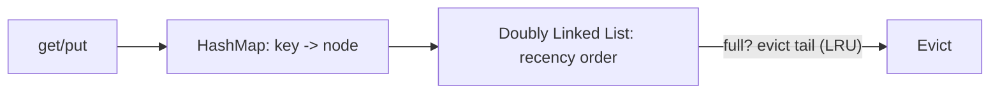
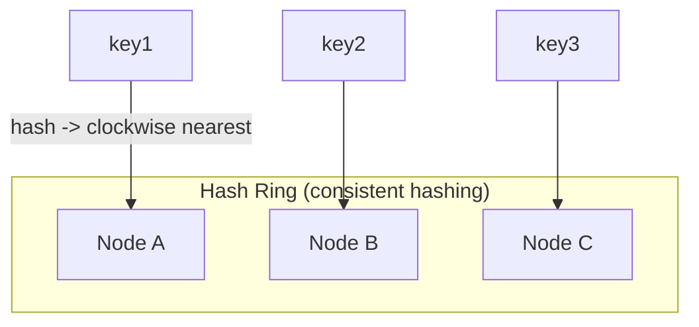
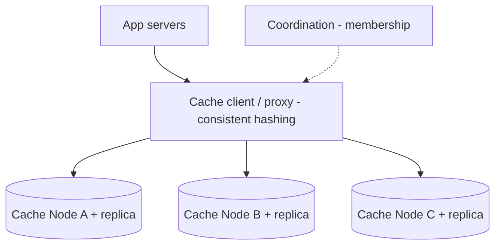

# ⚡ Design a Distributed Cache (like Redis / Memcached)

> **Problem:** Ek in-memory cache banao jo **ek machine ki RAM se bada** ho — data ko kai nodes pe
> baant ke store kare, fast reads/writes de (sub-ms), aur nodes add/remove hone par gracefully handle
> kare. Ye design **consistent hashing**, **eviction**, aur **replication** ka best example hai.

---

## 1. Requirements

### Functional
- `get(key)`, `put(key, value)`, `delete(key)`.
- **TTL** (expiry) support.
- **Eviction** jab memory full ho.

### Non-Functional
- **Ultra-low latency** (<1ms) — in-memory.
- **Scalable** — data > single machine RAM → distributed.
- **High availability** — node fail ho to cache poora down na ho.
- **High throughput** (millions ops/s).

---

## 2. Why cache? (recap)
DB slow (disk), cache fast (RAM). Read-heavy systems me cache 90%+ reads absorb karta → DB load ⬇️,
latency ⬇️. Dekho [Caching & Distributed Caching](../08_Caching_and_Distributed_Caching.md).

---

## 3. Single node cache (building block)

Ek node = **hash table (O(1) get/put)** + **eviction policy** + **TTL**.

### Eviction policies (memory full → kya nikaalo)
| Policy | Kya nikaalta |
|---|---|
| **LRU** (Least Recently Used) | Sabse purana use hua — **most common** |
| **LFU** (Least Frequently Used) | Sabse kam baar use hua |
| **FIFO** | Sabse pehle aaya |
| **Random** | Koi bhi |

> **LRU** implementation = HashMap + Doubly Linked List (O(1) get/put/evict). Tune LLD me ye bana hai
> ([LRU Cache LLD](../../LLD/LRU_Cache_LLD/), [LFU Cache LLD](../../LLD/LFU_Cache_LLD/)) — LLD↔HLD connection!

---

## 4. ⭐ Core — Distributing across nodes (Consistent Hashing)

Data > 1 machine RAM → **shard** across nodes. Kaunsi key kaunse node pe? Naive `hash(key) % N` ka
problem: **node add/remove pe** N badalta → **saari keys remap** (cache stampede). **Consistent
hashing** ise solve karta. Dekho [Consistent Hashing](../19_Consistent_Hashing.md).

- Nodes + keys ko ek **ring** pe hash karo; key clockwise nearest node pe.
- **Node add/remove** → sirf **padosi keys** remap (1/N), baaki untouched. ← ye jeet hai.
- **Virtual nodes** → load even distribution + smooth rebalance.

### Client routing
Client kaunse node pe jaaye?
- **Client-side:** client ring jaanta, direct node pe (ek hop). (Redis Cluster smart clients.)
- **Proxy:** ek proxy route kare (jaise Twemproxy). Client simple, ek extra hop.

---

## 5. High-Level Architecture

---

## 6. Deep Dive

### Availability — replication
Node mare → uska data gaya (cache miss storm on DB). **Replication:** har shard ki ek replica (doosre
node pe). Primary mare → replica promote. Dekho [Replication](../Database_Replication.md).
- Async replication (fast, thodi consistency loss OK — cache hai).

### Consistency (cache vs DB)
- Cache **derived** data — source of truth DB. Stale ho sakta.
- **Invalidation:** DB update → cache entry delete/update. Write-through / write-back / cache-aside patterns. Dekho [Caching](../08_Caching_and_Distributed_Caching.md).
- **TTL** — auto-expire, staleness bound karta.

### Cache problems (interview favorites)
| Problem | Kya | Fix |
|---|---|---|
| **Cache stampede / thundering herd** | Popular key expire → hazaaron requests DB pe ek saath | Lock/single-flight (ek fetch kare, baaki wait), stale-while-revalidate |
| **Hot key** | Ek key pe bahut load (viral) | Replicate hot key across nodes, local cache |
| **Cache penetration** | Non-existent keys DB tak jaate baar-baar | Cache "null", **Bloom filter** ([Bloom Filters](../Bloom_Filters_and_Probabilistic_Data_Structures.md)) |
| **Big key** | Ek huge value | Split / compress |

### Membership & failure detection
- Nodes ka up/down pata → **gossip protocol** (Redis Cluster) ya coordination service (Zookeeper/etcd). Dekho [Consensus](../Advanced_Topics/01_Consensus_Algorithms.md).

---

## 7. Bottlenecks & Solutions

| Bottleneck | Solution |
|---|---|
| Data > 1 machine | Consistent hashing across nodes |
| Node add/remove remap | Consistent hashing + virtual nodes |
| Node failure = data loss | Replication + failover |
| Hot key | Replicate hot key / local cache |
| Cache stampede | Single-flight lock + stale-while-revalidate |
| Cache penetration | Bloom filter / cache nulls |

---

## 8. Interview Talking Points
- **Single node** = HashMap + LRU (DLL) + TTL (mention your LRU/LFU LLD).
- **Distribution = consistent hashing** (naive `%N` ka problem + virtual nodes) — the core.
- **Replication** for availability (cache node fail → DB storm).
- **Cache problems** (stampede, hot key, penetration) — bonus points.
- Cache = **derived**, invalidation + TTL for staleness.

---

## Summary
- **Single node** = O(1) HashMap + **LRU/LFU eviction** (DLL) + TTL (see your [LRU](../../LLD/LRU_Cache_LLD/)/[LFU](../../LLD/LFU_Cache_LLD/) LLD).
- **Distribution = consistent hashing** (+ virtual nodes) → node add/remove sirf 1/N keys remap; client-side or proxy routing.
- **Replication + failover** for availability; cache is **derived** (invalidation + TTL for staleness).
- Handle **stampede** (single-flight), **hot keys** (replicate), **penetration** (Bloom filter).

> **Related:** [Caching & Distributed Caching](../08_Caching_and_Distributed_Caching.md) · [Consistent Hashing](../19_Consistent_Hashing.md) · [Replication](../Database_Replication.md) · [Bloom Filters](../Bloom_Filters_and_Probabilistic_Data_Structures.md) · [LRU Cache LLD](../../LLD/LRU_Cache_LLD/)
