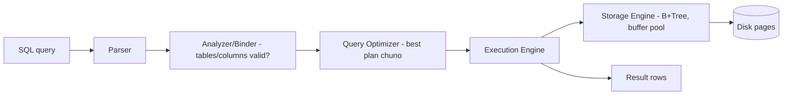
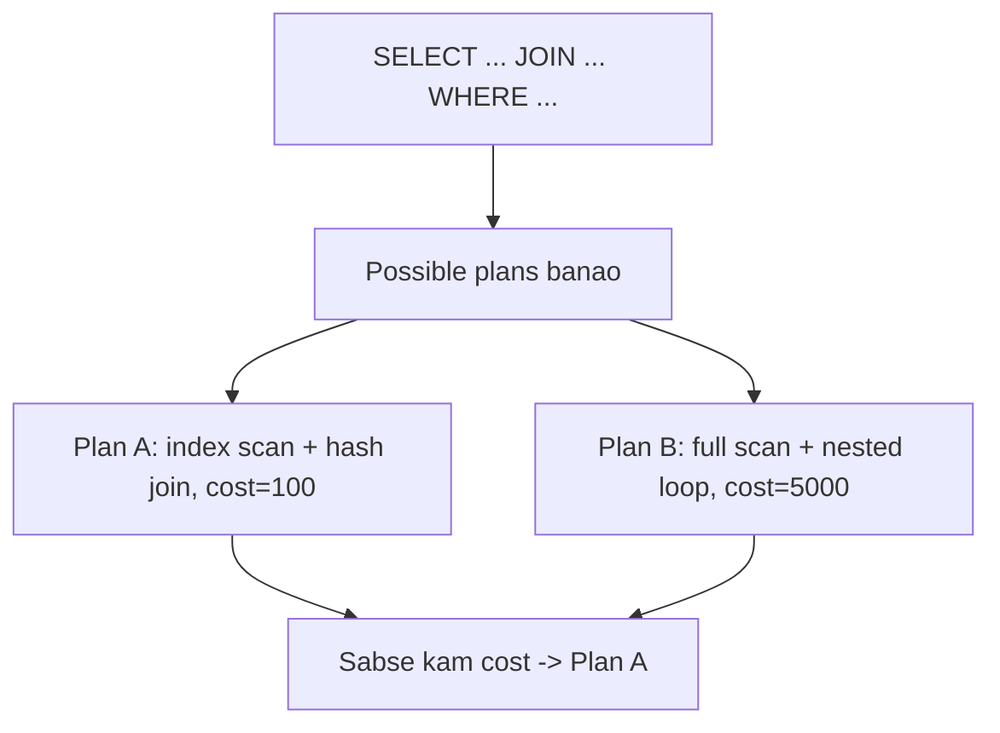
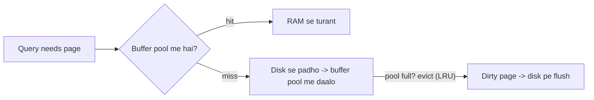
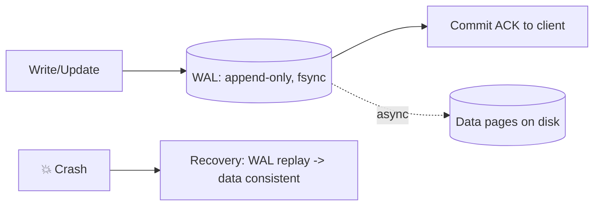
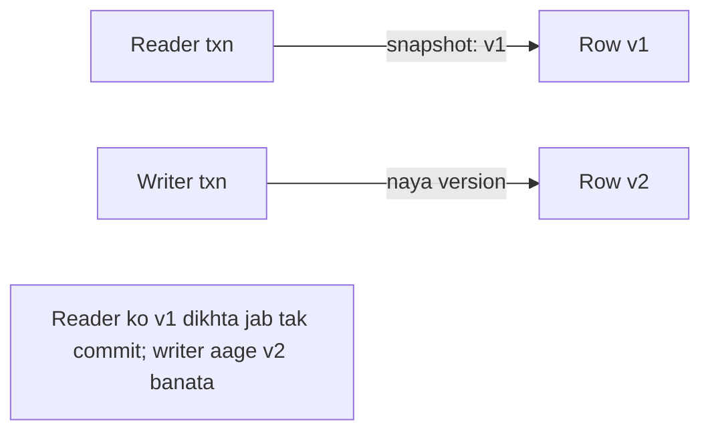
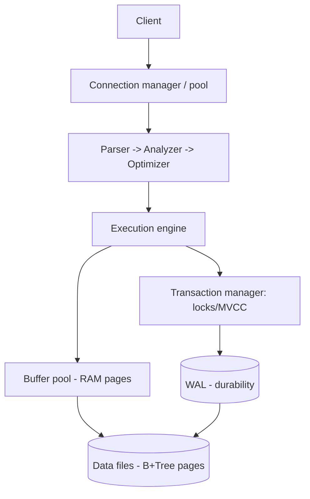

# 🛢️ Internal Design of a SQL Database (RDBMS Internals)

> **Problem:** Ye "app" design nahi — ye **ek relational database khud kaise kaam karta hai** andar se.
> Jab tum `SELECT * FROM users WHERE age > 25` chalate ho, DB ke andar kya-kya hota hai — parsing,
> optimization, execution, storage engine (B+Tree), buffer pool, WAL, transactions (ACID), MVCC, locks.
> Ye samajhna tumhe **har** data-heavy design me strong banata hai.

---

## 1. Ek query ka safar (high-level)

| Component | Kaam |
|---|---|
| **Parser** | SQL text → syntax tree (grammar check) |
| **Analyzer/Binder** | Tables/columns exist? Types valid? Permissions? |
| **Optimizer** | Kai possible plans me se **sabse sasta** chuno (cost-based) |
| **Execution engine** | Plan ko run karo (scan, join, filter, sort) |
| **Storage engine** | Data ko disk pe padho/likho (B+Tree, pages, cache) |
| **Transaction manager** | ACID — atomicity, isolation, durability |

---

## 2. Query Optimizer — DB ka dimaag

Ek query ke **kai** execution plans ho sakte (kaunsa index use karein, join order kya). Optimizer
**cost estimate** karke sabse sasta chunta hai. `EXPLAIN` se dekh sakte ho.

- **Statistics** (row count, value distribution, cardinality) → cost estimate ka base.
- **Join algorithms:** nested loop (chhote), hash join (bade equi-join), merge join (sorted).
- Isi liye "index hai" ≠ "index use hoga" — optimizer decide karta (kabhi full scan sasta). Dekho [DB Indexing](../Advanced_Topics/03_Database_Indexing_Deep_Dive.md).

---

## 3. ⭐ Storage Engine — B+Tree, Pages, Buffer Pool

### Pages (disk ka unit)
Data **rows me nahi, pages me** store hota (jaise 8KB/16KB block). DB disk se **page** padhta/likhta (row-by-row nahi) — kyunki disk block-based hai. Ek page me kai rows.

### B+Tree index
Data + indexes **B+Tree** me (balanced, high fanout → 3-4 levels me crores rows, O(log n) lookup +
range queries). Leaves linked → range scans fast. Detail: [DB Indexing Deep-Dive](../Advanced_Topics/03_Database_Indexing_Deep_Dive.md).

### ⭐ Buffer Pool (RAM cache) — performance ki jaan
Disk slow (10ms). DB frequently-used pages ko **RAM (buffer pool)** me cache karta.

- **Hit** → RAM se (fast); **miss** → disk se load. LRU eviction. **Dirty page** (modified) evict hone se pehle disk pe flush.
- Yehi wajah hai DB ko itni RAM chahiye — jitni zyada RAM, utna kaam disk pe nahi jaata.

---

## 4. ⭐ ACID — transactions kaise guarantee hote

| Property | Matlab | Kaise |
|---|---|---|
| **Atomicity** | All-or-nothing (aadha commit nahi) | **WAL / undo log** — fail pe rollback |
| **Consistency** | Constraints/rules kabhi na toote | Constraints + txn checks |
| **Isolation** | Concurrent txns ek doosre ko na bigaadein | **Locks / MVCC** |
| **Durability** | Commit hua = permanent (crash pe bhi) | **WAL fsync to disk** |

### Write-Ahead Log (WAL) — Atomicity + Durability
Changes pehle **WAL (append-only log, disk pe)** me likho, phir asli data pages me (baad me). Crash?
→ WAL replay karke recover.

- **Durability:** commit ke time WAL **fsync** (disk pe pakka) → crash ke baad bhi data safe.
- **Atomicity:** transaction fail → WAL se undo (rollback).
- **Speed:** WAL sequential write (fast) hai; data pages random write async (baad me) → fast commits.

---

## 5. ⭐ Isolation — Locks vs MVCC

Do transactions ek saath same data — kaise handle?

### Approach A: Locking (pessimistic)
- **Shared (read) lock** — kai reader saath; **Exclusive (write) lock** — akela.
- Writer padhne walon ko block karta (aur ulta) → contention. Deadlock possible. Dekho [Concurrency Control](../Concurrency_Control.md).

### Approach B: MVCC (Multi-Version Concurrency Control) ⭐
Har row ki **kai versions** rakho. Reader ko ek **snapshot** (consistent point-in-time) dikhta — writer
naye version banata, reader purana padhta. **Readers writers ko block nahi karte** (aur ulta).

- **Postgres, MySQL InnoDB, Oracle** = MVCC. Better concurrency (read-write clash kam).
- Cost: purani versions cleanup (vacuum/GC).

### Isolation Levels (weak → strong)
| Level | Rokta hai |
|---|---|
| Read Uncommitted | Kuch nahi (dirty reads possible) |
| Read Committed | Dirty reads |
| Repeatable Read | Dirty + non-repeatable reads |
| **Serializable** | Sab (phantom reads bhi) — strongest, slowest |

---

## 6. Full picture

---

## 7. Deep Dive extras

### Connection pooling
Har connection = memory + process/thread. DB ki connection limit hoti → app **connection pool** use kare (reuse). Dekho [DB Design Tips](../16_Database_Design_Tips.md).

### Why B+Tree over hash for primary storage?
Hash = O(1) equality par **no range/sort**. B+Tree = O(log n) par range/`ORDER BY`/prefix sab. DBs need range → B+Tree default.

### Checkpointing
Periodically buffer pool ki dirty pages disk pe flush + WAL truncate → recovery fast (poora WAL replay na karna pade).

---

## 8. Interview Q&A

**Q: `SELECT` chalane pe DB ke andar kya hota?**
Parse → analyze → optimize (best plan, cost-based) → execute → storage engine (buffer pool → B+Tree/disk) → rows.

**Q: WAL kya, kyun?**
Write-ahead log: changes pehle append-only log me (fsync) phir data pages me → **durability** (crash recovery) + **atomicity** (rollback) + fast sequential commits.

**Q: Buffer pool?**
Frequently-used disk pages ka RAM cache; hit = fast, miss = disk load + LRU evict (dirty → flush). DB ki speed ka core.

**Q: Locks vs MVCC?**
Locks = readers/writers block each other (contention). MVCC = row versions + snapshots → readers writers ko block nahi karte (Postgres/InnoDB).

**Q: Index hone pe bhi full scan kyun?**
Optimizer cost-based; agar query bahut rows laa rahi to index (random I/O) full scan se mehnga → full scan chunta.

**Q: Isolation levels?**
Read Uncommitted → Committed → Repeatable Read → Serializable (weak→strong; dirty/non-repeatable/phantom reads progressively rokta).

---

## Summary
- Query flow: **parse → analyze → optimize (cost-based plan) → execute → storage engine**.
- **Storage** = pages on disk, **B+Tree** indexes, **buffer pool** (RAM cache, LRU) = speed ki jaan.
- **ACID:** **WAL** (durability + atomicity via fsync/rollback), **locks/MVCC** (isolation), constraints (consistency).
- **MVCC** (row versions + snapshots) = readers/writers don't block — modern DBs (Postgres/InnoDB); isolation levels weak→serializable.

> **Related:** [Database Indexing Deep-Dive](../Advanced_Topics/03_Database_Indexing_Deep_Dive.md) · [Concurrency Control](../Concurrency_Control.md) · [SQL vs NoSQL](../SQL_vs_NoSQL.md) · [Database Design Tips](../16_Database_Design_Tips.md) · [Database Replication](../Database_Replication.md)
