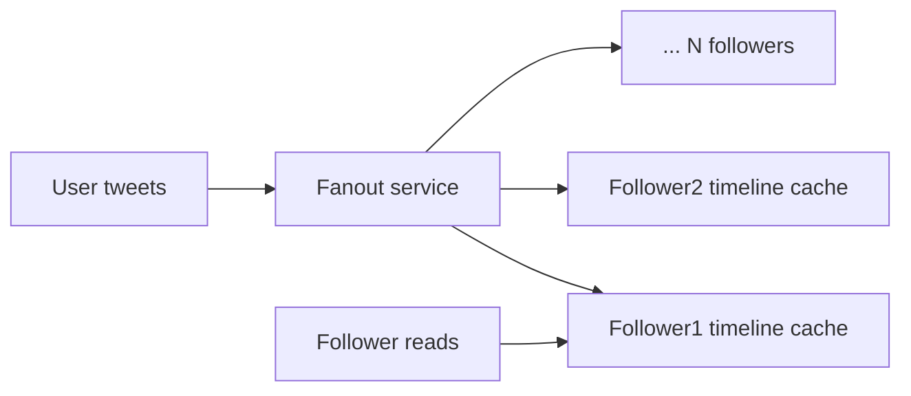
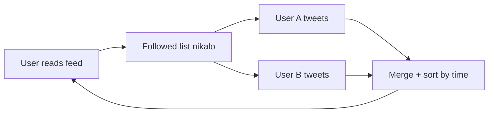
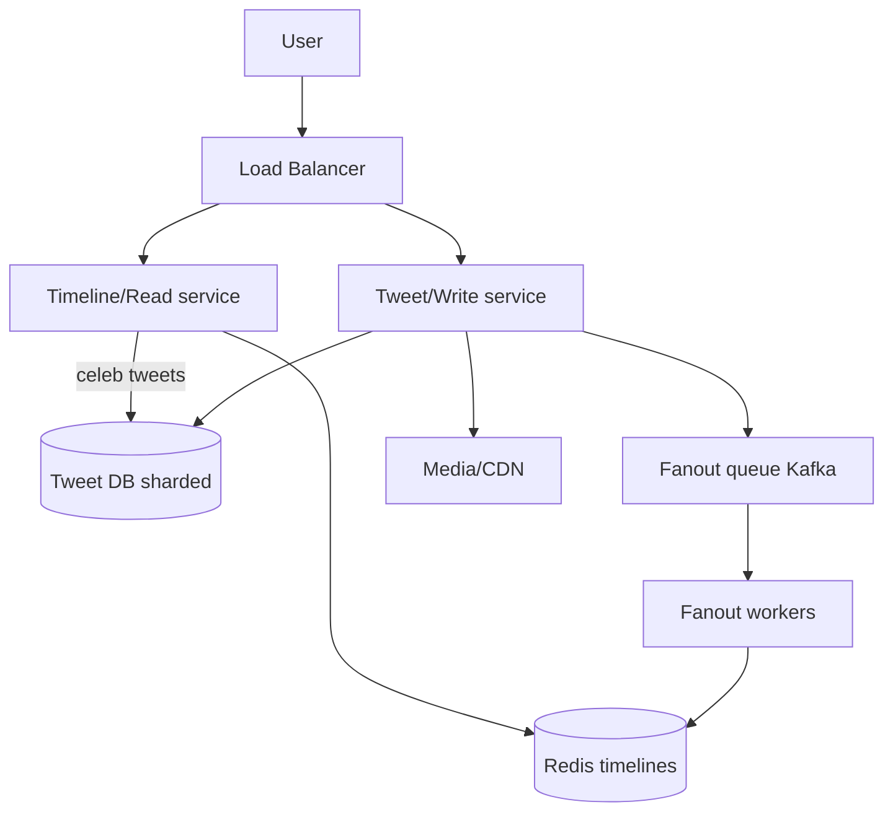

# 🐦 Design Twitter / News Feed

> **Problem:** User tweets post kare, doosron ko follow kare, aur apni **home timeline** (jinko follow
> kiya unke latest tweets, reverse-chronological/ranked) dekhe. Ye classic design hai — iska dil
> **"fanout"** (feed generation) hai, aur celebrity problem interesting twist deta hai.

---

## 1. Requirements

### Functional
- **Post tweet** (text + media, 280 chars).
- **Follow/unfollow** users.
- **Home timeline** — followed users ke tweets.
- **User timeline** — ek user ke apne tweets.
- Like, retweet, reply (extension).

### Non-Functional
- **Low latency timeline** (<200ms) — feed load fast.
- **Read-heavy** (log padho jyada, likho kam).
- **High availability**, eventual consistency OK (tweet 1-2 sec baad dikhe chalega).

---

## 2. Capacity Estimation

| Metric | Value |
|---|---|
| DAU | 200M |
| Tweets/day | 100M → ~1,160 writes/s |
| Timeline reads/day | 100:1 → ~28B → ~**325K reads/s** |
| Avg followers | ~200 (celebs: millions) |

> **Read-heavy + fanout amplification:** ek tweet 200 logon ke feed me jaana → writes bhi amplify.

---

## 3. ⭐ Core Problem — Feed Generation (Fanout)

Timeline banane ke 2 approaches:

### (A) Fanout-on-Write (Push model)
Tweet post hote hi, us tweet ko **saare followers ke pre-computed timeline** (cache) me push kar do.

- ✅ **Read super fast** — timeline pehle se ready (bas cache padho).
- ❌ **Write mehnga** — celeb ke 50M followers → 50M writes per tweet! ("fanout storm"). Inactive users ka bhi feed banega (waste).

### (B) Fanout-on-Read (Pull model)
Timeline read ke time pe banao — followed users ke latest tweets fetch + merge.

- ✅ **Write sasta** (bas apni tweet store), no wasted work.
- ❌ **Read slow/mehnga** — har read pe N users ke tweets fetch + merge (300K reads/s pe deadly).

### (C) ⭐ Hybrid (real Twitter) — best answer
- **Normal users:** fanout-on-write (push) — reads fast.
- **Celebrities** (millions of followers): fanout-on-read (pull) — unke tweets read-time pe merge (write storm avoid).
- Feed read = pre-computed timeline + celeb tweets **merge on read**.

| | Push | Pull | Hybrid |
|---|---|---|---|
| Read | ⚡ Fast | Slow | ⚡ Fast |
| Write | Slow (celeb storm) | Fast | Balanced |
| Best for | Few followers | Celebs | **Everyone** |

> **Interview gold:** "Hybrid — normal users push, celebs pull, read pe merge. Ye celebrity fanout problem solve karta."

---

## 4. API Design

```
POST /v1/tweet            { text, media_ids }         -> tweet_id
GET  /v1/feed?cursor=...  -> [tweets]  (cursor pagination)
POST /v1/follow           { target_user_id }
GET  /v1/user/{id}/tweets -> [tweets]
```
> **Cursor pagination** (offset nahi) — feed constantly badalta, offset galat results deta. Dekho [API Design](../API_Design.md).

---

## 5. Data Model

```
Tweets:    tweet_id (PK, Snowflake) | user_id | text | media_url | created_at
Follows:   follower_id | followee_id            (kaun kisko follow karta)
Timeline:  user_id -> [tweet_id, tweet_id...]   (Redis list, pre-computed feed)
```
- Tweets/Follows → **sharded DB** (by user_id / tweet_id).
- Timeline → **Redis** (in-memory list per user, latest ~800 tweet IDs).

---

## 6. High-Level Architecture



**Flow:**
- **Post:** tweet DB me → fanout queue (async) → workers followers ke Redis timeline me tweet_id push.
- **Read:** Redis se timeline (tweet IDs) → tweet content hydrate → celeb tweets merge → return.

---

## 7. Deep Dive

### Async fanout via queue
Fanout **synchronous nahi** — tweet turant store + return, fanout **background** (Kafka + workers).
User ko wait nahi; followers ke feed me 1-2 sec me aa jaata (eventual consistency OK). Dekho [Message Queues](../18_Message_Queues_Kafka_RabbitMQ.md).

### Timeline caching
- Redis me har active user ka timeline (tweet IDs list). Inactive users ka mat banao (on-demand generate).
- Read pe IDs → tweet content **hydrate** (tweet cache/DB se). IDs store karo, full content nahi (dedup + fresh likes/counts).

### Ranking (chronological → ML)
Simple = reverse-chronological. Real Twitter = **ranked feed** (ML: engagement, recency, relevance). Ranking service read-time pe re-order karti.

---

## 8. Bottlenecks & Solutions

| Bottleneck | Solution |
|---|---|
| Celebrity fanout storm | Hybrid (celebs pull, merge on read) |
| Read latency (325K/s) | Pre-computed Redis timelines |
| Fanout load | Async (Kafka + workers) |
| Tweet storage | Shard by tweet_id (Snowflake) |
| Hot tweets (viral) | Cache + CDN for media |

---

## 9. Interview Talking Points
- **Push vs Pull vs Hybrid** — ye poore design ka core, hybrid + celebrity problem zaroor bolo.
- **Async fanout** (queue) — writes decouple, eventual consistency acceptable.
- **Store tweet IDs** in timeline (not content) → hydrate on read.
- **Cursor pagination** (feed mutable).
- Extension: **ranking (ML)**, trending topics ([Big Data/streaming](../Advanced_Topics/05_Big_Data_and_Stream_Processing.md)).

---

## Summary
- Read-heavy; **feed generation = fanout**. **Hybrid** (normal push, celeb pull + merge-on-read) = best, solves celebrity storm.
- **Async fanout** (Kafka + workers) → **Redis pre-computed timelines** (tweet IDs) → hydrate on read.
- Tweets **sharded by Snowflake ID**; media on CDN; cursor pagination; eventual consistency fine.

> **Related:** [Caching](../08_Caching_and_Distributed_Caching.md) · [Message Queues](../18_Message_Queues_Kafka_RabbitMQ.md) · [Sharding](../21_Database_Sharding.md) · [Instagram](./06_Instagram.md) · [Notification System](./08_Notification_System.md)
