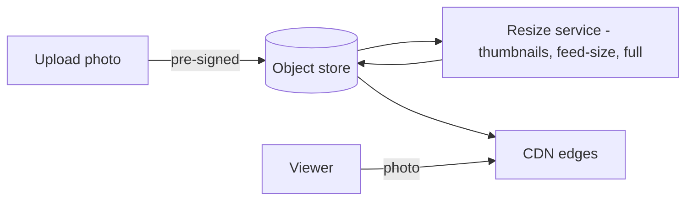
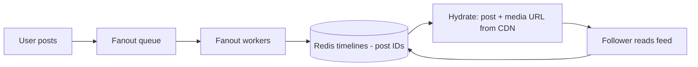
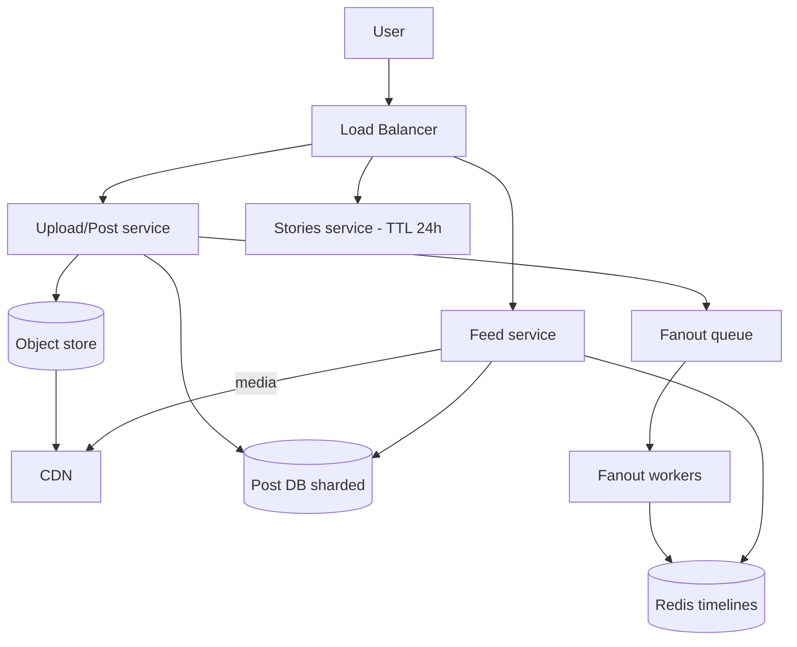

# 📸 Design Instagram

> **Problem:** Users photos/videos post karein, doosron ko follow karein, aur ek **feed** dekhein
> (followed users ki recent posts). Plus stories, likes, comments, explore. Ye Twitter + YouTube ka mix
> hai — **media storage + CDN** (photos) aur **feed fanout** (timeline) dono.

---

## 1. Requirements

### Functional
- **Upload** photo/video (with caption, filters).
- **Follow/unfollow**.
- **Feed** — followed users ki recent posts.
- **Like, comment**; **Stories** (24h expiry); **Explore** (discover).

### Non-Functional
- **Read-heavy** (feed scroll >>> post).
- **Low latency feed + fast media load** (photos instantly).
- **High availability**, eventual consistency OK.

---

## 2. Capacity Estimation

| Metric | Value |
|---|---|
| DAU | 500M |
| Posts/day | ~100M → ~1,160 writes/s |
| Feed reads/day | ~100:1 → **very read-heavy** |
| Avg photo | ~2 MB (multiple sizes) → **PB storage** |

> **Two giants:** feed generation (Twitter-style fanout) + media storage/delivery (YouTube-style CDN).

---

## 3. ⭐ Part 1 — Media Storage & Delivery

Photos DB me **nahi** — **object store + CDN**. Dekho [Blob Storage](../Advanced_Topics/08_Blob_Object_Storage_and_Large_Files.md), [CDN](../10_Content_Delivery_Network_CDN.md).



- **Pre-signed URL** — client seedha object store (server bypass).
- **Multiple sizes** pre-generated: thumbnail, feed-size, full-res — device/context ke hisaab se (bandwidth bachao).
- **CDN** se serve (edge-cached, low latency). Metadata (post) → DB.

---

## 4. ⭐ Part 2 — Feed Generation (Fanout)

Twitter jaisa — **hybrid fanout**. Dekho [Twitter/News Feed](./05_Twitter_News_Feed.md).



- **Normal users:** fanout-on-write (push post_id to followers' Redis timelines).
- **Celebrities** (millions of followers): fanout-on-read (pull + merge) — write storm avoid.
- Feed read → post IDs from Redis → **hydrate** (post meta + CDN media URL) → return.

---

## 5. API Design
```
POST /v1/media/upload    -> pre-signed URL + media_id
POST /v1/post            { media_id, caption }  -> post_id
GET  /v1/feed?cursor=... -> [posts with CDN media URLs]   (cursor pagination)
POST /v1/post/{id}/like
POST /v1/follow          { target_id }
```

---

## 6. Data Model
```
Posts:    post_id (Snowflake) | user_id | media_url | caption | created_at
Follows:  follower_id | followee_id
Timeline: user_id -> [post_id...]   (Redis)
Likes:    post_id | user_id         (or counter)
```
- Posts/Follows → **sharded DB** (by user_id).
- Timeline → **Redis** (post IDs).
- Media → object store + CDN.

---

## 7. High-Level Architecture



---

## 8. Deep Dive

### Stories (24h expiry)
- Ephemeral → **TTL** based store (Redis / DB with expiry). Auto-delete after 24h.
- Fanout to followers similar to feed, but short-lived.

### Explore / Discovery
- Not follow-based — **ML ranking** (interests, trending, engagement). Precompute candidate sets +
  online ranking. Uses [Big Data/streaming](../Advanced_Topics/05_Big_Data_and_Stream_Processing.md).

### Like/comment counts
- Hot posts (viral) → count contention. Async increment / cached counters (eventual). Redis counters + periodic DB flush.

### Feed ranking
- Chronological → ML-ranked (relevance, recency, engagement) — read-time re-rank.

---

## 9. Bottlenecks & Solutions

| Bottleneck | Solution |
|---|---|
| Media storage/delivery | Object store + CDN + multiple sizes |
| Feed read latency | Redis pre-computed timelines |
| Celebrity fanout | Hybrid (celeb pull, merge on read) |
| Fanout load | Async (queue + workers) |
| Hot post counts | Cached/async counters (eventual) |
| Large uploads | Pre-signed + chunked |

---

## 10. Interview Talking Points
- **Two parts:** media (object store + CDN + resize) AND feed (hybrid fanout) — dono bolo.
- **Pre-signed upload**, **multiple image sizes** (bandwidth).
- **Hybrid fanout** + celebrity problem (like Twitter).
- **Store post IDs** in timeline, hydrate on read; **cursor pagination**.
- Stories = TTL; Explore = ML; counts = async/eventual.

---

## Summary
- Instagram = **media (Twitter's feed + YouTube's media)**: object store + CDN + pre-generated sizes for photos; **pre-signed uploads**.
- Feed = **hybrid fanout** (push for normal, pull+merge for celebs) → Redis timelines (post IDs) → hydrate on read.
- Posts sharded by user_id; **stories = TTL**; **explore = ML**; **counts async/eventual**; cursor pagination.

> **Related:** [Twitter/News Feed](./05_Twitter_News_Feed.md) · [YouTube/Netflix](./09_YouTube_Netflix.md) · [Blob Storage](../Advanced_Topics/08_Blob_Object_Storage_and_Large_Files.md) · [CDN](../10_Content_Delivery_Network_CDN.md) · [Caching](../08_Caching_and_Distributed_Caching.md)
