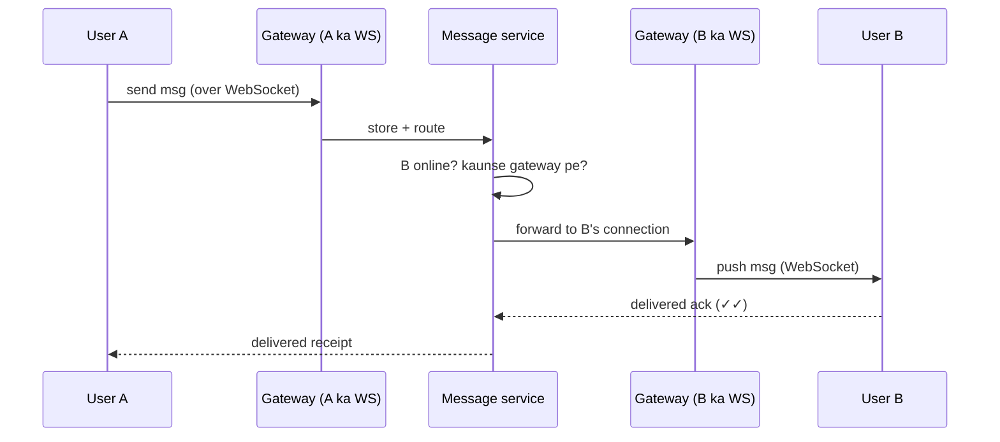
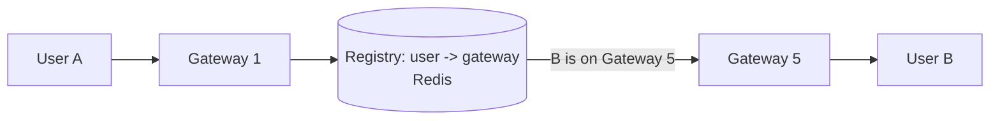
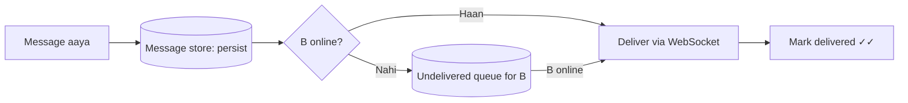
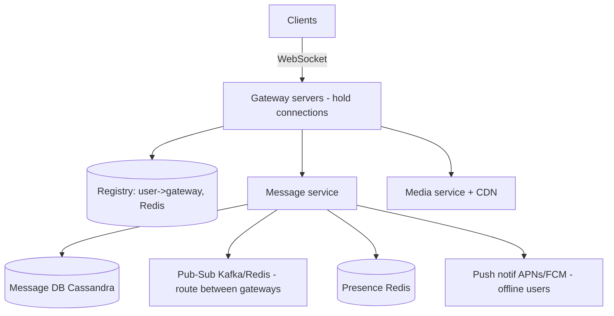

# 💬 Design WhatsApp / Chat System

> **Problem:** Real-time 1-on-1 (aur group) messaging — message turant deliver, delivery/read receipts
> (✓, ✓✓, blue), online/last-seen presence, offline delivery, media sharing. Ye design **WebSockets**,
> **message queues**, aur **presence** ka best example hai.

---

## 1. Requirements

### Functional
- **1-on-1 messaging** (real-time).
- **Group chat**.
- **Delivery status** — sent (✓), delivered (✓✓), read (blue).
- **Online/last-seen presence**.
- **Offline messages** — user offline ho to baad me deliver.
- **Media** (image/video/voice).

### Non-Functional
- **Low latency** (real-time feel, <100ms).
- **High availability**, **reliable delivery** (message kabhi na khoye).
- **Ordering** — messages sahi order me.
- **Scale** — billions of messages/day, 100Cr+ users.

---

## 2. Capacity Estimation

| Metric | Value |
|---|---|
| DAU | 2B |
| Messages/day | 100B → ~1.15M messages/s |
| Concurrent connections | ~100M+ WebSockets simultaneously |
| Avg message | ~100 bytes (text) |

> **Key challenge:** crores **persistent connections** ek saath (WebSocket) — normal request-response nahi chalega.

---

## 3. ⭐ Core — Real-time delivery (WebSocket)

HTTP polling se real-time nahi hota. **WebSocket** = persistent bidirectional connection — server client
ko **push** kar sakta (message aaye to turant). Dekho [WebSockets & Real-time](../WebSockets_and_Realtime.md).



### ⭐ Connection registry (B kis server pe connected hai?)
Crores users → hazaaron gateway servers. A ka message B tak kaise? **Registry** batata hai
`user_id → kaunsa gateway server`. (Redis / consistent hashing.)



- User connect → registry me `user_id → gateway` likho.
- Message route → registry se B ka gateway dhoondo → wahan bhejo → us gateway ka WebSocket se B ko push.
- Gateways ke beech routing: **pub-sub** (Redis/Kafka) — message service B ke gateway ke channel pe publish.

---

## 4. Offline messages & reliable delivery

B offline hai? Message **kho na jaaye**:
- Message pehle **persist** (message DB / queue) → phir deliver try.
- B offline → message DB me `undelivered` pada rahe.
- B online aaye → registry update → pending messages **pull/push** → deliver → mark delivered.



> **Delivery guarantee:** at-least-once + client dedup (message_id se) → duplicates avoid. Ordering ke
> liye per-conversation sequence number.

---

## 5. API / Protocol

WebSocket messages (JSON/protobuf over WS):
```
-> { "type":"send", "to":"userB", "msg_id":"uuid", "text":"hi" }
<- { "type":"ack", "msg_id":"uuid", "status":"delivered" }
<- { "type":"message", "from":"userA", "text":"hi", "ts":... }
```
> `msg_id` client-generated (UUID) → **idempotency** (retry pe duplicate na bane). Dekho [Idempotency](../Idempotency.md).

---

## 6. Data Model

```
Messages:  msg_id | conversation_id | sender_id | text | media_url | created_at | status
Conversations: conv_id | type(1-1/group) | participants[]
UserStatus: user_id | online | last_seen | gateway_id
```
- Messages → **write-heavy, time-ordered** → **Cassandra/LSM** (partition by conversation_id, sorted by time). Dekho [DB Indexing (LSM)](../Advanced_Topics/03_Database_Indexing_Deep_Dive.md), [SQL vs NoSQL](../SQL_vs_NoSQL.md).
- Presence → **Redis** (ephemeral, TTL).

---

## 7. High-Level Architecture



---

## 8. Deep Dive

### Presence (online / last-seen)
- Client periodic **heartbeat** over WebSocket → Redis me `online + last_seen` update (TTL, jaise 30s).
- Heartbeat rukа (disconnect) → TTL expire → offline.
- **Scale problem:** har user ke har contact ko presence-change batana = fanout storm. **Solution:**
  presence sirf **on-demand** (chat kholo tab fetch) ya subscribed contacts ko hi push — sabko nahi.

### Group chat
- Group message = **fanout** to N members (Twitter jaisa). Chhote groups: push to each member's gateway.
- Bade groups: message ek baar store, members pull/receive via their gateways.

### Media
- Media DB me nahi — **object store + CDN** (chunked upload, pre-signed URLs). Message me sirf media URL. Dekho [Blob Storage](../Advanced_Topics/08_Blob_Object_Storage_and_Large_Files.md).

### Offline push
- User WebSocket disconnected → **push notification** (APNs/FCM) bhejo "naya message". Dekho [Notification System](./08_Notification_System.md).

### End-to-end encryption (WhatsApp)
- Messages **client-side encrypted** (Signal protocol); server sirf ciphertext store/route karta — padh nahi sakta. Dekho [Security](../Security_in_System_Design.md).

---

## 9. Bottlenecks & Solutions

| Bottleneck | Solution |
|---|---|
| Crores persistent connections | Many gateway servers + registry + horizontal scale |
| Routing A→B across gateways | Registry (user→gateway) + pub-sub |
| Message loss | Persist-before-deliver + at-least-once + ack |
| Presence fanout storm | On-demand / subscribed-only presence |
| Offline delivery | Undelivered queue + push notifications |
| Ordering/duplicates | Per-conv sequence + client-side msg_id dedup |

---

## 10. Interview Talking Points
- **WebSocket** (not polling) — persistent, server-push; **connection registry** to route between gateways.
- **Persist-before-deliver** + acks → reliable, no message loss.
- **Presence fanout** is a trap — on-demand, not broadcast-to-all.
- **Media via object store + CDN**, not DB.
- **E2E encryption** (WhatsApp) — server can't read.

---

## Summary
- Real-time via **WebSocket** + **gateway servers** holding connections + **registry** (user→gateway) + **pub-sub** routing.
- **Persist-before-deliver** + at-least-once + client `msg_id` dedup = reliable, ordered.
- **Presence** via Redis heartbeat (on-demand to avoid fanout storm); **offline** → undelivered queue + push notif.
- Messages in **Cassandra** (time-partitioned); media in **object store + CDN**; E2E encryption.

> **Related:** [WebSockets & Real-time](../WebSockets_and_Realtime.md) · [Message Queues](../18_Message_Queues_Kafka_RabbitMQ.md) · [Notification System](./08_Notification_System.md) · [Consistent Hashing](../19_Consistent_Hashing.md) · [Blob Storage](../Advanced_Topics/08_Blob_Object_Storage_and_Large_Files.md)
