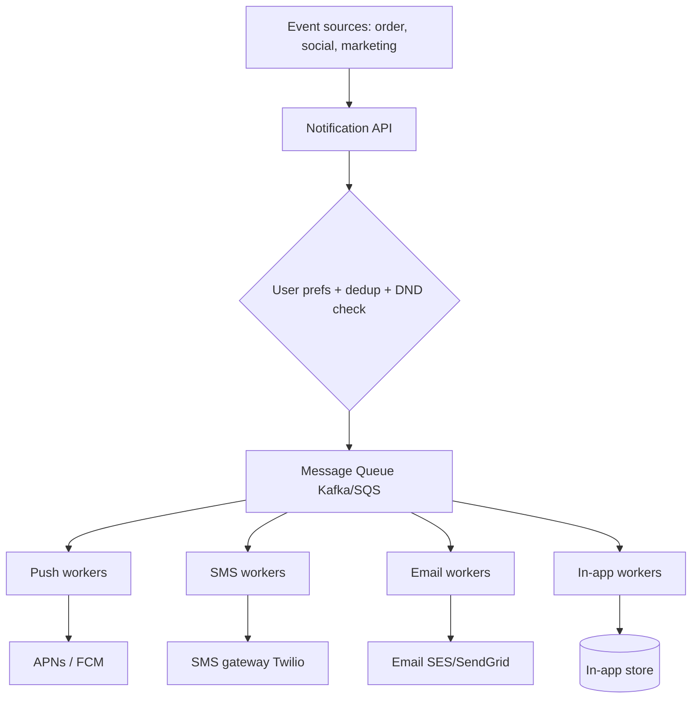
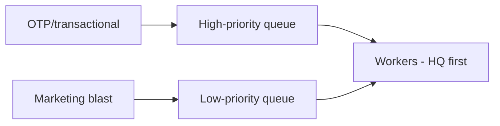

# 🔔 Design a Notification System

> **Problem:** Ek system jo **millions of notifications** bheje — push (mobile APNs/FCM), SMS, email,
> in-app — reliably, at scale, without spamming. "Order shipped", "New follower", "OTP", "Sale live" —
> sab isse jaate hain. Ye design **fanout, message queues, third-party integration, aur reliability**
> ka best example hai.

---

## 1. Requirements

### Functional
- **Multi-channel:** push, SMS, email, in-app.
- **Triggers:** events (order shipped), scheduled (reminders), bulk (marketing blast).
- **User preferences** (kaunse notif chahiye, kaunse channel, do-not-disturb hours).
- **Templates** (personalized content).

### Non-Functional
- **Scale** — millions/sec possible (bulk blast).
- **Reliable** — important notif (OTP) na khoye.
- **Low latency** for critical (OTP), batchable for marketing.
- **No spam / dedup** — same notif baar-baar nahi.

---

## 2. Capacity Estimation

| Metric | Value |
|---|---|
| Notifications/day | ~1B → ~11.5K/s avg, **huge bursts** (sale = millions/sec) |
| Channels | push/SMS/email each with own provider limits |

> **Key challenge:** spiky load (marketing blast) + **third-party rate limits** (APNs/FCM/SMS gateway throttle).

---

## 3. ⭐ Core Architecture — Queue-based fanout

Notification service **synchronous nahi** — event aaya → queue → workers process → provider ko bhejo.
Ye decoupling spikes absorb karta. Dekho [Message Queues](../18_Message_Queues_Kafka_RabbitMQ.md), [Event-Driven](../Event_Driven_Architecture.md).



**Flow:**
1. Event → Notification API.
2. **Preference + dedup + DND** check (bhejni chahiye ya nahi).
3. Channel-specific **queue** me daalo.
4. **Workers** (per channel) queue se uthaake **provider** ko bhejo.
5. Provider result (delivered/failed) track.

---

## 4. Why queue? (decoupling + reliability)

| Benefit | Kaise |
|---|---|
| **Spike absorption** | Blast aaye → queue buffer kare, workers apni speed se drain (backpressure) |
| **Reliability** | Queue durable → worker crash → message reprocess (at-least-once) |
| **Provider throttling** | Workers rate-limit karke provider limits respect karein |
| **Channel isolation** | SMS provider down → push/email chalte rahein (separate queues) |
| **Retry** | Failed send → retry queue (backoff) |

---

## 5. API Design
```
POST /v1/notify
  { user_id, template_id, channel_priority:[push,sms], data:{...}, dedup_key }
  -> 202 Accepted (async)

POST /v1/notify/bulk   { segment_id, template_id }   -> job_id
GET  /v1/preferences/{user_id}
```
> **202 Accepted** — async (queue me daala, deliver hoga). `dedup_key` → same notif dobara na jaaye ([Idempotency](../Idempotency.md)).

---

## 6. Data Model
```
Templates:    template_id | channel | body_template | vars
Preferences:  user_id | channel_settings | dnd_hours | opted_out[]
NotifLog:     notif_id | user_id | channel | status | sent_at | dedup_key
DeviceTokens: user_id | device_token | platform (for push)
```

---

## 7. Deep Dive

### Reliability & delivery tracking
- **At-least-once** delivery (queue + retry). Critical (OTP) → retry aggressively; marketing → drop OK.
- **Dedup:** `dedup_key` (idempotency) → same event dobara aaye to skip. Dekho [Idempotency](../Idempotency.md).
- **DLQ (Dead Letter Queue):** baar-baar fail → DLQ me daalo (investigate, don't block queue). Dekho [Message Queues](../18_Message_Queues_Kafka_RabbitMQ.md).
- **Delivery status:** provider webhook/callback → NotifLog update (sent/delivered/failed/bounced).

### Third-party provider handling
- Providers ke **rate limits** → workers throttle (token bucket). Dekho [Rate Limiter](./02_Rate_Limiter.md).
- Provider down → **circuit breaker** + retry + fallback provider. Dekho [Resilience](../Advanced_Topics/07_Resilience_and_Fault_Tolerance.md).
- **Channel fallback:** push fail → SMS (priority list).

### Preferences & anti-spam
- Har notif se pehle: opted-in? DND hours? frequency cap (spam roko)? → filter.
- **GDPR/opt-out** compliance.

### Bulk / marketing blast
- Segment (crore users) → **batch** into queue chunks → workers gradually process (rate-limited) → provider na choke.
- Priority queues: **transactional (OTP) high priority**, marketing low → OTP kabhi blast ke peeche na atke.



---

## 8. Bottlenecks & Solutions

| Bottleneck | Solution |
|---|---|
| Spiky load (blast) | Queue buffering + backpressure |
| Provider rate limits | Worker throttling (token bucket) |
| Provider outage | Circuit breaker + fallback provider/channel |
| Duplicate notifs | dedup_key (idempotency) |
| Poison messages | DLQ |
| OTP stuck behind blast | Priority queues |
| Spam | Preferences + DND + frequency cap |

---

## 9. Interview Talking Points
- **Queue-based, async** — decouples, absorbs spikes, enables retry (the core).
- **Per-channel workers + queues** (isolation); **priority queues** (OTP > marketing).
- **Reliability:** at-least-once + dedup (idempotency) + DLQ + delivery tracking.
- **Provider handling:** throttle (their limits), circuit breaker, fallback channel.
- **Preferences/DND/anti-spam** before sending.

---

## Summary
- **Queue-based async fanout**: event → prefs/dedup/DND filter → per-channel queues → workers → providers (APNs/FCM/SMS/email).
- Queues give **spike absorption, reliability (retry), provider throttling, channel isolation**.
- **At-least-once + dedup_key** (idempotency) + **DLQ** + delivery tracking; **priority queues** (OTP > marketing).
- Provider outages → **circuit breaker + fallback**; **preferences/DND/frequency cap** = anti-spam.

> **Related:** [Message Queues](../18_Message_Queues_Kafka_RabbitMQ.md) · [Event-Driven Architecture](../Event_Driven_Architecture.md) · [Idempotency](../Idempotency.md) · [Resilience](../Advanced_Topics/07_Resilience_and_Fault_Tolerance.md) · [Rate Limiter](./02_Rate_Limiter.md)
