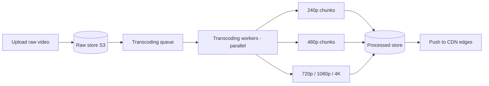
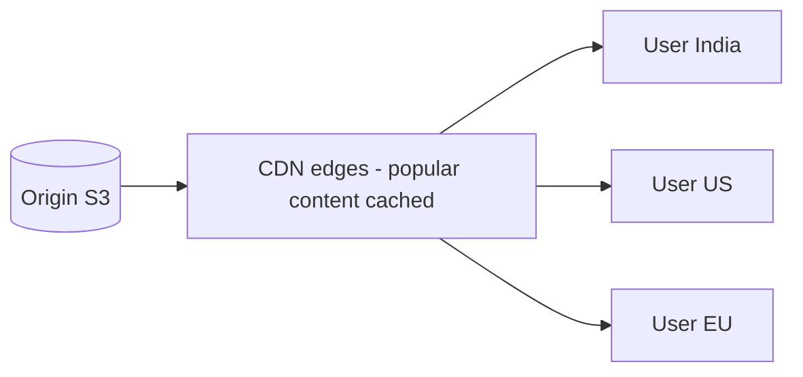
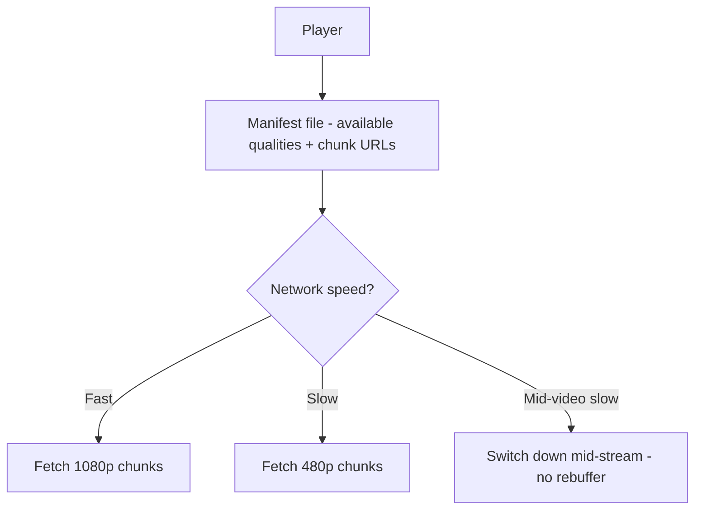
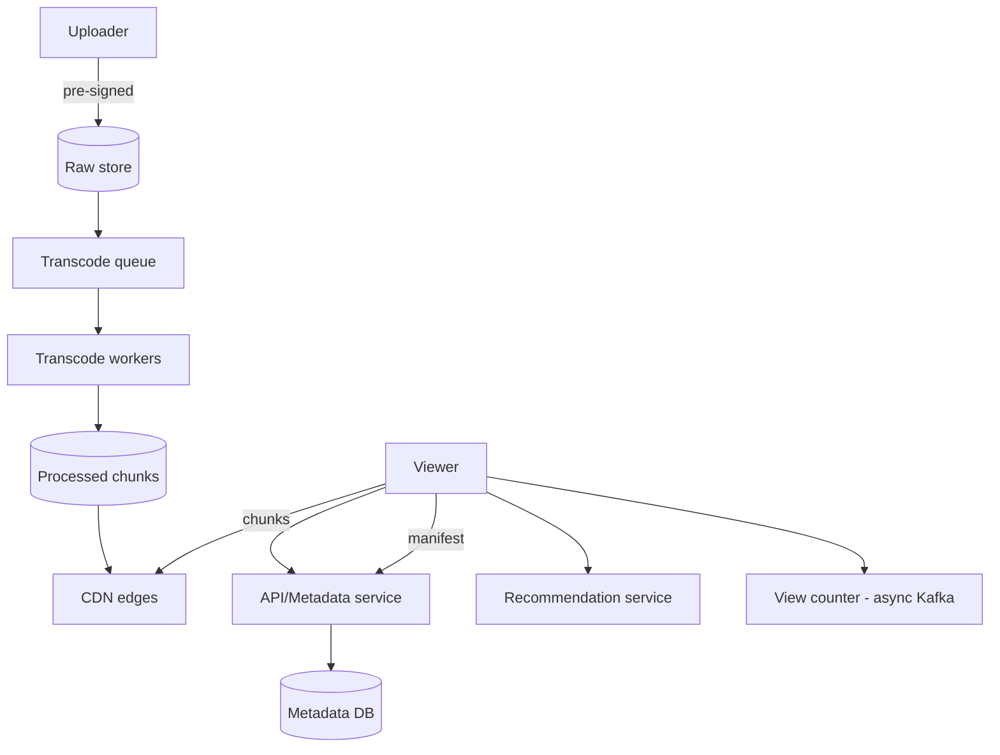

# 🎬 Design YouTube / Netflix (Video Streaming)

> **Problem:** Users video **upload** karein (YouTube) aur duniya bhar ke log use **smoothly stream**
> karein — koi buffering nahi, har device/network pe. Ye design **blob storage**, **CDN**,
> **transcoding**, aur **adaptive bitrate streaming** ka best example hai.

---

## 1. Requirements

### Functional
- **Upload** video (YouTube) / catalog (Netflix).
- **Stream** video smoothly (any device, any network speed).
- **Search & recommend**, thumbnails, view counts, likes/comments.

### Non-Functional
- **Low latency start** + **no buffering** (smooth playback #1 priority).
- **High availability**, global scale.
- **Read-heavy** (views >>> uploads), huge storage/bandwidth.

---

## 2. Capacity Estimation

| Metric | Value |
|---|---|
| Uploads/day (YouTube) | ~500 hrs/min → huge |
| Views/day | Billions → **bandwidth is the giant cost** |
| Avg video | ~100 MB–GBs (multiple encodings) |
| Storage | Petabytes/Exabytes |

> **Key insight:** **bandwidth + storage** dominant cost; playback smoothness dominant UX → **CDN** central.

---

## 3. ⭐ Core Part 1 — Upload & Transcoding

Raw uploaded video ek format/resolution me hota. Har device/network ke liye **multiple versions** chahiye
(240p, 480p, 720p, 1080p, 4K) + multiple codecs. Ye **transcoding** hai.



- **Chunking:** video ko chhote **segments** (jaise 2-10 sec) me todo → har segment alag transcode
  (parallel, faster) + streaming me alag-alag fetch.
- **Async pipeline:** upload → queue → workers transcode (background, parallel). User ko "processing" dikhao. Dekho [Message Queues](../18_Message_Queues_Kafka_RabbitMQ.md), [Big Data pipeline](../Advanced_Topics/05_Big_Data_and_Stream_Processing.md).
- Raw + processed → **object storage** (S3), chunked, immutable. Dekho [Blob Storage](../Advanced_Topics/08_Blob_Object_Storage_and_Large_Files.md).

---

## 4. ⭐ Core Part 2 — Streaming (CDN + Adaptive Bitrate)

### CDN = smooth playback ki jaan
Video **origin (S3) se seedha** serve nahi — **CDN edge** se (user ke paas). Isse latency kam, origin
load kam, buffering kam. Dekho [CDN](../10_Content_Delivery_Network_CDN.md).



### ⭐ Adaptive Bitrate Streaming (ABR) — HLS / DASH
Video pehle se **multiple quality levels** me chunked. Player **network ke hisaab se** quality switch
karta — fast net → 1080p, slow net → 480p — **buffering avoid**.



- **Manifest** (`.m3u8` HLS / `.mpd` DASH) player ko batata: kaunsi qualities, kaunse chunk URLs.
- Player har chunk se pehle network maapke best quality chunk maangta → **seamless**.

---

## 5. API Design
```
POST /v1/upload            -> upload_url (pre-signed to S3) + video_id
GET  /v1/video/{id}/manifest -> HLS/DASH manifest (chunk URLs -> CDN)
GET  <cdn>/chunk/{id}/720p/seg_42.ts   -> video chunk (from CDN)
GET  /v1/video/{id}/meta   -> title, views, likes...
```
> Upload = **pre-signed URL** (client seedha S3, server bypass). Dekho [Blob Storage](../Advanced_Topics/08_Blob_Object_Storage_and_Large_Files.md).

---

## 6. Data Model
```
Videos:   video_id | uploader | title | desc | status | duration | created_at
Metadata: video_id -> {chunk manifests, encodings, thumbnail_url}
Views:    video_id | count   (async increment, eventually consistent)
```
- Metadata → DB (sharded by video_id); video bytes → **object store + CDN** (never DB).
- **View count:** exact real-time nahi chahiye → async aggregate (Kafka → batch), eventually consistent.

---

## 7. High-Level Architecture



---

## 8. Deep Dive

### Why not stream from DB/origin?
DB blobs = bloat + no edge caching + bandwidth cost + slow. **Object store + CDN** = infinite scale,
edge-cached, cheap egress. This is the whole game.

### Popular vs long-tail content
- **Popular** (viral, new releases) → CDN pe cache (80/20). Netflix even puts **Open Connect** boxes
  inside ISPs.
- **Long-tail** (purani/rare videos) → CDN miss → origin fetch → cache. Storage class tiering (cold storage sasta).

### View count at scale
Har view pe DB `+1` = write storm + contention. **Solution:** view events → Kafka → batch aggregate →
periodic DB update (approximate real-time). Dekho [Big Data](../Advanced_Topics/05_Big_Data_and_Stream_Processing.md).

### Recommendations
Watch history + collaborative filtering (ML) → offline batch compute + online serving. (Netflix ka core moat.)

---

## 9. Bottlenecks & Solutions

| Bottleneck | Solution |
|---|---|
| Bandwidth cost/latency | **CDN** (edge cache) + ABR |
| Buffering on slow net | Adaptive bitrate (HLS/DASH) |
| Transcoding load | Async queue + parallel chunk workers |
| Huge storage | Object store + tiering (hot/cold) |
| View count storm | Async aggregate (Kafka), eventual |
| Upload of large files | Chunked/multipart + pre-signed URLs |

---

## 10. Interview Talking Points
- **Transcoding pipeline** (chunk → parallel workers → multiple qualities) — async via queue.
- **CDN + adaptive bitrate (HLS/DASH)** = smooth playback (the core answer).
- **Object store, not DB** for video; pre-signed upload.
- **View count** async/eventual (not per-view DB write).
- Netflix vs YouTube: Netflix pre-encodes fixed catalog + ISP boxes; YouTube handles arbitrary uploads.

---

## Summary
- **Upload → async transcoding** (chunk into segments, parallel workers → 240p–4K encodings) → **object store**.
- **Streaming = CDN + Adaptive Bitrate (HLS/DASH)**: manifest + per-chunk quality switch → no buffering.
- Video bytes in **object store + CDN** (never DB); metadata in sharded DB; **view counts async** (Kafka).
- Bandwidth/storage = dominant cost → CDN caching + tiering.

> **Related:** [CDN](../10_Content_Delivery_Network_CDN.md) · [Blob Storage](../Advanced_Topics/08_Blob_Object_Storage_and_Large_Files.md) · [Message Queues](../18_Message_Queues_Kafka_RabbitMQ.md) · [Big Data](../Advanced_Topics/05_Big_Data_and_Stream_Processing.md) · [Caching](../08_Caching_and_Distributed_Caching.md)
