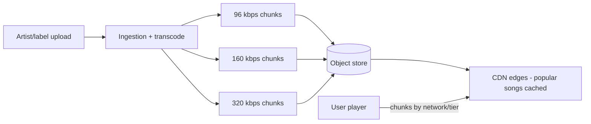
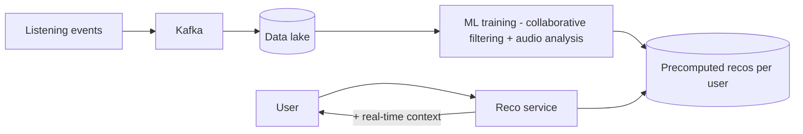
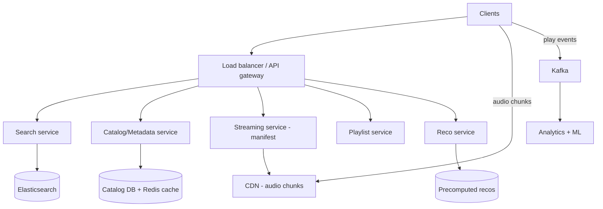

# 🎵 Design Spotify (Music Streaming)

> **Problem:** Crores users ko lakhs songs **instantly** stream karao — low latency start, no buffering,
> personalized recommendations (Discover Weekly), playlists, search, offline download. YouTube jaisa
> media hai par **audio** (chhoti files, lambe sessions) + **recommendation engine** iska asli moat hai.

---

## 1. Requirements

### Functional
- **Stream** any song instantly (play/pause/seek).
- **Search** songs/artists/albums/playlists.
- **Playlists** — create, edit, share.
- **Recommendations** — Discover Weekly, radio, "you might like".
- **Offline download** (premium).
- Likes, follow artists, listening history.

### Non-Functional
- **Low latency start** (<200ms tap-to-play) + **no buffering**.
- **Read-heavy** (plays >>> uploads; catalog mostly static).
- **High availability**, global scale.
- Scale: ~500M users, ~100M songs, billions of streams/day.

---

## 2. Capacity Estimation

| Metric | Value |
|---|---|
| Songs | ~100M × multiple bitrates |
| Avg song | ~3-5 MB (compressed, per bitrate) |
| Catalog storage | ~PBs (all bitrates + metadata) |
| Streams/day | Billions → **bandwidth = biggest cost** |
| Metadata reads | Very high (browse/search) |

> **Key:** catalog **mostly static** (naye songs kam) → **CDN heavily cacheable**; personalization = compute-heavy.

---

## 3. ⭐ Core Part 1 — Audio Streaming (CDN + chunked)

Songs DB me nahi — **object store + CDN**. Audio ko **chunks** (jaise 10-sec segments) + **multiple
bitrates** (96/160/320 kbps) me pre-encode karo. Dekho [CDN](../10_Content_Delivery_Network_CDN.md), [Blob Storage](../Advanced_Topics/08_Blob_Object_Storage_and_Large_Files.md).



- **Adaptive bitrate** (audio version of HLS/DASH): player network + user tier ke hisaab se bitrate chunk maangta → **no buffering**.
- **Pre-fetch:** player agla chunk pehle se download karta (buffer) → seamless playback + gapless.
- **CDN:** popular songs edge pe cached (80/20 — chhote % songs zyada plays). Long-tail → origin fetch.

---

## 4. ⭐ Core Part 2 — Recommendations (Spotify ka moat)

Discover Weekly / personalized = Spotify ki jaan. **Offline ML batch + online serving.**



- **Collaborative filtering:** "tere jaise users ne ye suna" (user-item matrix).
- **Content-based:** audio features (tempo, genre) se similar songs.
- **NLP on playlists/blogs:** songs ka "context" samajhna.
- **Batch precompute** (Discover Weekly weekly) + **online re-rank** (recent activity). Dekho [Big Data](../Advanced_Topics/05_Big_Data_and_Stream_Processing.md).

---

## 5. API Design
```
GET  /v1/search?q=...                  -> songs/artists/playlists
GET  /v1/song/{id}/manifest            -> bitrate options + chunk URLs (CDN)
GET  <cdn>/audio/{id}/320/seg_5.chunk  -> audio chunk
POST /v1/playlist                       { name, song_ids }
GET  /v1/recommendations/{user}         -> Discover Weekly etc.
POST /v1/play                           { song_id }  (log event, async)
```

---

## 6. Data Model
```
Songs:     song_id | title | artist_id | album_id | duration | audio_urls{bitrate->cdn}
Playlists: playlist_id | owner | song_ids[] | collaborative?
Users:     user_id | tier(free/premium) | country(licensing)
History:   user_id | song_id | played_at   (event stream)
```
- Catalog metadata → DB (read-heavy, cache-heavy; mostly static). Songs blob → object store + CDN.
- History/plays → event stream (Kafka) → analytics + recommendations.

---

## 7. High-Level Architecture



---

## 8. Deep Dive

### Instant play (low latency)
- Player pre-fetches first chunks; CDN edge (nearest) serves; small first chunk at lower bitrate → instant start, then ramp up.

### Search
- **Elasticsearch** (inverted index) — song/artist/album/playlist, typo-tolerant, ranked by popularity. Dekho [Search Systems](../Advanced_Topics/04_Search_Systems_and_Elasticsearch.md).

### Offline download (premium)
- Encrypted download to device (DRM); license check; playable offline within subscription validity.

### Licensing / geo-restrictions
- Song availability per **country** (licensing). GeoDNS/region + metadata flag → some songs not available in region. Dekho [DNS](../Advanced_Topics/09_DNS_Deep_Dive.md).

### Play count / royalties
- Every play = event → Kafka → aggregate (approx real-time) → royalty computation (accurate batch). Dekho [Big Data](../Advanced_Topics/05_Big_Data_and_Stream_Processing.md).

---

## 9. Bottlenecks & Solutions

| Bottleneck | Solution |
|---|---|
| Bandwidth/latency | CDN + adaptive bitrate + pre-fetch |
| Catalog reads | Cache-heavy (mostly static metadata) |
| Search | Elasticsearch |
| Personalization compute | Offline ML batch + online re-rank |
| Play count storm | Async event aggregation (Kafka) |
| Offline piracy | DRM + encrypted download |

---

## 10. Interview Talking Points
- **Audio = chunked + multi-bitrate + CDN + adaptive** (like YouTube but audio) — instant play + no buffer.
- **Recommendations** = collaborative filtering + content-based, **offline batch + online serve** (the moat).
- Catalog **static → cache/CDN heavy**; search = Elasticsearch.
- Play events async (Kafka) for analytics/royalties; licensing = per-country metadata.

---

## Summary
- **Streaming** = audio chunked into multi-bitrate segments in **object store + CDN**, adaptive bitrate + pre-fetch → instant play, no buffer.
- **Recommendations** (Discover Weekly) = collaborative filtering + content-based ML, **offline precompute + online re-rank** — Spotify's moat.
- Catalog metadata cache-heavy (static); **search = Elasticsearch**; plays → Kafka (analytics/royalties); DRM for offline; per-country licensing.

> **Related:** [YouTube/Netflix](./09_YouTube_Netflix.md) · [CDN](../10_Content_Delivery_Network_CDN.md) · [Blob Storage](../Advanced_Topics/08_Blob_Object_Storage_and_Large_Files.md) · [Search Systems](../Advanced_Topics/04_Search_Systems_and_Elasticsearch.md) · [Big Data](../Advanced_Topics/05_Big_Data_and_Stream_Processing.md)
