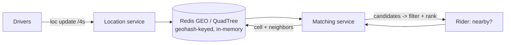
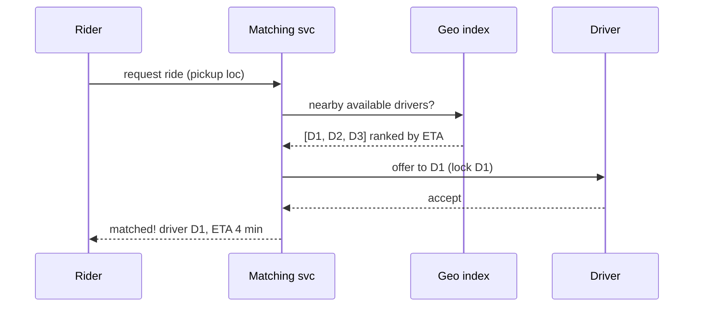
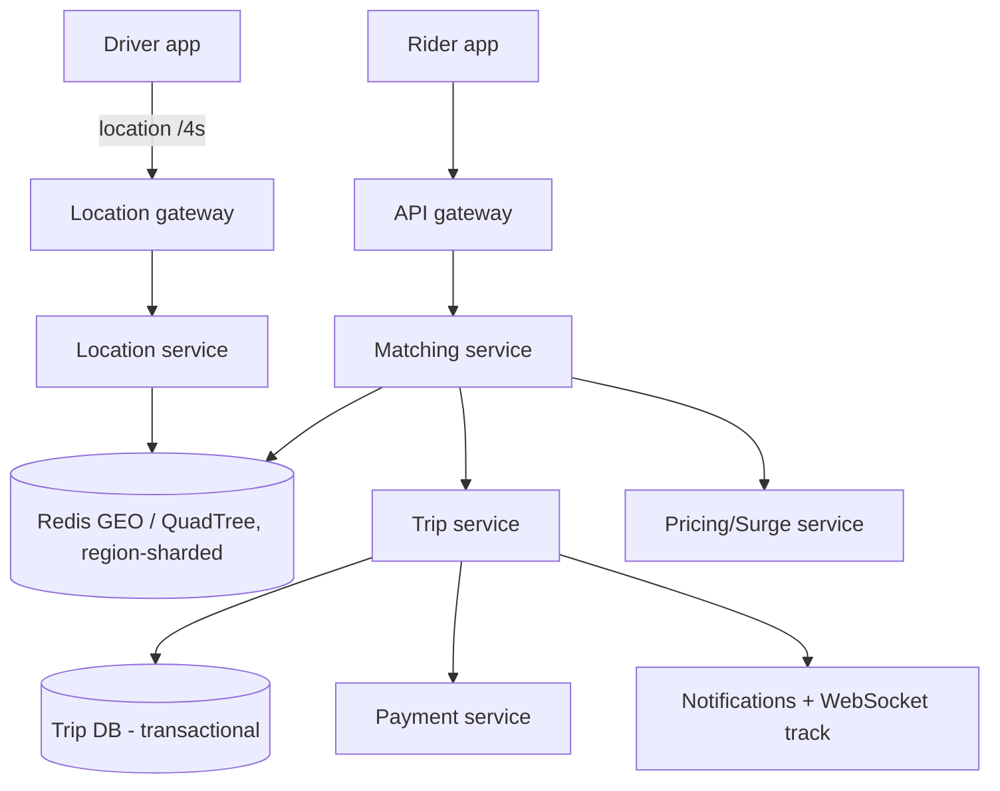

# 🚗 Design Uber / Ride-Hailing

> **Problem:** Rider ek ride maange, system uske paas ke available drivers dhoondhe, best driver ko
> match kare, real-time location tracking de, aur ride complete pe payment kare. Ye design **geospatial
> indexing**, **real-time location**, aur **matching** ka best example hai.

---

## 1. Requirements

### Functional
- **Rider:** nearby drivers dekhe, ride request kare, live driver track kare.
- **Driver:** location broadcast kare, ride requests accept/reject kare.
- **Matching:** rider ↔ nearest available driver.
- **Trip:** start, live track, end, fare calculate, pay.
- **ETA & pricing** (surge).

### Non-Functional
- **Low latency matching** (<few sec).
- **High availability** (ride critical hai).
- **Real-time** location (drivers har few sec update).
- **Scale** — millions of drivers/riders, high write throughput.

---

## 2. Capacity Estimation

| Metric | Value |
|---|---|
| Active drivers | ~5M |
| Location updates | har driver har ~4s → **~1.25M writes/s** ← write-heavy! |
| Ride requests | ~1M/hour peak |

> **Key challenge:** driver location updates = **massive write throughput** + geospatial "nearby" queries.

---

## 3. ⭐ Core — Geospatial "nearby drivers"

Normal DB me `WHERE lat BETWEEN.. AND lng BETWEEN..` bade scale pe fail. Use **geospatial index**
(Geohash / Quadtree / S2). Dekho [Geospatial Services](../Advanced_Topics/06_Geospatial_and_Location_Services.md).

- Har location → **geohash cell** (jaise `tdr1y` = ~1km box).
- "Nearby" = rider ki cell + **8 neighbor cells** ke drivers.
- Driver locations **in-memory** (Redis GEO / quadtree) — persistent DB har 4s update nahi jhelegi.



> **Sharding by region:** location data ko geographic region se shard karo (Mumbai shard, Delhi shard)
> — ek city ka load ek jagah. Hotspots (airport/concert) → quadtree adaptive split. Dekho [Sharding](../21_Database_Sharding.md).

---

## 4. ⭐ Matching Service

Rider request → nearby available drivers → **best** chuno:
- Candidates = geohash cell + neighbors se available drivers.
- Rank by: **ETA** (distance/traffic), rating, acceptance likelihood.
- Best driver ko request bhejo → accept? → matched. Reject/timeout → agle driver.
- **Concurrency:** ek driver do riders ko na mile → **lock/atomic** driver ko "assigned" mark karo. Dekho [Concurrency Control](../Concurrency_Control.md).



---

## 5. API Design

```
POST /v1/location        (driver) { lat, lng }        -> ok      (high frequency)
POST /v1/ride/request    (rider)  { pickup, drop }    -> ride_id, matched driver
GET  /v1/ride/{id}/track ->  { driver_lat, driver_lng, eta }   (WebSocket/poll)
POST /v1/ride/{id}/end   -> fare
```
- Location updates = high-frequency, fire-and-forget (UDP-ish / lightweight).
- Live tracking = **WebSocket** (rider ko driver ki live location push). Dekho [WebSockets](../WebSockets_and_Realtime.md).

---

## 6. Data Model

```
Drivers:   driver_id | status(available/busy) | current_geohash | rating
Trips:     trip_id | rider_id | driver_id | pickup | drop | status | fare | started_at
Location:  driver_id -> (lat,lng)   [Redis GEO, ephemeral, TTL]
```
- **Location = in-memory (Redis), ephemeral** (purana bekaar). Trips = **persistent DB** (transactional — payment).

---

## 7. High-Level Architecture



---

## 8. Deep Dive

### Location update flood (1.25M writes/s)
- **Don't hit persistent DB** — in-memory geo store (Redis), overwrite latest (history alag async).
- Lightweight protocol (kam overhead), batch/throttle updates.
- Region-sharded so load distributes.

### ETA & Pricing
- **ETA:** road-network + live traffic (routing service). Straight-line nahi — actual roads.
- **Surge pricing:** demand/supply ratio per region → high demand → price up (real-time, per geohash cell).

### Trip lifecycle (state machine)
`REQUESTED → MATCHED → DRIVER_ARRIVING → IN_PROGRESS → COMPLETED → PAID`. State machine se manage (LLD me [State pattern](../../LLD/L32%20State_design_pattern/) — cross-link to your LLD).

### Payment (money — careful!)
- Trip end → fare calc → payment (idempotent, no double charge). Dekho [Idempotency](../Idempotency.md), [Distributed Transactions](../Distributed_Transactions.md).

---

## 9. Bottlenecks & Solutions

| Bottleneck | Solution |
|---|---|
| Location write flood | In-memory geo (Redis), region-shard, no persistent DB per update |
| Nearby query at scale | Geohash/Quadtree index + neighbors |
| Hotspots (airport) | Quadtree adaptive split / finer cells |
| Double-matching a driver | Lock / atomic status update (concurrency) |
| Real-time tracking | WebSocket push |
| Payment correctness | Idempotent + transactional trip/payment |

---

## 10. Interview Talking Points
- **Geospatial index** (geohash/quadtree/S2) — poore design ka core; boundary → neighbor cells.
- **In-memory + region-sharded** location (write-heavy, ephemeral) — persistent DB nahi.
- **Matching** = nearby → rank by ETA → lock driver (concurrency).
- **WebSocket** for live tracking; **surge** = demand/supply per cell.
- **Payment** idempotent + transactional.

---

## Summary
- **Geospatial (geohash/quadtree)** nearby-drivers = core; rider cell + neighbors → candidates → rank by ETA → **lock** driver (no double-match).
- Location = **in-memory Redis GEO, region-sharded, ephemeral** (1.25M writes/s can't hit DB).
- **WebSocket** live tracking; **surge** per-cell demand/supply; **trip state machine**; **idempotent payment**.

> **Related:** [Geospatial Services](../Advanced_Topics/06_Geospatial_and_Location_Services.md) · [Concurrency Control](../Concurrency_Control.md) · [WebSockets](../WebSockets_and_Realtime.md) · [Sharding](../21_Database_Sharding.md) · [Idempotency](../Idempotency.md)
