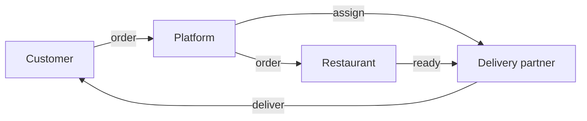
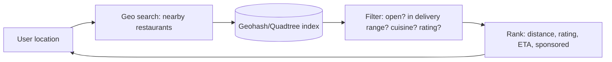
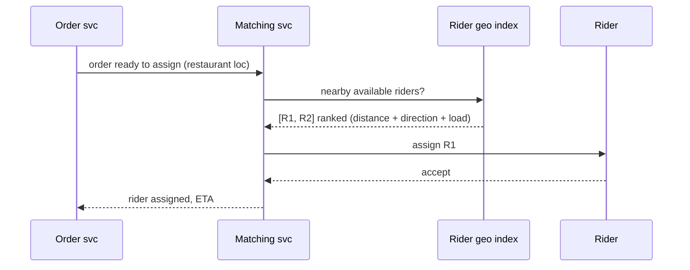
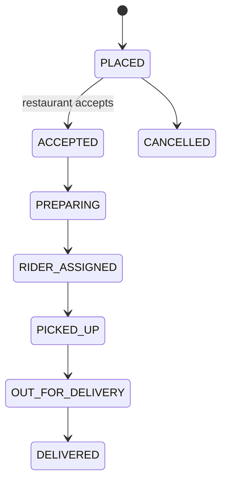
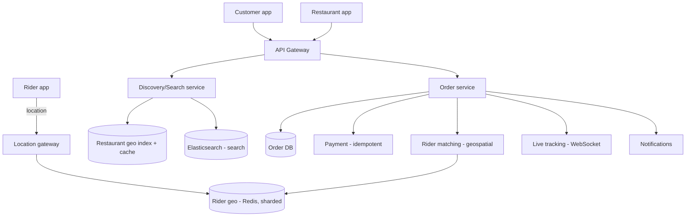

# 🍔 Design Swiggy / Zomato (Food Delivery)

> **Problem:** User nearby restaurants dhoondhe, food order kare, aur ek **delivery partner** us order
> ko restaurant se uthaake user tak pahunchaye — live tracking ke saath. Ye **three-sided marketplace**
> (customer + restaurant + rider) hai — **geospatial discovery + rider matching + real-time tracking**
> ka combo. Uber + e-commerce ka mix.

---

## 1. Requirements

### Functional
- **Discover** nearby restaurants (location, cuisine, rating, delivery time).
- **Menu + cart + order + payment**.
- **Restaurant** order accept + prep.
- **Delivery partner** assignment (nearest available) + live tracking + ETA.
- Ratings/reviews.

### Non-Functional
- **Low latency** discovery (geospatial search).
- **High availability**; correctness for orders/payment.
- Real-time tracking; spiky (lunch/dinner peaks).
- Three parties in sync.

---

## 2. ⭐ Three-sided system



Har side ka apna app + lifecycle. Platform inhe orchestrate karta.

---

## 3. ⭐ Part 1 — Restaurant Discovery (geospatial)

User ke aas-paas ke restaurants jo **deliver kar sakte** (within range). Geospatial + filters.



- Restaurants ko **geohash/quadtree** se index karo; user cell + neighbors → candidates. Dekho [Geospatial](../Advanced_Topics/06_Geospatial_and_Location_Services.md).
- Filter: open now, serviceable distance, cuisine; **rank** by distance/rating/ETA.
- **Read-heavy** → cache restaurant lists per area + [Search (Elasticsearch)](../Advanced_Topics/04_Search_Systems_and_Elasticsearch.md) for text/cuisine search.

---

## 4. ⭐ Part 2 — Delivery Partner Assignment (matching)

Order confirmed → nearest **available** rider ko assign (Uber-jaisa). Dekho [Uber](./11_Uber_Ride_Hailing.md).



- Rank riders by: distance to restaurant, current load, direction, rating.
- **Batching:** ek rider ko paas ke 2 orders (same route) → efficiency.
- Riders har few sec location bhejte → **in-memory geo (Redis GEO)**, region-sharded (write-heavy, ephemeral).

---

## 5. Order Lifecycle (state machine)



State machine se manage (LLD me [State pattern](../../LLD/L32%20State_design_pattern/)). Har transition → notification + tracking update.

---

## 6. API Design
```
GET  /v1/restaurants?lat=..&lng=..&cuisine=..  -> nearby restaurants (ranked)
GET  /v1/restaurant/{id}/menu
POST /v1/order   { items, address, payment } (idempotency key) -> order_id
GET  /v1/order/{id}/track  -> status + rider live location + ETA  (WebSocket)
```

---

## 7. Data Model
```
Restaurants: rest_id | location(geohash) | cuisine | rating | open_hours | menu_id
Orders:      order_id | user | rest_id | items[] | status | rider_id | payment_id
Riders:      rider_id | status | location   [Redis GEO, ephemeral]
```
- Restaurants → DB + geo index + cache; Orders → DB (transactional); Rider location → in-memory.

---

## 8. High-Level Architecture



---

## 9. Deep Dive

### ETA prediction
- Restaurant prep time (historical) + rider-to-restaurant + restaurant-to-user (road distance + traffic). ML model. Recompute live.

### Live tracking
- Rider location → **WebSocket** push to customer (live map). Dekho [WebSockets](../WebSockets_and_Realtime.md).

### Peak load (lunch/dinner)
- Order spike → async pipeline (queue); rider supply/demand balance (surge/incentives); pre-position riders in hotspots.

### Payment
- Idempotent (no double charge); order↔payment via Saga (fail → cancel order). Dekho [Idempotency](../Idempotency.md), [Distributed Transactions](../Distributed_Transactions.md).

### Search
- Text/cuisine/dish search → **Elasticsearch**; nearby → geospatial; combine.

---

## 10. Bottlenecks & Solutions

| Bottleneck | Solution |
|---|---|
| Nearby restaurant search | Geohash/quadtree + cache + Elasticsearch |
| Rider matching | Geospatial nearest + batching |
| Rider location writes | In-memory geo (Redis), region-sharded |
| Live tracking | WebSocket |
| Peak spikes | Async order pipeline + queue |
| Payment correctness | Idempotent + Saga |

---

## 11. Interview Talking Points
- **Three-sided** (customer/restaurant/rider) orchestration; **order state machine**.
- **Discovery = geospatial + filters + cache/Elasticsearch**.
- **Rider matching = Uber-style geospatial nearest + batching**; location in-memory + region-sharded.
- **Live tracking = WebSocket**; ETA = ML (prep + travel + traffic); payment idempotent + Saga.

---

## Summary
- **Three-sided marketplace**: discovery (**geospatial + filters + cache/Elasticsearch**), order (state machine, ACID + idempotent payment), delivery (**Uber-style rider matching + batching**).
- Rider location = in-memory Redis GEO, region-sharded; **live tracking = WebSocket**; ETA = ML.
- Peak spikes → async pipeline; order↔payment consistency via **Saga**.

> **Related:** [Uber](./11_Uber_Ride_Hailing.md) · [Zepto/Blinkit](./13_Zepto_Blinkit_Quick_Commerce.md) · [Geospatial](../Advanced_Topics/06_Geospatial_and_Location_Services.md) · [WebSockets](../WebSockets_and_Realtime.md) · [Distributed Transactions](../Distributed_Transactions.md)
