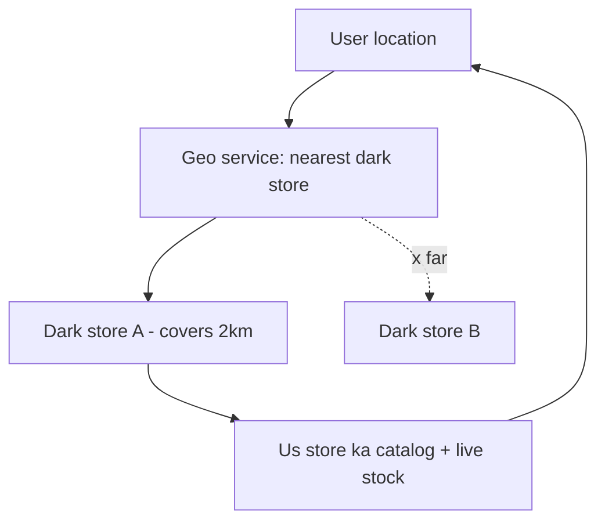
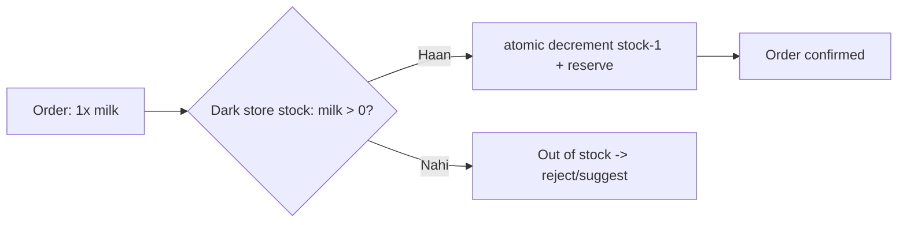
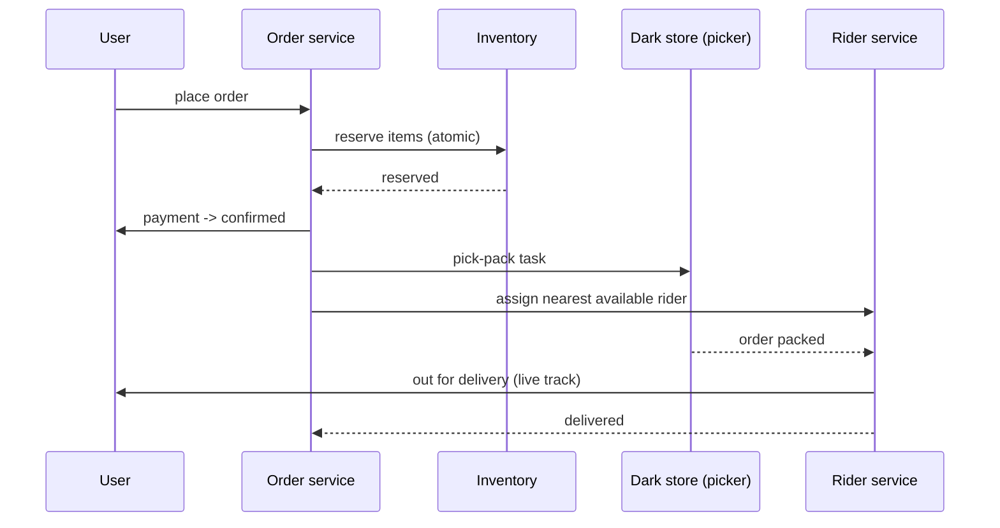
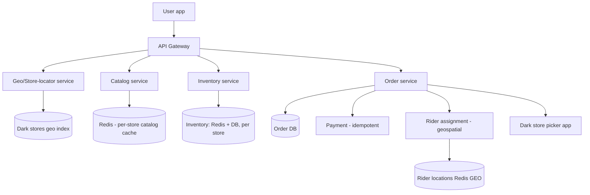

# 🛒 Design Zepto / Blinkit (Quick Commerce — 10-min delivery)

> **Problem:** Grocery **10 minute** me deliver karo. Ye normal e-commerce nahi — iska raaz **dark
> stores** (hyperlocal micro-warehouses) + **real-time hyperlocal inventory** + **fast rider
> assignment** hai. Challenge: har user ko sirf uske **nearby dark store** ka available stock dikhe,
> aur order turant pick-pack-deliver ho.

---

## 1. Requirements

### Functional
- **Location-based catalog** — user ke area ke dark store ka stock dikhao.
- **Real-time inventory** — jo stock me hai wahi dikhe (out-of-stock hide).
- **Cart + order + payment**.
- **Rider assignment** + live tracking + ~10 min ETA.
- Dark store operations (pick-pack).

### Non-Functional
- **Low latency** catalog/inventory (accurate, real-time).
- **High availability**; **consistency for inventory** (oversell na ho).
- Spiky (peak hours), hyperlocal scale.

---

## 2. ⭐ Core Concept — Dark Stores (hyperlocal)

Normal e-commerce = few big warehouses, 2-day delivery. Quick commerce = **bahut saare chhote dark
stores** (2-4 km radius each), har area cover. 10-min delivery = short distance + ready stock.



- User ki location → **nearest dark store** (geospatial). Uska hi catalog + inventory dikhao.
- Har dark store **apna** stock rakhta → inventory **per-store** (hyperlocal), global nahi. Dekho [Geospatial](../Advanced_Topics/06_Geospatial_and_Location_Services.md).

---

## 3. ⭐ Real-Time Inventory (oversell na ho)

Sabse critical — 2 users last packet ek saath order karein → sirf ek ko mile. Inventory per dark store,
**strongly consistent** decrement.



- **Atomic decrement** (conditional `WHERE stock > 0`) / lock → no oversell. Dekho [Concurrency Control](../Concurrency_Control.md).
- **Reservation:** cart→checkout ke time stock **reserve** (short hold), payment fail → release (TTL). Ticketmaster jaisa. Dekho [Ticketmaster](./15_Ticketmaster_Booking_System.md).
- Inventory = **fast store (Redis + DB)**; reads cached, writes strongly consistent.

---

## 4. Order → Delivery Flow



- **Rider assignment:** nearest available rider to dark store (geospatial + availability), ETA optimize. Uber-jaisa matching. Dekho [Uber](./11_Uber_Ride_Hailing.md).
- **Batching:** ek rider ko paas ke 2-3 orders (same direction) — efficiency.

---

## 5. API Design
```
GET  /v1/catalog?lat=..&lng=..   -> nearest store catalog + live stock
POST /v1/cart                     { items }
POST /v1/order                    { cart_id, address, payment } -> order_id (reserves stock)
GET  /v1/order/{id}/track         -> rider live location + ETA
```

---

## 6. Data Model
```
DarkStores:  store_id | location(geohash) | coverage_radius
Inventory:   store_id | product_id | available | reserved   [Redis + DB, per store]
Orders:      order_id | user | store_id | items[] | status | rider_id
Riders:      rider_id | status | current_location   [Redis GEO]
```
- **Inventory sharded by store** (hyperlocal → natural sharding). Dekho [Sharding](../21_Database_Sharding.md).

---

## 7. High-Level Architecture



---

## 8. Deep Dive

### Why per-store inventory (not global)?
10-min delivery = us area ke store ka stock hi relevant. Global inventory bemaani. **Naturally sharded
by store** → scale + locality. Different user → different store → different catalog.

### Consistency vs availability
- **Inventory decrement = strong consistency** (oversell disaster). CP here.
- **Catalog browse = cached** (eventual OK; final check order pe). Read-heavy → cache.

### Peak load
- Dinner/breakfast rush → order spike. Async order pipeline (queue), rider pre-positioning, surge.

### ETA
- Distance (store→user, short) + prep/pick time + rider availability → ~10 min promise. Real-time recompute.

---

## 9. Bottlenecks & Solutions

| Bottleneck | Solution |
|---|---|
| Oversell (last item race) | Atomic decrement / reservation + TTL |
| Nearby store lookup | Geospatial index (geohash) |
| Catalog reads | Per-store Redis cache |
| Inventory scale | Sharded by store (hyperlocal) |
| Rider matching | Geospatial + batching |
| Peak spikes | Async pipeline + queue |

---

## 10. Interview Talking Points
- **Dark store model** = hyperlocal micro-warehouses → **inventory sharded by store** (naturally).
- **Geospatial** (nearest store + nearest rider) = core.
- **Real-time inventory with atomic decrement + reservation** (no oversell) — CP for inventory.
- Catalog cached (AP); rider assignment = Uber-style matching + batching.

---

## Summary
- **Dark stores** (hyperlocal micro-warehouses) enable 10-min delivery → **inventory per-store (naturally sharded)**; user → nearest store via **geospatial**.
- **Real-time inventory**: atomic decrement + reservation-with-TTL → **no oversell** (CP); catalog browse cached (AP).
- **Rider assignment** = geospatial nearest + order batching (Uber-style); async order pipeline for peak; idempotent payment.

> **Related:** [Uber](./11_Uber_Ride_Hailing.md) · [Ticketmaster](./15_Ticketmaster_Booking_System.md) · [Geospatial](../Advanced_Topics/06_Geospatial_and_Location_Services.md) · [Concurrency Control](../Concurrency_Control.md) · [Swiggy/Zomato](./12_Swiggy_Zomato_Food_Delivery.md)
