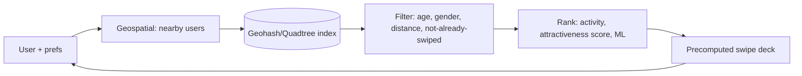
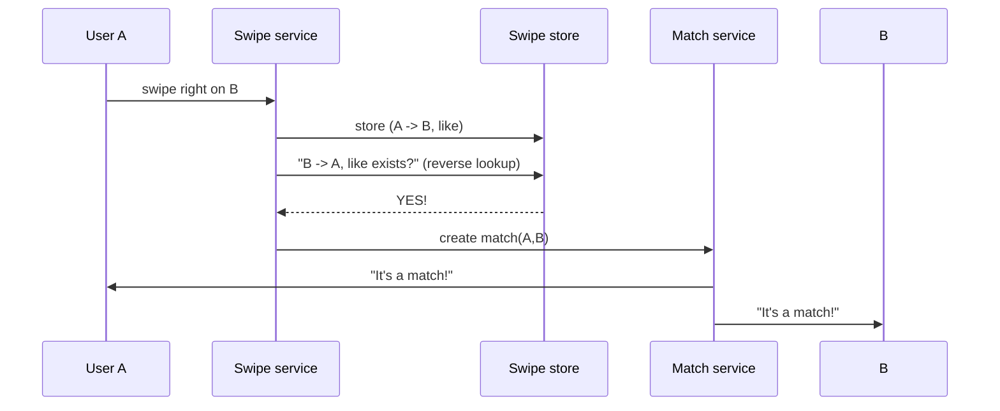
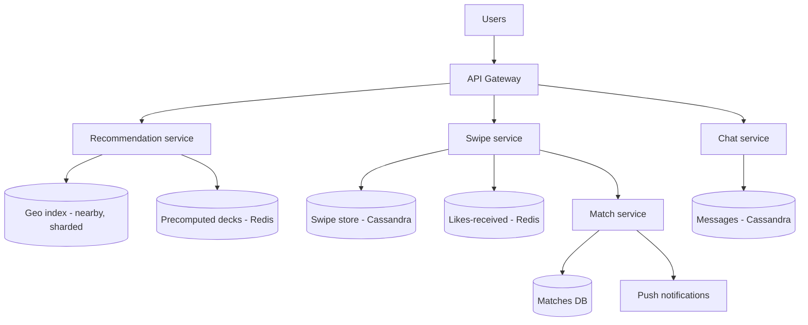

# 💘 Design Tinder (Dating / Swipe / Matching)

> **Problem:** Users nearby logon ke profiles dekhein, **swipe** karein (right = like, left = pass), aur
> jab **dono ne right swipe kiya** (mutual like) to **match** ho + chat khule. Ye **geospatial
> discovery** + **massive swipe writes** + **match detection** ka best example hai. Bumble/Hinge bhi similar.

---

## 1. Requirements

### Functional
- **Profile** (photos, bio, preferences: age/distance/gender).
- **Recommendations** — nearby, preference-matching profiles to swipe.
- **Swipe** — right (like) / left (pass) / super-like.
- **Match** — mutual right swipe → match + notification.
- **Chat** after match.

### Non-Functional
- **Low latency** recommendations (swipe deck ready).
- **Massive write throughput** (billions of swipes/day).
- **Scalable** geospatial (nearby people).
- Match detection real-time-ish.

---

## 2. Capacity Estimation

| Metric | Value |
|---|---|
| Users | ~75M+ |
| **Swipes/day** | ~2B → ~23K writes/s (peak much higher) ← write-heavy! |
| Matches/day | Millions |
| Recommendations | Precompute decks |

> **Key:** swipes = **huge write volume**; matches = rare (small % of swipes). Store efficiently.

---

## 3. ⭐ Part 1 — Recommendations (nearby + preferences)

User ko swipe deck chahiye: nearby + preference-matching (age, gender, distance) profiles.



- **Geospatial** — user cell + neighbors ke log; geo-sharding (region). Dekho [Geospatial](../Advanced_Topics/06_Geospatial_and_Location_Services.md).
- Filter: preferences + **already-swiped exclude** (don't re-show).
- **Rank/ELO-ish score** + ML (engagement). Precompute deck → instant swipe.

---

## 4. ⭐ Part 2 — Swipe storage (write-heavy)

Billions of swipes. Store efficiently — key = who swiped whom.

```
Swipes:  swiper_id | swipee_id | direction(like/pass) | timestamp
```
- **NoSQL (Cassandra)** — write-optimized (LSM), partition by swiper_id. Dekho [DB Indexing (LSM)](../Advanced_Topics/03_Database_Indexing_Deep_Dive.md), [SQL vs NoSQL](../SQL_vs_NoSQL.md).
- Passes bhi store (re-show avoid) — but can TTL/expire passes to save space.

---

## 5. ⭐ Part 3 — Match Detection (the clever bit)

A swipes right on B. Match tabhi jab B ne bhi A pe right kiya ho. **Check on write:**



- On each right-swipe, **reverse lookup**: "kya swipee ne pehle mujhe like kiya?" (`B→A like exists?`).
- Haan → **create match** + notify both (push). Nahi → bas swipe store.
- Reverse lookup fast: key `(swiper, swipee)` indexed; or Redis set of "who liked me".

> **Optimization:** "likes received" set per user in Redis → O(1) match check. Or async match-detection via stream (Kafka) if eventual match OK.

---

## 6. API Design
```
GET  /v1/recommendations       -> swipe deck (nearby, filtered, ranked)
POST /v1/swipe   { swipee_id, direction }  -> { matched: true/false }
GET  /v1/matches               -> list of matches
POST /v1/message { match_id, text }   (chat after match)
```

---

## 7. Data Model
```
Users:    user_id | location(geohash) | age | gender | prefs | photos[]
Swipes:   swiper_id | swipee_id | direction | ts    [Cassandra, by swiper]
LikesRecvd: user_id -> set of who-liked-them   [Redis, for O(1) match check]
Matches:  match_id | user_a | user_b | created_at
Messages: match_id | sender | text | ts
```

---

## 8. High-Level Architecture



---

## 9. Deep Dive

### Geo-sharding
- Users sharded by **region/geohash** — nearby queries local; user moves → re-shard (like Uber). Dekho [Sharding](../21_Database_Sharding.md).

### Handling write volume
- Swipes = fire-and-forget-ish (Cassandra fast writes); passes can be sampled/TTL'd.
- Match check async option: swipe → Kafka → match worker (if slight delay OK) to reduce hot-path latency.

### Don't re-show swiped profiles
- Bloom filter / set of swiped IDs per user → exclude from deck efficiently. Dekho [Bloom Filters](../Bloom_Filters_and_Probabilistic_Data_Structures.md).

### Chat
- Post-match chat = mini messaging system (WebSocket + message store). Dekho [WhatsApp/Chat](./07_WhatsApp_Chat.md).

### Recommendations quality
- ELO/desirability score, activity recency, ML (engagement prediction) → better deck.

---

## 10. Bottlenecks & Solutions

| Bottleneck | Solution |
|---|---|
| Nearby discovery | Geospatial index + geo-sharding |
| Billions of swipes (writes) | Cassandra (LSM, write-optimized), partition by swiper |
| Match detection | Reverse lookup / Redis "likes received" set |
| Re-showing swiped | Bloom filter / swiped-set exclude |
| Deck latency | Precompute decks (Redis) |
| Match notification | Push (APNs/FCM) |

---

## 11. Interview Talking Points
- **Geospatial** nearby + preference filter + precomputed decks (low-latency swipe).
- **Swipe = write-heavy** → Cassandra (LSM), partition by swiper.
- **Match = reverse lookup** on right-swipe (Redis "who liked me" set for O(1)); notify both.
- **Bloom filter** to exclude already-swiped; chat = post-match messaging.

---

## Summary
- **Recommendations** = geospatial nearby + preference filter + rank (ELO/ML) → **precomputed decks (Redis)** for instant swipe.
- **Swipes = massive writes** → **Cassandra (LSM)**, partition by swiper; exclude already-swiped via **Bloom filter/set**.
- **Match** = on right-swipe, **reverse lookup** (did swipee like me? — Redis "likes received" set, O(1)) → create match + push both.
- **Geo-sharding**; chat after match = mini messaging (WebSocket).

> **Related:** [Uber (geospatial)](./11_Uber_Ride_Hailing.md) · [WhatsApp/Chat](./07_WhatsApp_Chat.md) · [Geospatial](../Advanced_Topics/06_Geospatial_and_Location_Services.md) · [Bloom Filters](../Bloom_Filters_and_Probabilistic_Data_Structures.md) · [SQL vs NoSQL](../SQL_vs_NoSQL.md)
