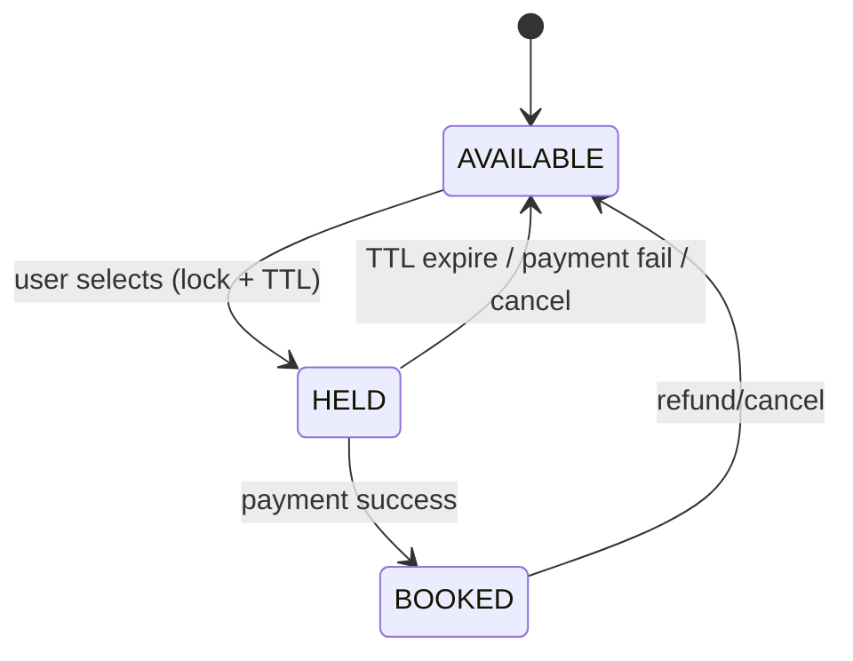
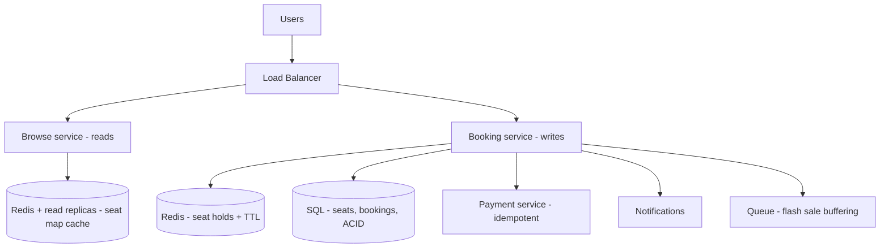

# 🎟️ Design Ticketmaster / Booking System (BookMyShow)

> **Problem:** Users events/movies/flights ke **seats book** karein — par ek seat **sirf ek** banda le
> paaye (double-booking bilkul nahi), lakhs users popular event pe ek saath toot padein (flash sale),
> aur payment ke beech seat "hold" ho. Ye design **concurrency control** aur **consistency** ka best
> example hai — yahan **money + correctness** > raw scale.

---

## 1. Requirements

### Functional
- Events/shows/seats browse.
- **Seat booking** — select seat(s) → hold → pay → confirm.
- **No double-booking** — ek seat ek hi banda.
- **Temporary hold** — payment ke time seat reserve (5-10 min).
- Search, view, cancel/refund.

### Non-Functional
- **Strong consistency** for booking (double-booking = disaster). ← CP over AP here.
- **High concurrency** — flash sale (Coldplay tickets 🎤): lakhs ek saath ek seat pe.
- **Availability** for browse (reads), **correctness** for booking (writes).

---

## 2. Capacity Estimation

| Metric | Value |
|---|---|
| Browse (read) | Very high, especially before popular event |
| Booking (write) | Spiky — flash sale = huge contention on few seats |

> **Key insight:** reads (browse) scale easily (cache/replicas); **writes (booking) = correctness under
> contention** — that's the real problem. Yahan CAP me **consistency** choose karte hain (dekho [CAP](../11_CAP_Theorem.md)).

---

## 3. ⭐ Core Problem — no double-booking (concurrency)

Do users same seat A1 ek saath book karte. **Race condition** → dono ko mil gaya = double-booking.
Solutions (dekho [Concurrency Control](../Concurrency_Control.md)):

### Option A: Pessimistic Locking (`SELECT ... FOR UPDATE`)
Seat row ko lock karo, book karo, release. Doosra wait karta.
```sql
BEGIN;
SELECT status FROM seats WHERE id='A1' FOR UPDATE;  -- lock
-- if available:
UPDATE seats SET status='BOOKED', user='U1' WHERE id='A1';
COMMIT;  -- lock release
```
- ✅ Strong guarantee (no double-book). ❌ Locks = contention/slow under flash sale, deadlock risk.

### Option B: Optimistic Locking (version / conditional update)
Lock mat lo; update ke time check karo "abhi bhi available?":
```sql
UPDATE seats SET status='BOOKED', user='U1'
WHERE id='A1' AND status='AVAILABLE';   -- atomic conditional
-- rows_affected = 1 -> mila; 0 -> koi aur le gaya, retry/fail
```
- ✅ No locks, high throughput jab conflicts kam. ❌ Conflicts zyada (same seat) → bahut retries.

### Option C: Distributed lock (Redis) for the hold
Multi-server → seat pe distributed lock (Redis `SETNX` + TTL). Dekho [Concurrency Control](../Concurrency_Control.md).

> **Interview answer:** "Seat status pe **atomic conditional update** (optimistic) — DB unique
> guarantee. Hold ke liye Redis lock with TTL. DB `WHERE status='AVAILABLE'` = single source of truth,
> double-booking impossible."

---

## 4. ⭐ Seat Hold (reserve during payment)

User seat select kare → **hold** (5-10 min) → pay → confirm. Hold ke bina: payment ke beech koi aur le
le. Hold ke saath: seat temporarily blocked, timeout pe auto-release.



- Hold = seat status `HELD` + **TTL** (Redis key with expiry, ya DB `held_until` timestamp).
- **Auto-release:** TTL expire → seat wapas `AVAILABLE` (background job / Redis expiry).
- Payment success within window → `BOOKED`. Fail/timeout → released.

---

## 5. API Design
```
GET  /v1/events/{id}/seats          -> seat map (available/held/booked)
POST /v1/hold    { event_id, seat_ids }  -> hold_id + expires_at   (locks seats)
POST /v1/book    { hold_id, payment }     -> booking_id            (confirm)
POST /v1/cancel  { booking_id }
```
> **Idempotency:** `book` with idempotency key → double-click / retry pe double charge/booking nahi. Dekho [Idempotency](../Idempotency.md).

---

## 6. Data Model
```
Events:  event_id | name | venue | datetime
Seats:   seat_id | event_id | status(AVAILABLE/HELD/BOOKED) | held_until | user_id | version
Bookings: booking_id | user_id | seat_ids[] | status | payment_id | created_at
```
- Seats/Bookings → **SQL (ACID transactions)** — strong consistency, unique constraint. Dekho [SQL vs NoSQL](../SQL_vs_NoSQL.md).
- Seat status = **single source of truth**; unique/conditional update = no double-book.

---

## 7. High-Level Architecture



---

## 8. Deep Dive

### Flash sale (lakhs on few seats)
- **Virtual waiting room / queue:** users ko queue me daalo, controlled rate se booking me aane do → DB
  ko protect (thundering herd roko). Dekho [Rate Limiter](./02_Rate_Limiter.md), [Resilience](../Advanced_Topics/07_Resilience_and_Fault_Tolerance.md).
- Reads (seat map) → heavily cached; writes → serialized per seat (atomic).

### Read vs Write split
- **Browse (read-heavy):** cache + read replicas — eventual consistency OK (seat map thoda stale chalega, final check booking pe).
- **Book (write):** strong consistency (ACID, conditional update) — yahan koi compromise nahi.

### Payment + booking consistency
- Seat hold → payment → confirm. Payment third-party (slow, can fail). Use **Saga / hold-then-confirm**:
  payment fail → release hold (compensate). Dekho [Distributed Transactions](../Distributed_Transactions.md), [Saga](../01_Monolithic_and_Microservices.md).
- **Idempotent payment** — retry safe (no double charge). Dekho [Idempotency](../Idempotency.md).

### Consistency > availability here
- CAP: booking me **CP** (consistency) — network issue me better reject than double-book. Browse me AP (available) OK.

---

## 9. Bottlenecks & Solutions

| Bottleneck | Solution |
|---|---|
| Double-booking | Atomic conditional update / lock, DB unique |
| Payment-window seat grab | Seat hold + TTL (auto-release) |
| Flash sale contention | Virtual waiting room / queue + caching reads |
| Double charge on retry | Idempotency key |
| Payment fail mid-flow | Saga (release hold / compensate) |
| Browse load | Cache + read replicas |

---

## 10. Interview Talking Points
- **Concurrency control** (optimistic conditional update / pessimistic lock) = core; DB status = single truth.
- **Seat hold + TTL** (reserve during payment, auto-release).
- **Idempotency** (no double charge/booking).
- **CP over AP** for booking (consistency wins); reads AP + cached.
- **Flash sale:** virtual waiting room/queue; **Saga** for payment↔booking.

---

## Summary
- Core = **no double-booking under concurrency**: **atomic conditional update** (`WHERE status='AVAILABLE'`) / locking — DB seat status = single source of truth (ACID SQL).
- **Seat hold + TTL** reserves during payment (auto-release on timeout/fail); **idempotency** prevents double charge.
- **CP over AP** for booking; reads (browse) = cache + replicas (AP, eventual OK).
- **Flash sale** → virtual waiting room/queue; **payment↔booking** via Saga (compensate on failure).

> **Related:** [Concurrency Control](../Concurrency_Control.md) · [Idempotency](../Idempotency.md) · [Distributed Transactions](../Distributed_Transactions.md) · [CAP Theorem](../11_CAP_Theorem.md) · [SQL vs NoSQL](../SQL_vs_NoSQL.md)
