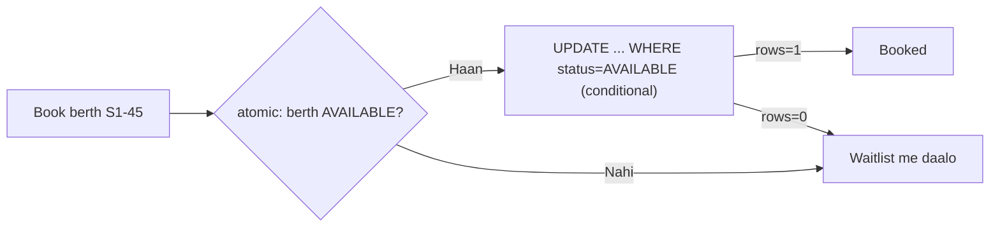
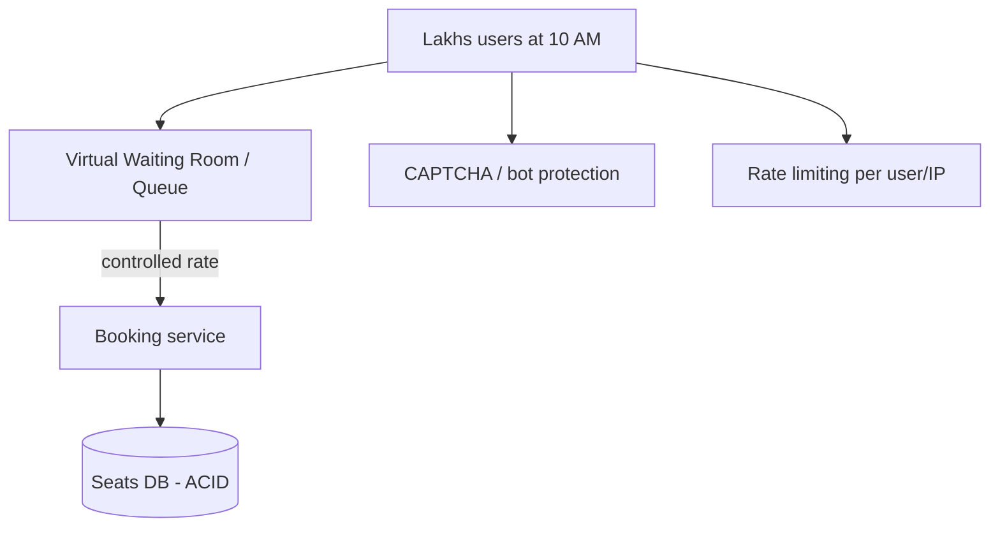
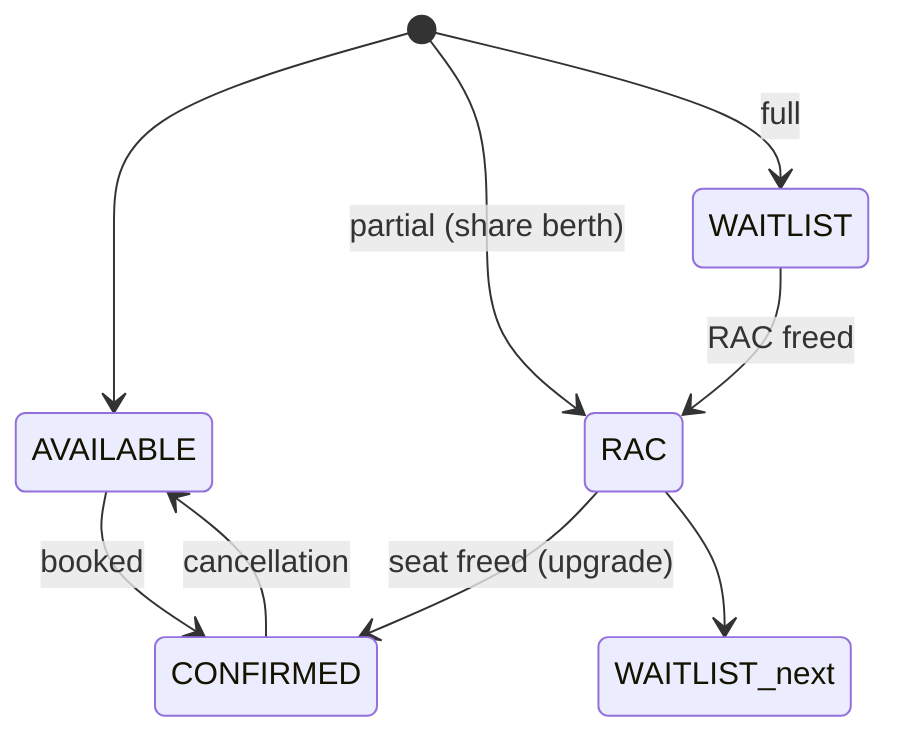
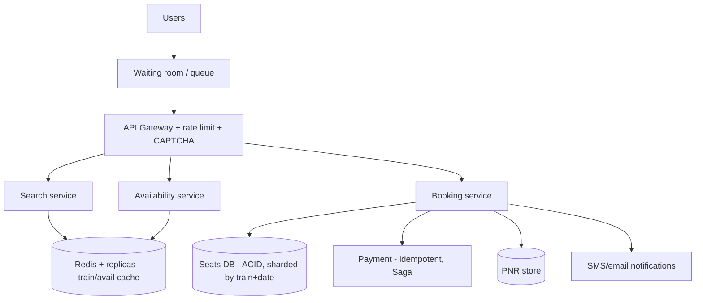

# 🚆 Design IRCTC (Train Ticket Booking)

> **Problem:** Trains me seats/berths book karo — par **Tatkal** window pe (10 AM) lakhs users ek saath
> toot padte hain (massive spike), seat **double-book na ho**, aur **waitlist/RAC/quota** ka complex
> logic handle ho. Ye Ticketmaster ka desi + tougher version hai — **concurrency under extreme load** +
> **fairness** iska asli challenge.

---

## 1. Requirements

### Functional
- Search trains (source→dest, date), **seat availability** dekho.
- **Book** seats/berths — no double-booking.
- **Waitlist (WL) + RAC** — seat full → waitlist; cancellation pe auto-upgrade.
- **Quotas** (General/Tatkal/Ladies/Senior), classes (SL/3A/2A).
- **PNR** status, payment, cancellation/refund.

### Non-Functional
- **Extreme spike handling** — Tatkal 10 AM: lakhs concurrent on few seats.
- **Strong consistency** for booking (double-book = disaster). **CP.**
- **Fairness** — pehle aaya pehle mile (as much as possible).
- High availability for search (reads).

---

## 2. Capacity Estimation

| Metric | Value |
|---|---|
| Users | Crores registered |
| Tatkal spike | Lakhs concurrent requests in seconds on **limited seats** |
| Read (search/availability) | Very high |
| Write (booking) | Spiky, high-contention on few rows |

> **Key:** reads scale easy; **the war is writes (booking) under Tatkal thundering herd** — correctness + fairness.

---

## 3. ⭐ Core — No double-booking (concurrency)

Har seat/berth ek hi banda le. Do requests same berth ek saath → race. Solutions (dekho [Concurrency Control](../Concurrency_Control.md)):



- **Atomic conditional update** (`WHERE status='AVAILABLE'`) / row lock → **DB = single source of truth**, oversell impossible.
- **Availability count** per train/class/quota — decrement atomically; 0 → waitlist.
- Money involved → **idempotent** booking (double-click, retry). Dekho [Idempotency](../Idempotency.md).

---

## 4. ⭐ Tatkal Spike — thundering herd

10:00:00 AM sharp, lakhs hit "book". Naive → DB crash. Solutions:



- **Virtual waiting room / queue** — sabko queue me daalo, controlled rate se booking me aane do → DB protect. Dekho [Rate Limiter](./02_Rate_Limiter.md), [Resilience](../Advanced_Topics/07_Resilience_and_Fault_Tolerance.md).
- **Rate limiting** per user/IP; **CAPTCHA** (bots/agents block).
- **Reads (availability) heavily cached** — everyone refreshing; cache + replicas absorb.
- Booking writes **serialized per seat** (atomic) — contention pe controlled.

---

## 5. Waitlist & RAC (IRCTC-specific logic)



- **Confirmed → Cancel** → frees a berth → **RAC upgrades to Confirmed**, **WL upgrades to RAC** (chain).
- **Ordering/fairness:** WL number = booking order → cancellation pe **FIFO** upgrade.
- Chart preparation (few hrs before) → final allocation. This upgrade-chain = interesting consistency problem (must be atomic + ordered).

---

## 6. API Design
```
GET  /v1/trains?src=..&dst=..&date=..    -> trains + availability (cached)
GET  /v1/availability/{train}/{class}     -> seats/WL count
POST /v1/book   { train, class, quota, passengers, payment } (idempotency key) -> PNR
GET  /v1/pnr/{pnr}                         -> status
POST /v1/cancel { pnr }                    -> refund
```

---

## 7. Data Model
```
Trains:    train_id | route | schedule
Coaches:   coach_id | train_id | class | total_berths
Seats:     seat_id | train_id | date | class | quota | status | version
Bookings:  pnr | user | train | date | passengers[] | status | payment_id
Waitlist:  train | date | class | wl_number | user   (ordered)
```
- Seats/Bookings → **SQL (ACID)** — strong consistency, conditional update, unique. Dekho [SQL vs NoSQL](../SQL_vs_NoSQL.md).
- **Shard by train+date** (natural partition — different trains independent).

---

## 8. High-Level Architecture



---

## 9. Deep Dive

### Read vs Write split
- **Search/availability (read-heavy):** cache + read replicas — everyone refreshing pe DB na gire (eventual OK; final truth at booking).
- **Booking (write):** strong consistency (ACID, atomic conditional) — no compromise. **CP over AP.** Dekho [CAP](../11_CAP_Theorem.md).

### Payment + booking consistency
- Seat reserve → payment (slow, third-party, can fail) → confirm. **Saga**: payment fail → release seat (compensate). Dekho [Distributed Transactions](../Distributed_Transactions.md).
- Idempotent payment/booking (retry-safe, no double charge/book).

### Fairness under Tatkal
- Queue-based ordering + per-user rate limit + bot protection → genuine users ko fair chance. Perfect fairness impossible at that scale, but queue+limits help.

---

## 10. Bottlenecks & Solutions

| Bottleneck | Solution |
|---|---|
| Tatkal thundering herd | Waiting room/queue + rate limit + CAPTCHA |
| Double-booking | Atomic conditional update / lock (ACID) |
| Availability refresh storm | Cache + read replicas |
| Payment-window seat grab | Reserve + TTL |
| Payment fail mid-flow | Saga (release seat) + idempotency |
| WL/RAC upgrade correctness | Atomic ordered upgrade chain |
| Scale | Shard by train + date |

---

## 11. Interview Talking Points
- **Concurrency (atomic conditional update)** = no double-book; DB = single truth; **CP over AP**.
- **Tatkal spike** = virtual waiting room + rate limit + CAPTCHA + cached reads (the real challenge).
- **Waitlist/RAC** = ordered (FIFO) atomic upgrade chain on cancellation.
- **Payment** = Saga + idempotency; **shard by train+date**.

---

## Summary
- Core = **no double-booking under extreme concurrency**: atomic conditional update / locking on seats (ACID SQL), **CP over AP**.
- **Tatkal thundering herd** → virtual waiting room + per-user rate limit + CAPTCHA; **reads cached + replicas**.
- **Waitlist/RAC** = FIFO ordered atomic upgrade chain on cancellation; **payment via Saga + idempotency**; **shard by train+date**.

> **Related:** [Ticketmaster](./15_Ticketmaster_Booking_System.md) · [Concurrency Control](../Concurrency_Control.md) · [Idempotency](../Idempotency.md) · [Distributed Transactions](../Distributed_Transactions.md) · [CAP Theorem](../11_CAP_Theorem.md)
