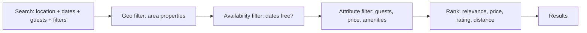
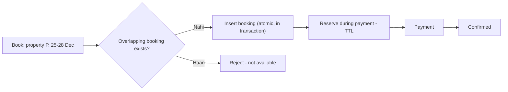
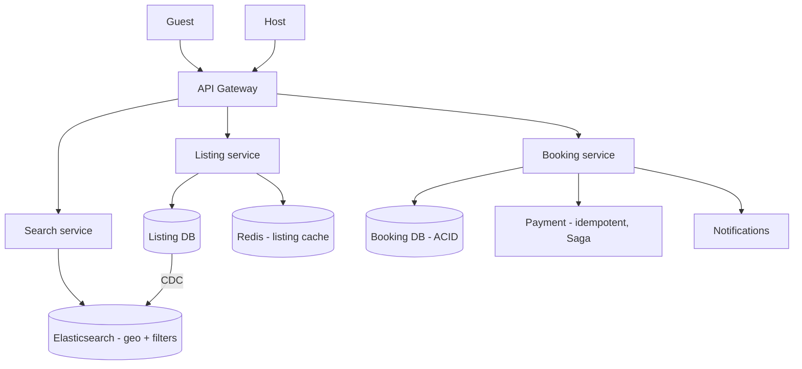

# 🏠 Design Airbnb (Booking Marketplace)

> **Problem:** Hosts apni properties list karein, guests location/dates/filters se search karein, aur
> **book** karein — **double-booking na ho** (ek property ek date range me ek hi guest). Ye **two-sided
> marketplace** hai — **geospatial + availability search + booking concurrency** ka combo. Hotel booking
> / OYO / Booking.com bhi similar.

---

## 1. Requirements

### Functional
- **Host:** property list (photos, price, availability calendar, amenities).
- **Guest:** search (location, dates, guests, filters), view, **book**.
- **Availability** — date-range based (no double-book for overlapping dates).
- Payment, reviews (two-way), messaging host↔guest.

### Non-Functional
- **Low latency search** (geospatial + date + filters).
- **Strong consistency for booking** (no double-book). CP for booking.
- **High availability** for search/browse (read-heavy).
- Global scale.

---

## 2. ⭐ Part 1 — Search (geo + dates + filters)

Sabse complex read: "Goa me, 25-28 Dec, 4 guests, pool, <₹5000" → matching + available properties, ranked.



- **Geospatial** — area ke properties (geohash/quadtree or Elasticsearch geo). Dekho [Geospatial](../Advanced_Topics/06_Geospatial_and_Location_Services.md).
- **Availability** — property us date-range me free? (calendar check).
- **Attributes** — guests capacity, price range, amenities.
- **Elasticsearch** — geo + filters + full-text + ranking ek jagah (denormalized listing index). Dekho [Search Systems](../Advanced_Topics/04_Search_Systems_and_Elasticsearch.md).

> **Denormalized search index:** listing + location + amenities + availability summary ek ES document me → fast multi-filter search. Source of truth alag DB (sync via CDC).

---

## 3. ⭐ Part 2 — Booking (no double-booking, date-range)

Ticketmaster se alag: yahan **date ranges** overlap ka issue. 25-28 Dec book hai → 27-30 Dec overlap → reject.



- **Overlap check + insert** in one **transaction** (ACID) with locking → no double-book. Conditional/serializable isolation. Dekho [Concurrency Control](../Concurrency_Control.md).
- **Reservation/hold** during payment (TTL) — payment fail → release. Dekho [Ticketmaster](./15_Ticketmaster_Booking_System.md).
- **Idempotent** booking/payment. Dekho [Idempotency](../Idempotency.md).

```sql
BEGIN;
-- lock property's bookings, check overlap
SELECT 1 FROM bookings
 WHERE property_id=? AND date_range && '[2026-12-25,2026-12-28)'  -- overlap
 FOR UPDATE;
-- if none: insert
INSERT INTO bookings (...) VALUES (...);
COMMIT;
```

---

## 4. API Design
```
GET  /v1/search?loc=..&checkin=..&checkout=..&guests=..&filters=..  -> listings
GET  /v1/listing/{id}                       -> details + availability calendar
POST /v1/booking { listing_id, dates, guests, payment } (idempotency key) -> booking_id
POST /v1/listing (host)  { details, calendar, price }
```

---

## 5. Data Model
```
Listings:  listing_id | host_id | location(geohash) | capacity | price | amenities[]
Calendar:  listing_id | date | available | price   (or booking date-ranges)
Bookings:  booking_id | listing_id | guest_id | checkin | checkout | status | payment_id
Reviews:   listing_id | guest_id | rating | text
```
- Bookings/Calendar → **SQL (ACID)** for consistency; Listings → DB + **Elasticsearch** (search index) + cache.
- **Shard by listing_id** (bookings) / by geo region (search).

---

## 6. High-Level Architecture



---

## 7. Deep Dive

### Search index sync (CDC)
- Listing/availability changes in DB → **CDC** → update Elasticsearch (eventually consistent). Search = derived; booking = source of truth. Dekho [Search Systems](../Advanced_Topics/04_Search_Systems_and_Elasticsearch.md).

### Read vs Write
- **Search/browse (read-heavy):** Elasticsearch + cache + replicas (eventual OK; final availability check at booking).
- **Booking (write):** strong consistency (ACID, overlap check in txn) — **CP**. Dekho [CAP](../11_CAP_Theorem.md).

### Availability calendar
- Model as booked date-ranges (overlap query) or per-date rows. Range-overlap index (Postgres `daterange` + GiST) makes overlap check fast.

### Payment + booking
- Hold → payment → confirm; **Saga** (payment fail → release hold). Idempotent. Dekho [Distributed Transactions](../Distributed_Transactions.md).

### Pricing
- Dynamic pricing (demand, season, events) — price per date; host + smart pricing.

---

## 8. Bottlenecks & Solutions

| Bottleneck | Solution |
|---|---|
| Complex geo+date+filter search | Elasticsearch (denormalized index) + cache |
| Double-booking (date overlap) | Overlap check + insert in ACID txn / lock |
| Payment-window grab | Reserve/hold + TTL |
| Search freshness | CDC (DB → ES), eventual |
| Payment fail | Saga + idempotency |
| Scale | Shard bookings by listing, search by region |

---

## 9. Interview Talking Points
- **Two parts:** search (geo + dates + filters via **Elasticsearch**) and booking (**date-range overlap, no double-book, ACID**).
- **Overlap check + insert in one transaction** (serializable/lock) — the concurrency core.
- **Search = derived (CDC-synced ES), booking = source of truth (SQL)**; CP for booking.
- Hold + TTL + Saga + idempotency for payment.

---

## Summary
- **Search** = geospatial + date-availability + attribute filters, best via **Elasticsearch** (denormalized index, CDC-synced from DB), cache + replicas (read-heavy, eventual).
- **Booking** = **date-range overlap check + insert in one ACID transaction** (lock/serializable) → no double-book; **CP over AP**.
- **Hold + TTL + Saga + idempotency** for payment; shard bookings by listing, search by region; dynamic pricing.

> **Related:** [Ticketmaster](./15_Ticketmaster_Booking_System.md) · [Search Systems](../Advanced_Topics/04_Search_Systems_and_Elasticsearch.md) · [Geospatial](../Advanced_Topics/06_Geospatial_and_Location_Services.md) · [Concurrency Control](../Concurrency_Control.md) · [Distributed Transactions](../Distributed_Transactions.md)
