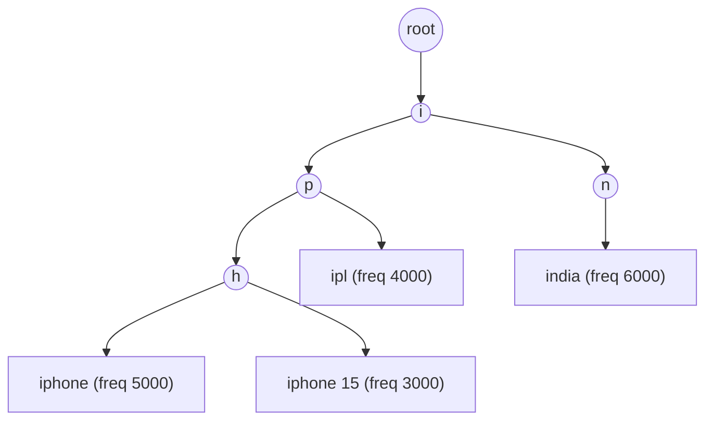
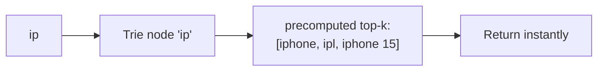
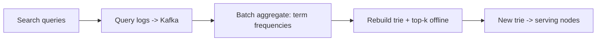
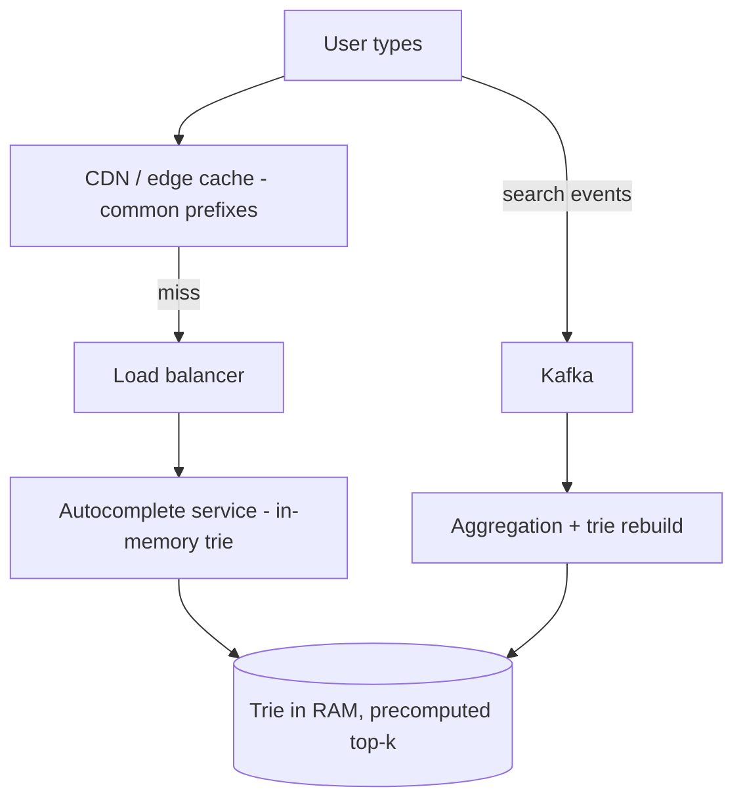

# 🔤 Design Search Autocomplete / Typeahead

> **Problem:** User search box me type kar raha ("ip"), har keystroke pe **top suggestions** dikhao
> ("iphone", "iphone 15", "ipl") — **ultra-low latency** (<100ms), popularity ke hisaab se ranked,
> typo-tolerant. Google/Amazon/YouTube search bar. Ye **Trie**, **top-k ranking**, aur **caching** ka
> best example hai.

---

## 1. Requirements

### Functional
- Har keystroke pe **top 5-10 suggestions** (prefix match).
- **Popularity ranking** (jo zyada search hua wo upar).
- **Fast** (real-time, har character pe).
- (Extension) typo tolerance, personalization, recent searches.

### Non-Functional
- **Ultra-low latency** (<100ms — har keystroke pe query!).
- **Read-heavy** (suggestions >>> updates).
- **Scalable** — billions of queries, huge vocabulary.
- Eventual consistency OK (naya trending term thodi der me aaye chalega).

---

## 2. Capacity Estimation

| Metric | Value |
|---|---|
| Searches/day | ~5B |
| Autocomplete requests | Har search ~5-6 keystrokes → ~25-30B/day → **massive read QPS** |
| Latency budget | <100ms (each keystroke) |

> **Key:** read QPS insane (har keystroke = request) → **caching + precomputed top-k** must.

---

## 3. ⭐ Core Data Structure — Trie (Prefix Tree)

**Trie** = tree jahan har path ek prefix. "ip" pe utro → us node ke neeche saare completions.

- Prefix `"ip"` → subtree me `iphone, iphone 15, ipl` → **frequency se sort** → top-k.
- Problem: har query pe **poora subtree traverse** karke top-k nikalna slow (subtree bada ho sakta).

### ⭐ Optimization — precompute top-k at each node
Har trie node pe uske subtree ke **top-k completions pehle se store** kar lo (cache). Ab `"ip"` pe →
seedha us node ka precomputed list return (no traversal). **O(prefix length)** — super fast.

---

## 4. Ranking — kaunse suggestions upar

- **Frequency/popularity** — kitni baar search hua (main signal).
- **Recency / trending** — abhi zyada search ho raha (time-weighted).
- **Personalization** — user ki history (optional).
- **Context** — location, language.

> Precomputed top-k me frequency-sorted rakho; trending ke liye time-decay weight.

---

## 5. ⭐ Updating the Trie (frequency kaise badhti)

Real-time har search pe trie update karna mehnga (write on hot read structure). Instead:

- Search events → **Kafka** → **batch aggregation** (hourly/daily) → **rebuild trie** with fresh
  frequencies + top-k → deploy to serving nodes. Dekho [Big Data](../Advanced_Topics/05_Big_Data_and_Stream_Processing.md).
- **Eventual consistency:** naya trending term next rebuild me aata (thoda lag OK).
- Trending/hot terms ke liye ek fast-path (real-time counter) bhi laga sakte.

---

## 6. Architecture

- **In-memory trie** on serving nodes (RAM = fast).
- **Sharded** by prefix (a-f nodes, g-m nodes...) ya replicated (trie fits? replicate for read scale).
- **CDN/edge cache** for very common prefixes ("a", "i", "the") — half requests wahin nipat jaate.

---

## 7. Deep Dive

### Caching layers
1. **Client-side** — recent/local suggestions cache.
2. **CDN/edge** — popular prefixes.
3. **Service memory** — full trie in RAM.
> Ye teen layer 90%+ requests ko backend se pehle nipta dete.

### Scaling the trie
- **Replication:** trie chhota (fits in RAM) → replicate across nodes for read QPS.
- **Sharding:** huge vocabulary → shard by first char/prefix range; router prefix ke hisaab se node chunta. Dekho [Sharding](../21_Database_Sharding.md).

### Typo tolerance
- Edit-distance / fuzzy match (costly) — ya common misspellings pre-map. Elasticsearch fuzzy for full search. Dekho [Search Systems](../Advanced_Topics/04_Search_Systems_and_Elasticsearch.md).

### Debouncing (client)
- Har keystroke pe request na bheje — thoda wait (jaise 100-200ms typing ruke) phir bheje → backend load kam.

---

## 8. Bottlenecks & Solutions

| Bottleneck | Solution |
|---|---|
| Insane read QPS (per keystroke) | Multi-layer cache (client/CDN/RAM) + debounce |
| Subtree traversal slow | Precomputed top-k per node |
| Trie updates on hot path | Offline rebuild (Kafka → batch) |
| Huge vocabulary | Shard trie by prefix; replicate for reads |
| Trending freshness | Periodic rebuild + real-time counter fast-path |

---

## 9. Interview Talking Points
- **Trie** + **precomputed top-k per node** = the core (O(prefix), no traversal).
- **Ultra read-heavy** → multi-layer caching (client + CDN + in-memory) + client debounce.
- **Offline rebuild** (Kafka → aggregate → new trie) — don't update on hot read path; eventual consistency OK.
- **Ranking** by frequency + recency; scale via replication (trie small) or prefix sharding.

---

## Summary
- Core = **Trie** with **precomputed top-k at each node** → O(prefix length) instant suggestions (no subtree traversal).
- **Ultra low-latency read-heavy** → in-memory trie + **multi-layer cache** (client/CDN/RAM) + client debounce.
- **Ranking** = frequency + recency (+ personalization); **updates offline** (search events → Kafka → aggregate → rebuild trie), eventual consistency.
- **Scale** = replicate (trie fits RAM) or shard by prefix.

> **Related:** [Search Systems & Elasticsearch](../Advanced_Topics/04_Search_Systems_and_Elasticsearch.md) · [Caching](../08_Caching_and_Distributed_Caching.md) · [Big Data](../Advanced_Topics/05_Big_Data_and_Stream_Processing.md) · [CDN](../10_Content_Delivery_Network_CDN.md) · [Sharding](../21_Database_Sharding.md)
