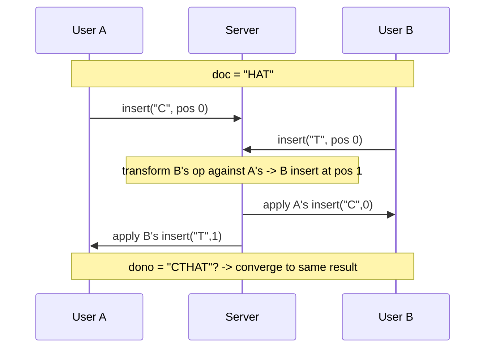
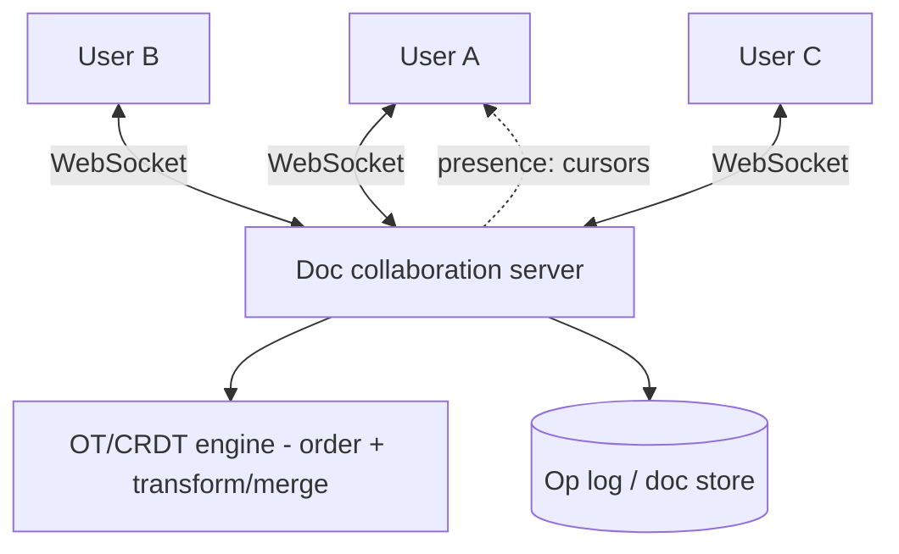
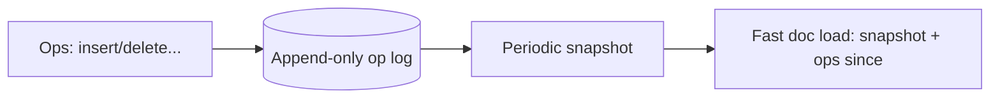
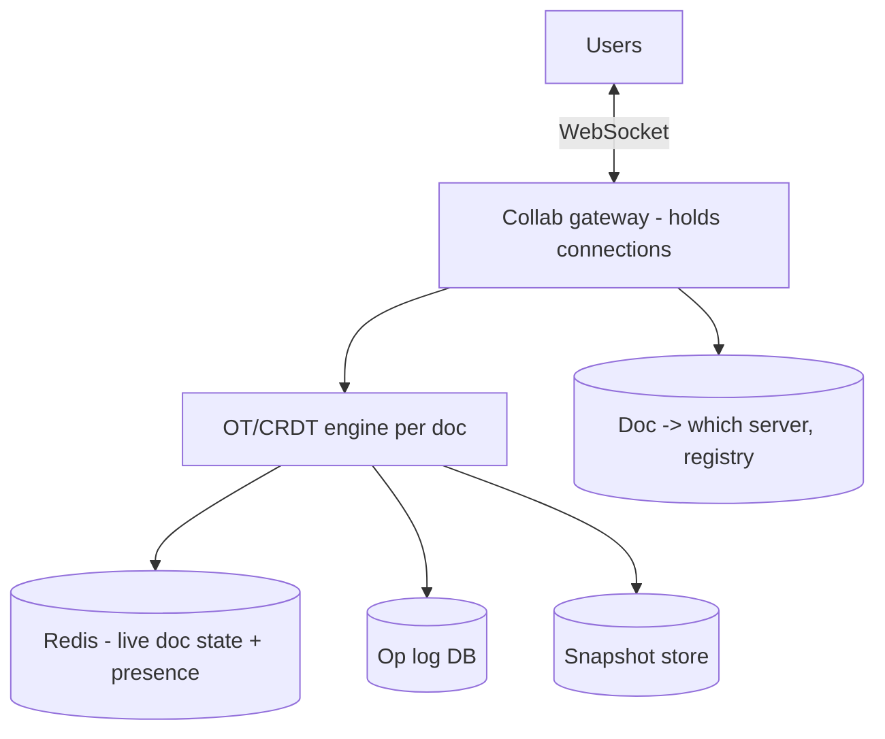

# 📝 Design Google Docs (Collaborative Editing)

> **Problem:** Multiple users ek hi document **ek saath** edit karein, aur sabko **real-time** me ek
> doosre ke changes dikhein — bina conflicts, bina data loss. "Kaun kahan type kar raha" (cursors) bhi
> dikhe. Ye design **real-time collaboration**, **conflict resolution (OT/CRDT)**, aur **WebSockets**
> ka best (aur toughest) example hai.

---

## 1. Requirements

### Functional
- **Concurrent editing** — kai users ek doc ek saath.
- **Real-time sync** — changes turant sabko dikhein.
- **Conflict-free** — do log ek jagah type karein to consistent result.
- **Cursors/presence** — kaun kahan hai.
- **History/versions**, comments, offline edit.

### Non-Functional
- **Low latency** (<100ms — typing feel).
- **Strong eventual consistency** — sab users same final doc dekhein.
- **Availability**, no data loss.

---

## 2. ⭐ Core Challenge — concurrent edits ka conflict

Do users ek sastring `"HAT"` edit karte hain **ek saath**:
- User A: position 0 pe insert "C" → wants `"CHAT"`.
- User B: position 0 pe insert "T" → wants `"THAT"`.

Naive "last write wins" → ek ka change udd jaayega ya doc corrupt. Chahiye: dono edits **merge** hokar
**consistent** result (sabke paas same). Iske 2 solutions: **OT** aur **CRDT**.

---

## 3. ⭐ Approach 1 — Operational Transformation (OT)

Har edit ek **operation** (insert/delete at position). Jab do operations concurrent ho, ek ko doosre ke
"against" **transform** karo taaki intent preserve rahe aur sab converge karein.

- Server operations ko **serialize** karta (ek order de deta) + transform.
- **Google Docs OT use karta.**
- ✅ Efficient (chhote ops), position-based. ❌ **Transform logic complex** (edge cases bahut), central server pe dependent.

---

## 4. ⭐ Approach 2 — CRDT (Conflict-free Replicated Data Type)

Har character ko ek **unique, ordered ID** do (position between neighbors, globally unique). Edits
**commutative** ban jaate — kisi bhi order me apply karo, **same result** (no transform needed).

- Insert = ek unique-ID'd character add (fractional index between neighbors).
- Delete = tombstone mark.
- **Any order → same final doc** (mathematically conflict-free).
- ✅ **Decentralized** (P2P possible), no central transform, offline-friendly. ❌ **Metadata heavy**
  (har char ka ID + tombstones) → memory. (Figma, newer tools CRDT use karte.)

> Dekho [Database Replication → CRDT](../Database_Replication.md) (conflict resolution). **OT vs CRDT** =
> classic interview discussion.

| | OT | CRDT |
|---|---|---|
| Kaise | Transform ops against each other | Unique IDs → commutative ops |
| Server | Central (usually) | Decentralized possible |
| Metadata | Light | Heavy (IDs + tombstones) |
| Complexity | Transform logic hard | Data structure heavy |
| Used by | Google Docs | Figma, Yjs, Automerge |

---

## 5. Real-time transport — WebSockets

Edits **turant** propagate → **WebSocket** (bidirectional, server pushes others' edits). Dekho [WebSockets](../WebSockets_and_Realtime.md).

- Har user edit → server → engine (OT transform / CRDT merge) → **broadcast** to other collaborators.
- **Presence/cursors** = lightweight ephemeral messages (who's where) over same WebSocket.

---

## 6. Persistence & versioning

- **Op log (event sourcing):** doc = sequence of operations. Store the ops → replay = current state. Dekho [Event-Driven / Event Sourcing](../Event_Driven_Architecture.md).
- **Snapshots:** periodically full-doc snapshot (op log chhota rakhne + fast load).
- **Versions/history:** op log se koi bhi past state reconstruct.
- Offline edits → local ops buffer → reconnect pe sync/merge (CRDT me natural).

---

## 7. High-Level Architecture

> **Doc-to-server affinity:** ek doc ke saare editors **same server/partition** pe route (in-memory
> shared state) — registry/consistent hashing se. Warna state sync mushkil.

---

## 8. Deep Dive

### Why same-server per doc?
OT/CRDT engine ko doc ka live state ek jagah chahiye. All editors of doc X → server holding X. Scale =
partition **by document** (different docs different servers). Dekho [Sharding](../21_Database_Sharding.md).

### Latency & optimistic UI
- Client edit **locally turant apply** (optimistic) → server ko bhejo → confirm/transform aaye to reconcile.
- Typing lag na ho — local echo + background sync.

---

## 9. Bottlenecks & Solutions

| Bottleneck | Solution |
|---|---|
| Concurrent edit conflicts | OT (transform) or CRDT (commutative) |
| Real-time propagation | WebSocket broadcast |
| Doc state consistency | Same-server-per-doc (partition by doc) |
| Persistence/history | Op log (event sourcing) + snapshots |
| Typing latency | Optimistic local apply + background sync |
| Offline edits | Buffer ops → merge on reconnect (CRDT natural) |

---

## 10. Interview Talking Points
- **OT vs CRDT** — the core; explain conflict problem, then both, trade-offs (Google Docs=OT, Figma=CRDT).
- **WebSocket** for real-time bidirectional sync + presence.
- **Op log (event sourcing) + snapshots** for persistence/history.
- **Partition by document** (same server per doc for shared state).
- **Optimistic local UI** for typing latency.

---

## Summary
- Core = **concurrent edit conflict resolution**: **OT** (transform ops, central, Google Docs) vs **CRDT** (unique-ID commutative ops, decentralized, Figma).
- **WebSocket** for real-time edit broadcast + cursors/presence; **optimistic local apply** for zero typing lag.
- Persistence via **op log (event sourcing) + periodic snapshots** → history/versions/offline.
- **Partition by document** (all editors → same server for shared in-memory state).

> **Related:** [WebSockets & Real-time](../WebSockets_and_Realtime.md) · [Database Replication (CRDT)](../Database_Replication.md) · [Event-Driven Architecture](../Event_Driven_Architecture.md) · [Concurrency Control](../Concurrency_Control.md) · [Consensus](../Advanced_Topics/01_Consensus_Algorithms.md)
