# 💳 Design a Payment System (UPI / Wallet / PayPal)

> **Problem:** Ek payment system banao jahan users ek doosre ko (ya merchants ko) paisa bhejein —
> **bilkul galti nahi** ho sakti: paisa na kho, na double ho, na do baar cut ho. Ye system design ka
> sabse **correctness-critical** example hai — yahan scale se zyada **money-correctness, idempotency,
> consistency, aur auditability** maayne rakhti hai. UPI, PayPal, Paytm wallet, GPay — sab isi ke upar.

---

## 1. Requirements

### Functional
- **Add money** to wallet (bank → wallet).
- **Pay** — user → user (P2P), user → merchant (P2M).
- **Withdraw** — wallet → bank.
- **Balance** check + **transaction history**.
- **Refund** — merchant → user (reverse a payment).
- **UPI-specific:** VPA (`user@bank`) resolution, bank-to-bank direct transfer.
- **Notifications** (payment success/fail).

### Non-Functional
- **Correctness / consistency** — #1 priority. Balance kabhi galat na ho, **double-spend impossible**.
- **Idempotency** — retry/double-click pe paisa do baar na kate.
- **Durability** — committed transaction kabhi na khoye (crash pe bhi).
- **High availability** — payment down = business loss (but correctness > availability).
- **Auditability** — har paisa **trace** ho (regulatory/compliance, reconciliation).
- **Security** — encryption, fraud detection, PCI-DSS compliance.
- **Latency** — payment ~sub-second, par correctness ke liye thoda slow OK.

> **Golden principle:** payment me **CP over AP** (CAP). Doubt ho to reject, kabhi galat commit mat karo.

---

## 2. Capacity Estimation

| Metric | Value |
|---|---|
| UPI transactions/day (India) | ~1.5B → **~17,000 TPS avg**, peak ~50K+ TPS |
| Avg transaction record | ~500 bytes (+ audit) |
| Storage/day | ~1.5B × 1KB (with ledger + audit) ≈ ~1.5 TB/day |
| Retention | Years (regulatory) → PBs, cold storage tiering |
| Read:write | Balance/history reads > writes, but writes are the hard part |

> **Key insight:** writes (money movement) = **hard part** (correctness under concurrency); reads
> (balance/history) scale easily (replicas/cache). Money data **never deleted** (append-only audit).

---

## 3. ⭐ Core Concept 1 — The Ledger (double-entry bookkeeping)

Balance ko ek simple `UPDATE balance = balance - 100` se **mat** karo — wo auditability aur correctness
todta hai. Instead **double-entry ledger** use karo (accounting ka 500-saal purana proven system).

**Har transaction = 2 entries: ek DEBIT, ek CREDIT.** Total hamesha zero-sum (paisa system me na banta na khatam hota, bas move hota).

```
A ne B ko ₹100 bheja:
  Ledger entry 1:  DEBIT  A  -₹100
  Ledger entry 2:  CREDIT B  +₹100
  (sum = 0 -> money conserved)
```

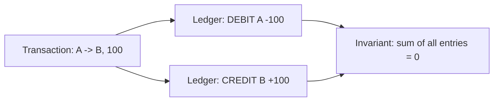

### Ledger = append-only (immutable)
- Ledger entries **kabhi update/delete nahi** hoti — sirf naye entries add. Ye **audit trail** deta.
- Balance = ledger entries ka sum (ya ek maintained balance jo ledger se reconcile hota).
- Galti ho to **reversing entry** (correction) daalo, purani mat badlo. Ye [Event Sourcing](../Event_Driven_Architecture.md) jaisa hai.

### Balance kaise store karein?
| Approach | Trade-off |
|---|---|
| **Running balance column** (fast read) | Fast, par ledger se reconcile karna padta |
| **Sum ledger on read** (always correct) | Slow at scale |
| **Hybrid** (balance column + ledger source of truth) | ⭐ Best — balance cache, ledger truth |

> **Interview line:** "Balance = derived; **ledger = source of truth** (append-only, double-entry). Reconcile balance against ledger periodically."

---

## 4. ⭐ Core Concept 2 — Idempotency (no double charge)

Network flaky hai — client request bhejta, timeout, retry → **paisa do baar kat sakta**. Fix:
**idempotency key**. Har payment request ke saath ek unique key (client-generated UUID); server usi key
pe **ek hi baar** process karta. Dekho [Idempotency](../Idempotency.md).

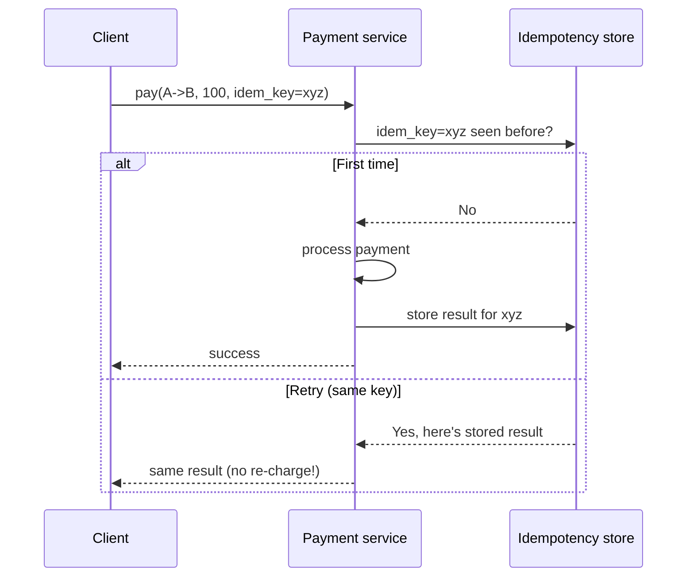

- **Idempotency key** = UUID per logical payment (client generate karta, retry pe wahi bhejta).
- Server: key already processed? → **stored result return karo** (dobara process nahi).
- Store: Redis (fast) + DB (durable) with the key → result mapping.
- **Race condition:** do requests same key ek saath → atomic insert (`INSERT ... unique constraint` on key, or Redis `SETNX`) → ek jeetega, doosra stored result padhega.

---

## 5. ⭐ Core Concept 3 — Preventing Double-Spend (concurrency)

A ke paas ₹100 hai. Do payments ek saath (₹100 + ₹100) → dono succeed → A ke -₹100 (galat!). Prevent karna zaroori. Dekho [Concurrency Control](../Concurrency_Control.md).

### Approach A: Pessimistic lock (row lock)
```sql
BEGIN;
SELECT balance FROM accounts WHERE id='A' FOR UPDATE;  -- lock A's row
-- if balance >= 100:
INSERT INTO ledger (DEBIT A -100), (CREDIT B +100);
UPDATE accounts SET balance = balance - 100 WHERE id='A';
UPDATE accounts SET balance = balance + 100 WHERE id='B';
COMMIT;  -- releases lock
```
- ✅ Simple, strong. ❌ Lock contention on hot accounts (popular merchant), deadlock risk (lock A then B — always lock in consistent order!).

### Approach B: Optimistic (conditional update)
```sql
UPDATE accounts SET balance = balance - 100
WHERE id='A' AND balance >= 100;   -- atomic: only if enough balance
-- rows_affected = 0 -> insufficient funds, reject
```
- ✅ No lock, high throughput. ❌ Retries under contention.

### Deadlock avoidance (critical!)
A→B aur B→A ek saath: request 1 locks A then B; request 2 locks B then A → **deadlock**. **Fix:**
hamesha accounts ko **consistent order** me lock karo (e.g., lower account_id pehle). Dekho [Concurrency Control](../Concurrency_Control.md).

---

## 6. API Design

```
POST /v1/payments
  Idempotency-Key: <uuid>
  { "from": "A", "to": "B", "amount": 10000, "currency": "INR", "note": "..." }
  -> 201 { "payment_id": "...", "status": "SUCCESS|PENDING|FAILED" }

GET  /v1/payments/{id}            -> status + details
GET  /v1/accounts/{id}/balance    -> current balance
GET  /v1/accounts/{id}/transactions?cursor=..  -> history (cursor pagination)
POST /v1/payments/{id}/refund     Idempotency-Key: <uuid>  -> refund txn
POST /v1/upi/resolve              { "vpa": "user@bank" }    -> account details
```

- **Amount in smallest unit** (paise, not rupees) — **integer**, never float (float rounding = money bugs!).
- **Idempotency-Key header** mandatory for writes.
- Status: `PENDING → SUCCESS / FAILED` (async settlement possible).

---

## 7. Data Model

```
Accounts:
  account_id (PK) | user_id | balance (integer paise) | currency | status | version

Ledger (append-only, immutable, source of truth):
  entry_id (PK) | txn_id | account_id | type(DEBIT/CREDIT) | amount | balance_after | created_at

Transactions:
  txn_id (PK) | from_acct | to_acct | amount | status | idempotency_key(unique) | created_at

IdempotencyKeys:
  key (PK) | txn_id | result | created_at | expires_at

WalletFunding / UPI mapping:
  vpa (PK) | account_id | bank_ref
```

- **Accounts/Ledger/Transactions → SQL (ACID)** — strong consistency, transactions. Dekho [SQL vs NoSQL](../SQL_vs_NoSQL.md).
- **Ledger append-only** = audit trail. `idempotency_key` **unique constraint** = DB-level double-charge prevention.
- **Sharding:** by `account_id` (user's account + ledger together for locality). Cross-shard transfers = harder (see deep-dive). Dekho [Sharding](../21_Database_Sharding.md).

---

## 8. 🏛️ Main HLD Architecture

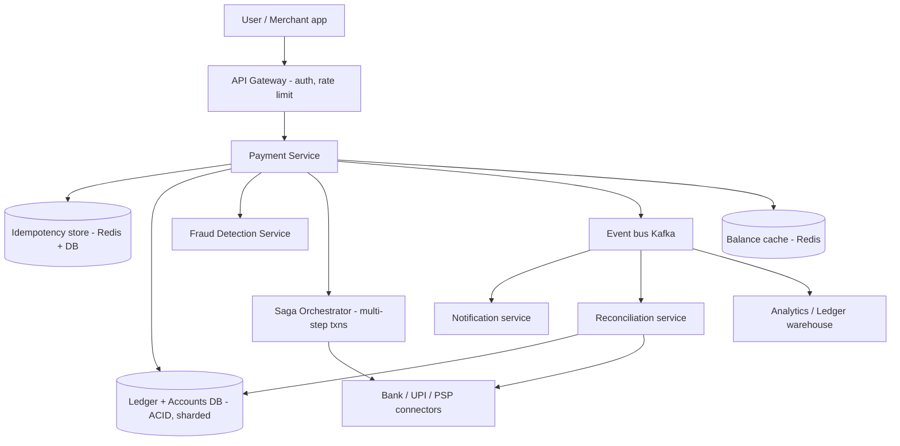

**Flow:**
1. User initiates payment → gateway (auth + rate limit).
2. Payment service: **idempotency check** → **fraud check** → **atomic ledger + balance update** (ACID txn).
3. External settlement (bank/UPI) via **Saga orchestrator** (multi-step, compensations).
4. Events published (Kafka) → notifications, reconciliation, analytics.

---

## 9. ⭐ Deep Dive — Distributed Transactions (Saga)

Payment aksar **multiple steps/services** hota hai: debit sender's bank → credit receiver's bank →
update ledger. Ye do banks ke beech ek ACID transaction **nahi** ho sakta (alag systems). Use **Saga**
— steps + compensating actions. Dekho [Distributed Transactions](../Distributed_Transactions.md), [Saga in Microservices](../01_Monolithic_and_Microservices.md).

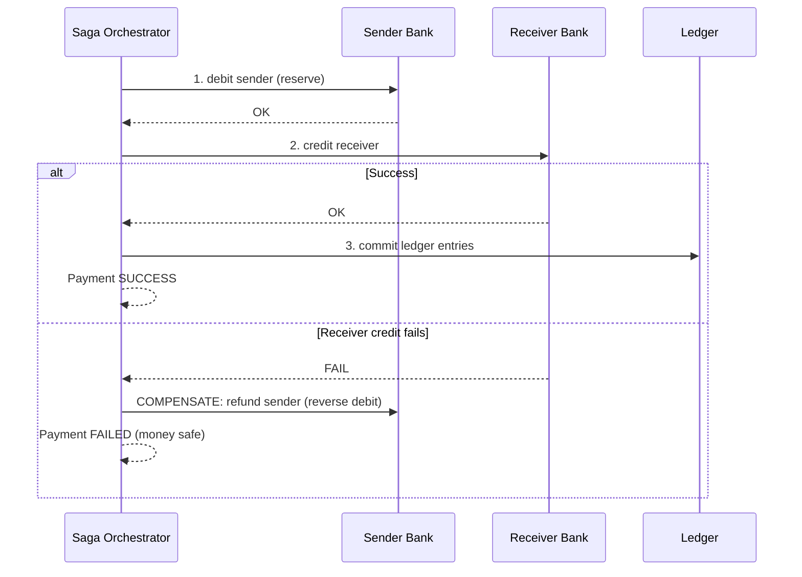

- **Each step has a compensating action** (debit → refund). Failure → run compensations in reverse.
- Ensures **no money lost** even across systems. Saga = eventual consistency but money-safe.
- **Orchestration** (central coordinator) preferred for payments (clear control + audit).

---

## 10. ⭐ Deep Dive — Reconciliation

External systems (banks) se hamara ledger **match** hona chahiye. Kabhi mismatch (network fail after
bank debited but before our commit). **Reconciliation** = periodic job jo hamara ledger vs bank
statements compare karta, mismatches flag karta.

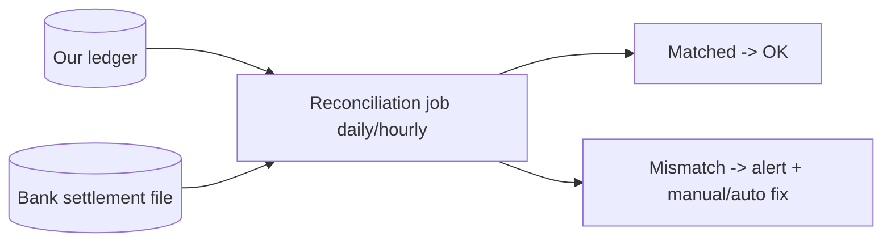

- **Pending → stuck transactions:** payment PENDING for too long → reconcile with bank → mark SUCCESS/FAILED.
- **Compensating entries** for corrections (never edit ledger).
- Regulatory requirement — every paisa must be accounted.

---

## 11. Deep Dive — Handling states & async settlement

Payment states: `INITIATED → PENDING → SUCCESS / FAILED`. Bank settlement async ho sakta (turant nahi).

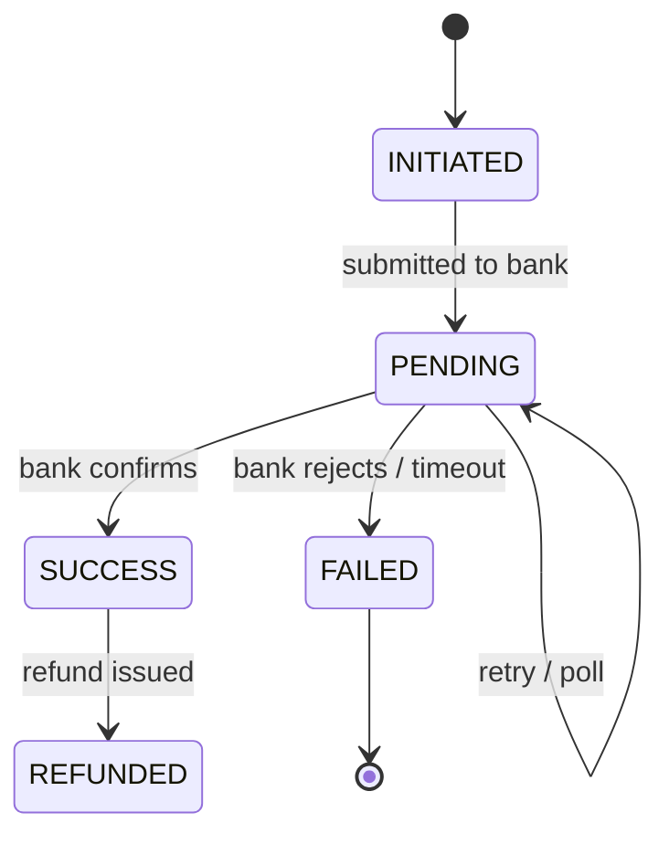

- **PENDING handling:** poll bank / wait for callback; timeout → reconcile.
- **Client sees PENDING** → later push notification on final status.
- **Never assume success** without confirmation — reconcile.

---

## 12. Deep Dive — Fraud Detection & Security

- **Fraud detection:** real-time rules (velocity checks — too many txns, unusual amount, new device) + ML scoring. Suspicious → block/challenge (OTP/2FA).
- **Encryption:** data in-transit (TLS) + at-rest; sensitive data (card) tokenized. Dekho [Security](../Security_in_System_Design.md).
- **PCI-DSS compliance** (card data), 2FA/OTP for high-value.
- **Rate limiting** per user (abuse). Dekho [Rate Limiter](./02_Rate_Limiter.md).
- **Audit log** — immutable record of every action (who/what/when).

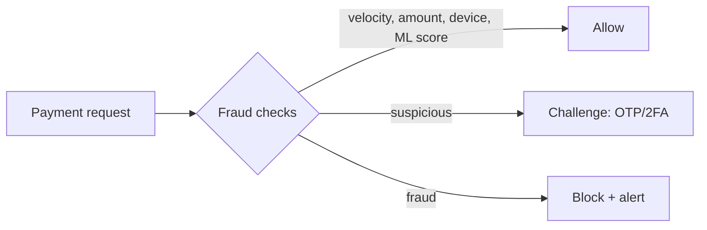

---

## 13. Deep Dive — Scaling reads (balance & history)

- **Balance reads:** cache (Redis) + read replicas. Balance cache invalidated/updated on write. Dekho [Caching](../08_Caching_and_Distributed_Caching.md).
- **Transaction history:** heavy read → read replicas + cursor pagination; old data → cold storage tiering.
- **Writes stay on primary** (ACID); reads distributed.

---

## 13.5 ⭐ Deep Dive — UPI-specific architecture (India)

UPI normal wallet se alag hai — paisa **wallet me nahi rukta**, seedha **bank-to-bank** move hota hai,
NPCI (National Payments Corporation) ka **central switch** beech me hota hai.

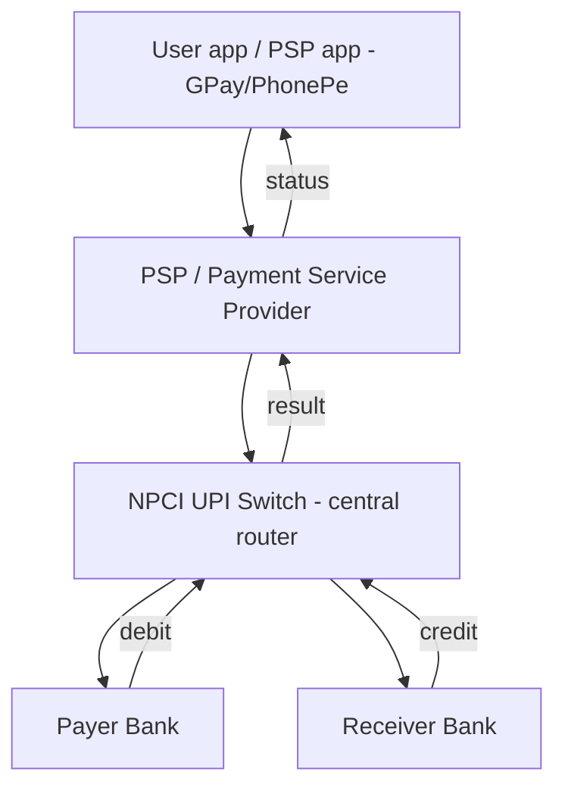

**UPI flow (P2P):**
1. User `A` PSP app (GPay) me `B@bank` (VPA) enter karta + amount.
2. PSP → **NPCI switch** ko request.
3. NPCI **VPA resolve** karta (`B@bank` → B ka bank + account) — VPA directory lookup.
4. NPCI payer bank ko **debit** bolta, receiver bank ko **credit**.
5. Dono banks confirm → NPCI success → PSP → user ko notification.

**Key UPI concepts:**
- **VPA (Virtual Payment Address)** — `user@bank` — real account number chhupata (privacy + convenience). VPA→account mapping ek directory me.
- **Two-leg transaction:** debit leg (payer bank) + credit leg (receiver bank) — dono succeed hone chahiye (atomicity via NPCI + reversals).
- **NPCI = central switch** — sab banks isse jude, direct bank-to-bank integration nahi (N banks = N connections, not N²).
- **PSP** (GPay/PhonePe) sirf UX + VPA layer; asli paisa bank me rehta (PSP ke paas nahi).

### Wallet vs UPI vs Card (teeno alag)
| | Wallet (Paytm) | UPI | Card |
|---|---|---|---|
| Paisa kahan | Wallet balance (prefunded) | Bank account (direct) | Bank/credit line |
| Ledger | Internal wallet ledger | Bank ledgers + NPCI | Bank + card network (Visa) |
| Speed | Instant (internal) | Near-instant (bank-to-bank) | T+1/T+2 settlement |
| Our system | Full ledger control | PSP + NPCI integration | PSP + card network |

---

## 13.6 Deep Dive — Chargebacks, Disputes & Refunds

- **Refund:** merchant → user, reverse of original payment (new transaction with reference to original). Idempotent, ledger reversing entries.
- **Chargeback/Dispute:** user claims unauthorized/fraud → dispute flow → funds held → investigation → reverse or reject. State machine tracks dispute lifecycle.
- **Partial refund:** amount ≤ original; track cumulative refunds ≤ original (no over-refund).

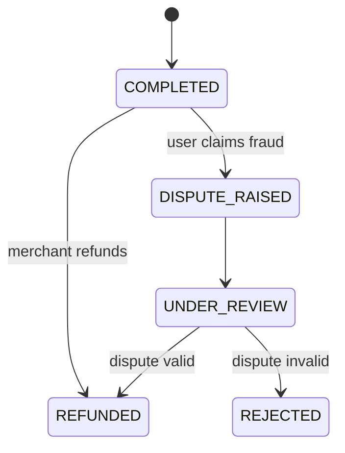

---

## 13.7 Deep Dive — Cross-shard transfers

Accounts `account_id` se shard hote hain. A aur B **alag shards** pe ho sakte → ek single DB transaction
possible nahi (distributed). Options:
- **Saga / 2-phase:** debit A (shard 1) → credit B (shard 2), with compensations. Dekho [Distributed Transactions](../Distributed_Transactions.md).
- **Transaction coordinator** logs intent (outbox) → both shards apply → eventual consistency, money-safe.
- **Outbox pattern:** debit + outbox event in shard 1 txn (atomic) → event → credit B in shard 2 (idempotent).

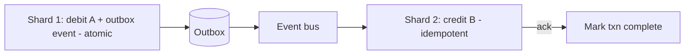

> **Interview point:** same-shard transfer = single ACID txn (easy); cross-shard = Saga/Outbox (harder, eventual, compensations).

---

## 13.8 Deep Dive — Settlement & Clearing

- **Authorization vs Capture vs Settlement:** card payments me pehle **authorize** (hold funds), phir
  **capture** (actual charge), phir **settlement** (bank-to-bank money movement, T+1/T+2). UPI me ye near-instant.
- **Netting:** din bhar ki transactions ko **net** karke banks ke beech settle (har txn alag nahi) — efficiency. NPCI/clearing house karta.
- **Escrow / nodal account:** PSP funds ek regulated nodal account me rakhta (apne paas nahi) — compliance.

## 13.9 Deep Dive — Observability & Correctness Testing

Payments me monitoring **critical** hai — ek bug = paisa loss. Dekho [Observability](../Advanced_Topics/02_Observability_Monitoring_Logging_Tracing.md).

- **Metrics:** success rate, p99 latency, PENDING count, reconciliation mismatch count, fraud block rate.
- **Alerts:** success rate drop, PENDING pile-up, ledger imbalance (sum ≠ 0!), bank connector down.
- **The invariant alert:** `SUM(all ledger entries) == 0` — agar kabhi ≠ 0, **immediate page** (money integrity broken).
- **Correctness testing:** property-based tests (random txns → invariant holds), chaos (kill mid-Saga → verify compensations), idempotency tests (replay → no double charge).
- **Audit log** immutable — regulatory + debugging.

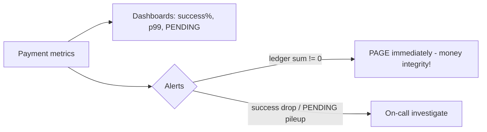

---

## 14. Bottlenecks & Solutions

| Bottleneck | Solution |
|---|---|
| Double charge (retry) | Idempotency key + unique constraint |
| Double-spend (concurrency) | Row lock / conditional update + consistent lock order |
| Deadlocks (A↔B) | Lock accounts in consistent order (by id) |
| Cross-bank atomicity | Saga + compensating transactions |
| Stuck/PENDING payments | Reconciliation + bank polling |
| Hot account (popular merchant) | Sharding, batched credits, optimistic updates |
| Balance read load | Cache + read replicas |
| Money integrity | Double-entry ledger (append-only) + reconciliation |
| Fraud | Real-time rules + ML + 2FA |

---

## 15. Common pitfalls (interview me bolo)
- ❌ **Float for money** → rounding errors. ✅ Integer (paise/cents).
- ❌ Direct `balance = balance - x` without ledger → no audit trail. ✅ Double-entry ledger.
- ❌ No idempotency → double charge on retry. ✅ Idempotency key.
- ❌ Assuming bank call succeeded → money loss. ✅ Reconcile + Saga compensations.
- ❌ Editing ledger to fix errors → audit broken. ✅ Reversing entries.
- ❌ AP over CP → wrong balance. ✅ CP (reject on doubt).

---

## 16. Interview Q&A

**Q: Double-entry ledger kyun?**
Har txn = DEBIT + CREDIT (zero-sum) → money conserved + full audit trail; append-only (immutable) → correctness + traceability. Balance = derived, ledger = source of truth.

**Q: Retry pe double charge kaise roke?**
Idempotency key (client UUID) — server ek hi baar process karta, retry pe stored result deta; DB unique constraint on key = race-safe.

**Q: Double-spend (concurrent payments) kaise roke?**
Row lock (`FOR UPDATE`) ya conditional update (`WHERE balance >= amount`); consistent lock order to avoid deadlock.

**Q: Do banks ke beech transfer atomic kaise (no ACID across systems)?**
Saga — steps + compensating actions (debit fail→refund); ensures no money lost, eventually consistent.

**Q: Payment PENDING me atak jaaye to?**
Reconciliation job bank se match karta; timeout → confirm/reject; compensating entries for corrections.

**Q: Money ke liye float kyun nahi?**
Float rounding errors (0.1+0.2≠0.3) → paisa galat. Integer smallest-unit (paise) use karo.

**Q: CAP me kya choose karoge?**
CP (consistency) — doubt ho to reject; galat balance/double-spend se better reject/retry.

**Q: Reconciliation kya hai?**
Our ledger vs external (bank) statements compare, mismatches flag/fix — regulatory + correctness.

**Q: Hot account (popular merchant getting 1000s payments) kaise?**
Contention → optimistic updates / batched credits / sharding; credits can be aggregated async.

---

## 16.5 Extensions / follow-ups (interviewer aksar poochta)
- **Recurring / subscriptions (mandates):** UPI AutoPay / standing instruction — pre-authorized recurring debit; store mandate, trigger on schedule (uses [Job Scheduler](./23_Distributed_Job_Scheduler.md)).
- **Split payments:** one payment → multiple receivers (bill split, marketplace payout) — multiple credit ledger entries, atomic.
- **Multi-currency:** amount + currency; FX conversion at a rate snapshot; ledger per currency, no mixing.
- **Payouts / settlements to merchants:** batch, scheduled, reconciled.
- **Wallet-to-bank withdrawal:** wallet debit + bank credit (Saga, external).

---

## 17. Summary
- **Correctness > scale.** **CP over AP.** Money = **integer** (paise), never float.
- **Double-entry ledger** (append-only, immutable) = source of truth + audit; balance = derived (cached).
- **Idempotency key** = no double charge; **row lock / conditional update + consistent lock order** = no double-spend / no deadlock.
- **Saga + compensating transactions** for cross-bank atomicity; **reconciliation** for mismatches/stuck payments.
- **Fraud detection + encryption + 2FA + audit log** for security; reads (balance/history) scale via cache + replicas.

> **Related:** [Idempotency](../Idempotency.md) · [Concurrency Control](../Concurrency_Control.md) · [Distributed Transactions](../Distributed_Transactions.md) · [Event-Driven Architecture](../Event_Driven_Architecture.md) · [Security](../Security_in_System_Design.md) · [Ticketmaster](./15_Ticketmaster_Booking_System.md) · [GPay LLD](../../LLD/GPay_LLD/)
