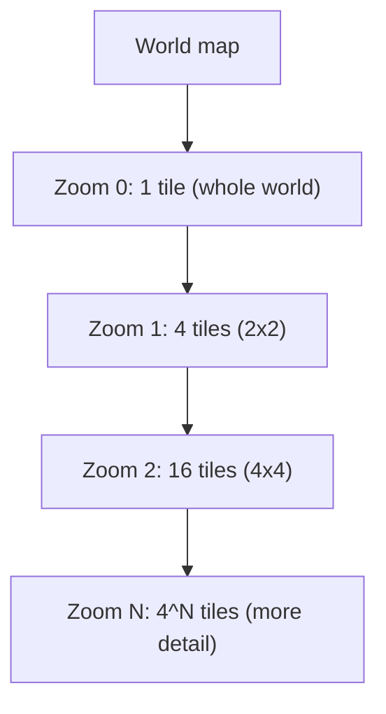
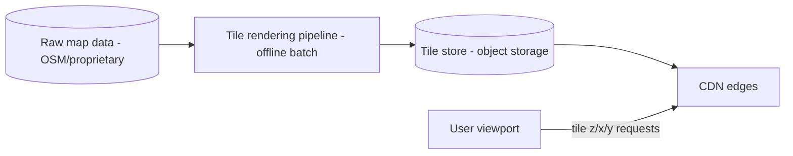
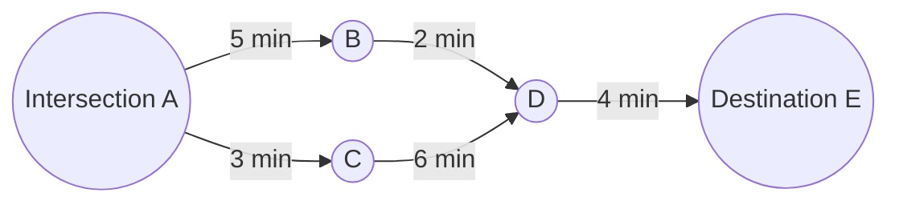
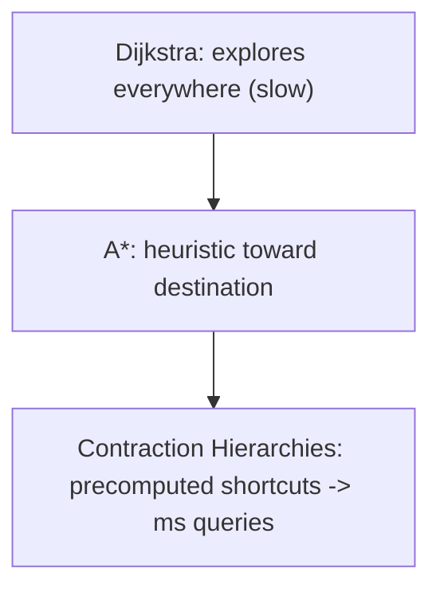
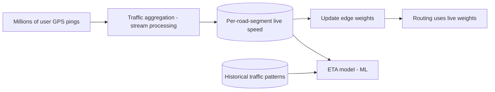
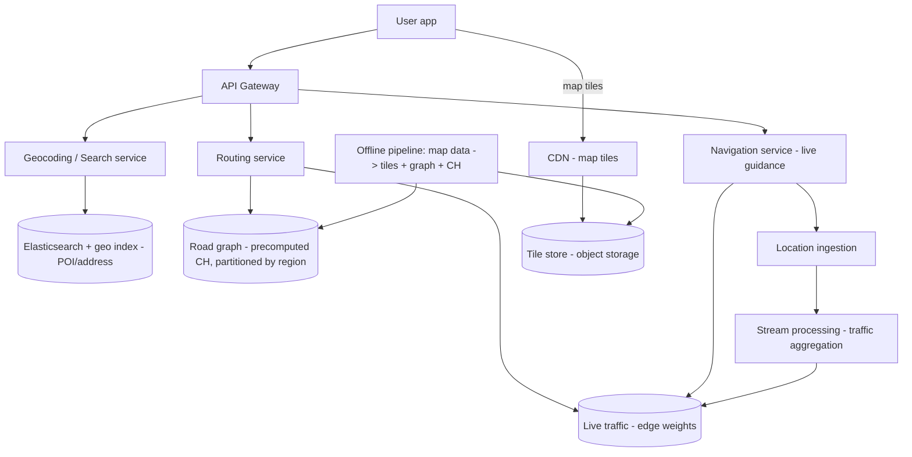
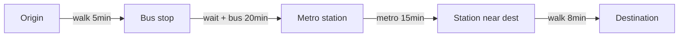
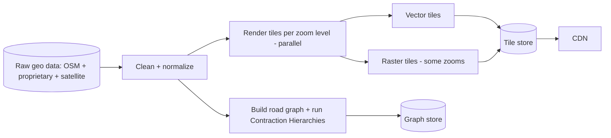
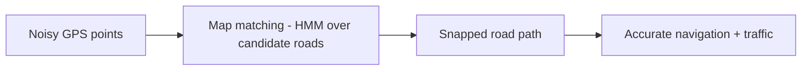

# 🗺️ Design Google Maps / Navigation

> **Problem:** Ek mapping + navigation system banao — map dikhao (pan/zoom), do jagah ke beech
> **shortest/fastest route** nikaalo (real-time traffic ke saath), **ETA** batao, aur turn-by-turn
> navigation do. Ye design **map tiles + CDN**, **road-network graph + shortest-path algorithms at
> scale**, aur **geospatial + real-time traffic** ka combo hai — sabse compute-intensive designs me se ek.

---

## 1. Requirements

### Functional
- **Map display** — render map, pan, zoom (multiple zoom levels).
- **Search / Geocoding** — "Connaught Place" → coordinates (and reverse: coords → address).
- **Routing / Directions** — A → B ka best route (driving/walking/transit).
- **ETA** — arrival time estimate (with live traffic).
- **Turn-by-turn navigation** — live guidance while driving.
- **Live traffic** — congestion overlay, reroute on jam.
- Nearby places (POI — restaurants, ATMs).

### Non-Functional
- **Low latency** — map tiles instant, route in <1s.
- **Massive scale** — billions of requests, planet-scale map data.
- **High availability** — navigation can't fail mid-drive.
- **Freshness** — traffic real-time; map data updated (new roads).
- **Accuracy** — routes + ETA reliable.

---

## 2. Capacity Estimation

| Metric | Value |
|---|---|
| Users | ~1B+ |
| Map tile requests | Huge — every pan/zoom loads many tiles → **CDN dominant** |
| Route requests | ~millions/min |
| Map data size | Planet OSM ~ 100s of GB raw → processed graph + tiles = TBs–PBs |
| Location pings (nav) | Active navigators send GPS every few sec |

> **Two cost centers:** (1) **map tile serving** (bandwidth — CDN), (2) **route computation** (CPU — precompute + smart algorithms).

---

## 3. ⭐ Core 1 — Map Data & Tiles

Poora map ek image nahi ho sakta (planet-scale). Map ko **tiles** me baanta jaata — chhote square
images/vector chunks — per **zoom level**.



- **Tile pyramid:** zoom `z` pe `4^z` tiles. Har tile ek `(z, x, y)` se identify hoti. Zoom in → zyada tiles, zyada detail.
- **Raster tiles** (pre-rendered PNG images) vs **Vector tiles** (data — client renders; smaller, stylable, rotatable). Modern = vector.
- **Only load visible tiles:** client viewport ke tiles hi fetch karta (pan pe naye tiles).

### Tile serving = CDN
Tiles **static-ish** (map roz nahi badalta) → **CDN se serve** (edge cache). Ye bandwidth cost aur
latency dono solve karta. Dekho [CDN](../10_Content_Delivery_Network_CDN.md).



- **Rendering pipeline** (offline batch): raw map data → render tiles per zoom → object store → CDN. Dekho [Big Data](../Advanced_Topics/05_Big_Data_and_Stream_Processing.md), [Blob Storage](../Advanced_Topics/08_Blob_Object_Storage_and_Large_Files.md).
- Map update (new road) → re-render affected tiles → invalidate CDN.

---

## 4. ⭐ Core 2 — Road Network as a Graph

Routing = **graph problem**. Roads ko graph me model karo:
- **Nodes** = intersections (junctions).
- **Edges** = road segments (connect intersections).
- **Edge weight** = travel time (distance / speed, adjusted for traffic) — NOT just distance (fastest ≠ shortest).



- **Weights dynamic:** traffic badalta → edge weight badalta (rush hour = higher). One-way roads = directed edges. Turn restrictions = edge constraints.

---

## 5. ⭐ Core 3 — Shortest Path at Scale

Naive **Dijkstra** correct hai par planet-scale graph (crores nodes) pe har query pe run karna **bahut slow**. Real systems isse optimize karte hain.

### Dijkstra → A* → Contraction Hierarchies
| Algorithm | Idea | Speed |
|---|---|---|
| **Dijkstra** | Explore all directions until dest found | Slow (explores too much) |
| **A\*** | Heuristic (straight-line distance to dest) guides search toward dest | Faster |
| **Bidirectional search** | Search from both A and B, meet in middle | Faster |
| **Contraction Hierarchies (CH)** | **Precompute** shortcuts (highways) → query super fast | ⭐ Production (Google/OSRM) |



### ⭐ Contraction Hierarchies (the production trick)
- **Precompute (offline):** graph ko "importance" order me process karo; important roads (highways)
  ke shortcuts bana lo. Result: query time pe pehle local roads → highway shortcuts → local roads.
- **Query:** ab poora graph explore nahi — precomputed shortcut hierarchy pe chalo → **milliseconds** even for cross-country routes.
- Precompute expensive (offline, periodic), query cheap (online). Classic **precompute vs runtime** trade-off.

### Graph partitioning for scale
- Planet graph ek machine me nahi → **partition by region** (geohash/tiles). Long routes = cross-region → hierarchical (region-level graph of highways + local graphs). Dekho [Sharding](../21_Database_Sharding.md).

---

## 6. ⭐ Core 4 — ETA & Live Traffic

ETA = route ke edges ke travel-times ka sum. Par travel time **traffic** pe depend karta.



- **Live traffic from users:** active navigators ke GPS pings → aggregate per road segment → current speed. (Crowdsourced — more users = better traffic.) Dekho [Big Data / Stream Processing](../Advanced_Topics/05_Big_Data_and_Stream_Processing.md).
- **Edge weights updated** with live speed → routing gives fastest route now.
- **ETA = ML model:** live speed + historical patterns (Monday 6pm always jam) + weather/events. Not just distance/speed.
- **Reroute:** driving me jam detect → recompute → "faster route available".

---

## 6.5 Core — Imagery, Street View & Place Details

- **Satellite/aerial imagery:** separate tile pyramid (raster, huge) — object store + CDN, same `z/x/y` scheme.
- **Street View:** 360° panoramas at points along roads — captured by cars, stored as images (object store + CDN), indexed by location; huge storage (PBs). Dekho [Blob Storage](../Advanced_Topics/08_Blob_Object_Storage_and_Large_Files.md).
- **Place details:** POI metadata (hours, photos, reviews, phone) — separate service + DB; reviews = user-generated (like [Instagram](./06_Instagram.md) media + [Twitter](./05_Twitter_News_Feed.md) content).
- **3D buildings / terrain:** additional vector data layers rendered client-side.

---

## 7. Core 5 — Geocoding & Search

- **Geocoding:** "Connaught Place, Delhi" → `(lat, lng)`. Reverse geocoding: coords → address.
- **Search:** POI search (restaurants near me), autocomplete. Uses **geospatial index** + **Elasticsearch**. Dekho [Geospatial](../Advanced_Topics/06_Geospatial_and_Location_Services.md), [Search Systems](../Advanced_Topics/04_Search_Systems_and_Elasticsearch.md), [Autocomplete](./18_Search_Autocomplete_Typeahead.md).
- Address database + fuzzy matching + ranking (popularity, distance).

---

## 8. API Design

```
GET  /v1/tiles/{z}/{x}/{y}                 -> map tile (from CDN)
GET  /v1/geocode?q=Connaught+Place         -> [ {lat, lng, address} ]
GET  /v1/reverse?lat=..&lng=..             -> address
POST /v1/route
  { "origin": {lat,lng}, "dest": {lat,lng}, "mode": "driving", "traffic": true }
  -> { "routes": [ { polyline, distance, eta, steps[] } ] }
GET  /v1/nearby?lat=..&lng=..&type=restaurant  -> [ POIs ]
POST /v1/navigation/location  { session_id, lat, lng }  -> reroute? next instruction
```

- Route returns **polyline** (encoded path) + **ETA** + **turn-by-turn steps**.
- Multiple route alternatives (fastest, shortest, avoid tolls).

---

## 9. Data Model

```
RoadGraph:   node_id | lat | lng               (intersections)
Edges:       edge_id | from_node | to_node | distance | base_time | road_type | oneway
LiveTraffic: segment_id | current_speed | updated_at   [in-memory / time-series]
Tiles:       (z, x, y) -> tile blob (object store + CDN)
Places/POI:  place_id | name | lat | lng | type | geohash | rating
Geocoding:   address text -> coordinates (indexed)
```

- **Road graph** → specialized graph store / in-memory (precomputed CH). Not a normal SQL query pattern.
- **Tiles** → object store + CDN. **POI** → geospatial index + Elasticsearch. **Live traffic** → in-memory (Redis) / time-series DB.

---

## 10. 🏛️ Main HLD Architecture



**Flow:**
- **Map display:** client → CDN for tiles (visible viewport only).
- **Route:** routing service → precomputed CH graph + live traffic weights → best route + ETA.
- **Navigation:** location pings → reroute if needed; pings also feed traffic aggregation.
- **Offline pipeline:** raw map → tiles + road graph + contraction hierarchies (periodic).

---

## 11. Deep Dive — Tile serving optimization
- **Only visible tiles** loaded; **prefetch** adjacent tiles (smooth pan).
- **Multiple zoom levels** pre-rendered; client picks by zoom.
- **Vector tiles** (smaller, client-rendered, rotate/style) preferred over raster.
- **CDN cache** — tiles rarely change → high hit rate → low origin load.
- **Offline maps:** download region tiles + graph to device (no network needed).

## 12. Deep Dive — Handling map updates
- New road / closure → update raw data → **re-render affected tiles** + **rebuild graph/CH** (incremental where possible) → invalidate CDN tiles.
- Graph rebuild = expensive (CH precompute) → periodic (not per-edit); urgent closures = live edge weight override.

## 13. Deep Dive — Navigation session (real-time)
- Client sends GPS every few sec → nav service checks "on route?".
- Off route → **reroute**; jam ahead → **reroute** to faster path.
- Pings also **feed traffic** (crowdsourced) — you help others while navigating.
- Session state (current route, position) — WebSocket/streaming. Dekho [WebSockets](../WebSockets_and_Realtime.md).

## 14. Deep Dive — Scaling routing compute
- **Precompute (CH)** = queries cheap; **cache popular routes** (home↔office common).
- **Region partitioning** — long routes via hierarchical (highways between regions).
- **Read-heavy** → many routing servers (stateless), horizontal scale. Dekho [Scaling](../06_Scaling_Vertical_and_Horizontal.md).

---

## 14.5 Deep Dive — Transit & Multi-Modal Routing

Driving se aage — public transit (bus/metro/train), walking, cycling, aur **mixed** (walk → metro → walk).

- **Transit = time-dependent graph:** edges pe schedule (bus 10:00, 10:15...) — weight depends on **departure time** (agla bus kab). Simple static graph nahi chalta.
- **Time-expanded / time-dependent models:** node = (stop, time); edges = "wait for bus" + "ride". Algorithm: modified Dijkstra / RAPTOR (Round-bAsed Public Transit routing).
- **Multi-modal:** combine walking graph + transit graph + driving; optimize total time (walk to stop + wait + ride + walk).
- **Constraints:** last-mile walking limits, transfers count, fare, accessibility (wheelchair).



> **Key difference:** driving = static-ish weights; transit = **time-dependent** (schedule-based) → different algorithms (RAPTOR/CSA).

---

## 14.6 Deep Dive — Tile Rendering Pipeline (offline)

Raw map data (roads, buildings, water, labels) ko renderable tiles me convert karna ek bada **batch pipeline** hai.



- **Data sources:** OpenStreetMap, government data, satellite imagery, Street View cars, user corrections.
- **Parallel rendering:** tiles independent → massive parallelism (MapReduce/Spark style). Dekho [Big Data](../Advanced_Topics/05_Big_Data_and_Stream_Processing.md).
- **Styling:** vector tiles + style rules (client renders dark mode, satellite, terrain from same data).
- **Versioning:** map versions; gradual rollout of new tiles (avoid breaking mid-view).

---

## 14.7 Deep Dive — Offline Maps

- User ek **region download** karta → tiles + road graph + POI subset device pe store.
- Routing runs **on-device** (no network) using downloaded graph.
- No live traffic offline (uses base/historical times).
- Sync updates when online (new map version).
- Storage-efficient: vector tiles + compressed graph.

---

## 14.8 Trade-offs & Edge Cases
- **Precompute vs freshness:** CH precompute = fast queries but map/traffic changes need rebuild → periodic + live overrides.
- **Accuracy vs latency:** perfect route (full graph) slow; CH approximate-fast (still optimal for the precomputed metric).
- **Traffic privacy:** GPS crowdsourcing → anonymize/aggregate (don't expose individual location).
- **GPS drift:** urban canyons (tall buildings) → GPS noisy → **map matching** (snap GPS to nearest road).
- **Tunnels / no GPS:** dead-reckoning (speed + heading) till signal returns.
- **Rerouting loops:** avoid flapping between two equal routes (hysteresis).

---

## 14.9 Deep Dive — Worked capacity & storage
- Planet road graph: ~100M+ nodes, ~200M+ edges → precomputed CH adds shortcut edges (grows graph but query cheap). Fits in memory across a partitioned cluster.
- Tiles: zoom 0-20, `4^z` tiles at max zoom = billions of tiles → object storage (PBs) + CDN; only popular areas frequently served.
- Traffic: millions of active navigators × pings every few sec → high write throughput → in-memory aggregation (per road segment), not persisted per-ping.

## 14.10 Deep Dive — Map matching (GPS → road)
- Raw GPS noisy (±5-50m, worse in cities/tunnels). **Map matching** = snap the noisy GPS trace to the
  most likely road path (Hidden Markov Model over candidate roads) → accurate "which road/lane".
- Enables correct turn-by-turn, correct traffic contribution, and off-route detection.



## 14.11 Deep Dive — Traffic prediction (not just current)
- ETA needs **future** traffic (route takes 30 min → traffic in 20 min matters, not now).
- **Historical patterns** (Monday 6 PM this road always jams) + live + events/weather → **ML prediction** of segment speeds over the journey timeline.
- Google's ETA uses graph neural networks over road segments (predictive, not just current speed).

## 14.12 Common pitfalls
- ❌ Dijkstra per query at planet scale → too slow. ✅ Contraction Hierarchies (precompute).
- ❌ Edge weight = distance → gives shortest, not fastest. ✅ Weight = time (traffic-adjusted).
- ❌ Serving tiles from origin → bandwidth blowup. ✅ CDN + vector tiles + visible-only.
- ❌ Raw GPS without map matching → wrong road/turns. ✅ Map matching (HMM).
- ❌ ETA from current traffic only → wrong for long routes. ✅ Predictive (historical + ML).

## 14.13 Extensions / follow-ups
- **Live location sharing** (share ETA with friends) → real-time pub-sub. Dekho [WebSockets](../WebSockets_and_Realtime.md).
- **Places/reviews** (like a mini social + search system).
- **Lane guidance / AR navigation** (client rendering).
- **Toll / fuel-efficient / avoid-highways** route options (different edge weights).

---

## 15. Bottlenecks & Solutions

| Bottleneck | Solution |
|---|---|
| Map tile bandwidth | CDN + vector tiles + visible-only loading |
| Route compute at scale | Contraction Hierarchies (precompute) + caching |
| Cross-country routes | Graph partitioning + hierarchical routing |
| Live traffic freshness | Crowdsourced GPS → stream aggregation |
| ETA accuracy | ML (live + historical + events) |
| Map updates | Incremental re-render + graph rebuild (periodic) |
| Routing server load | Stateless horizontal scale + route cache |

---

## 16. Interview Q&A

**Q: Poora map ek image kyun nahi?**
Planet-scale — too big. **Tiles** per zoom level (`z/x/y`), only visible loaded, served via CDN.

**Q: Routing kaise, aur Dijkstra scale pe kyun nahi?**
Road = graph (nodes=intersections, edges=segments, weight=time). Dijkstra explores too much → slow. Use **A\*** (heuristic) + **Contraction Hierarchies** (precompute shortcuts → ms queries).

**Q: Contraction Hierarchies kya?**
Offline precompute shortcuts (highways) in importance order → query uses hierarchy → milliseconds even cross-country. Precompute expensive, query cheap.

**Q: ETA kaise nikaalte, sirf distance/speed?**
Nahi — live traffic (crowdsourced GPS) + historical patterns + ML. Edge weights = live travel time.

**Q: Live traffic kahan se?**
Active navigators ke GPS pings → aggregate per road segment → current speed. More users = better data.

**Q: Fastest vs shortest route?**
Edge weight = **time** (not distance) → fastest. Traffic adjusts weights → live fastest.

**Q: Map tiles vector vs raster?**
Raster = pre-rendered images; vector = data, client renders (smaller, stylable, rotatable) — modern choice.

**Q: Reroute during driving?**
GPS pings → off-route or jam detected → recompute route with live weights → new guidance.

**Q: Cross-country route (crores nodes)?**
Graph partitioned by region; hierarchical routing (local → highways between regions → local).

**Q: Transit routing driving se kaise alag?**
Transit = time-dependent (schedule-based) graph — agla bus/train kab; algorithms RAPTOR/CSA, multi-modal (walk+transit) combine.

**Q: GPS noisy ho (tall buildings/tunnel) to?**
Map matching — GPS ko nearest road pe snap; tunnel me dead-reckoning (speed+heading) till signal.

**Q: Map update (new road) kaise?**
Raw data update → affected tiles re-render + graph/CH rebuild (periodic) → CDN invalidate; urgent closures = live weight override.

**Q: Map matching kya hai?**
Raw GPS points ko actual road network pe align karna (snap to road) — noisy GPS ke bawajood sahi road pata.

---

## 17. Summary
- **Map = tiles** (`z/x/y` pyramid, vector preferred) served via **CDN**; only visible tiles loaded; offline rendering pipeline.
- **Routing = graph** (nodes/edges, weight=time); Dijkstra too slow → **A\* + Contraction Hierarchies** (precompute shortcuts → ms queries); region-partitioned for scale.
- **ETA + live traffic** = crowdsourced GPS → stream aggregation → edge weights + ML (historical + live).
- **Geocoding/search** = geospatial index + Elasticsearch; **navigation** = GPS pings → reroute + feed traffic.
- Precompute (tiles, CH) heavy offline; queries cheap online — classic precompute vs runtime trade-off.

> **Related:** [Geospatial & Location Services](../Advanced_Topics/06_Geospatial_and_Location_Services.md) · [CDN](../10_Content_Delivery_Network_CDN.md) · [Big Data / Stream Processing](../Advanced_Topics/05_Big_Data_and_Stream_Processing.md) · [Uber](./11_Uber_Ride_Hailing.md) · [Search Systems](../Advanced_Topics/04_Search_Systems_and_Elasticsearch.md)
