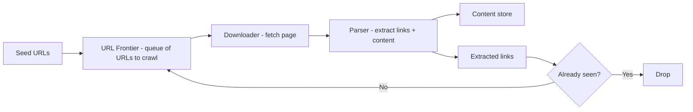
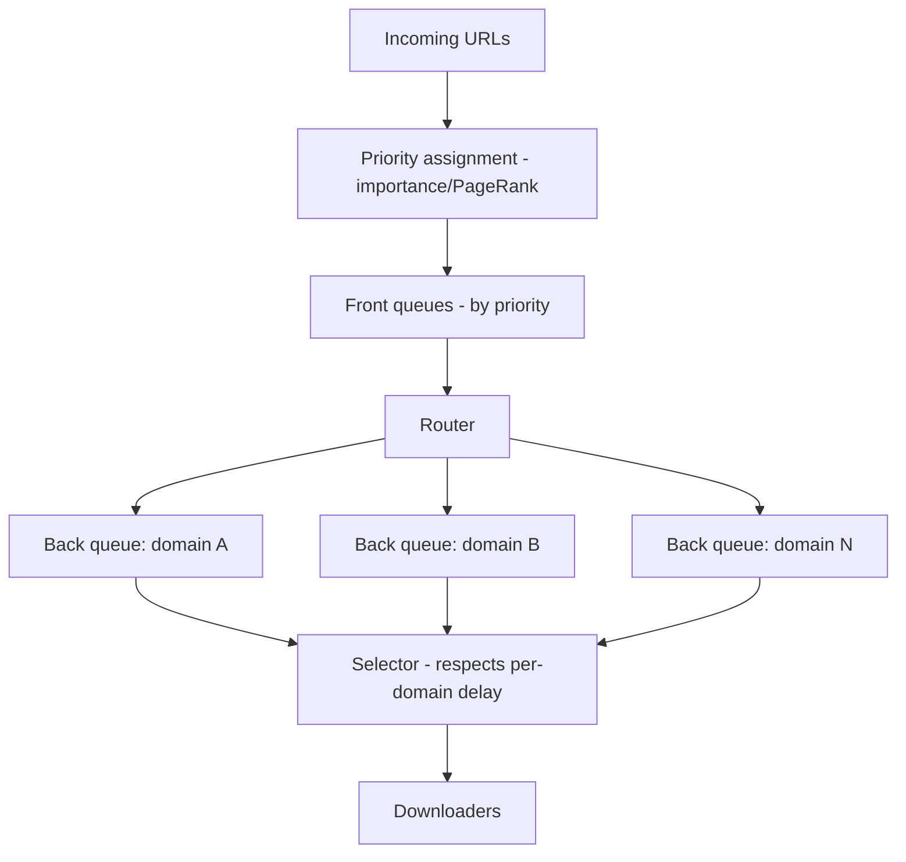
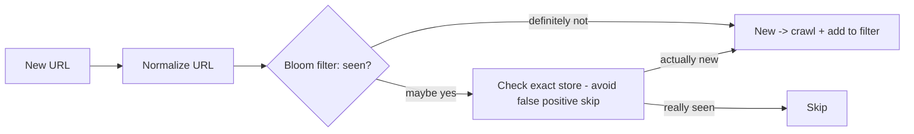
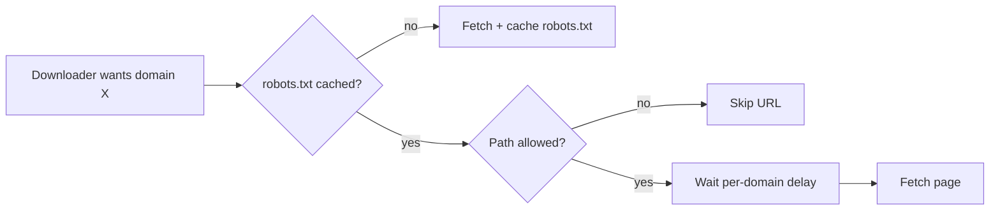
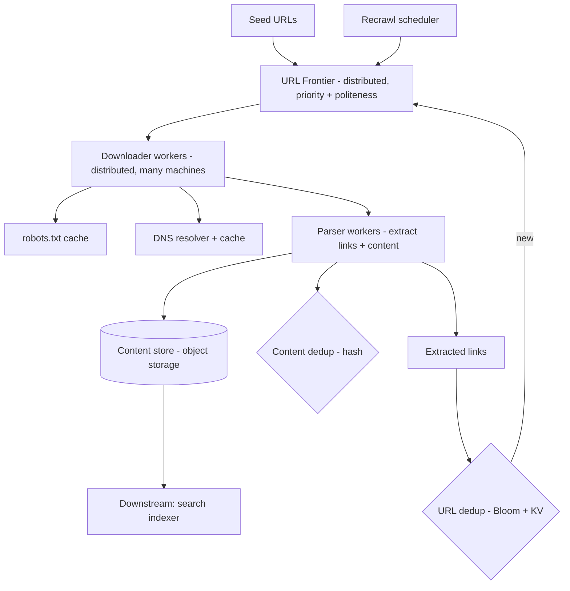
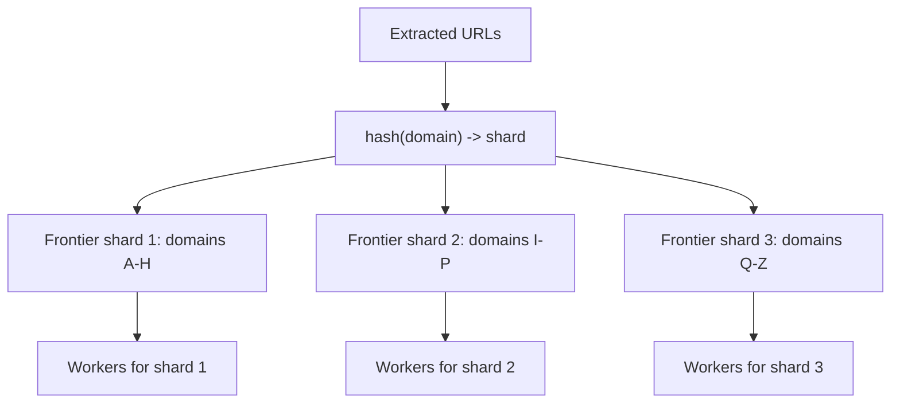
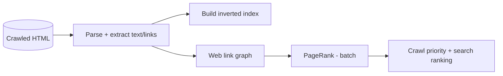

# 🕷️ Design a Web Crawler

> **Problem:** Ek system banao jo internet ke **billions of web pages** ko systematically download
> (crawl) kare — search engine ke liye content collect karne ke liye, ya web archiving, ya price
> monitoring ke liye. Ye design **BFS at massive scale**, **URL deduplication (Bloom filter)**,
> **politeness (server ko overload na karo)**, aur **distributed frontier** ka best example hai. Google
> Search ka pehla step yahi hai.

---

## 1. Requirements

### Functional
- Ek ya kuch **seed URLs** se shuru karo.
- Har page **download** karo, usme se **links extract** karo, un links ko crawl karne ke liye queue me daalo (BFS).
- **HTML content store** karo (indexing ke liye downstream).
- Same URL **dobara crawl na karo** (dedup).
- **Recrawl** — pages badalte hain, periodically wapas crawl karo (freshness).

### Non-Functional
- **Scalable** — billions of pages, distributed across many machines.
- **Politeness** — kisi ek website ke server ko hammer na karo (rate limit per domain); `robots.txt` respect karo.
- **Robustness** — bad HTML, traps (infinite URLs), slow servers, duplicates handle karo.
- **Freshness** — important pages jaldi-jaldi recrawl.
- **Efficiency** — bandwidth/storage optimize; duplicate content avoid.
- **Extensible** — naye content types (images, PDFs) add ho sakein.

---

## 2. Capacity Estimation

Maano hum **1 billion pages/month** crawl karna chahte hain (search engine scale). Zara numbers dekhte hain:

| Metric | Calculation | Value |
|---|---|---|
| Pages/month | given | 1B |
| Pages/sec | 1B / (30 × 86400) | **~400 pages/s** (avg), peak higher |
| Avg page size | ~100 KB (HTML) | |
| Bandwidth | 400 × 100KB | ~40 MB/s = 320 Mbps download |
| Storage/month | 1B × 100KB | **~100 TB/month** (raw HTML) |
| URLs tracked | 1B pages × ~10 links each | ~10B URLs (need dedup structure) |

> **Key insight:** ye ek **I/O-bound, network-heavy, storage-heavy** system hai. Politeness aur dedup
> at 10B-URL scale = asli challenges. Ek machine se nahi hoga → **distributed** must.

---

## 3. ⭐ Core Algorithm — BFS over the web graph

Web ek **graph** hai: pages = nodes, hyperlinks = edges. Crawling = is graph ka **traversal** (BFS
preferred over DFS — BFS important/shallow pages pehle crawl karta, aur naturally spread hota hai).



**Basic loop:**
1. **Frontier** se ek URL nikaalo (kaunsa crawl karna hai).
2. **Download** the page.
3. **Parse** — content store karo, links extract karo.
4. Har extracted link: **already seen?** (dedup) → naya hai to frontier me daalo.
5. Repeat (billions of times, across many machines).

> Ye simple lagta hai par **scale + politeness + dedup + traps** isse hard banate hain.

---

## 4. ⭐ URL Frontier (the heart of the crawler)

Frontier = "ab kaunsi URLs crawl karni hain" ki queue. Par ye simple FIFO nahi — do cheezein manage karni hoti:
**(a) Priority** (important pages pehle) aur **(b) Politeness** (ek domain ko flood na karo).



- **Front queues (priority):** important pages (high PageRank, news) higher priority → jaldi crawl.
- **Back queues (politeness):** har **domain** ki apni queue + apna delay (e.g., 1 request/sec per domain).
  Ek domain ke URLs ek hi back-queue me → controlled rate → server overload nahi hota.
- **Selector** back-queues me se politeness-delay respect karke URLs deta downloaders ko.

This two-level (priority front + politeness back) design = Mercator crawler ka classic pattern.

---

## 5. ⭐ URL Deduplication (Bloom filter at 10B scale)

10 billion URLs "already crawled?" check karna — ek `HashSet` me 10B URLs = **too much RAM**. Solution:
**Bloom filter** — probabilistic, memory-efficient membership test. Dekho [Bloom Filters](../Bloom_Filters_and_Probabilistic_Data_Structures.md).



- **Bloom filter:** "definitely not seen" (crawl it) or "maybe seen" (check exact store). **No false
  negatives** — kabhi kisi crawled page ko "new" nahi kahega (important — no infinite recrawl). False
  positive = rare skip (acceptable, or verify against exact store).
- **URL normalization** (dedup ke liye zaroori): `HTTP`→`http`, remove trailing `/`, sort query params,
  remove `#fragment`, resolve relative → absolute. Warna same page different URLs = duplicate crawl.
- Exact store (DB) for the actual set; Bloom filter = fast in-memory pre-check.

---

## 6. ⭐ Politeness & robots.txt

Kisi website ko **overload karna = DDoS jaisa** (unethical + IP ban). Politeness rules:

- **`robots.txt`:** har domain ka `example.com/robots.txt` batata kaunse paths crawl allowed/disallowed,
  crawl-delay. **Respect karo** (fetch + cache robots.txt per domain).
- **Rate limit per domain:** ek domain pe max 1 request per X seconds (back-queue delay). Dekho [Rate Limiter](./02_Rate_Limiter.md).
- **Identify yourself:** proper `User-Agent` (so site owners know who's crawling).
- **Crawl during off-peak** for big sites (optional).



---

## 7. API / Interfaces (internal)

Web crawler mostly internal (no public API), par components ke interfaces:
```
Frontier.add(url, priority)        -> enqueue URL
Frontier.getNext(domain-aware)     -> next URL respecting politeness
Downloader.fetch(url)              -> (status, html, headers)
Parser.parse(html)                 -> (content, [extracted_urls])
Dedup.seen(url) / Dedup.add(url)   -> bloom + exact store
ContentStore.put(url, html)        -> object store
```

---

## 8. Data Model / Storage

```
URL Frontier:     domain -> queue of (url, priority)         [distributed queue]
Seen URLs:        Bloom filter (RAM) + exact set (DB/KV)
Content Store:    url_hash -> html blob                        [object store]
Content Dedup:    content_hash -> url                          [detect duplicate pages]
Metadata:         url | last_crawled | status | content_hash | next_recrawl
robots.txt cache: domain -> rules + expiry
```

- **Content → object storage** (100s of TB) — not DB. Dekho [Blob Storage](../Advanced_Topics/08_Blob_Object_Storage_and_Large_Files.md).
- **Frontier → distributed queue** (Kafka / custom). Dekho [Message Queues](../18_Message_Queues_Kafka_RabbitMQ.md).
- **Seen set → Bloom filter + KV store** (sharded by URL hash). Dekho [Key-Value Store](./24_Key_Value_Store_DynamoDB.md).

---

## 9. 🏛️ Main HLD Architecture



**Flow:** seeds → frontier → distributed downloaders (respect robots + politeness + DNS cache) →
parsers (extract content + links) → content stored, links deduped and re-queued → recrawl scheduler
periodically re-adds pages. Downstream: search indexer consumes content.

---

## 10. Deep Dive — Distributed crawling
- **Many downloader machines** — thousands of pages fetched in parallel (I/O bound → high concurrency per machine).
- **Frontier partitioned by domain** (consistent hashing) → ek domain ek worker → politeness natural (one place controls that domain's rate). Dekho [Consistent Hashing](../19_Consistent_Hashing.md).
- **Coordination:** which worker owns which domain — via registry / consistent hashing. Worker fail → domains reassigned. Dekho [Service Discovery](../Advanced_Topics/10_Service_Discovery_and_Service_Mesh.md).
- **DNS cache:** DNS lookup slow (10s of ms) → cache per domain (huge speedup at scale). Dekho [DNS](../Advanced_Topics/09_DNS_Deep_Dive.md).

## 11. Deep Dive — Content deduplication
- Different URLs, **same content** (mirror sites, `www` vs non-`www`, print versions) → wasteful.
- **Content hash** (e.g., SHA / SimHash for near-duplicates) → agar hash pehle se dekha, skip storing.
- **SimHash / MinHash** for **near-duplicate** detection (95% same content) — not just exact.

## 12. Deep Dive — Crawler traps & robustness
- **Traps:** infinite URLs (`/page/1`, `/page/2`... forever, calendars with infinite dates, session-id URLs). Detection: max depth, max URLs per domain, pattern detection.
- **Slow/hanging servers:** timeouts (don't block a worker forever). Dekho [Resilience](../Advanced_Topics/07_Resilience_and_Fault_Tolerance.md).
- **Bad HTML:** robust parser (don't crash on malformed).
- **Redirect loops:** limit redirect chain length.
- **Large files:** size limit (don't download 10GB file).

## 13. Deep Dive — Freshness & recrawl
- Pages badalte → recrawl. Par sab equally nahi — **news** roz badalta, **static page** rarely.
- **Adaptive recrawl:** page ka change-frequency track karo (last N crawls me kitna badla) → high-churn pages jaldi recrawl, static pages kabhi-kabhi.
- **Priority recrawl:** important (high PageRank) + frequently-changing pages first.
- Recrawl scheduler periodically frontier me pages wapas add karta based on `next_recrawl`.

## 14. Deep Dive — Priority (which to crawl first)
- Web infinite hai → sab crawl nahi kar sakte; **important pages pehle**.
- **PageRank / popularity** as priority signal; freshness needs; domain authority.
- New/high-value pages → front of frontier.

---

## 14.1 Deep Dive — Distributed frontier at scale

Ek machine ka frontier 10B URLs handle nahi kar sakta. **Distributed frontier:**
- **Partition by domain (consistent hashing):** har URL ka domain hash → ek specific frontier shard/worker.
  Isse **politeness natural** milti (ek domain ka saara traffic ek jagah control hota) + parallelism. Dekho [Consistent Hashing](../19_Consistent_Hashing.md).
- **Persistent queue:** frontier durable hona chahiye (crash pe URLs na khoyein) → Kafka / disk-backed queue. Dekho [Message Queues](../18_Message_Queues_Kafka_RabbitMQ.md).
- **Prioritization:** har shard ke andar priority queues (importance-ordered).



## 14.2 Deep Dive — Storage layout & downstream indexing

- **Raw HTML → object storage** (100s TB), keyed by `hash(url)`; compressed (HTML compresses ~5-10x). Dekho [Blob Storage](../Advanced_Topics/08_Blob_Object_Storage_and_Large_Files.md).
- **Downstream (search engine):** crawled content → parsing → **inverted index** build → search. Dekho [Search Systems](../Advanced_Topics/04_Search_Systems_and_Elasticsearch.md).
- **Link graph:** extracted links → web graph → **PageRank** computation (batch, Spark) → feeds crawl priority + search ranking. Dekho [Big Data](../Advanced_Topics/05_Big_Data_and_Stream_Processing.md).



## 14.3 Deep Dive — Focused / vertical crawlers

- **General crawler** = whole web (Google). **Focused/vertical crawler** = specific topic/domain (jobs
  sites, e-commerce prices, news).
- Focused: **relevance classifier** decides which links to follow (only topic-relevant) → efficient, smaller scope.
- **Incremental crawl:** don't recrawl everything; use `If-Modified-Since` / ETag headers → server says "not changed" (304) → skip download (bandwidth saving).

## 14.4 Deep Dive — Handling dynamic content (JS-rendered)
- Modern sites render content with JavaScript (SPA) → raw HTML empty. **Headless browser** (Puppeteer/
  headless Chrome) to render → extract content. Expensive (CPU) → selectively (only JS-heavy sites).
- Trade-off: rendering cost vs coverage; queue JS-render jobs separately.

## 14.5 Deep Dive — Distributed coordination & fault tolerance
- **Worker failure:** a worker dies mid-crawl → its in-flight URLs (leased) → lease expires → requeued (at-least-once). Dekho [Resilience](../Advanced_Topics/07_Resilience_and_Fault_Tolerance.md).
- **Checkpointing:** frontier state + seen-set persisted → restart resumes (don't recrawl from scratch).
- **Domain reassignment:** worker down → its domains reassigned via consistent hashing rebalance. Dekho [Service Discovery](../Advanced_Topics/10_Service_Discovery_and_Service_Mesh.md).

## 14.6 Common pitfalls
- ❌ Ignoring robots.txt / no rate limit → IP ban, legal issues. ✅ Respect + per-domain throttle.
- ❌ Exact HashSet for 10B URLs → OOM. ✅ Bloom filter + sharded KV.
- ❌ No URL normalization → duplicate crawls. ✅ Canonicalize before dedup.
- ❌ No timeouts → workers hang on slow servers. ✅ Timeouts + async.
- ❌ Crawling infinite trap URLs → wasted resources. ✅ Depth/URL limits + pattern detection.
- ❌ No DNS cache → DNS bottleneck. ✅ Cache per domain.

## 14.7 Extensions / follow-ups
- **Politeness with crawl-delay from robots.txt** (some sites specify exact delay).
- **Distributed dedup:** Bloom filter sharded / replicated across workers (consistency of "seen").
- **Priority tuning:** freshness needs (news frequent) vs coverage (new pages) balance.
- **Sitemap.xml:** sites list their URLs → efficient discovery (crawl sitemap first).

---

## 15. Bottlenecks & Solutions

| Bottleneck | Solution |
|---|---|
| Overloading a website | Politeness — per-domain rate limit + robots.txt |
| 10B URL dedup (RAM) | Bloom filter + sharded KV exact store |
| DNS lookup latency | DNS cache per domain |
| Duplicate content | Content hash / SimHash dedup |
| Crawler traps (infinite URLs) | Max depth/URLs per domain, pattern detection |
| Slow servers | Timeouts + high concurrency |
| Scale (billions) | Distributed workers, frontier partitioned by domain |
| Freshness | Adaptive recrawl by change frequency |

---

## 16. Interview Q&A

**Q: BFS ya DFS, aur kyun?**
BFS — important/shallow pages pehle, natural spread; DFS ek branch me deep chala jaata (kam useful). Frontier = priority queue, not pure FIFO.

**Q: 10 billion URLs "seen?" check kaise (RAM me set nahi aayega)?**
Bloom filter — memory-efficient, "definitely not / maybe yes", no false negatives (crawled page kabhi "new" nahi); maybe-yes pe exact KV store check.

**Q: Politeness kaise ensure karte?**
Per-domain rate limit (back-queues, one queue per domain with delay) + robots.txt respect + proper User-Agent.

**Q: Same content different URLs (mirrors)?**
Content hash (SHA/SimHash) — dedup by content, not just URL; SimHash catches near-duplicates.

**Q: Crawler trap kya, kaise handle?**
Infinite auto-generated URLs (calendars, pagination) → max depth, max URLs/domain, pattern detection.

**Q: Distributed kaise, politeness maintain karte hue?**
Frontier partitioned by domain (consistent hashing) → one worker owns a domain → controls its rate → politeness natural even distributed.

**Q: URL normalization kyun?**
`http`/`HTTP`, trailing slash, query order, fragments → same page different URLs; normalize before dedup warna duplicate crawl.

**Q: Freshness (pages change) kaise?**
Adaptive recrawl — track change frequency per page; high-churn (news) frequent, static rare; priority by importance.

**Q: DNS ka role?**
Har fetch se pehle domain → IP; DNS slow → cache per domain (big speedup at scale).

**Q: Content kahan store, kyun DB nahi?**
Object storage (100s of TB HTML) — cheap, scalable; DB for metadata only.

---

## 17. Summary
- Web crawler = **BFS over web graph**: Frontier → Download → Parse (content + links) → dedup → re-queue.
- **URL Frontier** = priority (important first) + **politeness** (per-domain back-queues + delay + robots.txt).
- **Dedup** at 10B scale = **Bloom filter** (no false negatives) + sharded KV exact store + URL normalization; **content dedup** via SHA/SimHash.
- **Distributed** — workers, frontier **partitioned by domain** (consistent hashing → politeness natural), DNS cache.
- Handle **traps, slow servers, duplicates**; **adaptive recrawl** for freshness; content → object storage, feeds search indexer.

> **Related:** [Bloom Filters](../Bloom_Filters_and_Probabilistic_Data_Structures.md) · [Consistent Hashing](../19_Consistent_Hashing.md) · [Message Queues](../18_Message_Queues_Kafka_RabbitMQ.md) · [Rate Limiter](./02_Rate_Limiter.md) · [DNS](../Advanced_Topics/09_DNS_Deep_Dive.md) · [Blob Storage](../Advanced_Topics/08_Blob_Object_Storage_and_Large_Files.md) · [Google Maps](./21_Google_Maps_Navigation.md)
