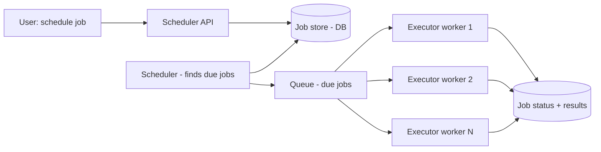
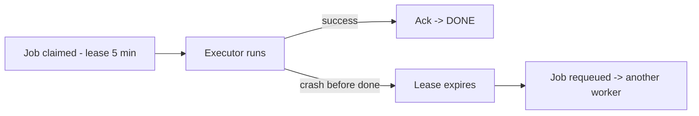
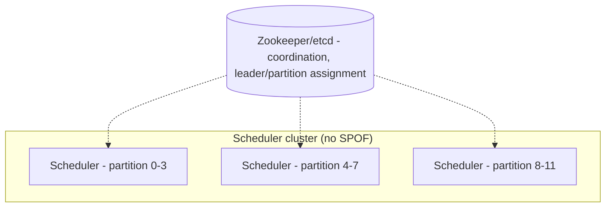
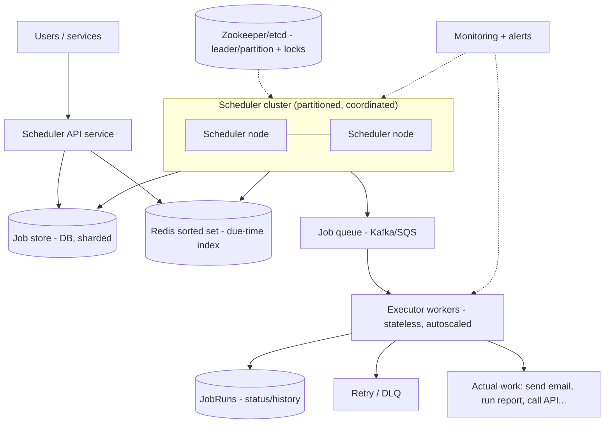
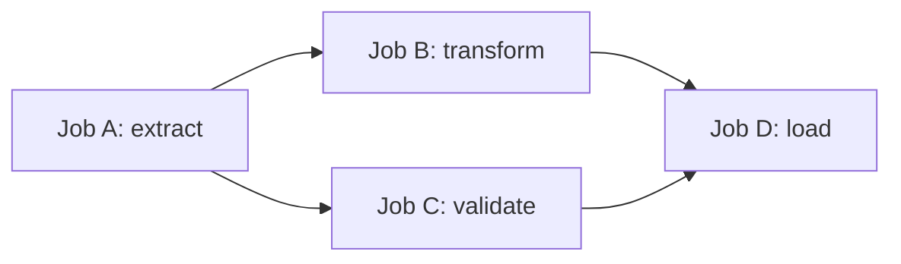
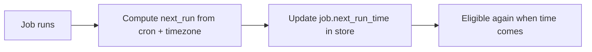

# ⏰ Design a Distributed Job Scheduler (Cron at Scale)

> **Problem:** Ek system banao jo **scheduled jobs / tasks** run kare — "har raat 2 baje report banao",
> "5 min baad ye email bhejo", "har ghante data sync karo", ya "10 lakh users ko kal 9 baje notification
> bhejo". Ye distributed `cron` hai — challenge hai **reliability at scale** (job kabhi na miss ho, na
> do baar chale), **exactly time pe trigger**, aur **failure handling**. Airflow, Quartz, cron, AWS
> EventBridge, Kubernetes CronJobs — sab isi family me.

---

## 1. Requirements

### Functional
- **Schedule a job:** one-time (run at time T) ya recurring (cron expression — `0 2 * * *`).
- **Execute** job at the right time (trigger the work).
- **Cancel / update** a scheduled job.
- **Retry** on failure (with backoff).
- **Job dependencies** (optional): job B runs after job A (DAG — Airflow style).
- **Status tracking:** pending / running / success / failed; history.

### Non-Functional
- **Reliability:** job kabhi **miss** na ho (at-least-once), ideally exactly-once effect.
- **Accuracy:** job scheduled time ke **aas-paas** hi chale (low delay).
- **Scalability:** millions of scheduled jobs, thousands executing concurrently.
- **Availability:** scheduler down = jobs miss = business impact → no SPOF.
- **Isolation:** ek slow/failing job baaki ko block na kare.
- **Durability:** scheduled jobs persist (crash pe na khoyein).

---

## 2. Capacity Estimation

Maano **100M scheduled jobs** total, average **10K jobs/sec** ko trigger karna hai peak pe (jaise 9:00 AM
pe lakhs reminders):

| Metric | Value |
|---|---|
| Total scheduled jobs | ~100M (stored) |
| Peak triggers/sec | ~10K–100K (spiky — many jobs at round times like 9:00) |
| Job metadata | ~1 KB each → ~100 GB store |
| Execution workers | Scale with concurrent running jobs |

> **Key insight:** load **spiky** hai — log 9:00, 12:00, midnight jaise round times pe jobs schedule
> karte → thundering herd. Aur **time-precision + no-miss + no-duplicate** = core challenges.

---

## 3. ⭐ Core Design — Separate Scheduling from Execution

Sabse important architectural decision: **scheduler** (decide *kab* chalana hai) ko **executor**
(actual kaam karna) se **alag** rakho. Scheduler light hota (bas time track karke trigger deta),
executor heavy (asli job run karta). Isse dono independently scale hote hain.



- **Scheduler:** periodically DB me dekhta "kaunse jobs ab due hain?" → unhe **queue** me daal deta.
- **Executors:** queue se job uthaake **run** karte (stateless workers, horizontally scalable).
- **Queue** decouples — scheduler light, executors scale independently, spikes absorb. Dekho [Message Queues](../18_Message_Queues_Kafka_RabbitMQ.md).

---

## 4. ⭐ How does the scheduler find "due" jobs?

Ye core mechanism hai. Do common approaches:

### Approach A: Polling the DB (simple, common)
Scheduler har few seconds DB query karta: `SELECT * FROM jobs WHERE next_run_time <= NOW() AND status='SCHEDULED'`.


- **Index on `next_run_time`** → query fast. Dekho [DB Indexing](../Advanced_Topics/03_Database_Indexing_Deep_Dive.md).
- **Poll interval** trade-off: chhota = accurate but more DB load; bada = less load but jobs late.
- **Claim atomically** (`UPDATE ... WHERE status='SCHEDULED'`) so two schedulers don't pick same job.

### Approach B: Time-bucketing / Timing wheel (scale)
100M jobs poll karna mehnga. **Bucket by time:** jobs ko time-slots (buckets, e.g., per-minute) me
group karo; sirf **current bucket** load karo. Redis sorted set (score = timestamp) ya timing wheel.

- **Redis sorted set:** `ZADD jobs <timestamp> <job_id>`; `ZRANGEBYSCORE jobs 0 now` → due jobs in O(log n). Very efficient.
- **Timing wheel:** in-memory circular buffer of time-slots (like OS schedulers) — O(1) add, efficient for near-term jobs.

> **Interview answer:** "Redis sorted set (score=next-run-time) for due-job lookup, or DB polling with
> index on next_run_time; bucket by time to avoid scanning all jobs."

---

## 5. ⭐ Reliability — At-Least-Once & No Duplicates

Do critical guarantees: **(a) job na miss ho** (at-least-once) aur **(b) do baar na chale** (dedup / idempotent).

### At-least-once (no miss)
- Job claim → enqueue → **executor crashes before finishing** → job kho jaayega? Nahi. Use **visibility
  timeout / lease:** job "PROCESSING" mark + lease time; executor complete kare to "DONE"; agar lease
  expire ho gaya (executor mar gaya) → job wapas "SCHEDULED" → koi aur worker uthaayega.
- Queue with ack (SQS/Kafka): message ack tabhi jab job done; na ack ho to redeliver.



### No duplicates (at-least-once → need idempotency)
- At-least-once me **duplicate execution possible** (lease expire but job actually completing). So the
  **job itself should be idempotent** (running twice = same effect). Dekho [Idempotency](../Idempotency.md).
- Or dedup: execution_id + "already ran?" check before side-effects.
- **Exactly-once is hard** — practically = at-least-once + idempotent jobs.

---

## 6. ⭐ No Single Point of Failure (multiple schedulers + leader election)

Ek scheduler = SPOF (wo mare to jobs miss). Chahiye **multiple schedulers**, par do schedulers **same
job trigger na karein**. Solutions:

### Option A: Leader election (active-passive)
Ek scheduler **leader** (active), baaki standby. Leader mare → naya elect. Leader election via
Zookeeper/etcd (consensus). Dekho [Consensus](../Advanced_Topics/01_Consensus_Algorithms.md).

### Option B: Partitioning (active-active)
Jobs ko **partition** karo (by hash / shard); har scheduler ek partition handle karta → parallel, no
overlap. Ek scheduler mare → uski partition kisi aur ko reassign (rebalance). Dekho [Sharding](../21_Database_Sharding.md).



- **Distributed lock / atomic claim** ensures even if two schedulers overlap, a job runs once (DB conditional update). Dekho [Concurrency Control](../Concurrency_Control.md).

---

## 7. API Design

```
POST /v1/jobs
  { "type": "send_email", "payload": {...}, "schedule": "0 9 * * *", "timezone": "IST",
    "retry": { "max": 3, "backoff": "exponential" } }
  -> job_id

GET    /v1/jobs/{id}         -> status, next_run, history
PUT    /v1/jobs/{id}         -> update schedule/payload
DELETE /v1/jobs/{id}         -> cancel
GET    /v1/jobs/{id}/runs    -> execution history (each run: status, time, error)
```

- **Cron expression** for recurring; ISO timestamp for one-time; timezone-aware.
- Retry policy per job.

---

## 8. Data Model

```
Jobs:
  job_id (PK) | type | payload | cron/next_run_time | timezone | status
              | retry_policy | owner | created_at | version

JobRuns (history):
  run_id | job_id | scheduled_time | started_at | finished_at | status | attempt | error

Locks/Leases:
  job_id | worker_id | lease_expiry     (for at-least-once claim)
```

- **Index on `next_run_time`** (find due jobs fast). Recurring job: after run, compute + set **next** `next_run_time`.
- Jobs → DB (durable); due-job lookup → Redis sorted set (fast). JobRuns → append-only history.

---

## 9. 🏛️ Main HLD Architecture



**Flow:** API stores job (DB + due-time index) → scheduler cluster (partitioned, coordinated) finds
due jobs, atomically claims, enqueues → executor workers run (with lease/retry) → status recorded;
failures → retry/DLQ. Coordination (etcd) prevents overlap; monitoring alerts on misses.

---

## 10. Deep Dive — Retries, backoff & DLQ
- **Failure → retry** with **exponential backoff + jitter** (don't hammer a failing dependency). Dekho [Resilience](../Advanced_Topics/07_Resilience_and_Fault_Tolerance.md).
- **Max retries** → then **Dead Letter Queue (DLQ)** — investigate, don't retry forever. Dekho [Message Queues](../18_Message_Queues_Kafka_RabbitMQ.md).
- **Idempotent jobs** essential (retry safe). Track attempt count in JobRuns.

## 11. Deep Dive — Thundering herd (many jobs at 9:00)
- Log jobs ko round times (9:00:00) pe schedule karte → spike. Solutions:
  - **Jitter:** add small random offset (9:00:00–9:00:30) → spread load.
  - **Queue buffering:** enqueue all, executors drain at their pace (backpressure).
  - **Autoscale executors** for known peaks.

## 12. Deep Dive — Job dependencies (DAG / workflows)
- Airflow-style: job B after A, C after A+B → **DAG** (directed acyclic graph).
- Scheduler tracks completion → triggers downstream when deps met.
- Used for data pipelines (ETL): extract → transform → load. Dekho [Big Data](../Advanced_Topics/05_Big_Data_and_Stream_Processing.md).



## 13. Deep Dive — Time accuracy & timezones
- **Precision:** poll interval / bucket granularity limits accuracy (e.g., ±few sec). Real-time critical? smaller buckets/timing wheel.
- **Timezones + DST:** store in UTC, convert per job timezone; DST transitions tricky (2 AM might happen twice or not at all).
- **Clock skew** across nodes → use a consistent time source (NTP); or central time authority.

## 14. Deep Dive — Isolation & resource limits
- Ek job **infinite loop / hog** → baaki block na ho. **Timeouts** per job; **resource limits** (CPU/memory, containers). Dekho [Resilience (bulkhead)](../Advanced_Topics/07_Resilience_and_Fault_Tolerance.md).
- Priority queues: critical jobs (payments) > low-priority (analytics).

---

## 14.1 Deep Dive — Delivery semantics (at-most / at-least / exactly-once)

| Semantic | Matlab | Kaise | Use |
|---|---|---|---|
| **At-most-once** | Zero or one run (may miss) | Fire, no retry | Non-critical (best-effort metric) |
| **At-least-once** | One or more (may duplicate) | Lease + retry on failure | **Default** — most schedulers |
| **Exactly-once (effect)** | Exactly one effect | At-least-once + **idempotent job** | Critical (payments, billing) |

- Pure exactly-once delivery = impossible in distributed systems; **exactly-once effect** = at-least-once + idempotency. Dekho [Idempotency](../Idempotency.md).

## 14.2 Deep Dive — Cron parsing & next-run computation

- **Cron expression** (`0 2 * * *` = 2 AM daily) parse → compute **next fire time**.
- Recurring job: after each run, **compute next `next_run_time`** and update (don't lose the schedule).
- **Timezone + DST:** store next-run in UTC; convert per job's timezone; DST → 2 AM might repeat or skip (handle explicitly).
- **Catch-up policy:** scheduler down for 1 hr → missed runs? Options: skip (run only latest), or backfill (run all missed) — configurable per job.



## 14.3 Deep Dive — Worked capacity example

- 100M jobs total; suppose 1% fire in a given minute at peak = 1M jobs/min = ~**17K/s**.
- Redis sorted set `ZRANGEBYSCORE` for due jobs: O(log N + M) — fetch the M due, enqueue.
- Executor workers: if avg job takes 200ms and 17K/s arrive → need ~3400 concurrent slots → autoscale worker pool.
- Job metadata 1 KB × 100M = ~100 GB → sharded DB.

## 14.4 Deep Dive — Priority & fairness

- **Priority queues:** critical jobs (payment settlement) > low (analytics) → high-priority queue drained first.
- **Fairness:** one tenant/user schedules millions of jobs → don't starve others → per-tenant quotas / weighted fair queuing. Dekho [Rate Limiter](./02_Rate_Limiter.md).
- **Isolation:** noisy tenant's jobs isolated (separate worker pool / bulkhead). Dekho [Resilience](../Advanced_Topics/07_Resilience_and_Fault_Tolerance.md).

## 14.5 Deep Dive — Monitoring & observability

Scheduler me monitoring critical (missed job = silent failure). Dekho [Observability](../Advanced_Topics/02_Observability_Monitoring_Logging_Tracing.md).
- **Metrics:** jobs scheduled/run/failed, execution delay (scheduled vs actual start), queue depth, worker utilization.
- **Alerts:** execution delay high (jobs late), failure rate spike, DLQ growing, queue backing up.
- **Missed-job detection:** job's next_run passed but no run recorded → alert (the scary silent failure).

## 14.6 Common pitfalls
- ❌ Single scheduler → SPOF (jobs miss on crash). ✅ Multiple + leader election / partition.
- ❌ Non-idempotent jobs + at-least-once → duplicate side-effects. ✅ Idempotent jobs.
- ❌ All jobs at round times (9:00) → thundering herd. ✅ Jitter.
- ❌ No timeout → runaway job hogs worker. ✅ Timeouts + resource limits.
- ❌ Recurring job forgets to set next_run → runs once. ✅ Compute + persist next fire.
- ❌ Polling too frequently → DB load; too rarely → jobs late. ✅ Tune / use Redis ZSET.

## 14.7 Extensions / follow-ups
- **Workflow engine (Airflow):** DAGs, retries, backfills, dependencies — full pipeline orchestration.
- **Delayed messages:** "run this in 5 min" = delay queue (SQS delay / Redis ZSET) — lightweight scheduler.
- **Distributed cron alternatives:** Kubernetes CronJobs, cloud (AWS EventBridge Scheduler), Quartz cluster.
- **Exactly-once with outbox:** job triggers a message via outbox pattern → downstream idempotent. Dekho [Distributed Transactions](../Distributed_Transactions.md).

---

## 15. Bottlenecks & Solutions

| Bottleneck | Solution |
|---|---|
| Scheduler SPOF | Multiple schedulers + leader election / partitioning |
| Two schedulers, same job | Atomic claim (conditional update) + coordination |
| Job missed (worker crash) | Lease/visibility timeout → requeue (at-least-once) |
| Duplicate execution | Idempotent jobs + dedup |
| Finding due jobs at 100M scale | Redis sorted set (score=time) / index on next_run_time / bucketing |
| Thundering herd (9:00 spike) | Jitter + queue buffering + autoscale |
| Failing jobs | Retry (backoff+jitter) + DLQ |
| Runaway job | Timeouts + resource limits + isolation |

---

## 16. Interview Q&A

**Q: Scheduling ko execution se alag kyun?**
Scheduler light (time track + trigger), executor heavy (run job); alag scale, queue decouples, spikes absorb.

**Q: Due jobs kaise dhoondhte 100M scale pe?**
Redis sorted set (score = next-run-time, `ZRANGEBYSCORE`) or DB with index on next_run_time; bucket by time — don't scan all.

**Q: Job miss na ho (at-least-once) kaise?**
Lease/visibility timeout: claim job + lease; complete → done; worker crash → lease expires → requeue.

**Q: Do baar na chale kaise, jab at-least-once me duplicate possible?**
Idempotent jobs (run twice = same effect) + dedup on execution_id; exactly-once ≈ at-least-once + idempotency.

**Q: Scheduler SPOF kaise avoid?**
Multiple schedulers + leader election (active-passive via etcd/Zookeeper) OR partition jobs (active-active); atomic claim prevents double-trigger.

**Q: Do schedulers same job trigger na karein?**
Atomic conditional claim (`UPDATE WHERE status='SCHEDULED'`) — one wins; + partitioning so they don't overlap.

**Q: 9:00 AM pe lakhs jobs (thundering herd)?**
Jitter (random offset), queue buffering (executors drain at pace), autoscale executors.

**Q: Failed job?**
Retry with exponential backoff + jitter, max attempts, then DLQ.

**Q: Job dependencies (B after A)?**
DAG — scheduler tracks completion, triggers downstream when deps met (Airflow-style, for ETL pipelines).

**Q: Timezone / DST?**
Store UTC, convert per-job timezone; handle DST edge cases (2AM twice / skipped).

---

## 17. Summary
- **Separate scheduler (when) from executors (what)** via a **queue** — independent scale, spike absorption.
- **Find due jobs** via Redis sorted set (score=time) / indexed `next_run_time` / bucketing — not full scan.
- **At-least-once** via lease/visibility timeout (crash → requeue); **no duplicates** via **idempotent jobs** (exactly-once ≈ at-least-once + idempotency).
- **No SPOF:** multiple schedulers + leader election OR partitioning + coordination (etcd); atomic claim prevents double-trigger.
- **Retries** (backoff + jitter + DLQ), **jitter** for thundering herd, **DAG** for dependencies, **timeouts/limits** for isolation.

> **Related:** [Message Queues](../18_Message_Queues_Kafka_RabbitMQ.md) · [Consensus](../Advanced_Topics/01_Consensus_Algorithms.md) · [Idempotency](../Idempotency.md) · [Concurrency Control](../Concurrency_Control.md) · [Resilience](../Advanced_Topics/07_Resilience_and_Fault_Tolerance.md) · [Notification System](./08_Notification_System.md)
