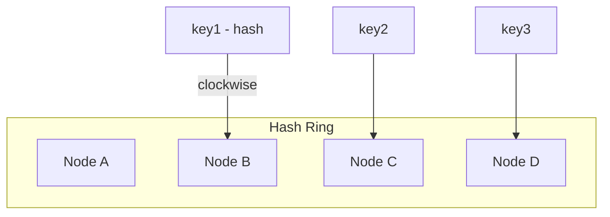
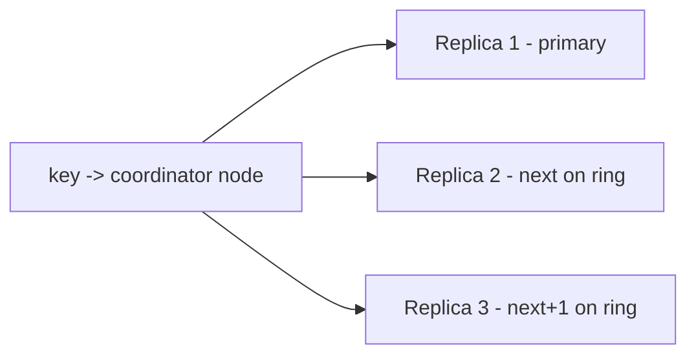
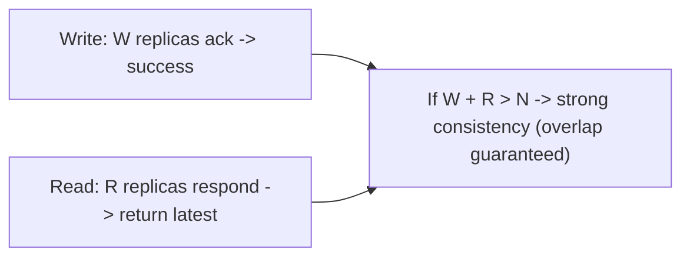
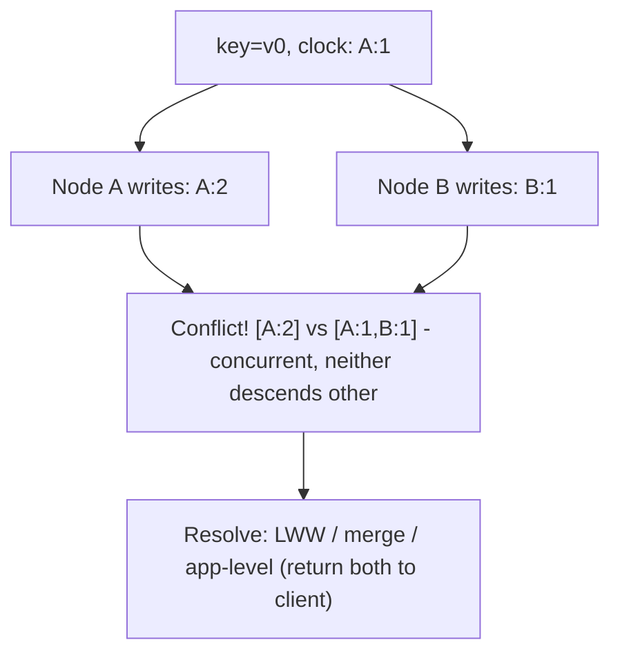
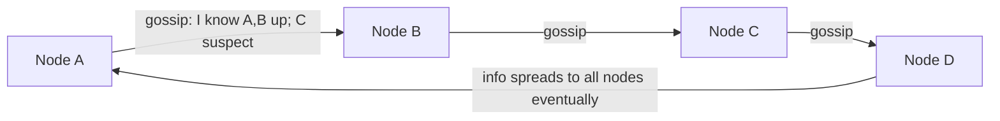
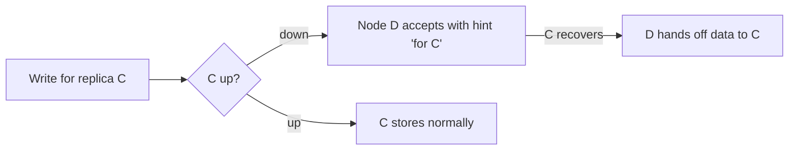
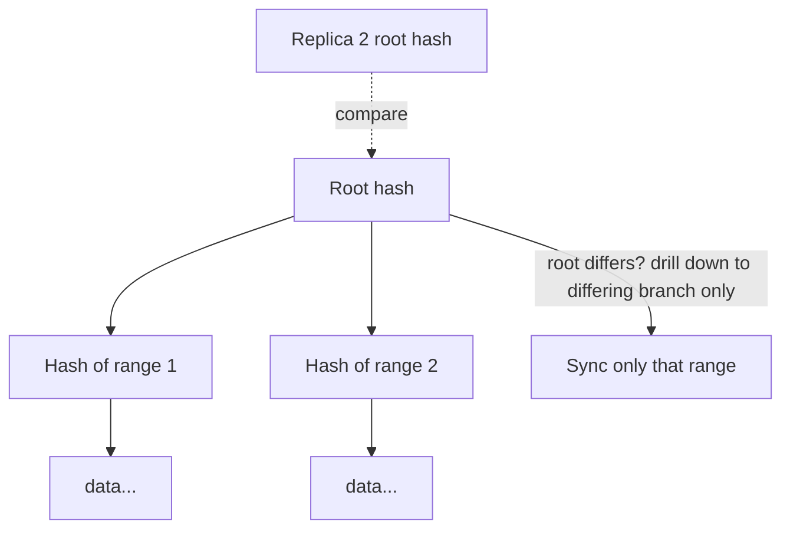
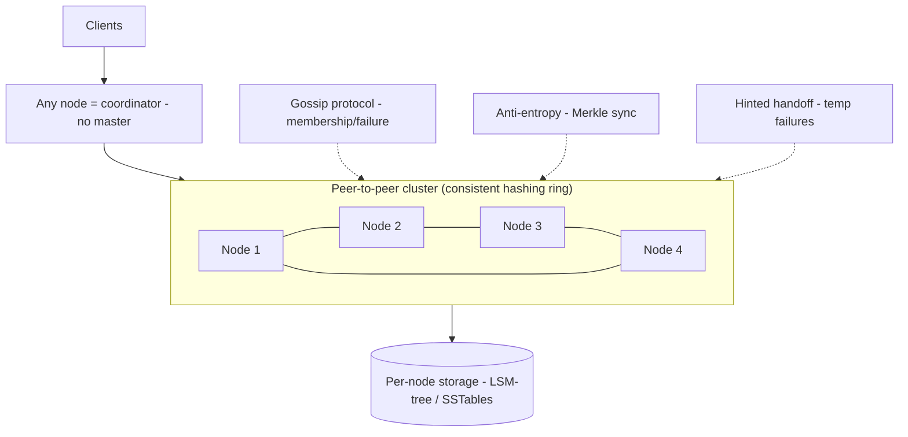
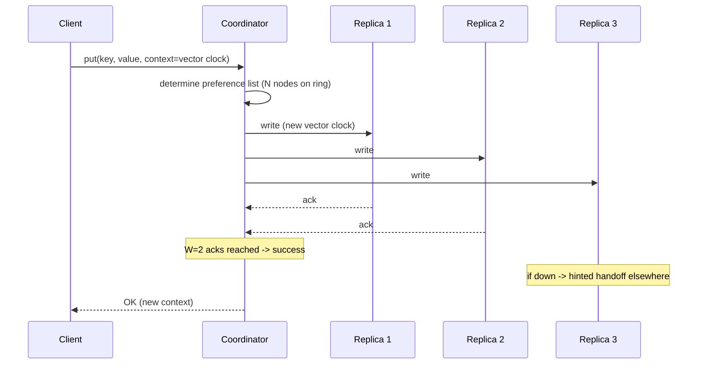
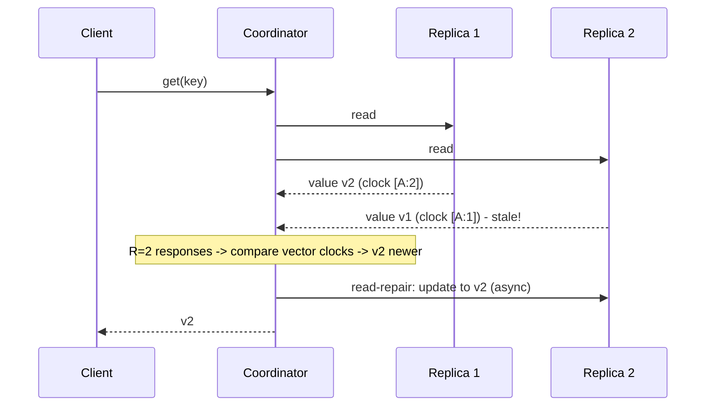

# 🗃️ Design a Distributed Key-Value Store (DynamoDB / Cassandra)

> **Problem:** Ek distributed key-value database banao jo **ek machine se bahut bada** ho — data ko kai
> nodes pe baante, **highly available** rahe (koi node mare to bhi chalti rahe), **horizontally scale**
> ho (nodes add karke), aur **tunable consistency** de. Ye Amazon Dynamo paper (2007) ka classic design
> hai — jisse DynamoDB, Cassandra, Riak, ScyllaDB bane. Isme distributed systems ke **saare** deep
> concepts ek jagah aate hain: consistent hashing, quorum, vector clocks, gossip, Merkle trees.

---

## 1. Requirements

### Functional
- **`get(key)`** — value nikaalo.
- **`put(key, value)`** — value store/update karo.
- **`delete(key)`** — remove.
- Values = opaque blobs (KV store ko structure ki parwah nahi).
- (Optional) TTL / expiry, range queries (Cassandra).

### Non-Functional
- **Highly available** — "always writeable" (Amazon cart: write kabhi fail na ho). AP-leaning.
- **Horizontally scalable** — nodes add karke capacity badhao (no downtime).
- **Fault tolerant** — nodes/disks/network fail hote rehte, system chalti rahe.
- **Tunable consistency** — app decide kare (strong vs eventual) per operation.
- **Low latency** (p99 bounded — Amazon SLA).
- **Decentralized** — no single master (no SPOF); peer-to-peer.

> **Design philosophy (Dynamo):** **availability + partition tolerance (AP)** chosen over strong
> consistency; consistency **tunable** via quorum. "Always writeable" > "always consistent". (CAP: AP.) Dekho [CAP](../11_CAP_Theorem.md).

---

## 2. Capacity Estimation

| Metric | Value |
|---|---|
| Data | PBs (way beyond one machine) |
| Nodes | 100s–1000s in a cluster |
| Ops/sec | Millions (read + write) |
| Replication factor | 3 (typical) — each key on 3 nodes |
| Availability target | 99.99%+ ("always on") |

> Ek machine na data hold kar sakti na load handle → **partition (shard) + replicate** across many nodes,
> **peer-to-peer** (no master bottleneck).

---

## 3. ⭐ Data Partitioning — Consistent Hashing

Data ko nodes me kaise baantein? Naive `hash(key) % N` ka problem: node add/remove → `N` badalta → **saari
keys remap** (massive data movement). **Consistent hashing** ise solve karta. Dekho [Consistent Hashing](../19_Consistent_Hashing.md).



- Nodes aur keys dono ek **ring** (hash space) pe map hote. Key clockwise nearest node pe jaati.
- **Node add/remove → sirf padosi keys remap** (1/N data moves), baaki untouched. Ye elastic scaling ki jaan.
- **Virtual nodes (vnodes):** har physical node ring pe **kai points** (vnodes) rakhta → load even
  distribute hota + node add/remove pe smooth rebalance (ek node ka data kai nodes me faila hota, ek jagah dump nahi).

---

## 4. ⭐ Replication — data ki copies

Har key ko **N nodes** (replication factor, usually 3) pe store karo → ek node mare to data safe.



- Key jis node pe aati wo **coordinator**; wo agle **N-1** nodes (ring pe clockwise) pe bhi copy karta → **preference list** of N nodes.
- **Cross-datacenter/rack awareness:** replicas alag racks/DCs me rakhо (ek rack/DC fail → data still available). Dekho [Replication](../Database_Replication.md).

---

## 5. ⭐ Tunable Consistency — Quorum (N, W, R)

Consistency vs latency/availability ko app tune kar sakta hai teen numbers se:
- **N** = replication factor (kitni copies).
- **W** = write quorum (kitni replicas ack karein tabhi write success).
- **R** = read quorum (kitni replicas se padhein).



- **W + R > N → strong consistency** (read aur write quorums **overlap** karte → read hamesha latest write dekhta).
- **W + R ≤ N → eventual consistency** (faster, par stale read possible).
- **Common configs:**
  - `N=3, W=1, R=1` → fast, highly available, eventual (loose).
  - `N=3, W=2, R=2` → W+R=4 > 3 → **strong-ish** consistency, balanced. ⭐ common.
  - `N=3, W=3, R=1` → fast reads, slow/less-available writes.
- **Trade-off:** high W = consistent but write fails if replicas down (less available); low W = available but stale reads. **App chooses per operation.** Dekho [Replication (quorum)](../Database_Replication.md).

---

## 6. ⭐ Handling Conflicts — Vector Clocks

AP + concurrent writes to same key on different replicas (network partition) → **conflicting versions**.
Kaunsi latest? Physical timestamps reliable nahi (clock skew). Solution: **vector clocks** — causality track karte.



- **Vector clock** = per-key version vector `{node: counter}`. Batata hai ek version doosre ka
  **descendant** hai (causal, auto-resolve) ya **concurrent** (conflict).
- **Concurrent conflict resolution:**
  - **Last-Write-Wins (LWW)** — simplest, but data loss possible (Cassandra default).
  - **Application merge** — return both versions, app merges (Dynamo shopping cart: union of items → nothing lost).
  - **CRDTs** — conflict-free data types auto-merge. Dekho [Replication (conflict resolution)](../Database_Replication.md).

---

## 7. ⭐ Membership & Failure Detection — Gossip

Decentralized (no master) → nodes ko khud pata karna hai kaun zinda, kaun naya, ring kaisa. **Gossip
protocol:** har node periodically kuch random nodes ke saath apni info exchange karta → cluster state
epidemic ki tarah phailti.



- Node join/leave/fail → gossip se sab nodes ko pata (eventually).
- **Failure detection:** node responses miss karta → "suspect" → "down" (phi-accrual detector). No central monitor (decentralized). Dekho [Consensus/coordination](../Advanced_Topics/01_Consensus_Algorithms.md).

---

## 8. ⭐ Handling temporary failures — Hinted Handoff

Ek replica node **temporarily down** hai write ke waqt. Write fail kar dein? Nahi (availability!).
**Hinted handoff:** koi doosra node write ko **temporarily accept** karta with a "hint" (ye X ke liye
hai); X wapas aaye to wo node hint deliver kar deta.



- Availability barकरार (write succeeds even if a replica down); C recover hone pe consistent ho jaata.

---

## 9. ⭐ Anti-Entropy — Merkle Trees

Replicas time ke saath **diverge** ho sakte (missed writes, hinted handoff gaps). Periodically inhe
**sync** karna hai — par poora data compare karna mehnga. **Merkle tree:** data ka hash tree — sirf
**differing branches** compare karo (efficient diff). Dekho [Bloom Filters & DS (Merkle)](../Bloom_Filters_and_Probabilistic_Data_Structures.md).



- Do replicas root hash compare → same to in-sync (done, O(1)); differ → drill down to **only the
  differing subtree** → sync minimal data. Ye **read repair** + background anti-entropy me use hota.

---

## 10. Read/Write Path (putting it together)

```mermaid
sequenceDiagram
    participant C as Client
    participant Co as Coordinator node
    participant R1 as Replica 1
    participant R2 as Replica 2
    participant R3 as Replica 3
    C->>Co: put(key, value)
    Co->>R1: write
    Co->>R2: write
    Co->>R3: write
    R1-->>Co: ack
    R2-->>Co: ack
    Note over Co: W=2 acks -> success (R3 async / hinted)
    Co-->>C: OK
    C->>Co: get(key)
    Co->>R1: read
    Co->>R2: read
    Note over Co: R=2 responses -> pick latest (vector clock); read-repair stale replica
    Co-->>C: value
```

- **Read repair:** read ke time agar ek replica stale mila → coordinator use latest se update kar deta (opportunistic sync).
- **Coordinator** = any node (client kisi bhi node ko hit kar sakta; wo route/coordinate karta — no master).

---

## 11. API Design
```
put(key, value, [context])     -> success (context = vector clock for conflict handling)
get(key)                       -> value(s) + context (multiple if conflict)
delete(key)
```
- **Context (vector clock)** client ko diya jaata read pe; next write pe wapas → causality track.
- Consistency level per-op: `get(key, consistency=QUORUM|ONE|ALL)`.

---

## 12. 🏛️ Main HLD Architecture



- **Peer-to-peer, no master** (no SPOF); any node coordinates. Consistent hashing ring + replication.
- Per-node storage engine = **LSM-tree** (write-optimized — Cassandra). Dekho [DB Indexing (LSM)](../Advanced_Topics/03_Database_Indexing_Deep_Dive.md).
- Gossip (membership), hinted handoff (temp fail), anti-entropy/Merkle (repair) — the "self-healing" trio.

---

## 13. Deep Dive — Storage engine (LSM-tree)
- Write-heavy KV → **LSM-tree** (memtable + WAL + SSTables + compaction). Writes fast (sequential append); reads use Bloom filter per SSTable. Dekho [DB Indexing](../Advanced_Topics/03_Database_Indexing_Deep_Dive.md).
- **Bloom filter** per SSTable → "key not here" O(1) → avoid disk reads. Dekho [Bloom Filters](../Bloom_Filters_and_Probabilistic_Data_Structures.md).

## 14. Deep Dive — DynamoDB vs Cassandra (real systems)
| | DynamoDB | Cassandra |
|---|---|---|
| Managed | AWS fully-managed | Self-hosted (open source) |
| Consistency | Tunable (eventual/strong) | Tunable (quorum levels) |
| Conflict | LWW / server | LWW (timestamp) |
| Data model | KV + document | Wide-column |
| Origin | Dynamo paper | Dynamo + BigTable ideas |

## 15. Deep Dive — Trade-offs & tuning
- **AP by default** (available, eventual); tune to CP-ish with W+R>N (strong but less available under partition).
- **Hot key/partition:** one key gets huge traffic → that partition's nodes overloaded → mitigate with caching, key splitting.
- **Tombstones:** deletes = markers (not immediate remove) → compaction cleans later; too many tombstones = read slowdown.
- **Consistency-latency:** higher R/W = more consistent but higher latency (wait for more replicas).

---

## 15.1 Deep Dive — The write path in detail



- Each replica: append to **commit log (WAL)** → memtable → later flush to SSTable (LSM). Durable + fast.
- If a replica down → **hinted handoff** to another node; delivered on recovery.

## 15.2 Deep Dive — The read path & read repair



- **Read repair:** stale replica detected during read → updated with latest (opportunistic anti-entropy).
- If vector clocks **concurrent** (conflict) → return **both** to client (or apply resolution policy).

## 15.3 Deep Dive — Sloppy quorum & availability

- **Strict quorum:** W nodes from the "home" preference list. If some down → write could fail.
- **Sloppy quorum:** if home nodes down, write to **next available** healthy nodes (with hints) → **always writeable** (Dynamo's goal). Home nodes recover → hinted handoff delivers. Higher availability, weaker consistency guarantee during failures.

## 15.4 Deep Dive — Storage engine internals (LSM recap)
- **Write:** WAL (durability) + memtable (in-RAM sorted). Memtable full → flush to immutable **SSTable**.
- **Read:** memtable → SSTables (newest first); **Bloom filter per SSTable** avoids reading files that don't have the key. Dekho [DB Indexing (LSM)](../Advanced_Topics/03_Database_Indexing_Deep_Dive.md), [Bloom Filters](../Bloom_Filters_and_Probabilistic_Data_Structures.md).
- **Compaction:** merge SSTables (remove overwritten/deleted) → keeps reads fast, reclaims space.
- **Tombstones:** deletes = markers; removed during compaction after grace period.

## 15.5 Deep Dive — Data modeling & access patterns
- KV/wide-column = **query-first modeling** — design tables around access patterns (no ad-hoc joins).
- **Partition key** choice critical: even distribution (avoid hot partitions), supports main queries.
- Denormalize + duplicate data (write to multiple tables) since no joins — storage cheap, reads fast.
- **DynamoDB:** partition key + sort key; GSI (global secondary index) for alternate queries.

## 15.6 Common pitfalls
- ❌ Hot partition (bad partition key) → one node overloaded. ✅ High-cardinality, even key.
- ❌ Expecting strong consistency by default → stale reads. ✅ Tune W+R>N if needed.
- ❌ Big values / large partitions → hotspots, slow. ✅ Split, keep items small.
- ❌ Too many tombstones → read slowdown. ✅ Compaction + TTL.
- ❌ Relying on it for joins/transactions → wrong tool. ✅ KV for simple access; RDBMS for relational.

## 15.7 Extensions / follow-ups
- **Secondary indexes:** GSI/LSI for alternate query patterns (extra write cost).
- **TTL/expiry:** auto-delete old items (sessions, cache).
- **Multi-region replication:** global tables (active-active), conflict resolution (LWW). Dekho [Database Replication](../Database_Replication.md).
- **Change streams (CDC):** table changes → stream (like DynamoDB Streams) → downstream sync/search.

---

## 16. Bottlenecks & Solutions

| Bottleneck | Solution |
|---|---|
| Node add/remove data movement | Consistent hashing + virtual nodes |
| Node failure = data loss | Replication (N=3), rack/DC-aware |
| Stale reads / consistency | Quorum W+R>N; read repair; tunable |
| Concurrent write conflicts | Vector clocks + resolution (LWW/merge/CRDT) |
| Temp node down (write) | Hinted handoff |
| Replica divergence | Anti-entropy (Merkle trees) |
| No master to track membership | Gossip protocol |
| Hot key | Caching, key splitting |

---

## 17. Interview Q&A

**Q: Data partition kaise, `hash % N` kyun nahi?**
`% N` pe node add/remove → sab keys remap. **Consistent hashing** (+ virtual nodes) → sirf 1/N keys move, even load.

**Q: Consistency kaise tune karte (N, W, R)?**
N=copies, W=write quorum, R=read quorum. **W+R>N → strong** (overlap); else eventual. App per-op chooses (latency vs consistency).

**Q: Concurrent writes ka conflict kaise resolve?**
Vector clocks (causality) → descendant auto-resolve; concurrent → LWW / app-merge (cart = union) / CRDT.

**Q: Ek replica down ho write ke waqt?**
Hinted handoff — another node accepts with a hint; original recovers → hint delivered. Availability barकरार.

**Q: Replicas diverge ho jaayein to sync kaise (efficient)?**
Merkle trees — compare root hash, drill into only differing branches → minimal data sync (anti-entropy + read repair).

**Q: No master, to membership/failure kaise pata?**
Gossip protocol — nodes periodically exchange state → cluster view spreads; phi-accrual failure detection.

**Q: CAP me DynamoDB kya?**
AP by default ("always writeable", eventual); tunable toward CP with W+R>N (less available under partition).

**Q: Coordinator kya, master hai?**
No master — any node client se contact ho kar coordinator ban jaata (route to replicas). Fully decentralized.

**Q: Storage engine kaunsa aur kyun?**
LSM-tree (write-optimized, sequential writes + compaction) + per-SSTable Bloom filter for reads — write-heavy KV ke liye best.

**Q: Read repair?**
Read pe stale replica mila → coordinator use latest se update kar deta (opportunistic consistency).

---

## 18. Summary
- **Peer-to-peer, no master** (no SPOF); **consistent hashing + virtual nodes** = elastic partition; **replication (N=3, rack-aware)** = fault tolerance.
- **Tunable consistency** via quorum: **W+R>N → strong**, else eventual (AP by default — "always writeable").
- **Conflicts** (concurrent writes) → **vector clocks** + resolution (LWW / app-merge / CRDT).
- **Self-healing trio:** **gossip** (membership), **hinted handoff** (temp failures), **Merkle-tree anti-entropy** (replica sync) + **read repair**.
- Per-node **LSM-tree + Bloom filter** storage; real systems: DynamoDB (managed), Cassandra (wide-column).

> **Related:** [Consistent Hashing](../19_Consistent_Hashing.md) · [Database Replication](../Database_Replication.md) · [CAP Theorem](../11_CAP_Theorem.md) · [Bloom Filters & Merkle](../Bloom_Filters_and_Probabilistic_Data_Structures.md) · [DB Indexing (LSM)](../Advanced_Topics/03_Database_Indexing_Deep_Dive.md) · [Distributed Cache](./03_Distributed_Cache.md)
