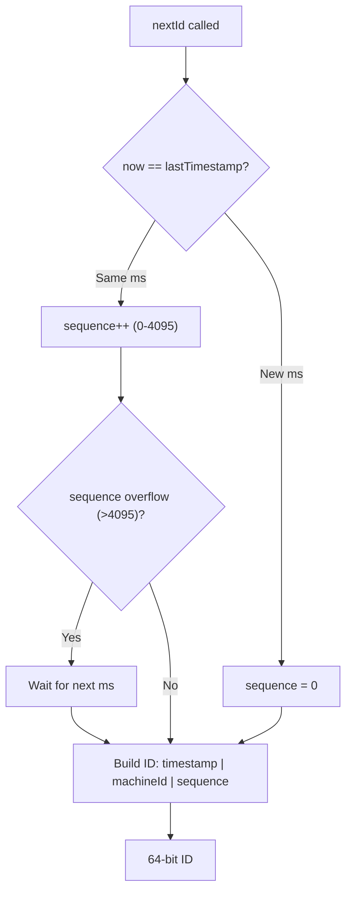
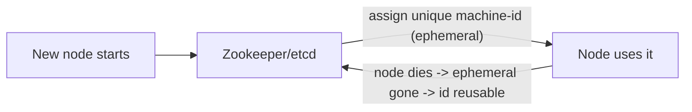
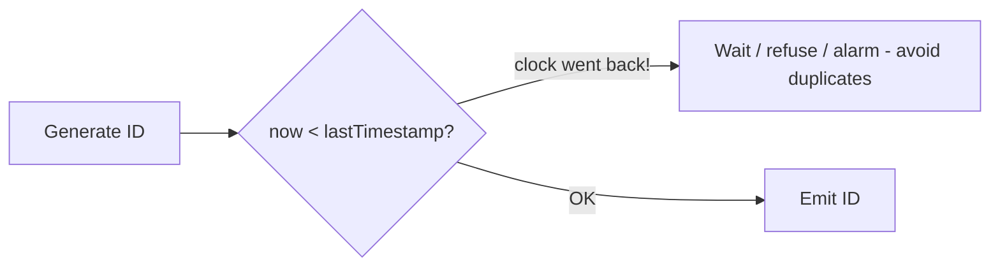
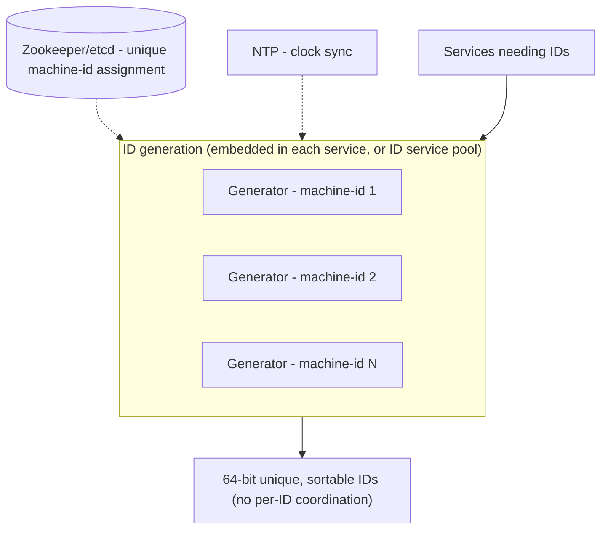

# 🆔 Design a Distributed Unique ID Generator (Snowflake)

> **Problem:** Ek system banao jo **globally unique IDs** generate kare — billions of IDs, kai machines
> pe **ek saath**, bina coordination ke, bina collision ke. IDs ideally **roughly time-sorted** ho
> (sortable) aur **64-bit** (compact) ho. Har tweet, order, message, payment ko unique ID chahiye — DB
> auto-increment single-node bottleneck hai, UUID bada + unsortable. Twitter ka **Snowflake** iska
> classic answer hai.

---

## 1. Requirements

### Functional
- **Unique** IDs generate karo — kabhi collision nahi (across all machines, all time).
- **Multiple generators** (distributed) — har node independently IDs banaye, coordination without per-ID network call.
- Given an ID, ideally uska **rough creation time** nikal sake.

### Non-Functional
- **Uniqueness** — 100% guaranteed (duplicate = data corruption).
- **Roughly sortable by time** — naye IDs bade (k-sorted) → DB indexing efficient, "latest N" easy.
- **High throughput** — 10K+ IDs/sec per node, millions cluster-wide.
- **Low latency** — ID generation local (no network round-trip per ID).
- **Compact** — 64-bit integer (fits in `bigint`, index-friendly, smaller than 128-bit UUID).
- **Highly available** — ID generation kabhi block na ho.

---

## 2. Why not the simple options?

Pehle samajhte hain simple approaches kyun fail hote (interview me ye zaroor discuss karo):

| Approach | Problem |
|---|---|
| **DB auto-increment** | Single DB = SPOF + bottleneck (har ID ke liye DB write); scale nahi |
| **UUID (v4, random)** | 128-bit (bada, index-unfriendly), **not sortable** (random) → B-tree fragmentation |
| **UUID (v1, timestamp)** | Sortable-ish par MAC-based (privacy), still 128-bit |
| **Multiple DBs with offset** | `DB1: 1,3,5...`, `DB2: 2,4,6...` — works but rigid, hard to add nodes |
| **Central ID service** | Every ID = network call → latency + SPOF/bottleneck (unless batched) |

> **Snowflake** in sab problems ko solve karta: 64-bit, sortable, distributed, no per-ID coordination.

---

## 3. ⭐ Core Design — Snowflake 64-bit layout

Snowflake ka jaadu: **64-bit ID ko parts me baanto** — har part alag cheez encode karta. Combine karke uniqueness + sortability milti.

```
 64-bit ID:
 ┌─┬───────────────────────────────┬──────────┬─────────────┐
 │0│      timestamp (41 bits)       │ machine  │  sequence   │
 │ │   (ms since custom epoch)      │ (10 bits)│  (12 bits)  │
 └─┴───────────────────────────────┴──────────┴─────────────┘
   1        41                         10           12
```


| Part | Bits | Kya | Range |
|---|---|---|---|
| **Sign** | 1 | Always 0 (positive number) | — |
| **Timestamp** | 41 | Milliseconds since a **custom epoch** | ~69 years |
| **Machine ID** | 10 | Which node/worker generated it | 1024 machines |
| **Sequence** | 12 | Counter for IDs within the **same millisecond** | 4096 IDs/ms/machine |

**Uniqueness kaise guaranteed:**
- **Timestamp** — different ms → different IDs (mostly).
- **Machine ID** — different machines → different IDs (even same ms). **No coordination needed** — har machine apni unique machine-id se IDs banata.
- **Sequence** — same machine, same ms me multiple IDs → sequence 0,1,2... → unique.
- Teeno combine → **globally unique** without any per-ID network call. ⚡

**Throughput:** 4096 IDs/ms/machine = **~4 million IDs/sec per machine**. 1024 machines = **billions/sec**. More than enough.

**Sortability:** timestamp **highest bits** me hai → numeric sort ≈ time sort (roughly, "k-sorted"). Latest IDs = largest numbers.

---

## 4. ⭐ ID Generation Algorithm (per node)

```
function nextId():
    now = currentTimeMillis()
    if now == lastTimestamp:
        sequence = (sequence + 1) & 4095      # 12-bit wrap
        if sequence == 0:                      # 4096 exhausted this ms
            now = waitNextMillis(lastTimestamp)  # busy-wait till next ms
    else:
        sequence = 0                           # new ms -> reset sequence
    lastTimestamp = now
    return ((now - EPOCH) << 22) | (machineId << 12) | sequence
```



- Sab kuch **local** (no network) → sub-microsecond latency.
- 4096/ms exhaust ho jaayein (rare) → agli ms tak wait (busy-wait).

---

## 5. ⭐ Machine ID assignment (the tricky part)

Har node ko ek **unique machine-id (0-1023)** chahiye. Do nodes same machine-id → collision! Assign kaise?

| Method | Kaise |
|---|---|
| **Static config** | Manually assign per node (simple, error-prone at scale) |
| **Zookeeper/etcd** | Node startup pe coordination service se unique id lo (ephemeral sequential znode) |
| **DB** | Central table hands out unique machine-ids |
| **Container orchestration** | Kubernetes stateful set ordinal → machine-id |



> **Best practice:** Zookeeper/etcd ephemeral sequential nodes → auto-assign + reclaim on death. Dekho [Consensus/coordination](../Advanced_Topics/01_Consensus_Algorithms.md).

---

## 6. ⭐ Clock issues — the Achilles' heel

Snowflake **timestamp** pe depend karta → clock problems = big issues:

### Clock skew (nodes ki clocks alag)
- Different nodes ki clock thodi alag → IDs across nodes not perfectly time-ordered (but still unique — machine-id saves). Acceptable ("roughly sorted"). Use **NTP** to keep clocks close.

### ⭐ Clock going backwards (the danger)
- NTP sync ya leap second se clock **peeche** chala jaaye → `now < lastTimestamp` → **duplicate IDs possible** (same timestamp again). 💥
- **Solutions:**
  - **Refuse to generate** while clock < lastTimestamp (wait till it catches up) — safest, brief unavailability.
  - **Reject small backward jumps** (wait), **alarm on large** (manual intervention).
  - Some designs store lastTimestamp and never emit ≤ it.



> **Interview point:** "Clock going backwards is the main risk — refuse/wait till clock catches up rather than risk duplicates."

---

## 7. API Design
```
GET /id            -> single 64-bit ID
GET /ids?count=100 -> batch of IDs (efficiency)
```
- Usually a **library embedded in each service** (no network — fastest), or a lightweight ID service with batching.

---

## 8. 🏛️ Main HLD Architecture



- **Two deployment models:** (a) **library** embedded in each app instance (fastest, no network); (b) **dedicated ID service** (pool of generators, clients call with batching).
- **No per-ID coordination** — machine-id assigned once at startup (via etcd); IDs generated locally.

---

## 9. Deep Dive — Bit allocation trade-offs
- Bits are a **fixed budget (64)** — tune per needs:
  - More **machine bits** → more nodes but fewer sequence bits (lower per-node throughput).
  - More **sequence bits** → higher throughput per node but fewer machines.
  - More **timestamp bits** → longer lifespan.
- Example alt: 41 time + 10 machine + 12 seq (Twitter). Instagram used a variant (shard-id in bits). Tune to your scale.

## 10. Deep Dive — Alternatives & when to use
| Approach | When |
|---|---|
| **Snowflake** | Need sortable, 64-bit, distributed, high throughput (most cases) |
| **UUID v4** | Don't need sortable/compact; simplest, no coordination (client-side) |
| **ULID / KSUID** | Sortable + more random bits (no machine-id coordination) |
| **DB ticket server (Flickr)** | Two DBs with odd/even offset — simple, small scale |
| **Range allocation** | Central service hands out ranges (e.g., 1-1000) → node uses locally (like [TinyURL](./01_TinyURL_URL_Shortener.md)) |

## 11. Deep Dive — Sortability & why it matters
- IDs sortable by time → **DB B-tree inserts sequential** (no random-insert fragmentation), "get latest N" = `ORDER BY id DESC LIMIT N`, time-range queries approx via ID ranges. Dekho [DB Indexing](../Advanced_Topics/03_Database_Indexing_Deep_Dive.md).
- Random UUIDs = random B-tree inserts = page splits, cache misses, fragmentation → slower writes.

## 12. Deep Dive — Availability
- **Embedded library** = no external dependency at generation time (etcd only at startup) → ID gen never blocks (highly available).
- ID service pool → multiple instances, stateless-ish (each has its machine-id) → node fail → others continue.

---

## 12.1 Deep Dive — Custom epoch (why & how)

- Timestamp = ms since a **custom epoch** (e.g., 2020-01-01), not Unix epoch (1970). Kyun?
- 41 bits = ~69 years of ms. Unix epoch se count karo to 1970-2020 already "waste" ho jaate (50 years gone) → lifespan sirf ~19 years bache. Custom epoch (recent) → poore 69 years future ke liye milte.
- Set epoch to your system's launch date → max lifespan.

## 12.2 Deep Dive — ID → timestamp extraction

- ID se creation time nikaal sakte: `timestamp = (id >> 22) + EPOCH`. Useful for debugging, time-range
  scans (IDs in a time window ≈ a numeric range), analytics.
- Machine/sequence bits similarly extractable: `machine = (id >> 12) & 0x3FF`, `seq = id & 0xFFF`.
- **Privacy note:** timestamp is embedded — reveals creation time (usually fine; sometimes undesirable → add randomness).

## 12.3 Deep Dive — Comparison with real systems

| System | Approach | Notes |
|---|---|---|
| **Twitter Snowflake** | 41 time + 10 machine + 12 seq | The original |
| **Instagram** | timestamp + shard-id + per-shard seq | Shard-id in bits (route + unique) |
| **Sonyflake** | More time bits, fewer machine bits | Longer lifespan, fewer nodes |
| **UUID v7** | Time-ordered UUID (128-bit) | Sortable + standard, larger |
| **ULID** | 48-bit time + 80-bit random | No machine-id coordination, sortable |
| **KSUID** | 32-bit time + 128-bit random | Very collision-resistant |

- **ULID/UUIDv7** = no machine-id assignment needed (random) → simpler ops, but 128-bit (larger).
- **Snowflake** = 64-bit (compact, DB-friendly) but needs machine-id coordination.

## 12.4 Deep Dive — Machine-id at scale (Kubernetes)

- **Static:** config/env per node — simple, but manual, error-prone.
- **Zookeeper/etcd:** ephemeral sequential znode at startup → unique id, auto-reclaimed on death. Robust. Dekho [Consensus](../Advanced_Topics/01_Consensus_Algorithms.md).
- **StatefulSet ordinal:** K8s StatefulSet gives stable ordinal (pod-0, pod-1...) → use as machine-id.
- **Only 1024 machine-ids** (10 bits) → if you have more nodes, reallocate bits (fewer seq bits) or use worker-id + datacenter-id split.

## 12.5 Deep Dive — Batching & ID service mode

- **Embedded library:** each service instance generates locally (fastest, no network, HA). Preferred.
- **Central ID service:** clients call service; to avoid per-ID network cost → **batch** (client fetches
  a block of IDs, uses locally). Reduces round-trips, but service = potential bottleneck/SPOF (mitigate with pool).

## 12.6 Common pitfalls
- ❌ Unix epoch (not custom) → shorter usable lifespan. ✅ Recent custom epoch.
- ❌ Ignoring clock-backward → duplicate IDs. ✅ Refuse/wait; alarm.
- ❌ Two nodes same machine-id → collisions. ✅ Coordinated assignment (etcd).
- ❌ Too few sequence bits at high throughput → frequent ms-waits. ✅ Tune bit allocation.
- ❌ Using random UUID where sortability matters → DB fragmentation. ✅ Snowflake/ULID.

## 12.7 Extensions / follow-ups
- **Monotonicity within a node:** guarantee strictly increasing per node (sequence handles same-ms).
- **Leap seconds / NTP smearing:** use monotonic clock or NTP smearing to avoid backward jumps.
- **Sharding hint in ID:** embed shard-id (Instagram) → ID itself routes to the right shard.
- **K-sortable guarantee:** across nodes, "roughly" sorted (clock skew) — acceptable for most; strict global order needs a sequencer (bottleneck).

---

## 13. Bottlenecks & Solutions

| Bottleneck | Solution |
|---|---|
| DB auto-increment SPOF | Distributed Snowflake (local generation) |
| UUID unsortable/large | 64-bit time-prefixed ID |
| Per-ID coordination latency | Machine-id assigned once; generate locally |
| Machine-id collision | Zookeeper/etcd unique assignment |
| Clock skew | NTP + accept "roughly sorted" |
| Clock going backward | Refuse/wait till caught up (avoid duplicates) |
| Sequence exhaustion (4096/ms) | Wait for next ms (rare); tune bits |

---

## 14. Interview Q&A

**Q: DB auto-increment kyun nahi?**
Single DB = SPOF + bottleneck (per-ID write), doesn't scale; can't generate on multiple nodes independently.

**Q: UUID kyun nahi (kab chalega)?**
128-bit (large, index-unfriendly), v4 random = unsortable → B-tree fragmentation. Fine when sortability/compactness don't matter and you want zero coordination.

**Q: Snowflake 64 bits kaise divide hote?**
1 sign + 41 timestamp (ms, ~69yr) + 10 machine-id (1024 nodes) + 12 sequence (4096/ms/node).

**Q: Uniqueness bina coordination kaise?**
Machine-id (unique per node) + timestamp + sequence → combination unique; no per-ID network call.

**Q: Sortable kaise, kyun important?**
Timestamp = high bits → numeric order ≈ time order; sequential DB inserts (no fragmentation), easy "latest N".

**Q: Machine-id kaise assign?**
Zookeeper/etcd ephemeral sequential znode at startup (unique + reclaimed on death); or static/DB/k8s ordinal.

**Q: Clock backward chala jaaye to?**
Duplicate risk! Refuse/wait till clock catches lastTimestamp; alarm on large jumps. Main failure mode.

**Q: Same ms me 4096 se zyada IDs chahiye?**
Sequence overflow → wait for next ms (rare at 4M/s/node); or reallocate bits (more sequence bits).

**Q: Throughput kitna?**
4096/ms/node = ~4M/s/node; 1024 nodes = billions/s.

**Q: Embedded library vs ID service?**
Embedded = fastest (no network, HA); service = centralized control + batching but network hop.

---

## 15. Summary
- **Snowflake = 64-bit ID:** 1 sign + 41 timestamp + 10 machine-id + 12 sequence → **globally unique, roughly time-sorted, compact, no per-ID coordination**.
- Beats DB auto-increment (SPOF/bottleneck) and UUID (large/unsortable); ~4M IDs/s/node.
- **Machine-id** assigned uniquely at startup (Zookeeper/etcd); **sortability** → efficient DB inserts + "latest N".
- **Main risk = clock going backward** → refuse/wait (avoid duplicates); NTP for skew; tune bit allocation to scale.
- Deploy as **embedded library** (fastest, HA) or ID service pool.

> **Related:** [TinyURL (ID gen)](./01_TinyURL_URL_Shortener.md) · [Consensus/coordination](../Advanced_Topics/01_Consensus_Algorithms.md) · [DB Indexing](../Advanced_Topics/03_Database_Indexing_Deep_Dive.md) · [Consistent Hashing](../19_Consistent_Hashing.md) · [Key-Value Store](./24_Key_Value_Store_DynamoDB.md)
