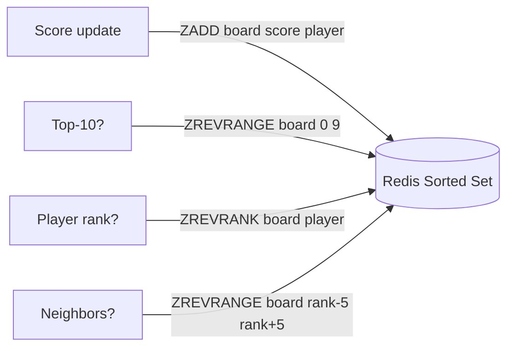
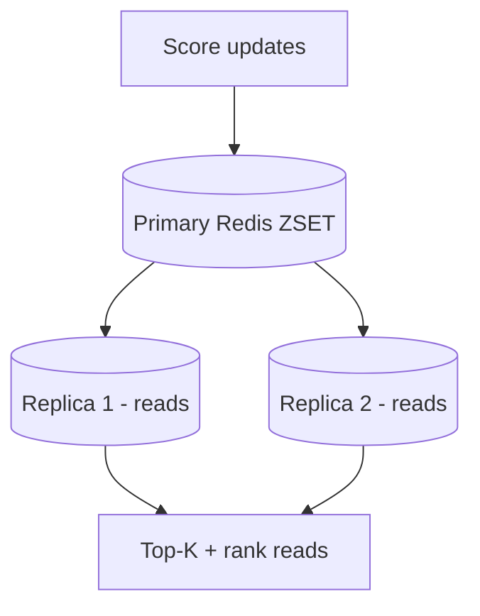
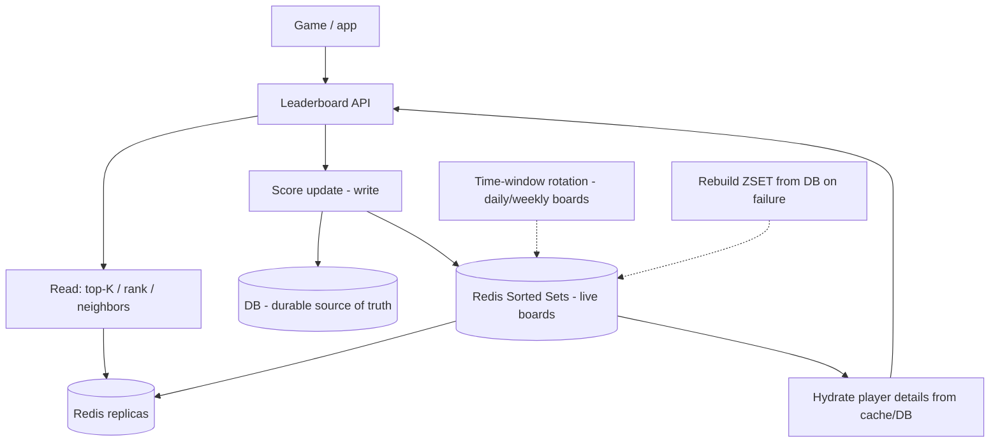
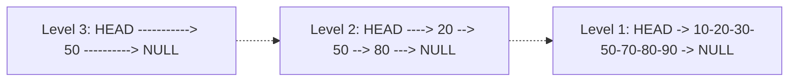
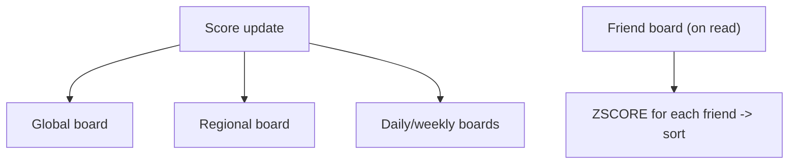
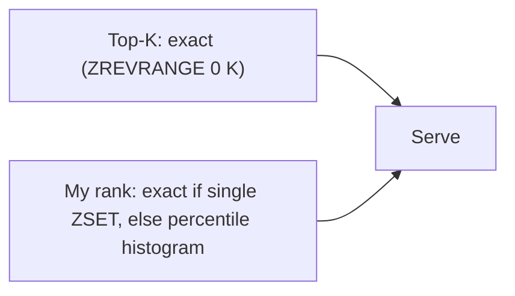

# 🏆 Design a Leaderboard (Gaming Ranking System)

> **Problem:** Ek real-time leaderboard banao — millions of players ke scores track karo, **top-K**
> (top 10/100) dikhao, aur kisi player ka **apna rank** + aas-paas ke players ("you're #4,521") turant
> dikhao. Score badalta rehta (live game) → rank real-time update ho. Ye design **Redis sorted sets**,
> **real-time ranking at scale**, aur **top-K/rank queries** ka best example hai. Gaming, contests
> (LeetCode/Codeforces), fantasy sports — sab isko use karte.

---

## 1. Requirements

### Functional
- **Update score** — player score badla (game jeeta, points mile).
- **Top-K** — top 10/100 players (with scores).
- **Player rank** — "mera rank kya hai?" (global position).
- **Rank neighbors** — "mere aas-paas kaun?" (±5 players around me).
- **Time-based boards** — daily / weekly / all-time / per-region.

### Non-Functional
- **Real-time** — score update → rank turant reflect (<100ms).
- **Scalable** — millions/100M+ players, high update rate.
- **Low latency reads** — top-K + rank super fast (frequently viewed).
- **High availability**.
- **Accuracy** — ranks correct (ties handled consistently).

---

## 2. Capacity Estimation

| Metric | Value |
|---|---|
| Players | ~100M |
| Score updates | Spiky — during events, millions/min |
| Top-K reads | Very high (everyone views leaderboard) |
| Rank queries | High (each player checks own rank) |

> **Key insight:** ye ek **read-heavy + frequent-update** system hai. Naive DB `ORDER BY score` on 100M
> rows **per query** = deadly slow. Need a data structure built for ranking → **Redis sorted set**.

---

## 3. ⭐ Why not just a database?

```sql
-- Rank query (naive):
SELECT COUNT(*) FROM scores WHERE score > (SELECT score FROM scores WHERE player='X') + 1;
-- Top-K:
SELECT * FROM scores ORDER BY score DESC LIMIT 10;
```

Problems:
- **Rank query** = count all players with higher score → O(N) scan per query (100M rows!). Even with
  index, computing exact rank is expensive.
- **Top-K** with index is OK-ish, but scores **constantly change** → index churn.
- Millions of concurrent rank queries → DB melts.

> DB fine as **source of truth / backup**, but **not for live ranking**. Use **Redis sorted set**.

---

## 4. ⭐ Core — Redis Sorted Set (the perfect fit)

Redis **Sorted Set (ZSET)** = elements ordered by a **score**, with O(log N) operations for exactly
what a leaderboard needs. Internally a **skip list + hash map**. Dekho [Bloom Filters & DS (skip list)](../Bloom_Filters_and_Probabilistic_Data_Structures.md).



| Operation | Redis command | Complexity |
|---|---|---|
| Update score | `ZADD board <score> <player>` | O(log N) |
| Top-K | `ZREVRANGE board 0 K-1 WITHSCORES` | O(log N + K) |
| Player rank | `ZREVRANK board <player>` | O(log N) |
| Neighbors | `ZREVRANGE board <rank-5> <rank+5>` | O(log N + range) |
| Score lookup | `ZSCORE board <player>` | O(1) |

**Ye exactly leaderboard ke operations hain, sab log(N) me!** Ek ZSET 100M members handle kar sakta (RAM permitting). Yahi core insight hai.

---

## 5. ⭐ Handling ties & score model
- **Ties (same score):** Redis ZSET same-score elements ko **lexicographically** (member name) order karta. Consistent but arbitrary. For fair tie-break (earlier achiever ranks higher), **encode timestamp into score**: `score = points * 10^13 + (MAX_TIME - achieved_at)` → higher points win, earlier time breaks ties. Composite score = single float.
- **Float precision:** Redis scores are doubles (~15-16 significant digits) → careful with composite encoding (don't exceed precision).

---

## 6. ⭐ Scaling beyond one Redis node

100M players might exceed one Redis instance's RAM, aur single instance = SPOF + throughput cap.

### Sharding the leaderboard (the hard part)
- **Naive shard by player** → but then **global rank** requires querying ALL shards + merging (rank = my position across all shards). Harder.
- **Approaches:**
  - **Single big ZSET** (vertical scale Redis) — works up to a point (100M members ~ few GB, feasible).
  - **Score-range sharding:** shard by score bucket (0-1000 → shard 1, etc.) — top-K easy (top shard), but rank = sum of counts in higher shards + local rank. Rebalancing tricky as scores change.
  - **Read replicas** for read scaling (top-K/rank reads); writes to primary.
  - **Approximate rank** for huge scale (see deep-dive).



> **Interview answer:** "Single ZSET + replicas for reads handles most scale. For extreme scale,
> score-range sharding or **approximate ranking** (percentile) — exact global rank across shards is expensive."

---

## 7. API Design
```
POST /v1/score      { player_id, board_id, delta_or_score }   -> new rank
GET  /v1/board/{id}/top?k=10                                    -> top-K players + scores
GET  /v1/board/{id}/rank/{player}                              -> player's rank + score
GET  /v1/board/{id}/around/{player}?range=5                    -> neighbors
```
- Boards: `daily:2026-08-01`, `weekly:2026-W31`, `alltime`, `region:IN` — separate ZSETs.

---

## 8. Data Model
```
Redis (live ranking):
  ZSET  leaderboard:{board_id}   member=player_id   score=composite_score

DB (source of truth / durability):
  Scores: player_id | board_id | score | updated_at
  Players: player_id | name | avatar | region
```
- **Redis = live leaderboard** (fast ranking); **DB = durable source of truth** (Redis rebuild karne ke liye + player details). Redis crash → rebuild ZSET from DB.

---

## 9. 🏛️ Main HLD Architecture



**Flow:** score update → Redis ZSET (`ZADD`) + DB (durability); reads (top-K/rank/neighbors) → Redis
(replicas) → hydrate player names → return. Time-windowed boards rotated; Redis rebuildable from DB.

---

## 10. Deep Dive — Time-based leaderboards (daily/weekly)
- **Separate ZSET per window:** `daily:2026-08-01`, `weekly:2026-W31`.
- Score update → write to **all relevant** boards (daily + weekly + all-time) — a few `ZADD`s.
- **Expiry:** old daily boards → TTL / archive to DB (keep Redis lean).
- **Rotation:** new day → new ZSET auto-created on first write.

## 11. Deep Dive — Hydration (player details)
- ZSET stores `player_id + score` only (compact). Top-K returns IDs → **hydrate** names/avatars from a
  player cache/DB (batch fetch). Dekho [Caching](../08_Caching_and_Distributed_Caching.md). Same "store IDs, hydrate on read" pattern as [Twitter feed](./05_Twitter_News_Feed.md).

## 12. Deep Dive — Approximate ranking (extreme scale)
- Exact rank for 100M+ across shards = expensive. Most users don't need exact ("#4,521,003" vs "top 5%").
- **Percentile/bucketed rank:** maintain score histogram → "you're in top 3%" — O(1)-ish, approximate.
- Exact rank only for **top-K** (small, precise) + own approximate rank. Common real-world compromise.

## 13. Deep Dive — Consistency & durability
- Redis + DB **dual write:** ideally atomic. If Redis ahead of DB (crash) → rebuild from DB (slight loss) or use write-through. For games, small inconsistency tolerable; for prize contests, stronger guarantees (DB source of truth, reconcile).
- **Redis persistence** (AOF/RDB) reduces rebuild need; replicas for HA.

## 14. Deep Dive — Anti-cheat & write spikes
- **Cheating:** validate score updates server-side (don't trust client); rate-limit updates; anomaly detection.
- **Write spikes** (event ends, everyone submits): buffer via queue, batch `ZADD`; Redis is fast but protect it.

---

## 14.1 Deep Dive — How Redis Sorted Set works internally (skip list)

ZSET O(log N) operations kaise deta? Andar do structures maintain karta:
- **Hash map:** `member → score` (O(1) score lookup, existence check).
- **Skip list:** members **sorted by score** — a multi-level linked list jahan upper levels "express lanes"
  hote hain. Search/insert/rank all **O(log N)** (probabilistic balancing). Dekho [Bloom Filters & DS (skip list)](../Bloom_Filters_and_Probabilistic_Data_Structures.md).



- **Rank query** (`ZREVRANK`): skip list me har node "span" (kitne neeche-wale skip kiye) store karta →
  rank = spans ka sum while traversing → O(log N), no full scan.
- Yahi wajah hai leaderboard ke liye ZSET "perfect fit" — rank aur range dono log(N).

## 14.2 Deep Dive — Regional & friend leaderboards

Global leaderboard ke alawa users aksar **relevant** boards dekhna chahte:
- **Regional:** `board:region:IN`, `board:region:US` — separate ZSETs per region; update writes to global + regional.
- **Friend leaderboard:** "mere friends me mera rank" — user ke friend-list ke members ka subset rank.
  - Small friend list → fetch friends' scores (`ZSCORE` each) → sort in app. 
  - Large → maintain per-user friend ZSET (costly) or compute on read (friends usually < few hundred).
- **Guild/team boards:** team members' aggregate/individual — another ZSET keyed by team.



## 14.3 Deep Dive — Seasonal resets & archival

- **Seasons:** many games reset leaderboards periodically (monthly/season). New season = new ZSET;
  old season → **archive to DB / cold storage** (history, rewards computation).
- **Soft reset:** carry forward a fraction of score (ranked decay) instead of full wipe.
- **Reward distribution:** at season end, read top-K + rank tiers → grant rewards (batch job). Dekho [Job Scheduler](./23_Distributed_Job_Scheduler.md).

## 14.4 Deep Dive — Exact rank vs approximate (algorithms)

Exact global rank at 100M+ across shards is the expensive query. Options in depth:
- **Single ZSET (exact):** `ZREVRANK` O(log N) — works to ~100M members on a beefy Redis (few GB). Simplest, exact.
- **Sharded + count aggregation:** shard by score range; rank = (count of members in higher-score shards) + (local rank in my shard). Requires maintaining per-shard counts.
- **Percentile via histogram:** maintain a score→count histogram (buckets); "your rank ≈ users with higher score" = sum of higher buckets. O(buckets), approximate but O(1)-ish, great for "top X%".
- **Hybrid:** exact for top-K (small, precise) + approximate percentile for the long tail (most users).



## 14.5 Capacity math (worked example)
- 100M players, each ZSET entry ≈ member (say 16 B id) + score (8 B) + skip-list overhead (~64 B) ≈ ~90 B.
- 100M × ~90 B ≈ **~9 GB** → fits on a single large Redis node (feasible!) + replicas.
- Multiple boards (daily/weekly/regional) → multiply, but each daily board only has active players. Manageable with TTL on old boards.

## 14.6 Common pitfalls
- ❌ Using DB `ORDER BY`/`COUNT` for live rank → O(N) per query, melts under load. ✅ Redis ZSET.
- ❌ Storing full player objects in ZSET member → bloat. ✅ Store `player_id`, hydrate separately.
- ❌ Wall-clock timestamp as tie-break with float precision loss. ✅ Careful composite score within double precision.
- ❌ No durability → Redis crash loses board. ✅ DB source of truth + Redis persistence + replicas.
- ❌ Trusting client scores → cheating. ✅ Server-side validation.

## 14.7 Extensions / follow-ups
- **Real-time updates to viewers:** leaderboard open hai aur ranks badal rahe → push updates via WebSocket. Dekho [WebSockets](../WebSockets_and_Realtime.md).
- **Anti-cheat deep:** statistical anomaly detection, replay validation, shadow-ban.
- **Multi-metric boards:** rank by different metrics (kills, wins, K/D) → multiple ZSETs.
- **Rank change indicators:** "↑3 since yesterday" → compare with snapshot.

---

## 15. Bottlenecks & Solutions

| Bottleneck | Solution |
|---|---|
| DB `ORDER BY`/rank on 100M | Redis sorted set (O(log N) rank/top-K) |
| Read-heavy (top-K, rank) | Redis replicas + cache hydrated results |
| Single Redis SPOF/RAM | Replicas + persistence; shard for extreme scale |
| Exact global rank at huge scale | Approximate/percentile rank; exact for top-K only |
| Player details in results | Hydrate from player cache/DB |
| Ties | Composite score (points + timestamp) |
| Write spikes | Queue buffer + batch updates |
| Cheating | Server-side validation + rate limit |

---

## 16. Interview Q&A

**Q: Leaderboard DB se kyun nahi?**
Rank = count higher scores = O(N) per query on 100M rows; scores constantly change → index churn; millions of queries melt DB. Use Redis sorted set.

**Q: Redis sorted set kaise perfect hai?**
ZADD/ZREVRANK/ZREVRANGE all O(log N) — exactly top-K, rank, neighbors, update. Skip-list + hashmap internally.

**Q: Player rank kaise nikaalte?**
`ZREVRANK board player` → O(log N) rank directly (no scan).

**Q: Ties kaise handle?**
Composite score = points × big + (MAX_TIME − timestamp) → higher points win, earlier time breaks ties, single float.

**Q: Scale beyond one Redis?**
Replicas for reads; single ZSET handles ~100M; extreme → score-range sharding (global rank harder) or approximate ranking.

**Q: Top-K me player names kaise (ZSET me sirf IDs)?**
Store player_id + score; hydrate names/avatars from player cache/DB (batch).

**Q: Daily/weekly boards?**
Separate ZSET per window (`daily:date`); update writes to all relevant boards; old boards TTL/archive.

**Q: Redis crash → data?**
DB = source of truth (dual write) → rebuild ZSET; + Redis persistence (AOF/RDB) + replicas.

**Q: Exact rank for #4 million player?**
Usually approximate (percentile / "top 3%") at extreme scale; exact reserved for top-K.

**Q: Cheating rokna?**
Server-side score validation, rate-limit updates, anomaly detection — never trust client score.

**Q: ZSET internally O(log N) kaise deta?**
Hash map (member→score, O(1)) + skip list (sorted by score, O(log N) search/insert/rank via node spans).

**Q: Friend leaderboard kaise?**
Friends usually < few hundred → fetch each friend's score (`ZSCORE`) → sort in app; or per-user friend ZSET (costlier).

**Q: Seasonal reset kaise?**
New season = new ZSET; old → archive to DB (history/rewards); optional soft reset (score decay).

**Q: 100M players ek Redis me aayenge?**
~90 B/entry × 100M ≈ ~9 GB → fits large Redis node + replicas; extreme scale → shard by score-range or percentile approximation.

**Q: Approximate rank kaise (long tail)?**
Score histogram (buckets) → rank ≈ sum of higher-score buckets → O(buckets), "top X%"; exact only for top-K.

---

## 17. Summary
- Leaderboard = **Redis Sorted Set (ZSET)** — O(log N) update/rank/top-K/neighbors (skip-list + hashmap); DB can't do live ranking at scale.
- **Composite score** (points + timestamp) for fair tie-breaking; **replicas** for read scaling; **DB = durable source of truth** (rebuild ZSET on failure).
- **Time-windowed boards** = separate ZSETs (daily/weekly/all-time); **hydrate** player details from cache (store IDs in ZSET).
- **Extreme scale** → score-range sharding or **approximate/percentile rank** (exact global rank across shards is costly); protect writes (queue/batch), validate scores (anti-cheat).

> **Related:** [Caching](../08_Caching_and_Distributed_Caching.md) · [Bloom Filters & DS (skip list)](../Bloom_Filters_and_Probabilistic_Data_Structures.md) · [Twitter (hydration)](./05_Twitter_News_Feed.md) · [Sharding](../21_Database_Sharding.md) · [Distributed Cache](./03_Distributed_Cache.md)
