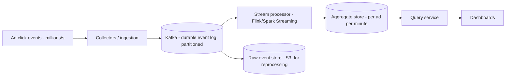
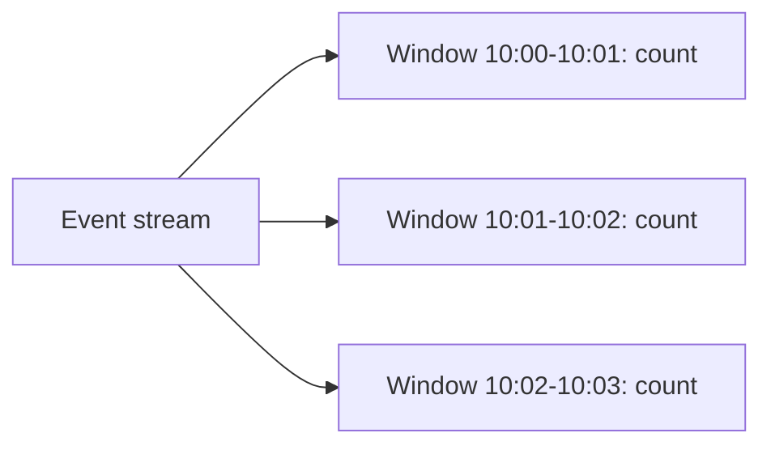
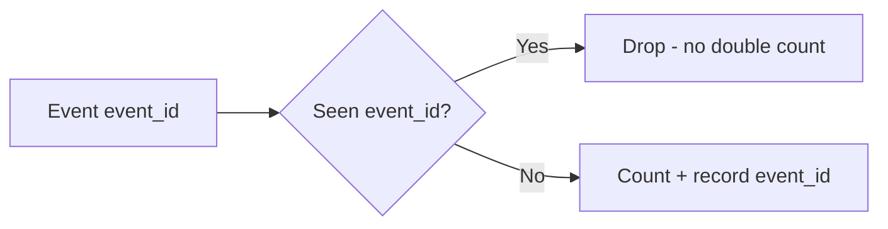
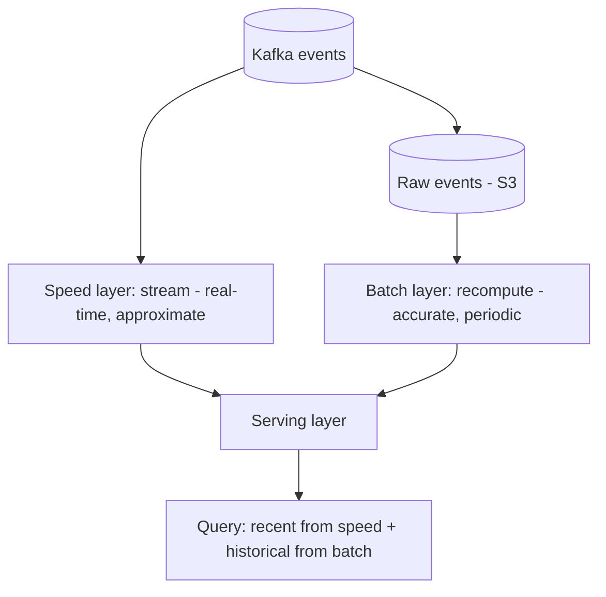
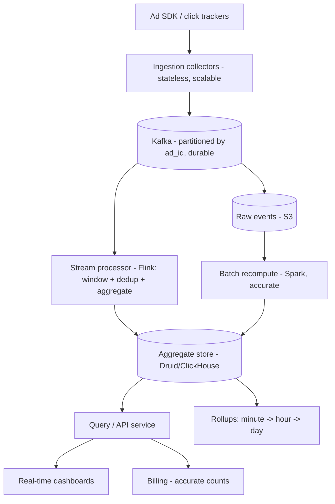
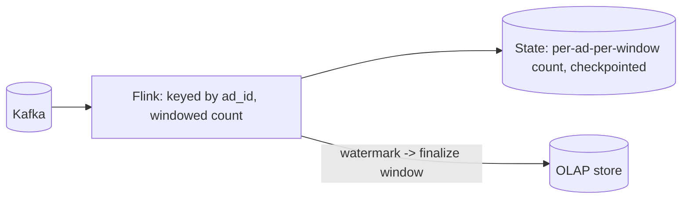

# 📊 Design Ad Click Aggregation / Real-Time Analytics

> **Problem:** Ek system banao jo **billions of ad-click events** ingest kare aur real-time + accurate
> **aggregations** de — "is ad ke last 1 minute me kitne clicks?", "top 100 ads by clicks", "per-region
> spend" — dashboards aur billing ke liye. Ye design **stream processing at massive scale**, **counting
> accurately**, aur **Lambda/Kappa architecture** ka best example hai. Google Ads, Facebook Ads
> analytics, event analytics (Mixpanel) — sab isi family me.

---

## 1. Requirements

### Functional
- **Ingest** ad-click events (billions/day): `{ad_id, user, timestamp, region, cost}`.
- **Aggregate:** clicks per ad per time-window (per minute/hour/day).
- **Top-N** ads by clicks (in a window).
- **Filtering:** by region, campaign, time-range.
- **Real-time dashboard** (recent) + **historical reports** (accurate).
- **Billing** — advertiser ko exact clicks charge karo.

### Non-Functional
- **Massive scale** — billions of events/day (millions/sec peak).
- **Low latency** for dashboards (near real-time, seconds).
- **Accuracy** for billing (exact counts — paisa involved).
- **Fault tolerant** — events na khoyein (billing!).
- **Scalable + cost-efficient** storage (huge volume).
- **Idempotent** — duplicate events double-count na karein.

> **Tension:** real-time (fast, approximate OK for dashboard) vs accuracy (billing needs exact) → **Lambda architecture** (both).

---

## 2. Capacity Estimation

| Metric | Value |
|---|---|
| Clicks/day | ~10B → **~115K events/s avg**, peak ~1M/s |
| Event size | ~100 bytes |
| Ingest bandwidth | ~10-100 MB/s |
| Raw storage/day | ~1 TB/day (raw events) |
| Aggregated data | Much smaller (per-ad-per-minute counts) |
| Retention | Raw: weeks (cold); aggregates: years |

> **Key insight:** raw event volume huge → can't query raw per dashboard. **Pre-aggregate via stream
> processing**; store raw for reprocessing/accuracy.

---

## 3. ⭐ Core — Streaming Pipeline

Events aate rehte (unbounded) → **stream processing** (not batch-per-query). Classic pipeline:
**ingest → queue → stream processor → aggregate store → query**. Dekho [Big Data & Stream Processing](../Advanced_Topics/05_Big_Data_and_Stream_Processing.md).



- **Kafka = backbone** — durable, partitioned, replayable log; absorbs spikes, decouples ingest from processing. Dekho [Message Queues](../18_Message_Queues_Kafka_RabbitMQ.md).
- **Stream processor** (Flink/Spark) — windows events, aggregates (count per ad per minute), writes to aggregate store.
- **Raw events → S3** — for reprocessing (accuracy / recompute if logic changes). Dekho [Blob Storage](../Advanced_Topics/08_Blob_Object_Storage_and_Large_Files.md).

---

## 4. ⭐ Windowing (aggregating an infinite stream)

"Last 1 minute clicks" = need to bucket the infinite stream into **windows**. Dekho [Big Data (windowing)](../Advanced_Topics/05_Big_Data_and_Stream_Processing.md).



- **Tumbling windows** (fixed, non-overlapping) — per-minute counts (most common for this).
- **Sliding windows** — "last 5 min, updated every min".
- **Aggregate** = `(ad_id, window) -> count, sum(cost)`.

### ⭐ Event time vs processing time (the hard part)
- **Event time** = click actually happened; **processing time** = server processed it.
- Events arrive **late/out-of-order** (mobile offline, network) → a 10:00 click arrives at 10:05. Kis window me?
- **Watermarks:** "10:00 window ke saare events aa gaye (probably)" — wait a bit for late events, then finalize window. Balance latency (finalize fast) vs completeness (wait for stragglers).

---

## 5. ⭐ Accuracy — Exactly-once & de-duplication (billing!)

Billing = paisa → **exact counts** chahiye. But streaming default = at-least-once (duplicates possible on retry/failure). Fix:

- **Idempotent processing:** each event has a **unique event_id** → dedup (already counted?). Dekho [Idempotency](../Idempotency.md).
- **Exactly-once semantics:** Flink/Kafka checkpointing + transactional writes → each event counted once even across failures.
- **Dedup window:** store seen event_ids (Bloom filter / KV with TTL) → drop duplicates. Dekho [Bloom Filters](../Bloom_Filters_and_Probabilistic_Data_Structures.md).



---

## 6. ⭐ Lambda Architecture — fast + accurate

Dashboard needs **fast** (approximate OK); billing needs **accurate** (can be slower). Serve both:



- **Speed layer** (stream): real-time counts, low latency, approximate (may miss late events).
- **Batch layer:** periodically **recompute from raw** (accurate, complete, corrects speed layer).
- **Serving:** recent = speed layer; finalized/billing = batch layer (source of truth).
- **Kappa alternative:** stream-only + Kafka replay for recompute (one codebase). Dekho [Big Data (Lambda vs Kappa)](../Advanced_Topics/05_Big_Data_and_Stream_Processing.md).

> **Why both:** you get sub-second dashboards AND penny-accurate billing. Batch reconciles the fast-but-approximate stream.

---

## 7. ⭐ Top-N ads (heavy hitters)

"Top 100 ads by clicks" over billions of ads — exact top-N needs counting all. Options:
- **Exact:** maintain per-ad counts (aggregate store) → sort top-N periodically (fine if ad count manageable).
- **Approximate (huge cardinality):** **Count-Min Sketch** — probabilistic frequency counter, memory-efficient, "heavy hitters". Dekho [Bloom Filters & DS (Count-Min Sketch)](../Bloom_Filters_and_Probabilistic_Data_Structures.md).
- **Unique users per ad:** **HyperLogLog** — approximate distinct count (unique clickers) in tiny memory.

---

## 8. API Design
```
POST /v1/events          { ad_id, user, ts, region, cost, event_id }   (or via SDK -> Kafka)
GET  /v1/ads/{id}/clicks?window=1m&range=last_hour   -> time series
GET  /v1/ads/top?n=100&window=1h                     -> top-N ads
GET  /v1/reports/spend?campaign=X&range=...          -> billing report (accurate)
```

---

## 9. Data Model
```
Raw events (S3):   ad_id | user | ts | region | cost | event_id     (immutable, partitioned by time)
Aggregates (OLAP): ad_id | window_start | region | click_count | total_cost
Dedup store:       event_id (Bloom filter / KV with TTL)
```
- **Aggregates → OLAP / time-series DB** (Druid, ClickHouse, Cassandra) — optimized for range/aggregate queries. Dekho [SQL vs NoSQL](../SQL_vs_NoSQL.md).
- **Raw → columnar (Parquet) on S3** — cheap, reprocessable.
- **Pre-aggregate at multiple granularities** (minute → hour → day rollups) for fast queries.

---

## 10. 🏛️ Main HLD Architecture



**Flow:** clicks → collectors → Kafka (durable) → Flink (window + dedup + aggregate) → OLAP store →
query/dashboard; raw → S3 → batch recompute (accurate) → reconcile OLAP for billing. Rollups for fast historical queries.

---

## 11. Deep Dive — Handling scale in Kafka
- **Partition by ad_id** → same ad's events ordered + parallel processing across partitions. Dekho [Message Queues](../18_Message_Queues_Kafka_RabbitMQ.md).
- **Consumer groups** — many Flink workers consume partitions in parallel → horizontal scale.
- Kafka retention (days) → replay for reprocessing / late recovery.

## 12. Deep Dive — Fault tolerance (no event loss)
- Kafka **durable + replicated** (events safe even if processor crashes).
- Flink **checkpointing** — periodic state snapshots → crash → resume from checkpoint (exactly-once). Dekho [Resilience](../Advanced_Topics/07_Resilience_and_Fault_Tolerance.md).
- Raw events in S3 → ultimate backup (recompute anything).

## 13. Deep Dive — Fraud / click spam
- Bots clicking to drain competitor budget → **fraud detection**: velocity (too many clicks from one IP/user), pattern anomalies, ML scoring.
- Invalid clicks filtered before billing (don't charge advertiser for bot clicks).

## 14. Deep Dive — Rollups & query performance
- Store at **multiple granularities:** per-minute (recent, detailed), per-hour, per-day (historical) → queries hit right granularity → fast.
- Old fine-grained data → aggregate up + drop (save storage). "Last hour" = minute buckets; "last year" = day buckets.

---

## 14.1 Deep Dive — Ingestion at millions/sec

- **Stateless collectors** behind load balancer accept events → write to Kafka. Scale horizontally.
- **Client-side batching:** SDK buffers events, sends in batches → fewer requests, higher throughput.
- **Backpressure:** if downstream slow, Kafka buffers (durable); collectors keep accepting → spikes absorbed. Dekho [Message Queues](../18_Message_Queues_Kafka_RabbitMQ.md).
- **Partition by ad_id:** ordering per ad + parallel consumption; watch for hot ads (a viral ad → hot partition → sub-partition or salt the key).

## 14.2 Deep Dive — Aggregation state & checkpointing

- Stream processor (Flink) maintains **windowed aggregation state** (per ad, per window, running count).
- **Checkpointing:** state snapshotted periodically to durable store → crash → restore from checkpoint (exactly-once). Dekho [Resilience](../Advanced_Topics/07_Resilience_and_Fault_Tolerance.md).
- **State size:** many ads × many windows → large state → RocksDB-backed state (Flink) spills to disk.
- **Window finalization:** watermark passes → window emitted to OLAP store → state for that window freed.



## 14.3 Deep Dive — Query serving (OLAP)

- **OLAP store** (Druid / ClickHouse / Pinot) — columnar, optimized for aggregation/range queries over time.
- **Pre-aggregated + rollups:** minute → hour → day; queries hit the right granularity → fast.
- **Dashboards** query recent (speed layer / OLAP); **billing** queries finalized batch numbers.
- Multi-dimensional: filter/group by region, campaign, device → OLAP handles slicing.

## 14.4 Deep Dive — Worked capacity example
- 10B events/day = ~115K/s avg; peak 1M/s. Event 100 B → ~1 TB/day raw.
- Kafka: partitioned (say 100 partitions) → ~1K-10K events/s/partition → many Flink tasks parallel.
- Aggregates: per-ad-per-minute for 1M ads × 1440 min = 1.44B rows/day (aggregated) — but rolled up to hour/day quickly → OLAP store manageable.
- Raw in S3 (Parquet, compressed) → cheap long retention for reprocessing.

## 14.5 Deep Dive — Reprocessing & backfill
- Logic change / bug → recompute from **raw events (S3)** via batch (Spark) → correct aggregates (Lambda batch layer / Kappa replay).
- **Kappa:** just replay Kafka (long retention) through the stream job → no separate batch code. Dekho [Big Data (Lambda vs Kappa)](../Advanced_Topics/05_Big_Data_and_Stream_Processing.md).

## 14.6 Common pitfalls
- ❌ Querying raw events per dashboard → too slow. ✅ Pre-aggregate (stream) + OLAP.
- ❌ Processing-time windows → wrong counts for late events. ✅ Event-time + watermarks.
- ❌ At-least-once without dedup → over-billing. ✅ event_id dedup + exactly-once.
- ❌ No raw retention → can't fix bugs / reprocess. ✅ Raw in S3.
- ❌ Hot ad = hot Kafka partition. ✅ Salt key / sub-partition.
- ❌ Counting bot clicks in billing. ✅ Fraud filter before billing.

## 14.7 Extensions / follow-ups
- **Real-time budgets:** ad campaign hits budget → stop serving (near-real-time counter + threshold).
- **Attribution:** which click → which conversion (join click + purchase streams).
- **A/B analytics:** compare ad variants (segmented aggregation).
- **Anomaly detection:** sudden click spike → fraud/alert (stream + ML).

---

## 15. Bottlenecks & Solutions

| Bottleneck | Solution |
|---|---|
| Billions of events (ingest) | Kafka (partitioned, durable) + stateless collectors |
| Can't query raw per dashboard | Pre-aggregate via stream processing (windows) |
| Late/out-of-order events | Event-time windows + watermarks |
| Double counting (billing) | Idempotency (event_id dedup) + exactly-once (checkpoints) |
| Fast dashboard vs accurate billing | Lambda (speed + batch layers) |
| Top-N over huge ad set | Count-Min Sketch / exact per-ad counts + sort |
| Unique users count | HyperLogLog (approximate distinct) |
| Query performance (historical) | Multi-granularity rollups + OLAP store |
| Event loss | Kafka durability + Flink checkpoints + S3 raw |

---

## 16. Interview Q&A

**Q: Raw events se dashboard query kyun nahi?**
Billions of events → per-query scan too slow/costly. Pre-aggregate via stream processing (per-ad per-minute counts).

**Q: Infinite stream ko kaise aggregate?**
Windowing (tumbling per-minute); event-time + watermarks for late/out-of-order events.

**Q: Late event (mobile offline) kis window me?**
Event time (when it happened), not processing time; watermark waits briefly for stragglers then finalizes.

**Q: Billing ke liye exact count kaise (streaming duplicates deta)?**
Idempotency (event_id dedup) + exactly-once (Flink/Kafka checkpointing + transactions); batch layer reconciles.

**Q: Lambda architecture kyun?**
Speed layer = fast approximate (dashboard); batch layer = accurate recompute from raw (billing). Both needs met.

**Q: Top-100 ads over billions?**
Exact per-ad counts + sort, or Count-Min Sketch (approximate heavy-hitters) at huge cardinality.

**Q: Unique clickers per ad?**
HyperLogLog — approximate distinct count in tiny memory.

**Q: Event loss kaise roke (billing critical)?**
Kafka durable+replicated + Flink checkpointing + raw events in S3 (recompute anything).

**Q: Historical query fast kaise?**
Multi-granularity rollups (minute/hour/day) in OLAP store (Druid/ClickHouse); query hits right level.

**Q: Kafka partition kaise?**
By ad_id → ordering per ad + parallel processing; consumer groups scale horizontally.

---

## 17. Summary
- **Streaming pipeline:** clicks → **Kafka** (durable, partitioned) → **stream processor** (Flink: window + dedup + aggregate) → OLAP store → dashboards; raw → S3.
- **Windowing** (tumbling per-minute) + **event-time + watermarks** for late/out-of-order events.
- **Accuracy (billing):** idempotency (event_id dedup) + exactly-once (checkpoints); **Lambda** (fast speed layer + accurate batch recompute from raw).
- **Top-N** = Count-Min Sketch / exact counts; **unique users** = HyperLogLog; **multi-granularity rollups** for fast historical queries.
- **Fault tolerance:** Kafka durability + Flink checkpoints + S3 raw = no event loss; fraud filtering before billing.

> **Related:** [Big Data & Stream Processing](../Advanced_Topics/05_Big_Data_and_Stream_Processing.md) · [Message Queues](../18_Message_Queues_Kafka_RabbitMQ.md) · [Bloom Filters & Probabilistic DS](../Bloom_Filters_and_Probabilistic_Data_Structures.md) · [Idempotency](../Idempotency.md) · [Blob Storage](../Advanced_Topics/08_Blob_Object_Storage_and_Large_Files.md)
