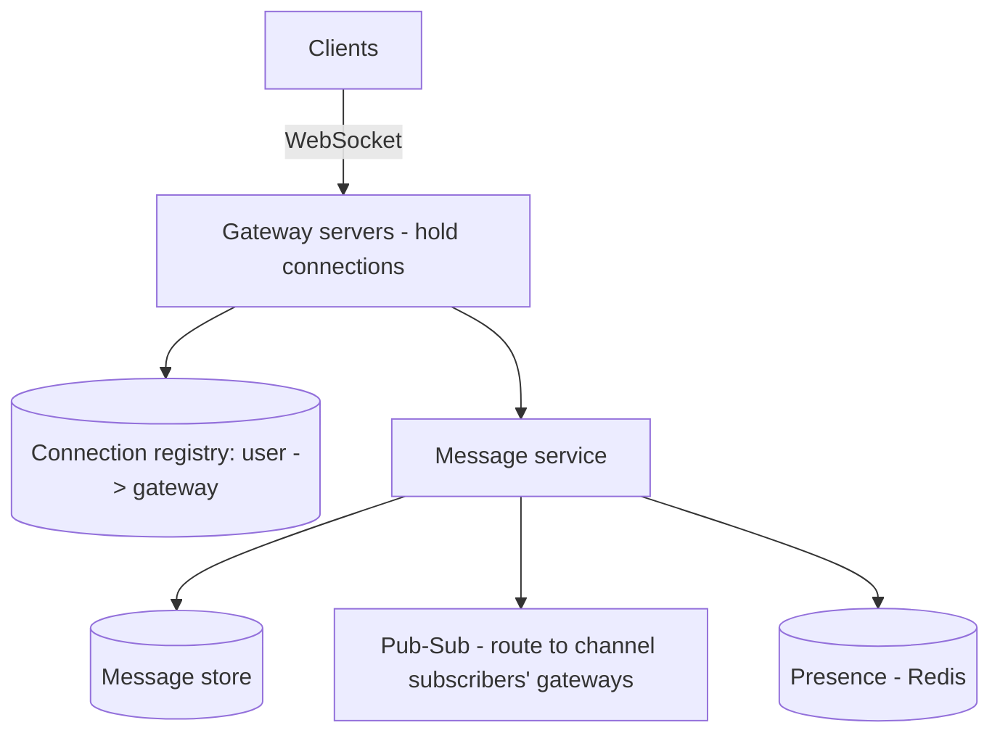
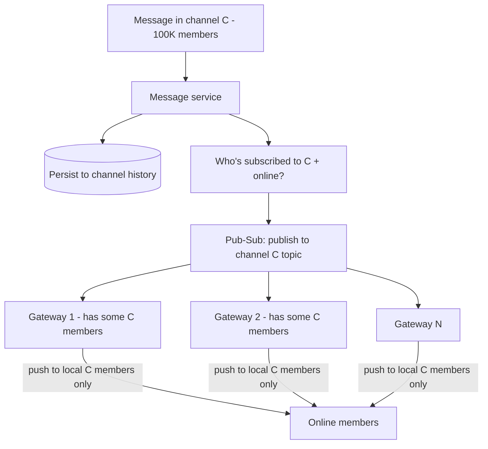
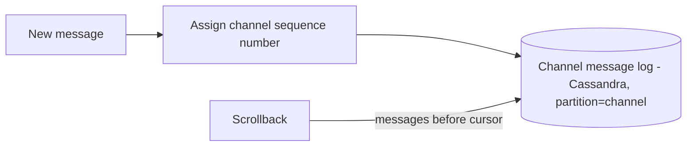
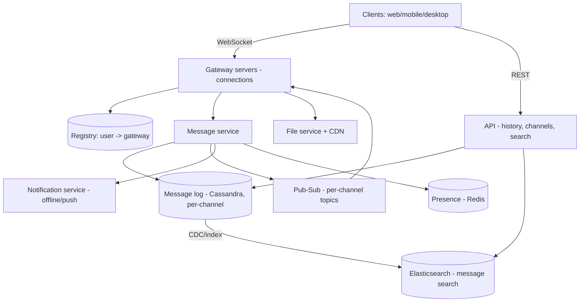
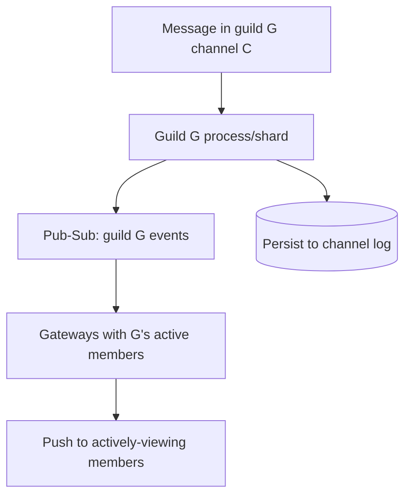

# 💬 Design Slack / Discord (Team Chat & Channels)

> **Problem:** WhatsApp se aage — ek **team/community chat** platform banao jahan **channels**
> (group conversations), **workspaces/servers**, threads, mentions, presence, file sharing, aur search
> ho. Discord me ek server pe **lakhs concurrent members** ho sakte (huge channels). Ye design
> **WebSockets + channel fan-out + huge-room scaling + search** ka combo hai — group messaging ka toughest form.

---

## 1. Requirements

### Functional
- **Workspaces/Servers** — org/community; har workspace me kai channels.
- **Channels** — public/private group conversations; users join/leave.
- **Messaging** — real-time send/receive in channels + DMs.
- **Threads** — message pe replies (nested conversation).
- **Presence** — online/away; typing indicators.
- **Mentions/notifications** — `@user`, `@channel`.
- **Message history** — scroll up, search messages.
- **File sharing**, reactions, edits.

### Non-Functional
- **Real-time** (<100ms delivery), **highly available**.
- **Huge channels** — Discord server with 100K+ members (fan-out challenge).
- **Ordering** + **history** (persistent, searchable).
- **Multi-device sync** (phone + desktop consistent).
- **Scale** — millions of concurrent WebSocket connections.

---

## 2. Capacity Estimation

| Metric | Value |
|---|---|
| DAU | ~50M |
| Concurrent connections | ~10M+ WebSockets |
| Messages/day | ~10B → ~115K/s avg |
| Big channel | 100K+ members (fan-out amplification) |
| Message size | ~few hundred bytes |

> **Key challenge:** WhatsApp = mostly 1:1 / small groups; Slack/Discord = **channels** (one message →
> potentially 100K recipients) + **huge concurrent connections**. Fan-out + connection scale are core.

---

## 3. ⭐ Core — Real-time via WebSockets + Gateway

Real-time bidirectional → **WebSocket** (server pushes messages). Millions of connections → many
**gateway servers** holding them + a **registry** to route. Same foundation as [WhatsApp](./07_WhatsApp_Chat.md), [WebSockets](../WebSockets_and_Realtime.md).



- User connects → gateway; registry maps `user → gateway` (which server holds their connection).
- Message → message service → **pub-sub** routes to gateways holding channel members → pushed via WebSocket.

---

## 4. ⭐ Channel Fan-out (the core challenge)

WhatsApp group = small (256). Discord channel = **100K+ members**. One message → deliver to all online
members. Naive "push to each member's connection" = fan-out storm.



### The pattern: pub-sub per channel + gateway-local delivery
- Message → **persist** to channel history → **publish to channel's pub-sub topic**.
- Each **gateway subscribes** to channels its connected users care about → receives message once → **fans out locally** to its connected members of that channel.
- This avoids central server pushing to 100K connections; work distributed across gateways. Dekho [Message Queues (pub-sub)](../18_Message_Queues_Kafka_RabbitMQ.md).

### Huge channel optimizations
- **Only deliver to online + actively-viewing** members (others read on open — pull).
- **Fan-out on read for very large / inactive channels:** don't push to 100K; members fetch on channel open ("read model"). Hybrid like [Twitter feed](./05_Twitter_News_Feed.md).
- **Rate/coalesce:** super-active channel → batch messages to reduce push frequency.

---

## 5. ⭐ Message storage & ordering

- **Per-channel message log:** messages stored ordered by time/sequence, partitioned by channel. Write-heavy, time-ordered → **Cassandra/LSM** (partition by channel_id, clustering by timestamp). Dekho [DB Indexing (LSM)](../Advanced_Topics/03_Database_Indexing_Deep_Dive.md), [SQL vs NoSQL](../SQL_vs_NoSQL.md).
- **Ordering:** per-channel sequence number (monotonic) → consistent order across devices; ties broken by seq, not wall-clock.
- **History / scrollback:** `GET channel messages before <cursor>` — cursor pagination on the log.
- **Read state:** per-user-per-channel "last read message" → unread counts.



---

## 6. Presence & Typing indicators
- **Presence** (online/away): heartbeat over WebSocket → Redis (TTL); on-demand fetch per channel (don't broadcast every change to everyone — fan-out storm). Dekho [WhatsApp presence](./07_WhatsApp_Chat.md).
- **Typing indicator:** ephemeral, best-effort (fire-and-forget to channel members; not persisted).

---

## 7. API / Protocol
```
WebSocket:
  -> { "type":"message", "channel":"C1", "text":"hi", "client_msg_id":"uuid" }
  <- { "type":"message", "channel":"C1", "from":"U2", "seq":1042, "ts":... }
  <- { "type":"presence", "user":"U3", "status":"online" }
REST:
  GET  /v1/channels/{id}/messages?before=<cursor>   -> history
  POST /v1/channels  { workspace, name, type }
  POST /v1/channels/{id}/members
  GET  /v1/search?q=...&workspace=W                  -> message search
```
- `client_msg_id` (UUID) → idempotency (retry no duplicate). Dekho [Idempotency](../Idempotency.md).

---

## 8. Data Model
```
Workspaces:  workspace_id | name | owner
Channels:    channel_id | workspace_id | name | type(public/private) | member_count
Members:     channel_id | user_id | last_read_seq | joined_at
Messages:    channel_id | seq | msg_id | sender | text | thread_id | ts   [Cassandra]
Threads:     thread_id | parent_msg_id | reply_count
Presence:    user_id -> status + gateway    [Redis, ephemeral]
```
- Messages → Cassandra (partition=channel_id, order by seq). Membership → DB. Presence → Redis. Files → object store + CDN. Dekho [Blob Storage](../Advanced_Topics/08_Blob_Object_Storage_and_Large_Files.md).

---

## 9. 🏛️ Main HLD Architecture



**Flow:** clients hold WebSockets to gateways; message → message service → persist (Cassandra, seq) →
pub-sub to subscribed gateways → local fan-out to online members; offline → push notifications; history/search via REST + Elasticsearch.

---

## 10. Deep Dive — Multi-device sync
- User on phone + desktop → both must see same messages + read state.
- Each device = separate WebSocket connection (registry maps user → multiple gateways).
- **Message delivered to all of a user's connections;** read state (`last_read_seq`) synced across devices → consistent unread counts.
- Client on reconnect: "give me messages after my last_seq" → catch up (no loss).

## 11. Deep Dive — Offline & notifications
- User offline (no WebSocket) → **push notification** (APNs/FCM) for mentions/DMs. Dekho [Notification System](./08_Notification_System.md).
- On reconnect → fetch missed messages (per-channel since last_read_seq).
- **Notification rules:** mentions/DMs = push; busy channel without mention = maybe no push (avoid spam) — per-user prefs.

## 12. Deep Dive — Search
- Message **full-text search** across workspace → **Elasticsearch** (inverted index); permission-aware (only channels user is in). Dekho [Search Systems](../Advanced_Topics/04_Search_Systems_and_Elasticsearch.md).
- Messages indexed via CDC from message log; search results scoped to user's accessible channels.

## 13. Deep Dive — Threads & reactions
- **Thread** = replies attached to a parent message (thread_id) → separate mini-log; parent shows reply count. Fan-out to thread participants.
- **Reactions** = per-message emoji counts (like counters) — aggregate, eventually consistent.

## 14. Deep Dive — Scaling connections & huge servers
- Millions of WebSockets → many gateways, **horizontal scale**; connection registry (Redis/consistent hashing). Dekho [Consistent Hashing](../19_Consistent_Hashing.md).
- **Discord's trick:** each large "guild" (server) handled by a dedicated process/shard; gateway sessions subscribe to relevant guilds' events via pub-sub → efficient huge-room fan-out.
- **Sticky-ish routing:** a channel's fan-out coordinated to minimize cross-gateway chatter.

---

## 14.1 Deep Dive — Connection lifecycle & reconnection

- **Connect:** client opens WebSocket to a gateway (via LB) → auth → registry records `user → gateway`
  + subscribes gateway to user's channels' pub-sub topics.
- **Heartbeat/ping-pong:** keep connection alive + detect dead connections (no pong → close, cleanup registry).
- **Reconnect:** connection drops (network/mobile) → client reconnects → "give me messages after last_seq per channel" → catch up (no loss). Dekho [WebSockets](../WebSockets_and_Realtime.md).
- **Graceful gateway shutdown:** deploy → drain connections (clients reconnect to other gateways). Dekho [Deployment](../Advanced_Topics/11_Deployment_Strategies_and_CICD.md).

## 14.2 Deep Dive — Delivery guarantee & catch-up

- **Persist-before-deliver:** message stored (with seq) before fanout → never lost even if delivery fails.
- **Per-channel sequence** = the "cursor"; each device tracks `last_read_seq` per channel.
- **Missed messages:** offline / disconnected → on reconnect, fetch `messages after last_seq` per channel → guaranteed catch-up.
- **Idempotent client:** dedup by `client_msg_id` (retry doesn't duplicate). Dekho [Idempotency](../Idempotency.md).

## 14.3 Deep Dive — Discord's huge-server (guild) model

- Discord "guild" (server) can have **millions of members**, huge channels. Pushing every message to
  every member's connection = impossible.
- **Guild → dedicated process/shard:** all events for a guild flow through its process; gateway sessions
  subscribe to the guilds they need → events pushed only to relevant gateways → local fan-out.
- **Lazy loading:** only load/notify members actively viewing; others fetch on open (pull).
- Erlang/Elixir (Discord) — lightweight processes per guild/session, great for millions of concurrent connections.



## 14.4 Deep Dive — Notifications & unread counts

- **Unread count** per channel = `channel.latest_seq - member.last_read_seq` → cheap to compute.
- **Mention detection:** message parsed for `@user`/`@channel` → targeted notification even if channel muted.
- **Push (offline):** APNs/FCM for mentions/DMs; per-user notification prefs (muted channels no push). Dekho [Notification System](./08_Notification_System.md).
- **Badge sync:** unread counts consistent across devices (read on one → cleared on all).

## 14.5 Common pitfalls
- ❌ Push every message to 100K connections centrally → meltdown. ✅ Pub-sub + gateway-local fanout + pull for large.
- ❌ Wall-clock ordering → inconsistent across devices. ✅ Per-channel sequence.
- ❌ Broadcast presence to everyone → storm. ✅ On-demand / subscribed-only.
- ❌ Deliver-before-persist → message loss on failure. ✅ Persist first.
- ❌ No reconnect catch-up → missed messages. ✅ last_seq-based fetch.

## 14.6 Extensions / follow-ups
- **Voice/video (Discord):** separate media servers (SFU/WebRTC), not the message path.
- **Bots/webhooks:** programmatic messages via API → same message pipeline.
- **Message edits/deletes:** update log entry + notify (tombstone for delete).
- **Read receipts / reactions:** aggregate per message, eventually consistent.
- **Rate limiting:** per-user message rate (spam/abuse). Dekho [Rate Limiter](./02_Rate_Limiter.md).

---

## 15. Bottlenecks & Solutions

| Bottleneck | Solution |
|---|---|
| Millions of connections | Many gateways + registry + horizontal scale |
| Huge channel fan-out (100K) | Pub-sub per channel + gateway-local delivery; pull for inactive |
| Message ordering | Per-channel sequence number |
| Presence fan-out storm | On-demand / subscribed-only, Redis TTL |
| History at scale | Cassandra (partition=channel) + cursor pagination |
| Multi-device consistency | Deliver to all connections + synced read state |
| Offline delivery | Push notifications + catch-up on reconnect |
| Search | Elasticsearch (permission-scoped) |

---

## 16. Interview Q&A

**Q: WhatsApp se kya alag?**
Channels (one message → 100K members = big fan-out), workspaces, threads, huge concurrent connections, message search — group scale is the challenge.

**Q: Huge channel (100K) fan-out kaise?**
Pub-sub per channel; each gateway subscribes for its connected members → receives once → fans out locally. Inactive/very-large → pull on open (hybrid).

**Q: Real-time delivery kaise?**
WebSocket + gateways holding connections + registry (user→gateway) + pub-sub routing between gateways.

**Q: Message ordering across devices?**
Per-channel monotonic sequence number (not wall-clock) → consistent order everywhere.

**Q: Multi-device sync?**
User → multiple connections (registry); message to all; read state (last_read_seq) synced → consistent unread; reconnect catches up after last_seq.

**Q: Presence for huge channels?**
On-demand (fetch on channel open) / subscribed-only, Redis heartbeat+TTL — never broadcast every change to everyone.

**Q: Message storage?**
Cassandra (LSM, write-heavy), partition by channel_id, clustered by sequence; cursor pagination for scrollback.

**Q: Search?**
Elasticsearch (inverted index), permission-scoped to user's channels; indexed via CDC.

**Q: Offline user?**
Push notification (mentions/DMs); on reconnect fetch missed per channel since last_read_seq.

**Q: Threads?**
Sub-log attached to parent (thread_id); parent shows reply count; fan-out to thread participants.

---

## 17. Summary
- **WebSockets + gateways + registry + pub-sub** for real-time (like WhatsApp) — but the challenge is **channels** (huge fan-out) + millions of connections.
- **Channel fan-out** = pub-sub per channel + **gateway-local delivery** (each gateway fans out to its members); huge/inactive channels → **pull on open** (hybrid).
- **Per-channel sequence** for ordering; **Cassandra** message log (partition=channel) + cursor pagination; **multi-device** = all connections + synced read state.
- **Presence** on-demand (no storm); **offline** = push + catch-up; **search** = Elasticsearch (permission-scoped); threads/reactions/files (object store + CDN).

> **Related:** [WhatsApp / Chat](./07_WhatsApp_Chat.md) · [WebSockets & Real-time](../WebSockets_and_Realtime.md) · [Message Queues (pub-sub)](../18_Message_Queues_Kafka_RabbitMQ.md) · [Notification System](./08_Notification_System.md) · [Search Systems](../Advanced_Topics/04_Search_Systems_and_Elasticsearch.md) · [Consistent Hashing](../19_Consistent_Hashing.md)
