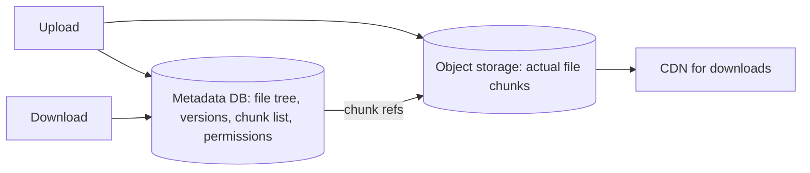
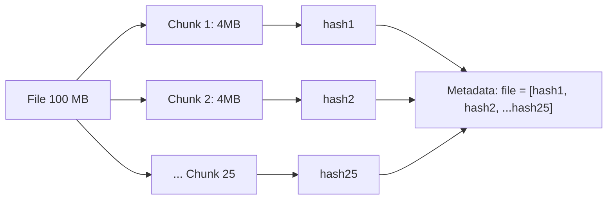
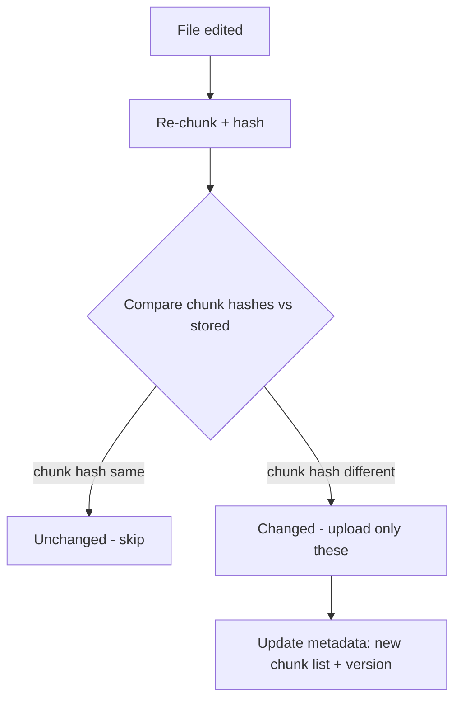
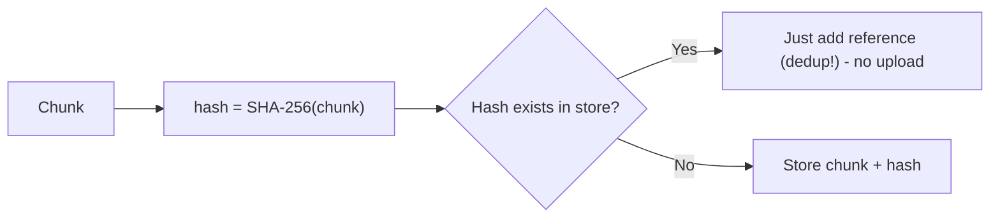
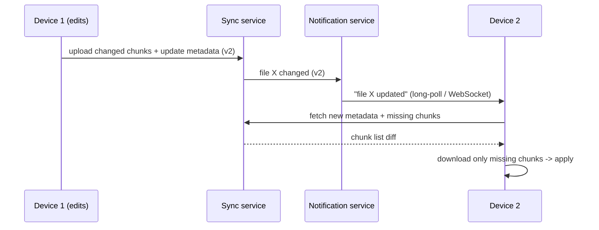
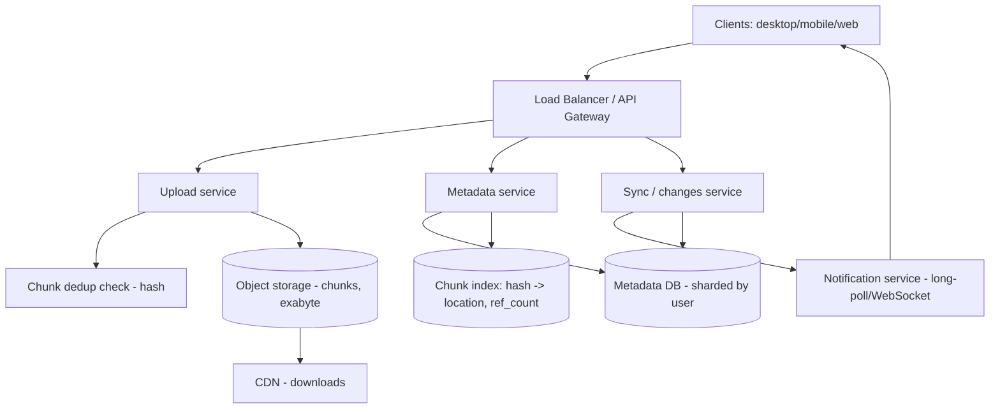
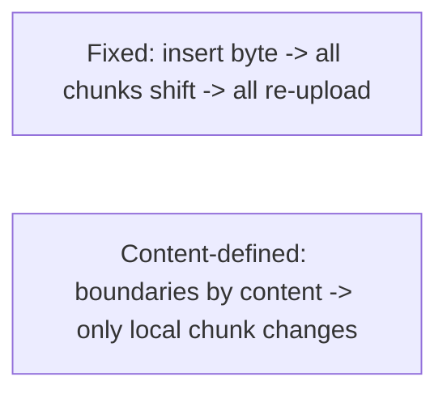
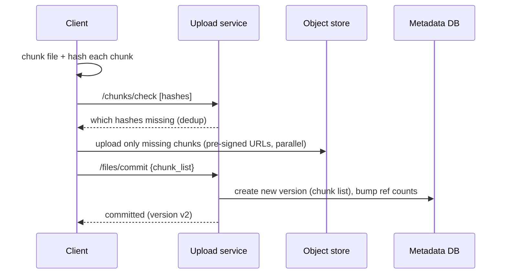

# 📁 Design Google Drive / Dropbox (File Storage & Sync)

> **Problem:** Ek cloud file storage + sync system banao — user files upload/download kare, **multiple
> devices pe automatically sync** ho, files **share** kare, versions rakhe, aur offline edits handle
> ho. Challenge: **large file uploads (resumable), efficient sync (only changed parts), deduplication,
> aur multi-device consistency**. Ye **blob storage + chunking + sync + metadata** ka deepest example hai.

---

## 1. Requirements

### Functional
- **Upload / download** files (small to GBs).
- **Sync** — file ek device pe badla → baaki devices pe auto-update.
- **Folders** — hierarchy, move/rename.
- **Sharing** — file/folder share with users (view/edit permissions).
- **Versioning** — file history, restore old versions.
- **Offline** — edit offline → sync on reconnect (conflict handling).

### Non-Functional
- **Reliability / durability** — files kabhi na khoyein (99.999999999%).
- **Efficient sync** — poori file dubara upload/download na ho (only changed parts).
- **Scalability** — billions of files, PBs of storage.
- **Low latency** for sync (change → other devices quickly).
- **Storage-efficient** (dedup, compression).
- **Consistency** — devices eventually consistent; conflicts resolved.

---

## 2. Capacity Estimation

| Metric | Value |
|---|---|
| Users | ~1B |
| Avg storage/user | ~10 GB → **~10 EB total** (exabytes!) |
| Files | Billions |
| Daily uploads | ~PBs/day |
| Metadata ops | Very high (sync checks) |

> **Key insight:** two very different scaling problems — (1) **file bytes** (exabytes → object storage,
> the "easy" scale) and (2) **metadata + sync** (billions of ops, the "hard" part). Efficient sync via
> **chunking + hashing** is the core innovation.

---

## 3. ⭐ Core 1 — Separate metadata from file bytes

**File bytes** aur **metadata** alag store karo — ye foundational decision.



- **Metadata DB:** file/folder tree, names, sizes, versions, permissions, **chunk list per file** (which chunks make up the file). Small, transactional, queried constantly (sync). → SQL/sharded. Dekho [SQL vs NoSQL](../SQL_vs_NoSQL.md).
- **Object storage:** actual file **chunks** (immutable blobs). Exabyte scale, cheap, durable. Dekho [Blob Storage](../Advanced_Topics/08_Blob_Object_Storage_and_Large_Files.md).
- File = ordered list of chunk references in metadata; bytes in object store.

---

## 4. ⭐ Core 2 — Chunking (the key to everything)

File ko **fixed/variable-size chunks** (e.g., 4 MB) me todo. Ye chunking teen bade problems solve karti:



**Chunking benefits:**
1. **Resumable upload** — network fail → sirf remaining chunks (poori file nahi). Dekho [Blob Storage (multipart)](../Advanced_Topics/08_Blob_Object_Storage_and_Large_Files.md).
2. **Delta sync** — file me thoda change → sirf **changed chunks** upload (poori 1GB file nahi).
3. **Deduplication** — same chunk (across files/users) once store.
4. **Parallel** upload/download of chunks → faster.

---

## 5. ⭐ Core 3 — Delta Sync (only changed chunks)

Dropbox's killer feature. File badla → poori file re-upload **nahi**, sirf badle chunks.



- Client re-chunks edited file → hashes each chunk → compares with server's chunk list → **uploads only new/changed chunks** → updates metadata (new version = new chunk list).
- 1 GB file me 4 MB change → upload ~4-8 MB (not 1 GB). Huge bandwidth saving.

---

## 6. ⭐ Core 4 — Deduplication (content-addressed storage)

Chunk ka **hash (SHA-256)** = its address (content-addressed). Same content → same hash → store **once**.



- **Cross-user dedup:** 1000 users ka same file (popular PDF) → chunks once stored. Massive storage saving.
- **Bandwidth dedup:** client sends chunk **hash first**; server says "already have it" → client skips upload entirely.
- **Reference counting:** chunk deleted only when no file references it (GC).

---

## 7. ⭐ Core 5 — Sync mechanism (change notification)

File badla → doosre devices ko **jaldi pata** chalna chahiye. Push-based notification.



- **Notification service** informs other devices of changes (long-polling / WebSocket). Dekho [WebSockets](../WebSockets_and_Realtime.md).
- Device pulls **metadata diff** → downloads only **missing chunks** (delta) → applies.
- **Watcher on client:** local file changes detected → chunk + upload.

---

## 8. API Design
```
POST /v1/files/upload/start   { name, size, folder }   -> upload_id + chunk plan
POST /v1/chunks/check         { hashes:[...] }          -> which already exist (dedup)
PUT  /v1/chunks/{hash}         <chunk bytes>            -> store chunk (if new)
POST /v1/files/commit         { upload_id, chunk_list } -> new file version
GET  /v1/files/{id}/metadata                            -> chunk list + version
GET  /v1/chunks/{hash}                                  -> chunk bytes (via CDN)
GET  /v1/changes?cursor=<x>                             -> changes since cursor (sync)
POST /v1/files/{id}/share     { user, permission }
```
- **`/chunks/check`** first → dedup (skip existing). **`/changes`** = delta sync feed (long-poll).

---

## 9. Data Model
```
Files:      file_id | owner | name | folder_id | current_version | is_deleted
Versions:   file_id | version | chunk_list(ordered hashes) | size | created_at
Chunks:     chunk_hash (PK) | storage_location | ref_count | size
Folders:    folder_id | parent_id | name | owner
Shares:     file_id/folder_id | user_id | permission
DeviceState: device_id | user_id | last_sync_cursor
```
- **Metadata (Files/Versions/Folders) → SQL, sharded by user_id** (user's tree together). **Chunks → object storage**, chunk metadata in KV (hash→location, ref_count). Dekho [Sharding](../21_Database_Sharding.md).

---

## 10. 🏛️ Main HLD Architecture



**Flow:** upload → chunk + hash → dedup check (skip existing) → new chunks to object storage, metadata
updated (new version) → notification service tells other devices → they pull metadata diff + missing
chunks. Downloads via CDN.

---

## 11. Deep Dive — Conflict resolution (offline edits)
- Two devices edit same file offline → both sync → **conflict**.
- **Strategies:**
  - **Last-write-wins** (simplest, may lose data).
  - **Conflicted copy:** keep both (`file (Device1's conflicted copy)`) — Dropbox's approach; no data loss, user resolves.
  - **Operational transform / CRDT** for collaborative docs (see [Google Docs](./19_Google_Docs.md)) — but for opaque files, conflicted-copy is standard.
- **Version vector** to detect concurrent edits (like [Key-Value Store](./24_Key_Value_Store_DynamoDB.md) vector clocks). Dekho [Replication (conflict)](../Database_Replication.md).

## 12. Deep Dive — Versioning
- Each save = new **version** = new chunk list (old chunks reused via dedup!). Old versions cheap (only changed chunks duplicated).
- History → restore any version (just point to that version's chunk list).
- Retention policy (keep N versions / N days) → GC old chunks (ref_count 0).

## 13. Deep Dive — Consistency & metadata sync
- **Metadata = source of truth** for "what the file is now" (chunk list + version).
- **Changes feed** (cursor-based): device polls "changes since cursor" → gets updated files → syncs. Efficient incremental sync. Dekho [CDC-like pattern].
- Eventual consistency across devices (small lag OK); metadata ops transactional per user.

## 14. Deep Dive — Large file & performance
- **Multipart/parallel** chunk upload; resumable (retry failed chunks). Dekho [Blob Storage](../Advanced_Topics/08_Blob_Object_Storage_and_Large_Files.md).
- **Pre-signed URLs** → client uploads chunks **directly to object storage** (bypass app server → scalable).
- **CDN** for downloads (popular shared files cached at edge). Dekho [CDN](../10_Content_Delivery_Network_CDN.md).
- **Compression** chunks before store (text files shrink a lot).

## 15. Deep Dive — Sharing & permissions
- Share file/folder with users (view/edit); permission checked on every access.
- Folder share = inherited permissions on children.
- **Public links** (anyone with link) → signed URL. Dekho [Security](../Security_in_System_Design.md).

---

## 15.1 Deep Dive — Fixed vs variable (content-defined) chunking

- **Fixed-size chunking** (e.g., 4 MB): simple. Problem: insert 1 byte at file start → **all chunks shift**
  → all hashes change → whole file re-uploads (dedup broken for edits).
- **Content-defined chunking (CDC, Rabin fingerprint):** chunk boundaries based on **content** (rolling
  hash) → insert doesn't shift later boundaries → only affected chunks change → **dedup survives edits**.
- Dropbox-style sync uses content-defined chunking for robust delta sync.



## 15.2 Deep Dive — Upload flow end-to-end



- **Hash-first** → dedup (skip existing chunks). **Pre-signed URLs** → client uploads chunks direct to object store (bypass app server). Dekho [Blob Storage](../Advanced_Topics/08_Blob_Object_Storage_and_Large_Files.md).

## 15.3 Deep Dive — Sync via changes feed (cursor)

- Each device tracks a **sync cursor** (last change seen). Polls/subscribes `GET /changes?cursor=X` →
  gets file changes since X → applies incrementally. Efficient (no full rescan).
- **Long-poll / WebSocket:** server pushes "you have changes" → device pulls diff → near-real-time.
- Namespace/journal per user: monotonic change log → cursor-based incremental sync (like a per-user changelog).

## 15.4 Deep Dive — Garbage collection & ref counting

- Chunk stored once, referenced by many file-versions → **ref_count**. Version deleted / retention expired
  → decrement refs; **ref_count 0 → chunk GC'd** (background job). Dekho [Job Scheduler](./23_Distributed_Job_Scheduler.md).
- Careful: concurrent add-ref + delete → race → do ref counting atomically; GC with grace period.

## 15.5 Deep Dive — Worked capacity example
- 1B users × 10 GB = ~10 EB → object storage (S3-class), tiered (hot/cold). Dedup reduces effective storage significantly (shared chunks).
- Metadata: billions of files × ~1 KB metadata → ~TBs → sharded SQL by user_id.
- Chunk index: hash → location, billions of chunks → distributed KV.

## 15.6 Common pitfalls
- ❌ File bytes in DB → bloat, no CDN. ✅ Object store + metadata DB split.
- ❌ Fixed chunking → edits break dedup. ✅ Content-defined chunking.
- ❌ Re-upload whole file on edit. ✅ Delta sync (changed chunks).
- ❌ Upload through app server → bandwidth bottleneck. ✅ Pre-signed URLs (direct).
- ❌ LWW silently loses offline edits. ✅ Conflicted copy / version vectors.
- ❌ No ref counting → orphan chunks or premature deletion. ✅ Ref count + grace-period GC.

## 15.7 Extensions / follow-ups
- **Real-time collaboration** (Google Docs) → OT/CRDT, not opaque-file sync. Dekho [Google Docs](./19_Google_Docs.md).
- **Selective sync:** only chosen folders sync to a device (save local space).
- **Trash / restore:** soft delete (retention) before permanent GC.
- **Bandwidth throttling / LAN sync:** peer devices sync locally (Dropbox LAN sync).
- **Encryption:** client-side / at-rest encryption of chunks. Dekho [Security](../Security_in_System_Design.md).

---

## 16. Bottlenecks & Solutions

| Bottleneck | Solution |
|---|---|
| Exabyte file storage | Object storage (S3-like) + tiering |
| Re-uploading whole files | Chunking + delta sync (changed chunks only) |
| Duplicate content | Content-addressed dedup (hash) + ref counting |
| Large file upload reliability | Multipart/resumable + pre-signed URLs |
| Sync latency | Notification service (long-poll/WebSocket) + changes feed |
| App-server bandwidth | Pre-signed URLs (client ↔ object store direct) + CDN |
| Offline edit conflicts | Conflicted copy / version vectors |
| Metadata scale | Shard by user_id |
| Version storage | Dedup (versions share unchanged chunks) |

---

## 17. Interview Q&A

**Q: File DB me kyun nahi?**
Exabyte scale, CDN needed, DB bloat. File **chunks → object storage**, **metadata → DB** (chunk list + tree).

**Q: 1 GB file me chhota edit — poori file upload?**
Nahi — **delta sync**: re-chunk, compare hashes, upload **only changed chunks** (~few MB). Chunking + hashing.

**Q: Chunking ke fayde?**
Resumable upload, delta sync, dedup, parallel transfer — all from chunk + hash.

**Q: Deduplication kaise?**
Chunk hash (SHA-256) = content address; same hash → store once + reference; cross-user saving; client sends hash first (skip upload if exists).

**Q: Sync (dusre device pe update) kaise?**
Notification service (long-poll/WebSocket) → device pulls metadata diff → downloads missing chunks. Changes-feed (cursor) for incremental.

**Q: Offline edits conflict?**
Conflicted copy (keep both, no loss) — Dropbox style; version vectors detect concurrency; LWW simplest.

**Q: Versioning storage-efficient kaise?**
New version = new chunk list; unchanged chunks reused (dedup) → only changed chunks stored extra.

**Q: App-server bandwidth bacha kaise?**
Pre-signed URLs → client uploads/downloads chunks **directly to/from object storage**; CDN for downloads.

**Q: Large file reliability?**
Multipart + resumable (retry failed chunks only) + parallel.

**Q: Metadata scale?**
Shard by user_id (user's file tree together); transactional per user.

---

## 18. Summary
- **Metadata (tree, versions, chunk list) → DB (sharded by user)**; **file bytes → object storage** (exabyte, cheap, durable) + CDN.
- **Chunking** (4 MB) is the core: enables **resumable upload**, **delta sync** (only changed chunks), **dedup**, parallel transfer.
- **Content-addressed dedup** (chunk hash → store once + ref count); client sends hash first (skip existing).
- **Sync** = notification (long-poll/WebSocket) + **changes feed** (cursor) → device pulls metadata diff + missing chunks.
- **Conflicts** (offline) = conflicted copy / version vectors; **versioning** cheap (reuse unchanged chunks); **pre-signed URLs** for direct client↔store transfer.

> **Related:** [Blob Storage & Large Files](../Advanced_Topics/08_Blob_Object_Storage_and_Large_Files.md) · [CDN](../10_Content_Delivery_Network_CDN.md) · [Key-Value Store (vector clocks)](./24_Key_Value_Store_DynamoDB.md) · [Google Docs](./19_Google_Docs.md) · [Database Replication (conflict)](../Database_Replication.md) · [WebSockets](../WebSockets_and_Realtime.md)
