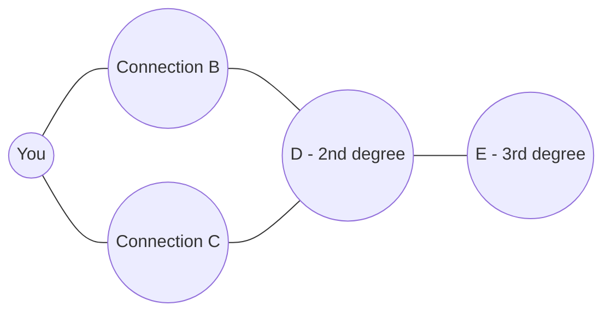
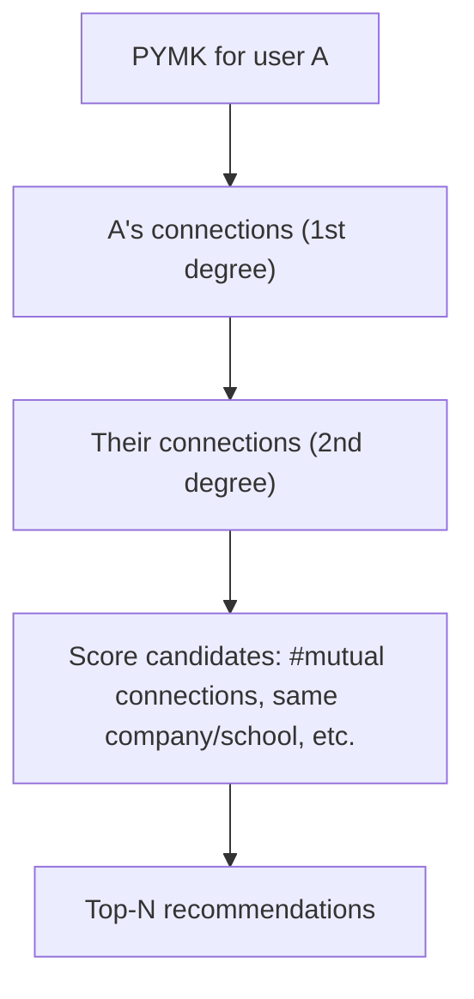
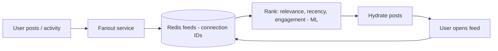
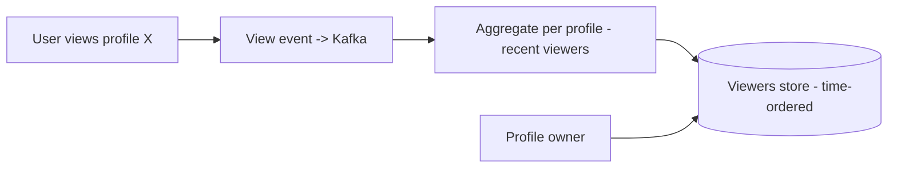
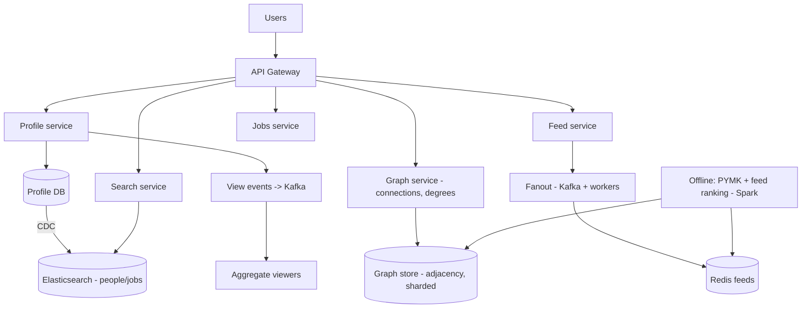
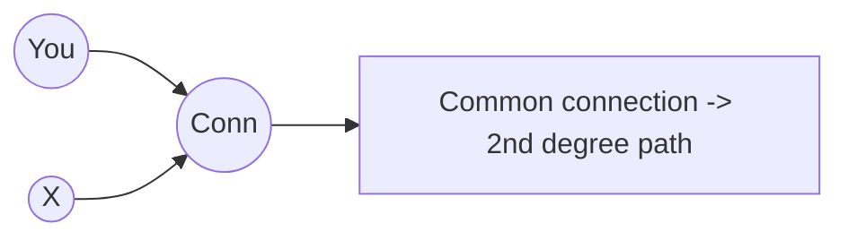
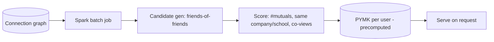

# 💼 Design LinkedIn (Professional Network)

> **Problem:** Ek professional networking platform banao — users profiles banayein, ek doosre se
> **connect** karein (social graph), ek **feed** dekhein (connections + follows ki activity), jobs
> search karein, aur "**People You May Know**" + "**who viewed your profile**" jaise graph-powered
> features ho. Ye design **social graph (connections)**, **feed fanout**, **graph traversal (2nd/3rd
> degree)**, aur **search** ka combo hai — Facebook + Twitter + a jobs marketplace.

---

## 1. Requirements

### Functional
- **Profiles** — experience, skills, education, photo.
- **Connections** — send/accept connection requests (bidirectional edge); follow (unidirectional).
- **Feed** — posts/activity from connections + followed people/pages.
- **People You May Know (PYMK)** — connection recommendations (graph-based).
- **Who viewed your profile** — track + show viewers.
- **Search** — people, jobs, companies (with filters).
- **Jobs** — post, search, apply; messaging.

### Non-Functional
- **Read-heavy** (feed, profile views, search >>> writes).
- **Low latency** feed + search.
- **Scalable** — ~1B users, huge connection graph (billions of edges).
- **High availability**; eventual consistency OK for feed/PYMK.
- **Graph queries** (degrees of connection) at scale — the hard part.

---

## 2. Capacity Estimation

| Metric | Value |
|---|---|
| Users | ~1B |
| Avg connections/user | ~500 → **~500B edges** (huge graph) |
| Feed reads | Very high (read-heavy) |
| Profile views | High (each generates a "who viewed" event) |
| Posts/day | Millions |

> **Key insight:** the **connection graph (billions of edges)** + **graph queries** (2nd/3rd degree,
> PYMK, "you both know X") = the distinguishing challenge. Feed = Twitter-like fanout; search = Elasticsearch.

---

## 3. ⭐ Core — The Social Graph

Connections = a **graph**: users = nodes, connections = **bidirectional edges** (both accept), follows = directed edges.



- **Degrees:** 1st (direct), 2nd (friend of friend), 3rd (further). "You both know X" = common neighbors.
- **Storage:** billions of edges → specialized. Options:
  - **Graph DB** (Neo4j) — natural for traversals, but scaling to billions is hard.
  - **Adjacency lists in KV/sharded DB** — `user_id → [connection_ids]`; LinkedIn built a custom distributed graph service (like FB's TAO). Dekho [SQL vs NoSQL](../SQL_vs_NoSQL.md), [Key-Value Store](./24_Key_Value_Store_DynamoDB.md).
- **Sharding the graph:** by user_id → a user's direct connections local; but 2nd-degree spans shards (cross-shard traversal — hard). Dekho [Sharding](../21_Database_Sharding.md).

---

## 4. ⭐ Graph Queries — degrees & common connections

"2nd degree connections" / "People You May Know" = graph traversal. At billion-edge scale, real-time
full traversal is expensive.



- **PYMK signals:** number of **mutual connections** (biggest), same company/school, contacts imported, profile similarity.
- **Precompute (offline):** PYMK not real-time — **batch job** (Spark) computes candidates + scores periodically → store per-user. Dekho [Big Data](../Advanced_Topics/05_Big_Data_and_Stream_Processing.md).
- **2nd-degree at query time:** for "how are we connected", limited BFS (bounded depth) on the graph service; cache hot results.

---

## 5. ⭐ Feed (fanout — like Twitter)

Connections/follows ki activity → feed. Same **fanout** problem as [Twitter](./05_Twitter_News_Feed.md).



- **Hybrid fanout:** normal users push to connections' feeds; high-follower (influencers/companies) → pull + merge. Dekho [Twitter](./05_Twitter_News_Feed.md), [Instagram](./06_Instagram.md).
- **Ranking:** not pure chronological — **ML-ranked** (relevance, your engagement, connection strength, recency).
- **Activity types:** posts, "X connected with Y", "X started a job", "X liked" → feed items.

---

## 6. ⭐ "Who Viewed Your Profile"

Profile view → event → track viewer. High volume (every profile visit).



- View events → Kafka (high volume) → aggregate per-profile recent viewers (async, eventual). Dekho [Message Queues](../18_Message_Queues_Kafka_RabbitMQ.md).
- Privacy: viewer can be anonymous (settings) → store accordingly.
- Similar to [Ad Aggregation](./27_Ad_Click_Aggregation_Analytics.md) counting pattern.

---

## 7. Search (people, jobs, companies)
- **Elasticsearch** — people search (name, title, company, skills, location) with filters + ranking (relevance + connection degree — closer connections rank higher). Dekho [Search Systems](../Advanced_Topics/04_Search_Systems_and_Elasticsearch.md).
- **Personalized ranking:** search results ranked by relevance AND your network proximity.
- Jobs search = similar (role, location, filters) + recommendation (matching profile ↔ job).

---

## 8. API Design
```
GET  /v1/profile/{id}                        -> profile (records a view event)
POST /v1/connections/request  { to_user }
POST /v1/connections/accept   { request_id }
GET  /v1/feed?cursor=..                       -> ranked feed
GET  /v1/pymk                                 -> people you may know
GET  /v1/profile/me/viewers                   -> who viewed
GET  /v1/search/people?q=..&filters=..        -> people
GET  /v1/jobs/search?q=..                      -> jobs
```

---

## 9. Data Model
```
Users/Profiles: user_id | name | headline | experience[] | skills[] | ...
Connections:    user_id | connection_id | status(pending/accepted) | since   (adjacency)
Follows:        follower_id | followee_id
Feed:           user_id -> [activity_ids]    (Redis, precomputed)
ProfileViews:   profile_id | viewer_id | ts
PYMK:           user_id -> [recommended_ids + scores]  (precomputed)
```
- **Connections → graph service / sharded KV** (adjacency lists). **Profiles → DB + Elasticsearch** (search). **Feed/PYMK → precomputed (Redis)**. Dekho [Caching](../08_Caching_and_Distributed_Caching.md).

---

## 10. 🏛️ Main HLD Architecture



**Flow:** profiles (DB + Elasticsearch via CDC); connections in graph service (sharded adjacency);
feed = fanout (Kafka + Redis) + ML ranking; PYMK precomputed offline (Spark on graph); profile views →
Kafka → aggregate; search via Elasticsearch (network-aware ranking).

---

## 11. Deep Dive — Scaling the graph
- **Adjacency lists** (`user → [connections]`) in sharded KV — 1st degree fast (single lookup).
- **2nd degree** = union of connections' connections → cross-shard, expensive → **cache** + bounded depth + precompute for PYMK.
- **Dedicated graph service** (like FB's TAO) — caches graph in memory, optimized for these queries. Dekho [Key-Value Store](./24_Key_Value_Store_DynamoDB.md).
- **Denormalize mutual-connection counts** for fast PYMK scoring.

## 12. Deep Dive — Connection request flow
- Request = pending edge; accept → bidirectional edge (update both adjacency lists atomically).
- Idempotent (double-click no duplicate). Notifications on request/accept. Dekho [Notification System](./08_Notification_System.md).

## 13. Deep Dive — Feed ranking (ML)
- Signals: connection strength, your past engagement, content type, recency, virality.
- Two-stage: **candidate generation** (fanout gives candidates) → **ranking** (ML model scores) → top feed. Read-time re-rank.

## 14. Deep Dive — Consistency & read-heavy scaling
- **Read-heavy** → caches (profile cache, feed cache) + read replicas everywhere. Dekho [Caching](../08_Caching_and_Distributed_Caching.md), [Replication](../Database_Replication.md).
- **Eventual consistency** fine: feed/PYMK/viewers can lag; connections eventually reflect.
- **Search index** (Elasticsearch) synced from profile DB via CDC (eventually consistent). Dekho [Search Systems](../Advanced_Topics/04_Search_Systems_and_Elasticsearch.md).

---

## 14.1 Deep Dive — Graph storage options in depth

| Option | Pros | Cons |
|---|---|---|
| **Graph DB (Neo4j)** | Natural traversals, expressive | Hard to scale to billions of edges/shard |
| **Adjacency lists in KV** | Scales (shard by user), fast 1st-degree | Multi-hop = app-side traversal |
| **Dedicated graph service (TAO-like)** | In-memory cache, optimized graph ops | Custom infra, complex |

- LinkedIn/FB built **custom graph services** (LinkedIn's "graph", FB's TAO) — cache the graph in memory,
  serve `get_connections(user)`, `are_connected(a,b)`, `mutual(a,b)` at low latency.
- **Edge = two directed entries** (A→B and B→A) for bidirectional connections → each side's adjacency list has it. Dekho [Key-Value Store](./24_Key_Value_Store_DynamoDB.md).

## 14.2 Deep Dive — "How are you connected" (2nd degree path)

- "You and X both know Y" = find common neighbors / shortest path (≤ 3 hops) in the graph.
- **Bidirectional BFS:** search from both you and X, meet in middle → far fewer nodes explored than one-directional.
- Bounded to 2-3 hops (LinkedIn shows up to 3rd degree) → limited traversal, cached.



## 14.3 Deep Dive — PYMK pipeline (offline)



- Real-time FoF traversal for 1B users too expensive → **precompute** candidates + scores in batch (Spark), refresh periodically. Dekho [Big Data](../Advanced_Topics/05_Big_Data_and_Stream_Processing.md).
- Signals: mutual-connection count (strongest), same company/school, imported contacts, profile co-views, ML model.

## 14.4 Deep Dive — Feed candidate generation + ranking (two-stage)

- **Stage 1 (candidates):** fanout gives recent activity from connections/follows → candidate pool.
- **Stage 2 (ranking):** ML model scores each candidate (relevance, your past engagement, connection
  strength, recency, content type) → top items. Read-time re-rank. Same as [Twitter](./05_Twitter_News_Feed.md)/[Instagram](./06_Instagram.md) feeds.
- **Hybrid fanout:** normal users push; influencers/companies (millions of followers) → pull + merge.

## 14.5 Deep Dive — Jobs recommendations
- **Matching:** job requirements ↔ user profile (skills, experience, location) → relevance score (ML).
- **Search:** Elasticsearch (role, location, filters) + personalization. Dekho [Search Systems](../Advanced_Topics/04_Search_Systems_and_Elasticsearch.md).
- **Two-sided:** recruiters search candidates (profile search), users search jobs.

## 14.6 Common pitfalls
- ❌ Real-time full 2nd-degree traversal for 1B users → too slow. ✅ Precompute (PYMK) + bounded BFS + cache.
- ❌ Graph DB expecting billion-edge scale. ✅ Sharded adjacency / dedicated graph service.
- ❌ Chronological feed only. ✅ ML ranking (relevance).
- ❌ Sync profile updates to search inline. ✅ CDC → Elasticsearch (async).
- ❌ Storing full objects in feed. ✅ Store IDs, hydrate.

## 14.7 Extensions / follow-ups
- **Messaging (InMail):** chat between connections (like [WhatsApp](./07_WhatsApp_Chat.md)).
- **Notifications:** connection requests, post engagement, job alerts. Dekho [Notification System](./08_Notification_System.md).
- **Skill endorsements / recommendations:** graph + content features.
- **Company pages / newsletters:** followed entities → feed sources.
- **Privacy:** "who viewed" anonymity settings, connection visibility. Dekho [Security](../Security_in_System_Design.md).

---

## 15. Bottlenecks & Solutions

| Bottleneck | Solution |
|---|---|
| Billions of connection edges | Sharded adjacency lists + dedicated graph service |
| 2nd/3rd degree traversal | Bounded BFS + cache + precompute (PYMK offline) |
| Feed generation | Hybrid fanout (push/pull) + Redis + ML ranking |
| PYMK compute | Offline batch (Spark) on graph, precomputed |
| Profile view volume | Kafka + async aggregation |
| People/job search | Elasticsearch (network-aware ranking) |
| Read-heavy | Caches + read replicas |
| Search freshness | CDC (DB → ES), eventual |

---

## 16. Interview Q&A

**Q: LinkedIn ka distinguishing challenge?**
Connection graph (billions of edges) + graph queries (2nd/3rd degree, PYMK, mutual connections) at scale — beyond simple feed.

**Q: Social graph kaise store?**
Sharded adjacency lists (`user → [connections]`) in KV / dedicated graph service (TAO-like, in-memory cache); graph DB doesn't scale to billions easily.

**Q: People You May Know kaise?**
Graph signals (mutual connections biggest, same company/school) — **precomputed offline (Spark)**, not real-time; stored per-user.

**Q: 2nd degree at query time expensive kyun, solution?**
Union of connections' connections → cross-shard, huge; bounded BFS + cache + precompute; denormalize mutual counts.

**Q: Feed kaise?**
Fanout (hybrid push/pull, like Twitter) → candidates → **ML ranking** (relevance/engagement/recency) → top feed.

**Q: Who viewed profile?**
View → Kafka event → async aggregate per profile (recent viewers); privacy settings respected; eventual.

**Q: Search?**
Elasticsearch (people/jobs), filters + **network-aware ranking** (closer connections rank higher); synced via CDC.

**Q: Connection request flow?**
Pending edge → accept → bidirectional (both adjacency lists updated atomically); idempotent; notifications.

**Q: Consistency?**
Read-heavy, eventual OK — feed/PYMK/viewers/search lag acceptable; caches + replicas.

---

## 17. Summary
- LinkedIn = **social graph** (billions of edges, sharded adjacency lists / dedicated graph service) + Twitter-like **feed** + **search** + jobs.
- **Graph queries** (2nd/3rd degree, mutual connections) = the hard part → bounded BFS + cache + **precompute PYMK offline (Spark)**.
- **Feed** = hybrid fanout + Redis + **ML ranking** (candidate generation → ranking); **who-viewed** = Kafka events + async aggregation.
- **Search** = Elasticsearch (network-aware ranking, CDC-synced); heavily **read-heavy** → caches + read replicas, eventual consistency.

> **Related:** [Twitter / News Feed](./05_Twitter_News_Feed.md) · [Instagram](./06_Instagram.md) · [Key-Value Store (graph store)](./24_Key_Value_Store_DynamoDB.md) · [Search Systems](../Advanced_Topics/04_Search_Systems_and_Elasticsearch.md) · [Big Data](../Advanced_Topics/05_Big_Data_and_Stream_Processing.md) · [Notification System](./08_Notification_System.md)
