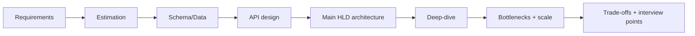

# 🏗️ System Design Case Studies (All 30 — Classic + Real Apps)

  
  
  

> **Full end-to-end system designs** — classic (TinyURL, Twitter…) + famous real apps (Spotify, Uber,
> IRCTC, Swiggy, Airbnb, Tinder…) — ek hi jagah. Har design RESHADED format me:
> **Requirements → Estimation → API → Schema → Main HLD architecture diagram → Deep-dive → Bottlenecks
> → Interview points**. Concept files "ingredients", ye case studies "recipe".

> 💡 **Diagrams mermaid me hain** (har design me main bada HLD diagram + chhote flow diagrams).
> GitHub pe apne aap render honge; **VSCode me** dekhne ke liye **"Markdown Preview Mermaid Support"**
> extension install karo.

---

## 📚 The 30 Designs

### 🧱 Fundamentals & Data (01–04)
| # | Design | Core concept | Difficulty |
|---|---|---|---|
| 01 | [TinyURL / URL Shortener](./01_TinyURL_URL_Shortener.md) | Base62 + distributed ID, cache, read-heavy | 🟢 |
| 02 | [Rate Limiter](./02_Rate_Limiter.md) | Token bucket, distributed Redis + atomicity | 🟢 |
| 03 | [Distributed Cache](./03_Distributed_Cache.md) | Consistent hashing, eviction, replication | 🔴 |
| 04 | [SQL Database Internals](./04_SQL_Database_Internals.md) | Optimizer, B+Tree, buffer pool, WAL, MVCC, ACID | 🔴 |

### 📱 Social / Feed / Media (05–10)
| # | Design | Core concept | Difficulty |
|---|---|---|---|
| 05 | [Twitter / News Feed](./05_Twitter_News_Feed.md) | Fanout (push/pull/hybrid), celebrity problem | 🟡 |
| 06 | [Instagram](./06_Instagram.md) | Media (object store+CDN) + feed fanout | 🟡 |
| 07 | [WhatsApp / Chat](./07_WhatsApp_Chat.md) | WebSockets, registry, presence, offline | 🟡 |
| 08 | [Notification System](./08_Notification_System.md) | Queues, multi-channel fanout, retries/DLQ | 🟡 |
| 09 | [YouTube / Netflix](./09_YouTube_Netflix.md) | CDN + adaptive bitrate, transcoding | 🟡 |
| 10 | [Spotify](./10_Spotify_Music_Streaming.md) | Audio streaming + recommendation engine | 🟡 |

### 📍 Location / Marketplace / Delivery (11–14)
| # | Design | Core concept | Difficulty |
|---|---|---|---|
| 11 | [Uber / Ride-Hailing](./11_Uber_Ride_Hailing.md) | Geospatial, matching, real-time location | 🔴 |
| 12 | [Swiggy / Zomato](./12_Swiggy_Zomato_Food_Delivery.md) | Three-sided marketplace, geo, matching, tracking | 🔴 |
| 13 | [Zepto / Blinkit](./13_Zepto_Blinkit_Quick_Commerce.md) | Dark stores, hyperlocal inventory, rider assign | 🔴 |
| 14 | [Tinder](./14_Tinder_Dating_App.md) | Geospatial swipe deck, swipe writes, match detection | 🟡 |

### 🎟️ Booking / Concurrency (15–17)
| # | Design | Core concept | Difficulty |
|---|---|---|---|
| 15 | [Ticketmaster / Booking](./15_Ticketmaster_Booking_System.md) | No double-book, seat hold, CP | 🔴 |
| 16 | [IRCTC](./16_IRCTC_Train_Booking.md) | Tatkal thundering herd, no double-book, waitlist/RAC | 🔴 |
| 17 | [Airbnb](./17_Airbnb_Marketplace.md) | Geo + date-availability search, date-range no-double-book | 🔴 |

### 🔎 Search / Collaboration (18–19)
| # | Design | Core concept | Difficulty |
|---|---|---|---|
| 18 | [Search Autocomplete](./18_Search_Autocomplete_Typeahead.md) | Trie + precomputed top-k, multi-layer cache | 🟡 |
| 19 | [Google Docs](./19_Google_Docs.md) | OT vs CRDT, real-time collab, op log | 🔴 |

### 💳 Payments & Location (20–21)
| # | Design | Core concept | Difficulty |
|---|---|---|---|
| 20 | [Payment System / UPI / Wallet](./20_Payment_System_UPI_Wallet.md) | Ledger, idempotency, double-spend, Saga, reconciliation | 🔴 |
| 21 | [Google Maps / Navigation](./21_Google_Maps_Navigation.md) | Map tiles, shortest path (CH), ETA, live traffic | 🔴 |

### 🏛️ Infrastructure & Scale (22–25)
| # | Design | Core concept | Difficulty |
|---|---|---|---|
| 22 | [Web Crawler](./22_Web_Crawler.md) | BFS at scale, politeness, Bloom dedup, distributed frontier | 🔴 |
| 23 | [Distributed Job Scheduler](./23_Distributed_Job_Scheduler.md) | Scheduling, at-least-once, leader election, locks | 🔴 |
| 24 | [Key-Value Store (DynamoDB)](./24_Key_Value_Store_DynamoDB.md) | Consistent hashing, quorum, vector clocks, gossip | 🔴 |
| 25 | [Distributed Unique ID (Snowflake)](./25_Distributed_Unique_ID_Snowflake.md) | 64-bit ID, timestamp+machine+seq, clock skew | 🟡 |

### 📊 Real-time / Analytics / Social (26–30)
| # | Design | Core concept | Difficulty |
|---|---|---|---|
| 26 | [Leaderboard / Gaming Rank](./26_Leaderboard_Gaming_Rank.md) | Redis sorted sets, real-time ranking, top-K | 🟡 |
| 27 | [Ad Click Aggregation / Analytics](./27_Ad_Click_Aggregation_Analytics.md) | Stream processing, exactly-once, Lambda/Kappa | 🔴 |
| 28 | [Slack / Discord](./28_Slack_Discord.md) | Channels, huge-room fanout, presence, search | 🔴 |
| 29 | [Google Drive / Dropbox](./29_Google_Drive_Dropbox.md) | Chunking, delta sync, dedup, conflict resolution | 🔴 |
| 30 | [LinkedIn](./30_LinkedIn.md) | Social graph, 2nd-degree, PYMK, feed, who-viewed | 🔴 |

---

## 🎯 Concept → Case Study map (reverse lookup)

| Concept | Best dekhoge yahan |
|---|---|
| **Fanout / feed** | [Twitter](./05_Twitter_News_Feed.md), [Instagram](./06_Instagram.md) |
| **WebSockets / real-time** | [WhatsApp](./07_WhatsApp_Chat.md), [Google Docs](./19_Google_Docs.md), [Uber](./11_Uber_Ride_Hailing.md) |
| **Geospatial (nearby)** | [Uber](./11_Uber_Ride_Hailing.md), [Swiggy](./12_Swiggy_Zomato_Food_Delivery.md), [Zepto](./13_Zepto_Blinkit_Quick_Commerce.md), [Tinder](./14_Tinder_Dating_App.md) |
| **CDN + media streaming** | [YouTube](./09_YouTube_Netflix.md), [Spotify](./10_Spotify_Music_Streaming.md), [Instagram](./06_Instagram.md) |
| **Consistent hashing** | [Distributed Cache](./03_Distributed_Cache.md), [TinyURL](./01_TinyURL_URL_Shortener.md) |
| **Message queues** | [Notification](./08_Notification_System.md), [YouTube](./09_YouTube_Netflix.md) |
| **Booking concurrency (no double-book)** | [Ticketmaster](./15_Ticketmaster_Booking_System.md), [IRCTC](./16_IRCTC_Train_Booking.md), [Airbnb](./17_Airbnb_Marketplace.md) |
| **Thundering herd / spike** | [IRCTC (Tatkal)](./16_IRCTC_Train_Booking.md), [Ticketmaster](./15_Ticketmaster_Booking_System.md) |
| **Search + ranking** | [Autocomplete](./18_Search_Autocomplete_Typeahead.md), [Airbnb](./17_Airbnb_Marketplace.md) |
| **Conflict resolution (OT/CRDT)** | [Google Docs](./19_Google_Docs.md) |
| **DB internals** | [SQL Internals](./04_SQL_Database_Internals.md) |
| **Idempotency / payment** | [Ticketmaster](./15_Ticketmaster_Booking_System.md), [Uber](./11_Uber_Ride_Hailing.md), [IRCTC](./16_IRCTC_Train_Booking.md) |

---

## 🧭 The RESHADED framework (har design me follow kiya)

> **Interview tip:** requirements + estimation pehle (5 min), phir main high-level diagram banao,
> phir ek-do component deep-dive. Interviewer ko drive karne do.

---

## 📖 Recommended order
1. **[TinyURL](./01_TinyURL_URL_Shortener.md)** → **[Rate Limiter](./02_Rate_Limiter.md)** → **[Distributed Cache](./03_Distributed_Cache.md)** — framework + building blocks.
2. **[Twitter](./05_Twitter_News_Feed.md)** → **[Instagram](./06_Instagram.md)** — fanout mastery.
3. **[WhatsApp](./07_WhatsApp_Chat.md)** → **[Notification](./08_Notification_System.md)** — real-time + queues.
4. **[YouTube](./09_YouTube_Netflix.md)** → **[Spotify](./10_Spotify_Music_Streaming.md)** — media/CDN.
5. **[Uber](./11_Uber_Ride_Hailing.md)** → **[Swiggy](./12_Swiggy_Zomato_Food_Delivery.md)** → **[Zepto](./13_Zepto_Blinkit_Quick_Commerce.md)** → **[Tinder](./14_Tinder_Dating_App.md)** — geospatial.
6. **[Ticketmaster](./15_Ticketmaster_Booking_System.md)** → **[IRCTC](./16_IRCTC_Train_Booking.md)** → **[Airbnb](./17_Airbnb_Marketplace.md)** — booking/concurrency.
7. **[Autocomplete](./18_Search_Autocomplete_Typeahead.md)**, **[Google Docs](./19_Google_Docs.md)**, **[SQL Internals](./04_SQL_Database_Internals.md)** — search/collab/DB.

---

## 📚 Prerequisites (concept files)
- [Caching](../08_Caching_and_Distributed_Caching.md) · [Sharding](../21_Database_Sharding.md) · [Replication](../Database_Replication.md) · [SQL vs NoSQL](../SQL_vs_NoSQL.md)
- [Message Queues](../18_Message_Queues_Kafka_RabbitMQ.md) · [Consistent Hashing](../19_Consistent_Hashing.md) · [CAP](../11_CAP_Theorem.md) · [Back-of-Envelope](../20_Back_of_the_Envelope_Calculations.md)
- [WebSockets](../WebSockets_and_Realtime.md) · [Concurrency Control](../Concurrency_Control.md) · [Idempotency](../Idempotency.md) · [Geospatial](../Advanced_Topics/06_Geospatial_and_Location_Services.md)

---

> ⬅️ Wapas: [HLD main index](../README.md) · [Advanced Topics](../Advanced_Topics/README.md) · [Cheatsheet](../CHEATSHEET.md) · [Interview guide](../HLD_Interview.md) · [Root](../../README.md)
>
> **Ye 19 designs interview me 90%+ questions cover karte hain. Practice + apne words me explain karo. 🚀**
