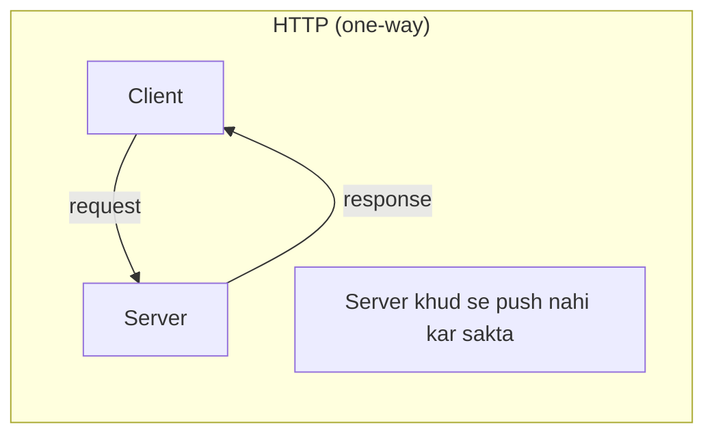
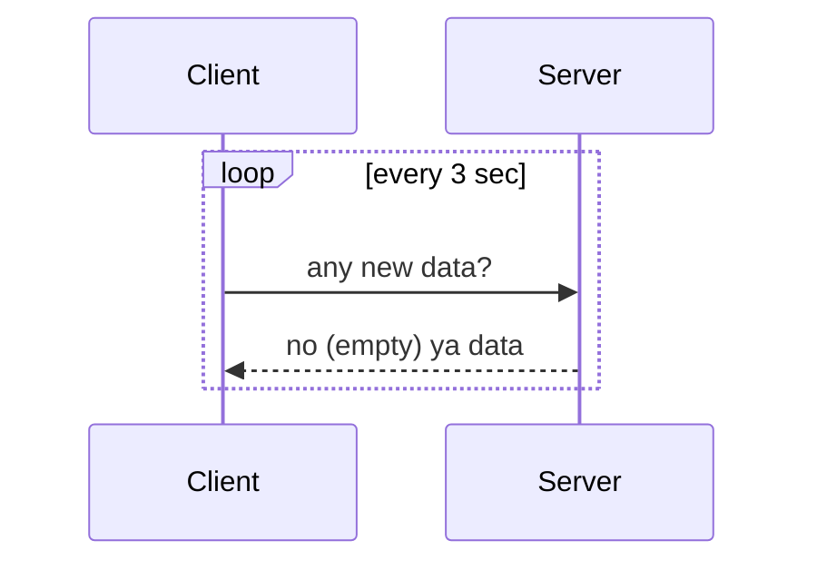
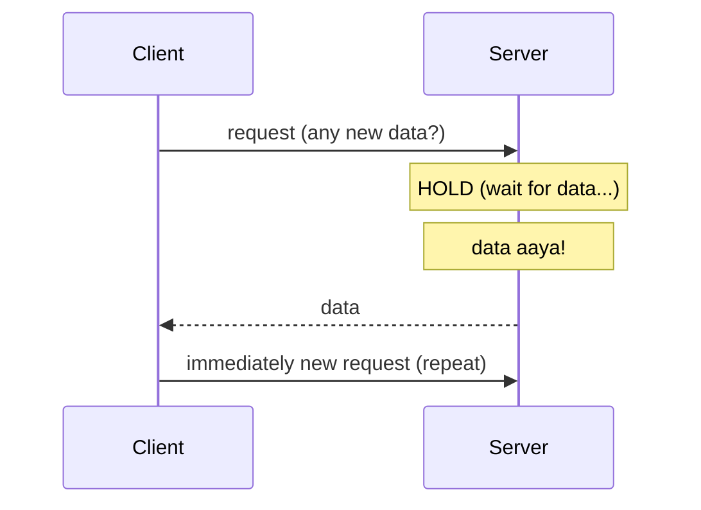
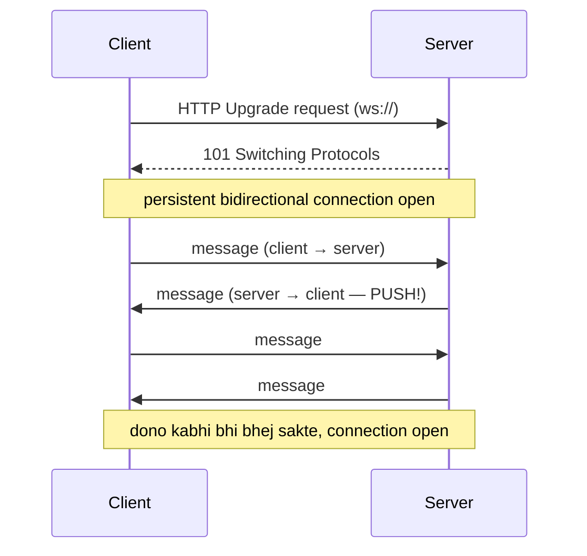
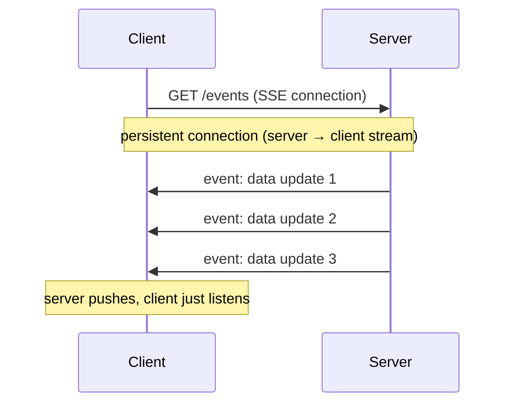
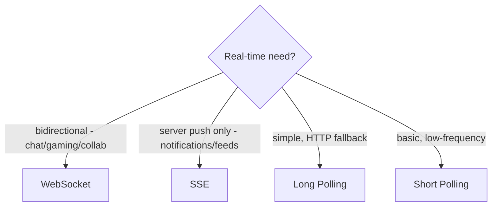
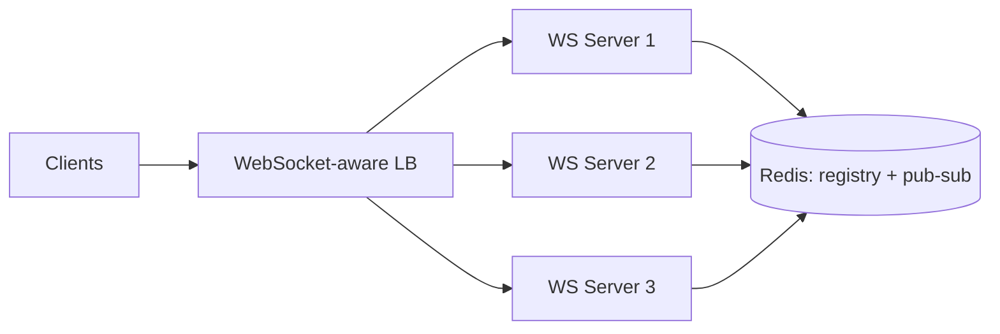
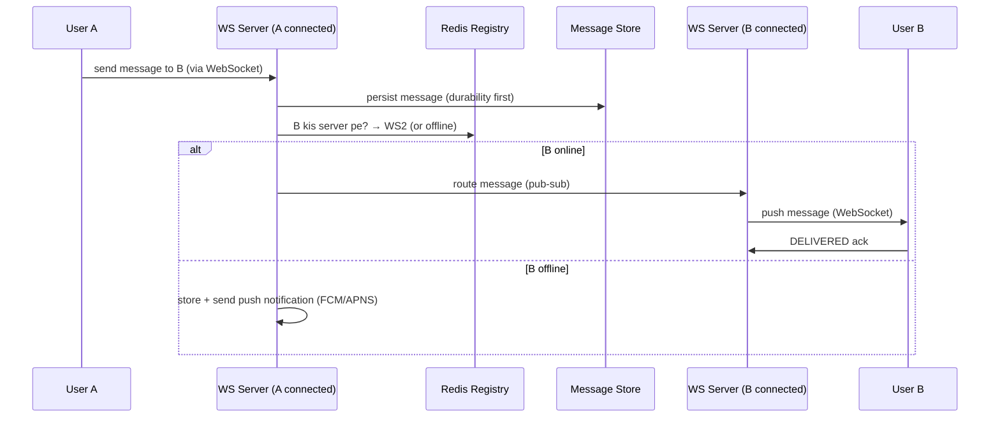

# WebSockets & Real-Time Communication — Complete Deep Dive

> HTTP request-response one-directional hai (client pulls). **Real-time** systems (chat, live scores,
> collaborative editing, gaming) me server ko client ko **push** karna padta — instantly. Ye file:
> real-time communication ke saare options (polling, long-polling, WebSocket, SSE), WebSocket deep
> (handshake, working), aur **scaling** WebSocket connections (millions).

---

## 📑 Table of Contents
1. [Problem: HTTP real-time ke liye kyun nahi](#1-problem-http-real-time-ke-liye)
2. [Short Polling](#2-short-polling)
3. [Long Polling](#3-long-polling)
4. [WebSockets — deep](#4-websockets--deep)
5. [Server-Sent Events (SSE)](#5-server-sent-events-sse)
6. [Comparison (all 4)](#6-comparison--all-approaches)
7. [Scaling WebSockets (millions)](#7-scaling-websockets--the-hard-part)
8. [Real-time architecture (chat example)](#8-real-time-architecture--chat-example)
9. [Interview Q&A](#9-interview-qa)
10. [Summary](#10-summary)

---

## 1. Problem: HTTP real-time ke liye

Traditional HTTP: client **request** karta, server **respond** karta. Server **khud se** client ko
kuch nahi bhej sakta (client se initiate karna padta). Real-time me server ko **push** chahiye:
- Chat — naya message aaya → sab ko turant.
- Live scores — score badla → instant update.
- Stock ticker — price change → live.
- Collaborative editing — kisi ne edit kiya → sabko dikhe.



**Solutions (4):** short polling, long polling, WebSocket, SSE. Chalo detail me.

---

## 2. Short Polling

Client **baar-baar** (fixed interval — har 2-5 sec) server ko request karta "kuch naya hai?".



- ✅ Simple (plain HTTP), works everywhere.
- ❌ **Wasteful** — mostly empty responses (naya data nahi to bhi request), server load (frequent
  requests), **latency** (interval jitna delay — 3 sec purana data), bandwidth waste.
- **Use:** simple, low-frequency updates, jab real-time critical nahi.

---

## 3. Long Polling

Client request karta, server **response hold karta** jab tak naya data na ho (ya timeout). Data aaya
→ respond → client turant naya request.



- ✅ **Near-real-time** (data available hote hi respond, no interval delay), plain HTTP, fewer empty
  responses than short polling.
- ❌ Still request overhead (each cycle new connection), server holds connections (resource), not
  true bidirectional.
- **Use:** near-real-time on HTTP, WebSocket fallback (old browsers).

---

## 4. WebSockets — Deep

**WebSocket** = **persistent, bidirectional, full-duplex** connection over a single TCP connection.
Ek baar establish → dono taraf (client + server) **kabhi bhi** messages bhej sakte (no repeated
requests).



### How it works (handshake)
1. Client HTTP request bhejta with **`Upgrade: websocket`** header.
2. Server **`101 Switching Protocols`** se respond — HTTP se WebSocket protocol pe switch.
3. **Persistent connection** established (single TCP, stays open).
4. Ab dono taraf **frames** (messages) bhej sakte — full-duplex, real-time.

### Characteristics
- **Persistent** — connection open rehti (no repeated setup).
- **Bidirectional** — client + server dono push kar sakte.
- **Low latency** — no request overhead per message (open connection).
- **`ws://`** (unencrypted) / **`wss://`** (TLS — secure).

### ✅ Advantages
- **True real-time bidirectional** — dono taraf instant push.
- **Low latency** — no per-message HTTP overhead.
- **Efficient** — one connection (no repeated handshakes).

### ❌ Disadvantages
- **Persistent connections = server memory** — millions of connections = many servers (scaling hard —
  section 7).
- **Stateful** — connection state on server (sticky, harder to scale/load balance).
- **Complexity** — connection management, reconnection, heartbeats.
- **Proxies/firewalls** — some block WebSocket (fallback needed).

### Use cases
- **Chat** (WhatsApp, Slack), **live scores/notifications**, **collaborative editing** (Google Docs),
  **multiplayer gaming**, **trading dashboards**, **live location** (Uber).

---

## 5. Server-Sent Events (SSE)

**One-way** (server → client) persistent connection over HTTP. Server stream of events push karta,
client sunta. **Uni-directional** (client push nahi kar sakta — normal HTTP se karta).



- ✅ **Simple** (plain HTTP, no special protocol), **auto-reconnect** (built-in), works with HTTP
  infra (proxies/LB), server push.
- ❌ **One-way only** (server → client — client can't push over SSE), text only (no binary),
  connection limit per browser (HTTP/1.1).
- **Use:** server push only (notifications, live feeds, stock tickers, live logs, progress updates) —
  jaha client ko real-time nahi bhejna.

---

## 6. Comparison — all approaches

| | Short Polling | Long Polling | WebSocket | SSE |
|---|---|---|---|---|
| Direction | client pulls | client pulls (held) | **bidirectional** | server → client |
| Connection | new each time | new per cycle | **persistent** | persistent |
| Latency | high (interval) | low | **lowest** | low |
| Overhead | high (frequent) | medium | low | low |
| Real-time | poor | good | **best** | good (one-way) |
| Complexity | simple | simple | complex | simple |
| Protocol | HTTP | HTTP | WebSocket (ws/wss) | HTTP |
| Binary | yes | yes | yes | no (text) |
| Auto-reconnect | n/a | manual | manual | **built-in** |
| Use | simple, low-freq | fallback | chat, gaming, collab | notifications, feeds |



> ⭐ **Rule:** bidirectional (chat/gaming/collab) → **WebSocket**. Server push only (notifications) →
> **SSE** (simpler). HTTP-only near-real-time → **long polling** (WebSocket fallback).

---

## 7. Scaling WebSockets — the hard part

WebSocket **stateful** (persistent connections on server) — scaling mushkil. Millions of concurrent
connections handle karna:

### Problem: connection state on server
```
500M concurrent WebSocket connections (WhatsApp scale)
Per server ~65K connections → 500M / 65K ≈ 8,000 connection servers
```
User A ka connection Server 1 pe. User B ka Server 2 pe. Agar A ko B ko message bhejna hai — A ka
message Server 1 pe aaya, par B Server 2 pe connected. **A ka message B tak kaise pahunche?**

### Solution: Connection Registry + Pub-Sub
```mermaid
flowchart TB
    A[User A] <--> WS1[WebSocket Server 1]
    B[User B] <--> WS2[WebSocket Server 2]
    WS1 & WS2 --> REG[(Redis: Connection Registry<br/>userId → server)]
    WS1 & WS2 <--> PS[Pub-Sub / Message Broker]
    Note[A → B message: WS1 looks up B's server (WS2)<br/>via registry → route via pub-sub → WS2 → B]
```

**Approach:**
1. **Connection registry** — Redis me `userId → server` mapping (kaun kis server pe connected).
2. **Message routing** — A ka message (WS1 pe) → registry lookup (B kis server pe? WS2) → route to
   WS2 (via pub-sub/broker) → WS2 → B's WebSocket.
3. **Pub-Sub layer** — servers ek doosre ko messages route karte (Redis pub-sub, Kafka).

### Scaling techniques
- **Sticky by connection** — user ka connection ek server pe (LB sticky by connection, not request).
- **Horizontal scale connection servers** — add servers (each holds subset of connections).
- **Connection registry** (Redis) — route messages across servers.
- **Load balancer** — WebSocket-aware (L7, handles Upgrade), distribute new connections.
- **Heartbeats/ping-pong** — detect dead connections (cleanup).
- **Graceful reconnection** — connection drop → client reconnects (state recovery).



> ⭐ WebSocket servers **inherently stateful** (connections). Scale: horizontal connection servers +
> connection registry (Redis: userId→server) + pub-sub routing between servers. [Stateful detail:
> `Stateful_and_Stateless_Architecture.md`]

---

## 8. Real-Time Architecture — Chat Example

WhatsApp-style chat (WebSocket-based):



**Key points:**
- **Persistent WebSocket** per online user (real-time push).
- **Connection registry** (Redis: userId → server) — routing.
- **Message store** (Cassandra — write-heavy) — persist first (durability), then deliver.
- **Offline** — store + push notification (FCM/APNS).
- **Message states** — SENT → DELIVERED → READ.
- [Full: `HLD_Interview.md` WhatsApp design; Repo LLD: `WhatsApp_LLD`]

---

## 9. Interview Q&A

**Q: Real-time communication ke options?**
Short polling (repeated requests — wasteful), long polling (server holds — near-real-time), WebSocket
(persistent bidirectional — best), SSE (server → client one-way). Bidirectional → WebSocket,
server-push → SSE.

**Q: WebSocket kaise kaam karta?**
HTTP Upgrade request → server 101 Switching Protocols → persistent bidirectional TCP connection. Dono
taraf kabhi bhi messages (full-duplex), low latency (no per-message overhead).

**Q: WebSocket vs SSE?**
WebSocket — bidirectional (client + server both push), persistent, binary, complex (chat/gaming).
SSE — one-way (server → client), HTTP-based, auto-reconnect, simpler (notifications/feeds).

**Q: WebSocket vs long polling?**
WebSocket — persistent bidirectional, low latency (one connection). Long polling — client pulls
(server holds response), new request each cycle, HTTP-based (fallback). WebSocket better for true
real-time.

**Q: WebSockets kaise scale (millions of connections)?**
Stateful (connections on server). Horizontal connection servers (each ~65K connections) + connection
registry (Redis: userId → server) + pub-sub routing between servers (A's message → B's server →
B). WebSocket-aware LB, heartbeats, reconnection.

**Q: Chat me A→B message kaise pahunche (different servers)?**
Connection registry (Redis) lookup B's server → route message via pub-sub → B's server → B's
WebSocket. Persist message first (durability). Offline → store + push notification.

**Q: WebSocket kab use, kab SSE?**
WebSocket — bidirectional real-time (chat, gaming, collaborative editing). SSE — server push only
(notifications, live feeds, stock tickers) — simpler, HTTP-based.

**Q: Short polling ke problems?**
Wasteful (mostly empty responses), server load (frequent requests), latency (interval delay),
bandwidth waste. Long polling / WebSocket better.

---

## 10. Summary

- **HTTP** one-way (client pulls) — real-time (server push) ke liye special approaches.
- **Short polling** — repeated requests (wasteful, high latency).
- **Long polling** — server holds response until data (near-real-time, HTTP, fallback).
- **WebSocket** — persistent bidirectional (best for real-time — chat/gaming/collab). Low latency,
  but stateful + scaling hard.
- **SSE** — server → client one-way (notifications/feeds), HTTP-based, auto-reconnect, simpler.
- **Choose:** bidirectional → WebSocket, server-push-only → SSE, HTTP fallback → long polling.
- **Scaling WebSockets** — horizontal connection servers + connection registry (Redis: userId→server)
  + pub-sub routing + WebSocket-aware LB + heartbeats.
- **Chat architecture** — WebSocket + registry + message store + offline push.

> Related: [`05_Network_Protocols.md`](./05_Network_Protocols.md) ·
> [`Stateful_and_Stateless_Architecture.md`](./Stateful_and_Stateless_Architecture.md) (WebSocket
> stateful scaling) · [`Event_Driven_Architecture.md`](./Event_Driven_Architecture.md) ·
> [`18_Message_Queues_Kafka_RabbitMQ.md`](./18_Message_Queues_Kafka_RabbitMQ.md)
