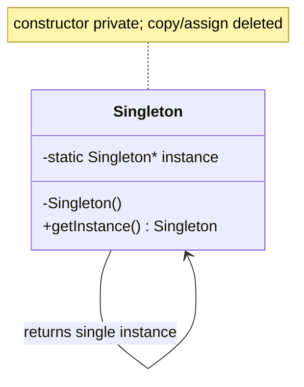
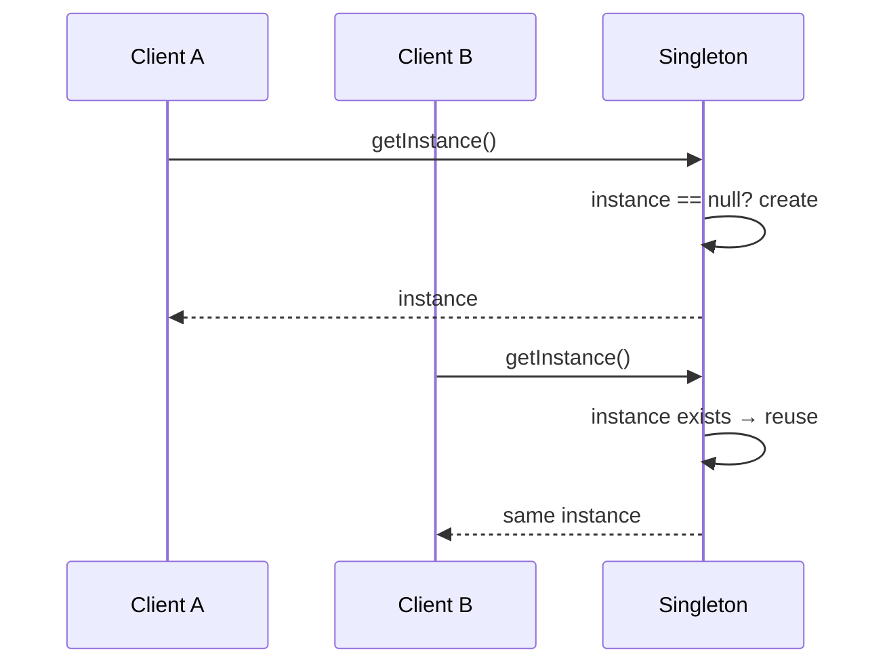

# Singleton Design Pattern — Detailed Guide

> **Creational Design Pattern** that guarantees a class has **exactly one instance** and provides a **single global access point** to it (`getInstance()`). Useful when one shared object must coordinate the whole system — a logger, a configuration store, a connection pool, or a central manager.

**Domain examples (in this repo):** This folder ships a full progression — from "no singleton" to the modern **Meyers Singleton** — so you can see *why* each step exists and where thread-safety breaks.

**Core problem it solves:** Multiple independent instances of a resource that must be **unique** (e.g. two loggers writing to the same file, two config objects disagreeing), plus uncontrolled global access scattered across the codebase.

---

## Table of Contents

1. [Problem — Why not just a global object?](#1-problem--why-not-just-a-global-object)
2. [What is the Singleton Pattern?](#2-what-is-the-singleton-pattern)
3. [The Six Variants in This Folder](#3-the-six-variants-in-this-folder)
4. [Real-World Analogy](#4-real-world-analogy)
5. [Key Participants (UML Roles)](#5-key-participants-uml-roles)
6. [When to Use / When to Avoid](#6-when-to-use--when-to-avoid)
7. [Pros and Cons](#7-pros-and-cons)
8. [SOLID & Testability Notes](#8-solid--testability-notes)
9. [Folder Structure](#9-folder-structure)
10. [Code Walkthrough — Variant by Variant](#10-code-walkthrough--variant-by-variant)
11. [Architecture Diagrams](#11-architecture-diagrams)
12. [Build & Run](#12-build--run)
13. [Singleton vs Related Patterns](#13-singleton-vs-related-patterns)
14. [Interview Talking Points](#14-interview-talking-points)
15. [Summary](#15-summary)

---

## 1. Problem — Why not just a global object?

A naive approach lets any caller create the resource:

```cpp
// ❌ Anyone can construct another one
Logger* a = new Logger("app.log");
Logger* b = new Logger("app.log");   // second instance — duplicate handles, races
```

| Problem | Detail |
| ------- | ------ |
| **Duplicate instances** | Two config objects can hold different values |
| **Resource conflicts** | Two pool managers double-allocate connections |
| **No single access point** | The object is passed around or rebuilt everywhere |
| **Uncontrolled lifetime** | Who owns it? When is it destroyed? |

A plain global variable fixes uniqueness but loses **lazy initialization** and **encapsulated construction** — Singleton gives you both.

---

## 2. What is the Singleton Pattern?

Singleton enforces two guarantees:

1. **One instance** — the constructor is private; the class controls creation.
2. **Global access** — a static `getInstance()` returns that one instance.

```cpp
class Singleton {
    Singleton() {}                       // private constructor
public:
    Singleton(const Singleton&) = delete;            // no copy
    Singleton& operator=(const Singleton&) = delete; // no assign
    static Singleton& getInstance();     // single access point
};
```

| Property | Detail |
| -------- | ------ |
| **Private constructor** | Blocks `new Singleton()` from outside |
| **Deleted copy/assign** | Prevents cloning the "single" instance |
| **Static accessor** | One well-known entry point for everyone |

---

## 3. The Six Variants in This Folder

This is the heart of the lesson — the same idea implemented six ways, each fixing a weakness of the previous one:

| File | Type | Thread-Safe | Key idea |
| ---- | ---- | ----------- | -------- |
| `NoSingleton.cpp` | Baseline (anti-pattern) | N/A | Multiple objects allowed — shows the problem |
| `SimpleSingleton.cpp` | Lazy pointer | ❌ No | `if (!instance) instance = new ...` — race on first call |
| `ThreadSafeEagerSingleton.cpp` | Eager init | ✅ (at startup) | Created before `main()` races begin; may waste resources if unused |
| `ThreadSafeLockingSingleton.cpp` | Lazy + mutex | ✅ Yes | Lock on **every** call — correct but slow |
| `ThreadSafeDoubleLockingSingleton.cpp` | Double-checked locking | ✅ (with care) | Lock only on first creation; needs `atomic`/memory ordering to be correct |
| `MeyersSingleton.cpp` | Function-local `static` | ✅ (C++11+) | `static Singleton s;` inside `getInstance()` — compiler guarantees thread-safe init |

```
NoSingleton → Simple → Eager → Locking → Double-Checked → Meyers
   (problem)   (unsafe) (safe)  (slow)    (optimized)     (recommended)
```

---

## 4. Real-World Analogy

| Analogy | Mapping |
| ------- | ------- |
| **The President of a country** | Only one at a time; everyone refers to "the President", not a specific person object |
| **A printer spooler** | One queue coordinates all print jobs; two spoolers would interleave pages |
| **Government records office** | A single source of truth everyone queries, instead of each office keeping its own copy |

---

## 5. Key Participants (UML Roles)

| Role | In this demo |
| ---- | ------------ |
| **Singleton** | The class with the private constructor and static `getInstance()` |
| **Static instance** | The single cached object (pointer, eager static, or function-local static) |
| **Client** | `main()` and any code that calls `Singleton::getInstance()` |

```
Client ──► Singleton::getInstance() ──► returns the one cached instance
```

---

## 6. When to Use / When to Avoid

### ✅ Use when

| Scenario | Example |
| -------- | ------- |
| Exactly one shared resource | Logger, config, thread pool, cache registry |
| A single coordinator is required | Game manager, device manager |
| Global access is genuinely needed | Cross-cutting service used everywhere |

### ❌ Avoid when

| Scenario | Reason |
| -------- | ------ |
| You just want a global variable | Singleton adds ceremony without benefit |
| The object has per-request state | Hidden shared mutable state → bugs |
| You need easy unit testing | Global state makes mocking/isolation hard — prefer Dependency Injection |
| Multiple configurations are plausible | "One" assumption breaks (e.g. multi-tenant) |

---

## 7. Pros and Cons

### Pros

| Benefit | Detail |
| ------- | ------ |
| **Controlled access** | One instance, one entry point |
| **Lazy initialization** | (Lazy variants) created only when first needed |
| **Consistency** | Everyone reads/writes the same state |
| **Saves resources** | One pool/connection instead of many |

### Cons

| Drawback | Detail |
| -------- | ------ |
| **Global state** | Hidden dependencies, hard to reason about |
| **Testability** | Hard to substitute a mock; tests share state |
| **Concurrency traps** | Naive lazy init is unsafe (the whole point of this lesson) |
| **Lifetime/order** | Static init/destruction order across translation units |

---

## 8. SOLID & Testability Notes

- **SRP tension:** A Singleton often does its real job *and* manages its own lifetime — two responsibilities.
- **DIP-friendly alternative:** Inject an interface (`ILogger&`) instead of calling `Logger::getInstance()` everywhere; you keep one instance via the composition root but stay testable.
- **Interview nuance:** "Singleton is a *global*; use it for true single resources, otherwise prefer DI." Pairs well with the [Null Object](../L40%20Null_object_pattern_and_Antipatterns/) discussion on Singleton abuse.

---

## 9. Folder Structure

```
L10 Singleton_Design_Pattern/
├── README.md                        ← This guide
└── C++ Code/
    ├── NoSingleton.cpp                  ← Baseline (multiple instances)
    ├── SimpleSingleton.cpp              ← Lazy pointer (unsafe)
    ├── ThreadSafeEagerSingleton.cpp     ← Eager init
    ├── ThreadSafeLockingSingleton.cpp   ← Lazy + mutex
    ├── ThreadSafeDoubleLockingSingleton.cpp ← Double-checked locking
    ├── MeyersSingleton.cpp              ← Function-local static (recommended)
    ├── Markdown.md
    └── notes/                           ← Per-variant deep notes + diagrams
```

---

## 10. Code Walkthrough — Variant by Variant

### 10.1 Simple Lazy Singleton (unsafe)

```cpp
Singleton* Singleton::instance = nullptr;

Singleton* Singleton::getInstance() {
    if (instance == nullptr)             // ❌ two threads can both see nullptr
        instance = new Singleton();
    return instance;
}
```
**Key:** Fine single-threaded; under concurrency two threads can both construct.

### 10.2 Thread-Safe Eager

```cpp
Singleton* Singleton::instance = new Singleton(); // created before main()
Singleton* Singleton::getInstance() { return instance; }
```
**Key:** No race (constructed during static init), but always created even if never used.

### 10.3 Thread-Safe Locking

```cpp
Singleton* Singleton::getInstance() {
    lock_guard<mutex> lock(mtx);         // every call pays the lock
    if (!instance) instance = new Singleton();
    return instance;
}
```
**Key:** Correct, but locking on every access is wasteful once the instance exists.

### 10.4 Double-Checked Locking

```cpp
Singleton* Singleton::getInstance() {
    if (!instance) {                     // 1st check (no lock)
        lock_guard<mutex> lock(mtx);
        if (!instance)                   // 2nd check (locked)
            instance = new Singleton();
    }
    return instance;
}
```
**Key:** Locks only on first creation. Subtle: needs `std::atomic` / proper memory ordering to be truly correct.

### 10.5 Meyers Singleton (recommended)

```cpp
Singleton& Singleton::getInstance() {
    static Singleton instance;           // C++11 guarantees thread-safe init
    return instance;
}
```
**Key:** Lazy **and** thread-safe with zero manual locking — the modern default answer.

---

## 11. Architecture Diagrams

### Class Diagram



### First-Access Sequence (lazy)



> Per-variant class + sequence diagrams are in [`C++ Code/notes/`](./C%20%2B%2B%20Code/notes/) (see [`IMAGES.md`](./C%20%2B%2B%20Code/notes/IMAGES.md)).

---

## 12. Build & Run

Every file declares the same class name `Singleton`, so compile and run each separately:

```bash
cd "L10 Singleton_Design_Pattern/C++ Code"

g++ -std=c++17 -o no_singleton_demo NoSingleton.cpp && ./no_singleton_demo
g++ -std=c++17 -o simple_singleton_demo SimpleSingleton.cpp && ./simple_singleton_demo
g++ -std=c++17 -o eager_singleton_demo ThreadSafeEagerSingleton.cpp && ./eager_singleton_demo
g++ -std=c++17 -o locking_singleton_demo ThreadSafeLockingSingleton.cpp && ./locking_singleton_demo
g++ -std=c++17 -o dcl_singleton_demo ThreadSafeDoubleLockingSingleton.cpp && ./dcl_singleton_demo
g++ -std=c++17 -o meyers_singleton_demo MeyersSingleton.cpp && ./meyers_singleton_demo
```

---

## 13. Singleton vs Related Patterns

| Pattern | Intent | Difference from Singleton |
| ------- | ------ | ------------------------- |
| **Factory** | Create objects | Factory makes *many*; Singleton ensures *one* |
| **Monostate** | Shared state via static members | Many instances, one shared state; Singleton = one instance |
| **Null Object** | Safe do-nothing default | Can have many instances; Singleton is single — don't confuse |
| **Dependency Injection** | Provide collaborators | DI passes one instance explicitly; Singleton hides it globally |

---

## 14. Interview Talking Points

1. **One-liner:** "Singleton guarantees one instance with a global access point."
2. **Why naive lazy init is unsafe:** Two threads can both pass the `nullptr` check and construct twice.
3. **Locking cost:** A mutex on every `getInstance()` is correct but expensive after creation.
4. **DCL caveat:** Double-checked locking needs `std::atomic`/memory fences to be correct on modern CPUs.
5. **Modern answer:** "Use a Meyers Singleton — function-local static is lazy and thread-safe since C++11."
6. **Push-back:** "Singleton is global state; for testability I'd inject the dependency instead."

---

## 15. Summary

| Aspect | Detail |
| ------ | ------ |
| **Pattern Type** | Creational |
| **Core Idea** | One instance + global access point |
| **Variants** | No → Simple → Eager → Locking → DCL → Meyers |
| **Recommended** | **Meyers Singleton** (function-local static) |
| **Main Problem Solved** | Duplicate instances of a unique resource |
| **Watch Out For** | Global state, testability, concurrency on lazy init |

> **Remember:** A Singleton is like a country's president — there is only ever **one** at a time, and everyone refers to "the president" through a single, well-known office (`getInstance()`) rather than constructing their own. 🏛️
